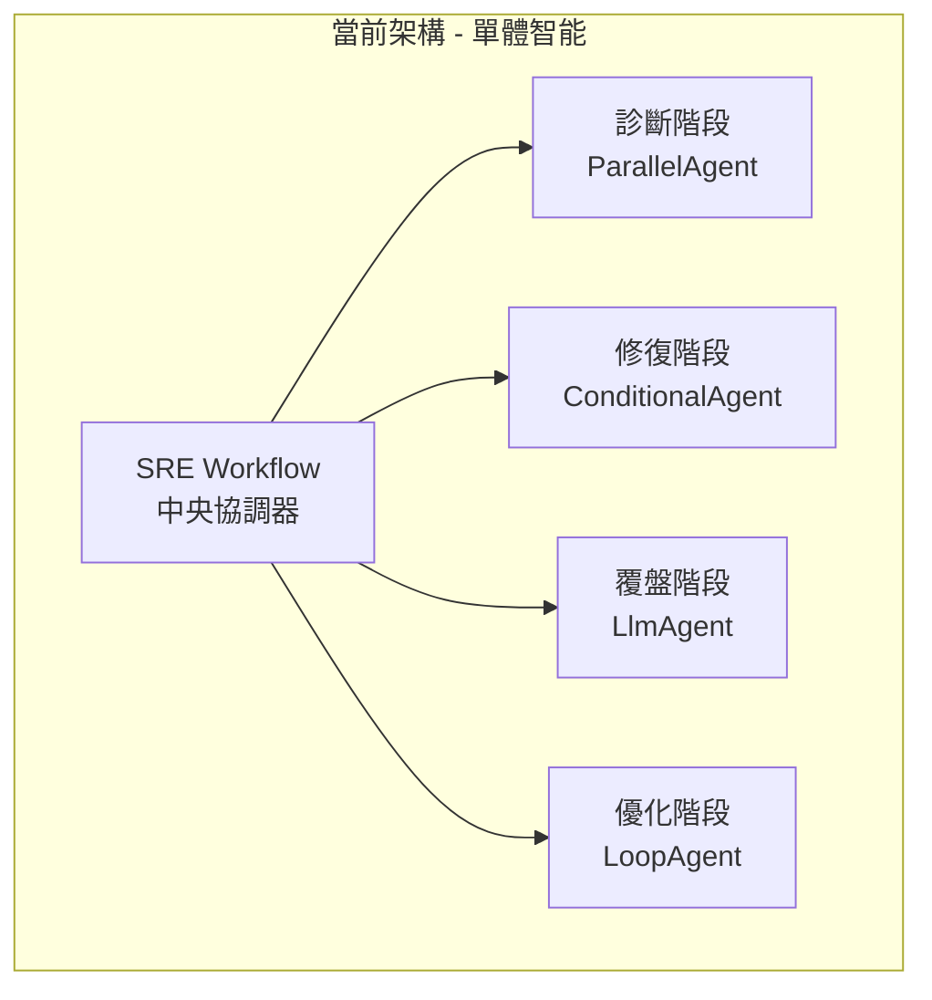
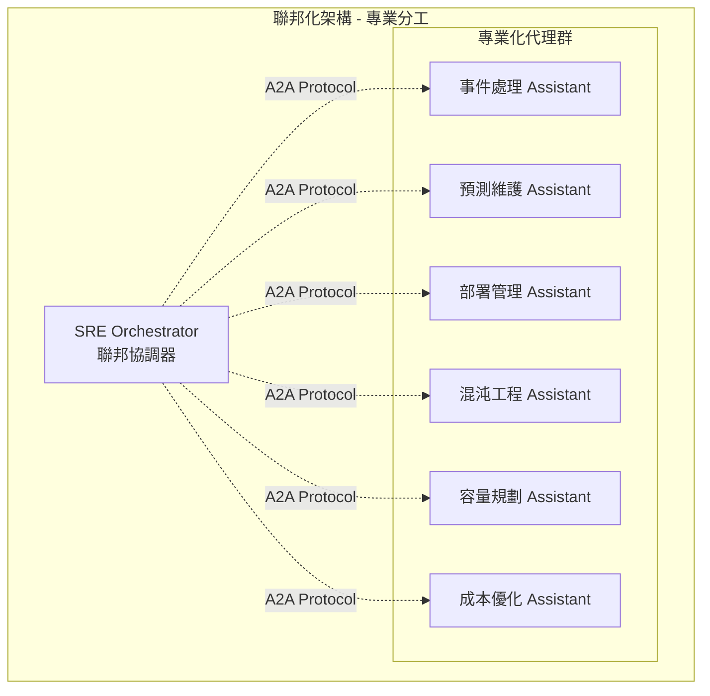
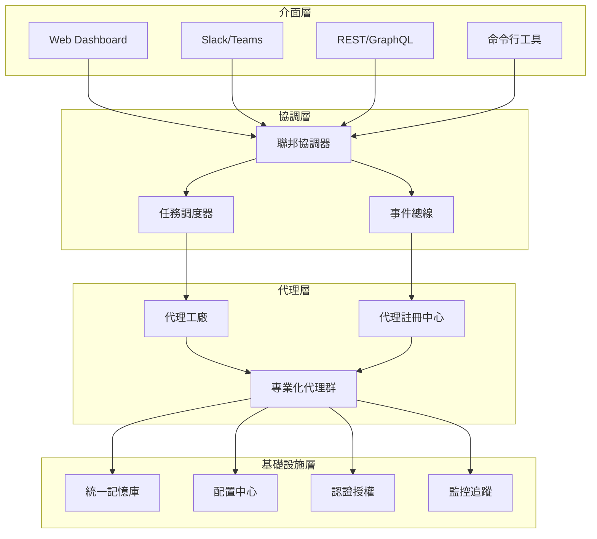
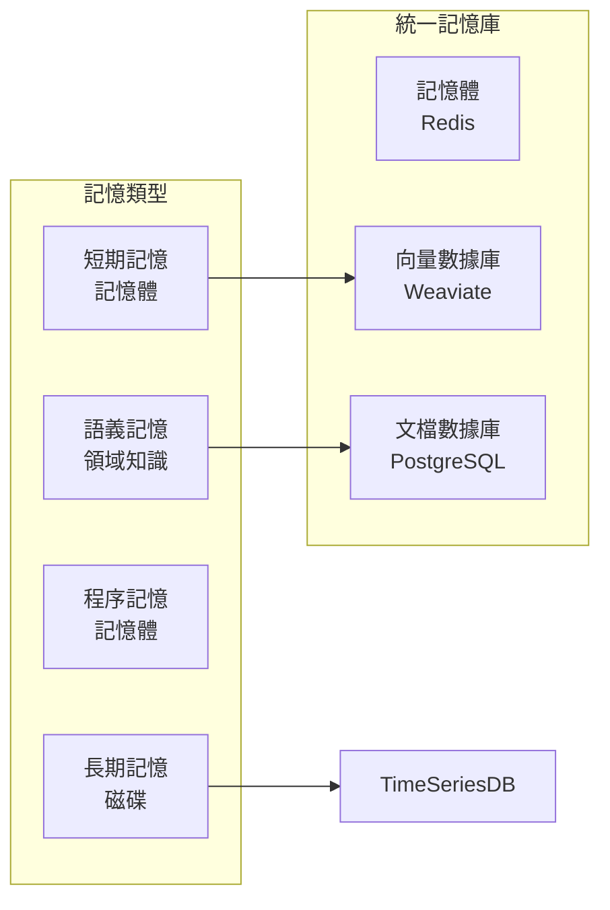
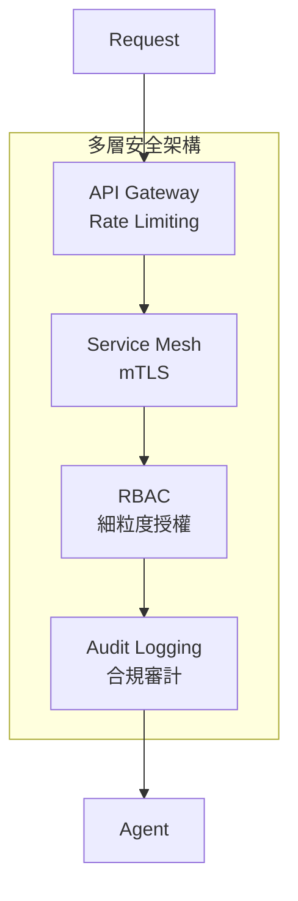

# ARCHITECTURE.md - SRE Assistant 聯邦化架構設計

## 1. 架構演進概覽

### 1.1 當前架構 (v2.x - 單體智能代理)

當前的 SRE Assistant 採用集中式架構，以 `SREWorkflow` 為核心協調四個處理階段：



### 1.2 目標架構 (v3.x - 聯邦化生態系統)

未來將演進為多個專業化代理協同工作的聯邦架構：



## 2. 核心設計原則

### 2.1 漸進式演進
- **Phase 1-2**: 維持單體架構，優化核心功能
- **Phase 3-4**: 逐步拆分為專業化代理
- **長期願景**: 完全聯邦化、自學習的代理生態

### 2.2 關注點分離
- **專業化**: 每個代理專注單一領域
- **可組合**: 代理可自由組合處理複雜場景
- **獨立演進**: 各代理獨立升級不影響整體

### 2.3 人機協同
- **HITL 機制**: 關鍵決策保留人工審核
- **ChatOps**: 自然語言控制所有操作
- **透明度**: 決策過程可審計可解釋

## 3. 系統組件架構

### 3.1 核心層級



### 3.2 代理間通訊架構 (A2A)

```yaml
# A2A 通訊協議設計
protocol:
  discovery:
    registry: "agent-registry.sre.local"
    heartbeat_interval: 30s
    
  messaging:
    format: "protobuf"
    transport: "grpc"
    timeout: 60s
    
  security:
    authentication: "mTLS"
    authorization: "RBAC"
    encryption: "AES-256"
```

## 4. 專業化代理設計

### 4.1 事件處理 Assistant

```python
class IncidentHandlerAssistant(BaseAgent):
    """處理生產環境事件的專業化代理"""
    
    capabilities = [
        "incident_detection",      # 事件檢測
        "root_cause_analysis",     # 根因分析
        "automated_remediation",   # 自動修復
        "postmortem_generation"    # 事後檢討
    ]
    
    tools = [
        PrometheusQueryTool(),       # 普羅米修斯查詢工具
        KubernetesOperationTool(),   # 容器操作工具
        GrafanaIntegrationTool()     # Grafana 整合工具
    ]
    
    memory_collections = [
        "incident_history",        # 事件歷史
        "runbook_library",         # 運行手冊庫
        "postmortem_archive"       # 事後檢討庫
    ]
```

### 4.2 預測維護 Assistant

```python
class PredictiveMaintenanceAssistant(BaseAgent):
    """預測和預防系統問題的專業化代理"""
    
    capabilities = [
        "anomaly_detection",       # 異常檢測
        "failure_prediction",      # 故障預測
        "capacity_forecasting",    # 容量預測
        "trend_analysis"           # 趨勢分析
    ]
    
    ml_models = [
        "time_series_forecasting",
        "anomaly_detection_autoencoder",
        "failure_prediction_random_forest"
    ]
```

### 4.3 部署管理 Assistant

```python
class DeploymentAssistant(BaseAgent):
    """管理部署流程的專業化代理"""
    
    capabilities = [
        "deployment_planning",     # 部署規劃
        "canary_analysis",        # 金絲雀分析
        "rollback_management",    # 回滾管理
        "dependency_tracking"     # 依賴追蹤
    ]
    
    integrations = [
        "GitHub/GitLab",
        "ArgoCD/Flux",
        "Jenkins/CircleCI",
        "Helm/Kustomize"
    ]
```

## 5. 統一基礎設施

### 5.1 記憶體架構
Weaviate 向量數據庫，PostgreSQL 文檔數據庫，Redis 記憶體數據庫



### 5.2 配置管理

```yaml
# 分層配置架構
configuration:
  global:           # 全局配置
    slo_targets:
      availability: 99.95%
      latency_p99: 500ms
      
  agent_specific:   # 代理特定配置
    incident_handler:
      auto_remediation_threshold: "P2"
      escalation_timeout: 300s
      
  environment:      # 環境配置
    production:
      high_availability: true
      backup_enabled: true
    staging:
      chaos_testing: enabled
```

## 6. 實施路線圖

### Phase 1: 基礎強化 (當前)
- ✅ 進階工作流程架構
- ✅ 統一認證系統
- ✅ RAG 引用系統
- 🔄 智慧分診系統

### Phase 2: 功能擴展 (3-6個月)
- 預測維護能力
- 部署自動化
- A2A 協議實現
- ChatOps 整合

### Phase 3: 專業化拆分 (6-12個月)
- 獨立事件處理代理
- 混沌工程代理
- 容量規劃代理
- 代理註冊中心

### Phase 4: 聯邦化生態 (12個月+)
- 完整 A2A 通訊
- 跨組織協作
- 自學習能力
- 開放生態系統

## 7. 技術棧選擇

### 7.1 核心技術
- **框架**: Google ADK
- **語言**: Python 3.11+
- **LLM**: Gemini Pro / GPT-4
- **向量DB**: Weaviate / Vertex AI Vector Search

### 7.2 基礎設施
- **容器**: Docker / Kubernetes
- **認證授權**: OAuth 2.0 / JWT
- **監控**: OpenTelemetry
- **日誌**: Grafana Loki
- **視覺化**: Grafana OSS / Grafana Cloud

### 7.3 協議標準
- **A2A**: gRPC + Protocol Buffers
- **API**: REST
- **事件**: CloudEvents
- **配置**: YAML / JSON Schema

## 8. 安全架構

### 8.1 認證授權


### 8.2 數據安全
- **加密**: 傳輸中 (TLS 1.3) + 靜態 (AES-256)
- **密鑰管理**: Google Secret Manager / HashiCorp Vault
- **隱私**: PII 遮罩 + GDPR 合規

## 9. 性能目標

### 9.1 SLO 定義
| 指標 | 目標 | 測量方法 |
|------|------|----------|
| 可用性 | 99.95% | Uptime 監控 |
| 診斷延遲 | < 15s | P99 測量 |
| 修復成功率 | > 85% | 月度統計 |
| 誤報率 | < 5% | 人工審核 |

### 9.2 擴展性
- **水平擴展**: 支援 100+ 並發事件
- **代理數量**: 支援 50+ 專業代理
- **數據規模**: PB 級日誌分析

## 10. 監控與可觀測性

### 10.1 指標層級
```yaml
metrics:
  business:
    - incident_mttr
    - auto_remediation_rate
    - cost_savings
    
  application:
    - agent_response_time
    - tool_execution_duration
    - memory_retrieval_latency
    
  infrastructure:
    - cpu_utilization
    - memory_usage
    - network_throughput
```

### 10.2 追蹤架構
- **分散式追蹤**: OpenTelemetry
- **決策追蹤**: Agent Decision Tree
- **審計日誌**: Immutable Event Log

## 11. 災難恢復

### 11.1 備份策略
- **記憶體備份**: 每小時增量 + 每日全量
- **配置備份**: Git 版本控制
- **狀態備份**: Multi-region 複製

### 11.2 故障轉移
- **主備切換**: < 30 秒
- **數據恢復**: RPO < 1 小時, RTO < 4 小時
- **降級模式**: 核心功能優先

## 12. 開發規範

### 12.1 代碼結構
遵循 [ADK 官方目錄結構](adk-repository-structure.md)

### 12.2 測試策略
- **單元測試**: > 80% 覆蓋率
- **整合測試**: 端到端場景
- **混沌測試**: 生產環境韌性

### 12.3 文檔標準
- **API 文檔**: OpenAPI 3.0
- **架構圖**: Mermaid / Draw.io
- **決策記錄**: ADR 格式

---

**文檔版本**: 3.0.0  
**最後更新**: 2025-08-25  
**維護者**: SRE Platform Team