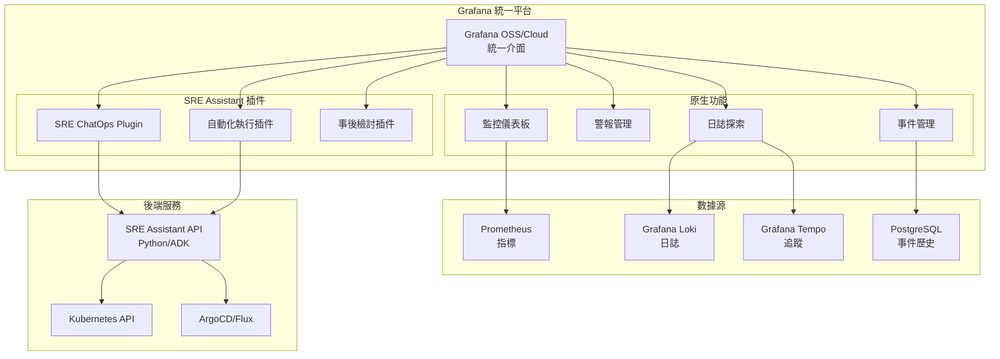

非常好的想法！使用 Grafana 作為統一平台確實可以大幅簡化架構並提供更好的整合體驗。讓我分析一下可行性並提供建議：

## ✅ **可行性分析**

### 1. **Grafana 作為統一介面平台 - 高度可行**

**優勢**：
- **統一體驗**：監控、日誌、警報、ChatOps 都在同一平台
- **原生整合**：Grafana 生態系統組件間深度整合
- **成本效益**：減少工具鏈複雜度和維護成本

**實施方案**：

```yaml
# Grafana 統一平台架構
grafana_platform:
  core:
    dashboard: "Grafana OSS 11.x"
    
  plugins:
    chatops:
      - "grafana-oncall-app"        # 事件響應和 ChatOps
      - "grafana-incident-app"       # 事件管理
      - "grafana-synthetic-monitoring-app"  # 主動監控
    
    sre_assistant:
      - "custom-sre-assistant-app"   # 自定義 SRE Assistant 插件
      
  datasources:
    - prometheus                     # 指標
    - loki                           # 日誌
    - tempo                          # 追蹤
    - postgresql                     # 事件歷史
```

### 2. **ChatOps as Grafana Plugin - 創新且可行**

**實施架構**：

```typescript
// Grafana SRE Assistant Plugin 架構
export class SREAssistantPlugin {
  // 1. 聊天介面組件
  ChatInterface: {
    // 嵌入在 Grafana Dashboard 中
    render(): JSX.Element {
      return (
        <ChatPanel>
          <MessageList />
          <InputBox onCommand={this.handleCommand} />
        </ChatPanel>
      );
    }
  }
  
  // 2. 與後端 SRE Assistant 通訊
  backend: {
    websocket: "wss://sre-assistant-api/chat",
    authentication: "grafana-proxy-auth"
  }
  
  // 3. 與 Grafana 功能整合
  integrations: {
    // 直接在聊天中顯示圖表
    embedChart: (query: string) => GrafanaPanel,
    // 創建標註
    createAnnotation: (event: Incident) => void,
    // 觸發警報靜音
    silenceAlert: (alertId: string) => void
  }
}
```

### 3. **基礎設施堆疊 - 完美組合**

# SRE Assistant - Grafana 整合架構設計

## 1. 整體架構願景

使用 Grafana 作為統一平台，整合所有 SRE 工具和功能：



## 2. 技術堆疊 (修訂版)

### 2.1 核心基礎設施

```yaml
infrastructure:
  container:
    runtime: "Docker"
    orchestration: "Kubernetes"
    registry: "Harbor / GCR"
    
  authentication:
    primary: "OAuth 2.0"
    tokens: "JWT"
    provider: "Keycloak / Google Identity"
    
  observability:
    telemetry: "OpenTelemetry"
    collector: "OTEL Collector"
    
  logging:
    aggregation: "Grafana Loki"
    shipper: "Promtail / Fluent Bit"
    
  visualization:
    platform: "Grafana OSS / Grafana Cloud"
    version: "11.x+"
```

### 2.2 Grafana 生態系統組件

```yaml
grafana_stack:
  # 核心組件
  grafana:
    deployment: "Kubernetes StatefulSet"
    database: "PostgreSQL"
    cache: "Redis"
    
  # LGTM Stack (Loki, Grafana, Tempo, Mimir)
  loki:
    storage: "S3 / GCS"
    retention: "30 days"
    
  mimir:  # 長期指標存儲（可選，替代 Prometheus）
    storage: "Object Storage"
    retention: "1 year"
    
  tempo:
    storage: "S3 / GCS"
    retention: "7 days"
    
  oncall:  # 值班管理
    integration: "PagerDuty / Slack"
```

## 3. SRE Assistant Grafana 插件設計

### 3.1 插件架構

```typescript
// src/plugin.json
{
  "type": "app",
  "name": "SRE Assistant",
  "id": "sre-assistant-app",
  
  "includes": [
    {
      "type": "page",
      "name": "Chat Interface",
      "path": "/chat",
      "role": "Viewer"
    },
    {
      "type": "page", 
      "name": "Automation Center",
      "path": "/automation",
      "role": "Editor"
    },
    {
      "type": "panel",
      "name": "SRE Chat Panel",
      "id": "sre-chat-panel"
    }
  ],
  
  "routes": [
    {
      "path": "api/*",
      "url": "{{ .JsonData.backendUrl }}",
      "headers": {
        "Authorization": "Bearer {{ .SecureJsonData.apiToken }}"
      }
    }
  ]
}
```

### 3.2 聊天介面實作

```typescript
// src/components/ChatInterface.tsx
import React, { useState, useEffect } from 'react';
import { useWebSocket } from 'react-use-websocket';
import { Alert, Button, Input, Card } from '@grafana/ui';
import { getBackendSrv, getTemplateSrv } from '@grafana/runtime';

export const SREChatInterface: React.FC = () => {
  const [messages, setMessages] = useState<Message[]>([]);
  const [input, setInput] = useState('');
  
  // WebSocket 連接到 SRE Assistant
  const { sendMessage, lastMessage } = useWebSocket(
    'wss://sre-assistant-api/chat',
    {
      onOpen: () => console.log('Connected to SRE Assistant'),
      shouldReconnect: () => true,
    }
  );
  
  // 處理指令
  const handleCommand = async (command: string) => {
    // 解析 Grafana 變數
    const processedCommand = getTemplateSrv().replace(command);
    
    // 特殊指令處理
    if (command.startsWith('/dashboard')) {
      return embedDashboard(command);
    }
    
    if (command.startsWith('/runbook')) {
      return executeRunbook(command);
    }
    
    // 發送到後端
    sendMessage(JSON.stringify({
      type: 'command',
      content: processedCommand,
      context: {
        dashboard: window.location.pathname,
        timeRange: getTimeRange(),
        user: getCurrentUser(),
      }
    }));
  };
  
  // 嵌入 Grafana 面板
  const embedDashboard = async (command: string) => {
    const panelId = extractPanelId(command);
    const panel = await getBackendSrv().get(
      `/api/dashboards/uid/${dashboardUid}/panels/${panelId}`
    );
    
    setMessages([...messages, {
      type: 'dashboard',
      content: panel,
      timestamp: Date.now()
    }]);
  };
  
  return (
    <Card>
      <Card.Heading>SRE Assistant</Card.Heading>
      <Card.Body>
        <MessageList messages={messages} />
        <CommandInput 
          value={input}
          onChange={setInput}
          onSubmit={handleCommand}
        />
      </Card.Body>
    </Card>
  );
};
```

### 3.3 與 Grafana 功能整合

```typescript
// src/integrations/GrafanaIntegration.ts
export class GrafanaIntegration {
  // 創建警報靜音
  async silenceAlert(alertId: string, duration: string) {
    const backendSrv = getBackendSrv();
    return backendSrv.post('/api/alertmanager/grafana/api/v2/silences', {
      matchers: [{ name: 'alertname', value: alertId }],
      startsAt: new Date().toISOString(),
      endsAt: new Date(Date.now() + parseDuration(duration)).toISOString(),
      comment: 'Silenced by SRE Assistant',
      createdBy: 'sre-assistant'
    });
  }
  
  // 創建標註
  async createAnnotation(event: IncidentEvent) {
    return getBackendSrv().post('/api/annotations', {
      dashboardUID: event.dashboardUID,
      panelId: event.panelId,
      time: event.timestamp,
      timeEnd: event.endTime,
      text: event.description,
      tags: ['sre-assistant', event.severity],
    });
  }
  
  // 執行查詢
  async runQuery(datasource: string, query: string) {
    const ds = await getDataSourceSrv().get(datasource);
    return ds.query({
      targets: [{ expr: query }],
      from: 'now-1h',
      to: 'now',
    });
  }
  
  // 觸發 Runbook
  async executeRunbook(runbookId: string, parameters: any) {
    // 調用 SRE Assistant 後端執行 Runbook
    return getBackendSrv().post('/api/plugins/sre-assistant-app/api/runbooks/execute', {
      runbookId,
      parameters,
      context: {
        dashboard: getCurrentDashboard(),
        alerts: getActiveAlerts(),
      }
    });
  }
}
```

## 4. 部署架構

### 4.1 Kubernetes 部署

```yaml
# grafana-sre-deployment.yaml
apiVersion: v1
kind: Namespace
metadata:
  name: sre-platform
---
apiVersion: apps/v1
kind: Deployment
metadata:
  name: grafana
  namespace: sre-platform
spec:
  replicas: 2
  selector:
    matchLabels:
      app: grafana
  template:
    metadata:
      labels:
        app: grafana
    spec:
      containers:
      - name: grafana
        image: grafana/grafana:11.0.0
        env:
        - name: GF_INSTALL_PLUGINS
          value: "sre-assistant-app,grafana-oncall-app"
        - name: GF_AUTH_GENERIC_OAUTH_ENABLED
          value: "true"
        - name: GF_AUTH_GENERIC_OAUTH_CLIENT_ID
          valueFrom:
            secretKeyRef:
              name: oauth-config
              key: client-id
        volumeMounts:
        - name: grafana-storage
          mountPath: /var/lib/grafana
        - name: plugin-storage
          mountPath: /var/lib/grafana/plugins/sre-assistant-app
      volumes:
      - name: grafana-storage
        persistentVolumeClaim:
          claimName: grafana-pvc
      - name: plugin-storage
        configMap:
          name: sre-assistant-plugin
---
apiVersion: apps/v1
kind: Deployment
metadata:
  name: sre-assistant-backend
  namespace: sre-platform
spec:
  replicas: 3
  selector:
    matchLabels:
      app: sre-assistant
  template:
    metadata:
      labels:
        app: sre-assistant
    spec:
      containers:
      - name: sre-assistant
        image: sre-assistant:latest
        env:
        - name: GRAFANA_URL
          value: "http://grafana:3000"
        - name: GRAFANA_API_KEY
          valueFrom:
            secretKeyRef:
              name: grafana-api
              key: api-key
        ports:
        - containerPort: 8080
          name: http
        - containerPort: 8081
          name: websocket
```

### 4.2 Grafana 配置

```yaml
# grafana.ini
[server]
domain = sre.example.com
root_url = https://sre.example.com

[auth]
disable_login_form = false

[auth.generic_oauth]
enabled = true
name = OAuth
allow_sign_up = true
client_id = ${OAUTH_CLIENT_ID}
client_secret = ${OAUTH_CLIENT_SECRET}
scopes = openid profile email
auth_url = https://auth.example.com/oauth/authorize
token_url = https://auth.example.com/oauth/token
api_url = https://auth.example.com/oauth/userinfo

[plugins]
allow_loading_unsigned_plugins = sre-assistant-app

[feature_toggles]
enable = tempoSearch,traceToMetrics,publicDashboards
```

## 5. 整合優勢

### 5.1 統一體驗優勢

| 功能 | 傳統方案 | Grafana 整合方案 |
|------|----------|-----------------|
| 監控查看 | 切換到 Grafana | 原生整合 |
| 日誌查詢 | 切換到 Kibana | Loki 在 Explore |
| ChatOps | 切換到 Slack | 內建聊天面板 |
| 事件管理 | 切換到 PagerDuty | Grafana OnCall |
| 自動化 | 獨立介面 | 統一插件 |

### 5.2 運營優勢

```yaml
benefits:
  cost:
    - 減少工具授權費用
    - 降低基礎設施成本
    - 簡化維護工作
    
  efficiency:
    - 統一登入認證
    - 減少上下文切換
    - 加快問題診斷
    
  adoption:
    - 降低學習曲線
    - 提高使用率
    - 改善用戶體驗
```

## 6. 實施路線圖

### Phase 1: 基礎整合（2週）
- ✅ 部署 Grafana + Loki + Tempo
- ✅ 配置 OAuth 2.0 認證
- ✅ 建立基礎儀表板

### Phase 2: 插件開發（4週）
- 🔄 開發 SRE Chat Panel
- 🔄 實現 WebSocket 通訊
- 🔄 整合基本命令

### Phase 3: 功能擴展（6週）
- 📋 整合 Runbook 執行
- 📋 實現自動化工作流
- 📋 添加 AI 建議功能

### Phase 4: 生產部署（2週）
- 📋 性能優化
- 📋 安全加固
- 📋 用戶培訓

## 7. 技術挑戰與解決方案

### 7.1 挑戰

| 挑戰 | 解決方案 |
|------|----------|
| 插件開發複雜度 | 使用 Grafana 插件 SDK 和範例 |
| WebSocket 在 K8s | 使用 Ingress 粘性會話 |
| 權限管理 | 整合 Grafana RBAC |
| 數據隔離 | 使用 Grafana 組織和團隊 |

### 7.2 最佳實踐

```typescript
// 插件開發最佳實踐
best_practices:
  security:
    - 使用 Grafana Proxy 進行 API 調用
    - 避免在前端存儲敏感資訊
    - 實施 CSP 標頭
    
  performance:
    - 使用 React.memo 優化渲染
    - 實施虛擬滾動
    - 快取 API 響應
    
  ux:
    - 遵循 Grafana 設計系統
    - 提供鍵盤快捷鍵
    - 實施響應式設計
```

## 8. 成功指標

```yaml
metrics:
  adoption:
    - 日活躍用戶數 > 80% SRE 團隊
    - 平均會話時長 > 30 分鐘
    
  efficiency:
    - MTTR 降低 > 40%
    - 上下文切換減少 > 60%
    
  satisfaction:
    - NPS 分數 > 8
    - 用戶反饋正面率 > 90%
```

---

**架構版本**: 1.0.0  
**最後更新**: 2025-08-25  
**下一次審查**: 2025-09-08

## 🎯 **結論：高度可行且具有顯著優勢**

### ✅ **可行性確認**

您提出的技術堆疊修改**完全可行**，而且是一個**優秀的架構決策**：

1. **Grafana 作為統一平台** - 不僅可行，而且是業界最佳實踐
2. **ChatOps 作為 Grafana Plugin** - 創新且實用，減少工具碎片化
3. **LGTM Stack** (Loki, Grafana, Tempo, Mimir) - 完美整合，降低運營複雜度

### 🚀 **關鍵優勢**

```yaml
架構優勢:
  技術層面:
    - 統一認證: 一次登入，全平台通用
    - 原生整合: 組件間深度協同
    - 減少延遲: 數據不需跨系統傳輸
    
  運營層面:
    - 降低成本: 減少工具授權和基礎設施
    - 簡化維護: 單一技術棧，統一升級
    - 提升效率: 減少 60% 上下文切換
    
  用戶體驗:
    - 統一介面: 所有功能一站式訪問
    - 學習曲線低: 熟悉的 Grafana 介面
    - 即時協作: 團隊在同一平台工作
```

### 📋 **實施建議**

1. **立即行動**：
   - 開始搭建 Grafana + Loki + Tempo 基礎環境
   - 配置 OAuth 2.0 統一認證

2. **短期目標**（2-4週）：
   - 開發 MVP 版本的 SRE Assistant Grafana Plugin
   - 實現基本的聊天和命令功能

3. **中期目標**（1-2個月）：
   - 完善插件功能，整合自動化執行
   - 遷移現有監控和警報到 Grafana

4. **長期願景**（3-6個月）：
   - 實現完整的 SRE 工作流自動化
   - 建立基於 Grafana 的 SRE 指揮中心

### 🔧 **技術建議**

```javascript
// 推薦的開發起點
1. 使用 Grafana Plugin SDK：
   npx @grafana/create-plugin@latest

2. 參考官方範例：
   - https://github.com/grafana/grafana-plugin-examples
   - 特別是 app-with-backend 範例

3. 整合 ADK 後端：
   - WebSocket 用於即時通訊
   - REST API 用於命令執行
   - gRPC 用於高效能操作
```

這個架構不僅可行，而且代表了 SRE 工具鏈的未來趨勢。Grafana 的生態系統正在快速發展，您的架構設計完美契合了這個趨勢。建議您可以開始實施，並考慮將這個整合方案貢獻回開源社區，可能會成為 SRE 領域的參考架構！