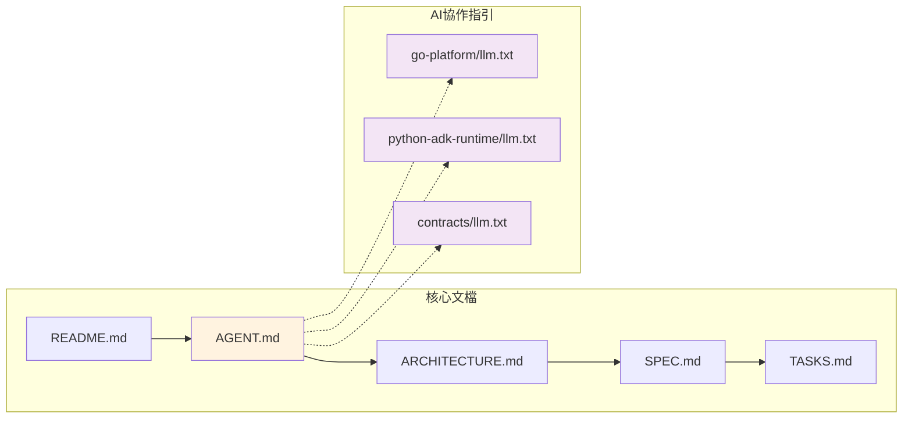
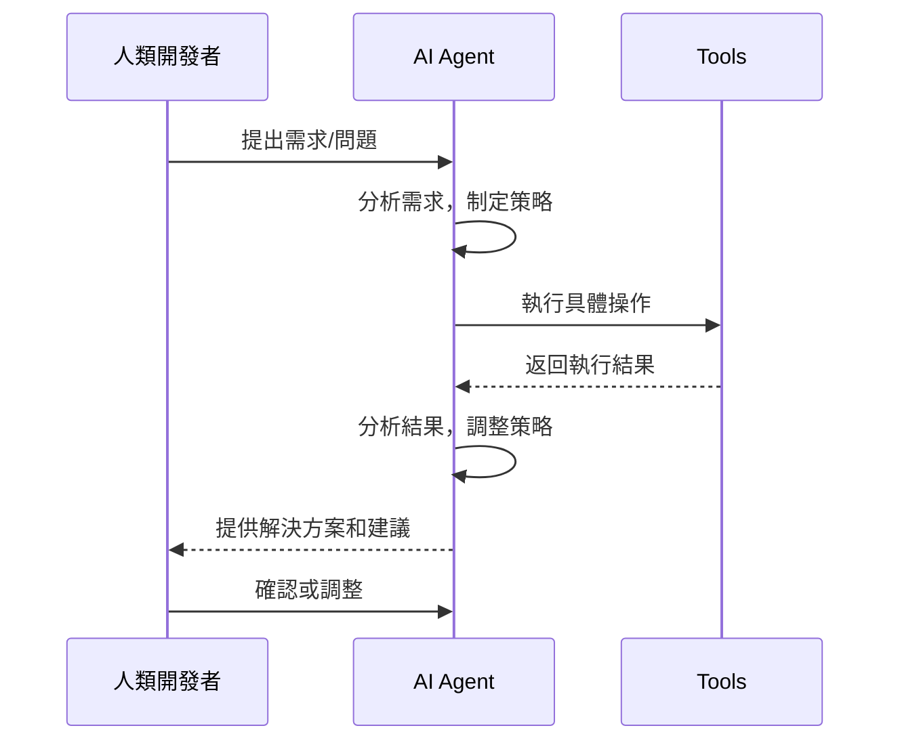
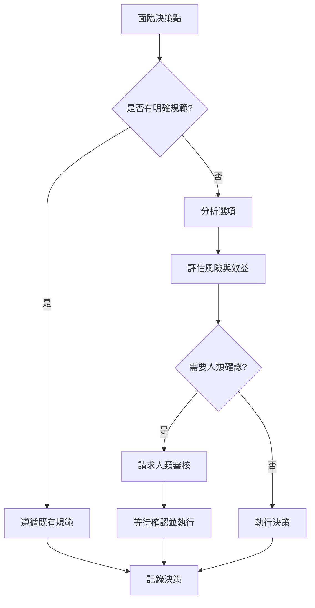

# AI 協作指南

> **文檔職責**：定義 AI 代理與人類開發者的協作規範、操作流程和品質標準

## 文檔定位

- **目標受眾**：AI 代理、協作開發者、AI 工程師
- **更新頻率**：每月
- **版本**：1.0.0
- **最後更新**：2025-08-20

## 文檔關係

### 核心文檔鏈

```bash
README.md (專案入口) → [AGENT.md] (AI協作規範) → ARCHITECTURE.md (系統架構) → SPEC.md (技術規格) → TASKS.md (開發任務)
```

### 文檔體系架構



**快速導航**：
- **前置閱讀**：[README.md - 專案概覽](README.md#專案概覽)
- **後續閱讀**：[ARCHITECTURE.md - 系統架構](ARCHITECTURE.md#系統架構設計)
- **技術參考**：[SPEC.md](SPEC.md) | [TASKS.md](TASKS.md)
- **ADK 範例**：[agents](adk-references/agents/)
- **ADK 文檔**：[docs](adk-references/docs/)

---

## 🎯 AI 協作黃金準則

### 核心原則

#### 1. 職責分工原則
```yaml
Agent (決策大腦):
  責任: "WHY - 為什麼做, WHAT - 做什麼, WHEN - 何時做"
  職能: "決策制定, 工作流編排, 策略規劃"

Tool (執行手臂):
  責任: "HOW - 如何做, WHERE - 在哪做, WITH - 用什麼做"
  職能: "具體執行, 數據操作, 系統互動"
```

#### 2. 結構化溝通標準
**任務請求格式**：
```yaml
Task_Request:
  objective: "明確的任務目標"
  context: "相關背景資訊和約束條件"
  success_criteria: "成功完成的標準"
  priority: "任務優先級 (P0-P3)"
```

**回應格式**：
```yaml
Task_Response:
  status: "執行狀態 (completed/in_progress/failed)"
  result: "具體執行結果"
  reasoning: "決策推理過程"
  next_steps: "建議的後續行動"
```

#### 3. 可追溯決策
所有決策必須包含：
- 決策原因和考量因素
- 替代方案的比較分析
- 約束條件和限制說明
- 實施步驟和驗證方法

#### 4. 持續學習機制
- 收集協作過程回饋
- 分析成功和失敗案例
- 持續優化協作模式
- 更新知識庫和流程

### 協作模式



---

## 🔄 標準工作流程

### 任務執行流程

#### Step 1: 任務接收與分析
**檢查清單**：
- [ ] 確認任務目標和期望結果
- [ ] 理解相關背景和約束條件
- [ ] 評估可用的工具和資源
- [ ] 識別潛在風險和挑戰
- [ ] 制定執行策略和時程

#### Step 2: 複雜度評估
| 複雜度 | 特徵 | 處理策略 |
|--------|------|----------|
| **簡單** | 單一工具、明確步驟、無依賴 | 直接執行 |
| **中等** | 多個工具、部分依賴、需要協調 | 分階段執行 |
| **複雜** | 多系統整合、複雜依賴、高風險 | 詳細規劃、分步驗證 |

#### Step 3: 決策制定


**決策權限範圍**：
- ✅ **自主決策**：標準開發流程、規範化技術選擇、低風險配置調整
- ⚠️ **需要確認**：架構變更、多模組影響、新技術引入
- ❌ **禁止決策**：生產環境修改、安全配置變更、資料庫結構調整

#### Step 4: 執行與監控
**執行檢查點**：
```yaml
Pre_Execution:
  - "確認執行環境準備就緒"
  - "驗證所需工具和權限"
  - "建立執行日誌記錄"

During_Execution:
  - "監控執行進度和狀態"
  - "記錄中間結果和異常"
  - "適時調整執行策略"

Post_Execution:
  - "驗證執行結果正確性"
  - "清理臨時資源"
  - "更新相關文檔和狀態"
```

#### Step 5: 結果交付
**交付標準驗證**：
- [ ] 功能完整性：所有要求功能已實現
- [ ] 品質標準：符合代碼品質和文檔標準
- [ ] 測試覆蓋：包含適當測試和驗證
- [ ] 文檔同步：相關文檔已更新
- [ ] 依賴處理：所有依賴關係正確處理

---

## ⚙️ 開發工具與指令

### 🚀 常用開發指令
```bash
# 佔位符
```

### 📋 品質檢查清單

#### 代碼品質標準
- [ ] **類型安全**：Python 類型標註完整，Go 類型安全
- [ ] **代碼風格**：符合專案風格指南和 linting 規則
- [ ] **錯誤處理**：完善的錯誤處理和異常管理
- [ ] **日誌記錄**：結構化日誌，包含適當上下文資訊
- [ ] **性能考量**：避免性能瓶頸和資源洩漏
- [ ] **安全實踐**：遵循安全編碼最佳實踐

#### 測試標準
- **單元測試**：覆蓋率 > 90%，測試所有公開介面
- **整合測試**：驗證跨模組通訊和依賴關係
- **端到端測試**：驗證完整使用者工作流程
- **性能測試**：確保符合性能基準要求

#### SSOT 契約優先原則
> 詳細契約管理：參見 [SPEC.md - 配置管理](SPEC.md#配置管理與模組規範)

任何跨語言介面或配置變更**必須**優先在 `contracts/` 完成：
1. 更新 proto/schema/samples
2. 執行 `buf lint && buf generate` 
3. 同步到下游專案

---

## 🔧 故障排除與支援

### 常見問題快速診斷

#### gRPC 通訊問題
```bash
# 檢查服務狀態
curl http://localhost:8080/health
grpcurl -plaintext localhost:5002 detectviz.contracts.v1.HealthService/Check

# 驗證契約一致性
make health-check-proto
```

#### 環境配置問題
```bash
# 完整實作驗證
make validate-implementation

# 自動修復常見問題
make fix-common-issues
```

#### 模組卡驗證問題
```bash
# 自動修復模組卡
make fix-module-cards

# 檢查模組 llm.txt 指南
cat go-platform/llm.txt
cat python-adk-runtime/llm.txt
cat contracts/llm.txt
```

### 升級機制

**升級觸發條件**：
- **技術問題**：超出當前知識範圍的技術難題
- **決策問題**：需要業務判斷或策略決策的情況
- **安全問題**：涉及安全風險的操作或配置
- **緊急問題**：影響生產環境或關鍵功能的問題

---

## 學習資源與參考

### 核心文檔參考
- **技術規格**：[SPEC.md - 技術棧與依賴](SPEC.md#技術棧現狀)
- **系統架構**：[ARCHITECTURE.md - 系統架構設計](ARCHITECTURE.md#系統架構設計)
- **開發任務**：[TASKS.md - 實作任務清單](TASKS.md#實作任務清單)

### AI 協作指引
- **Go 模組指引**：[go-platform/llm.txt](go-platform/llm.txt)
- **Python 模組指引**：[python-adk-runtime/llm.txt](python-adk-runtime/llm.txt)
- **契約管理指引**：[contracts/llm.txt](contracts/llm.txt)

### 模組文檔
- **Go 平台核心**：[go-platform/README.md](go-platform/README.md)
- **Python ADK Runtime**：[python-adk-runtime/README.md](python-adk-runtime/README.md)
- **契約 SSOT**：[contracts/README.md](contracts/README.md)
- **部署服務**：[deploy/README.md](deploy/README.md)

---

## 協作效果評估

### 評估指標
- **任務完成率**：成功完成任務的比例
- **品質分數**：交付物品質的評估分數
- **效率指標**：完成任務所需的時間和資源
- **學習速度**：適應新需求和技術的能力
- **協作滿意度**：人類開發者的回饋評分

### 持續改進
- 定期收集效能指標和使用者回饋
- 分析成功和失敗的協作案例
- 優化工作流程和決策機制
- 更新培訓材料和知識庫

---

> **核心提醒**：遇到任何疑問，優先查閱對應的 SSOT 文檔和模組 llm.txt 指引！