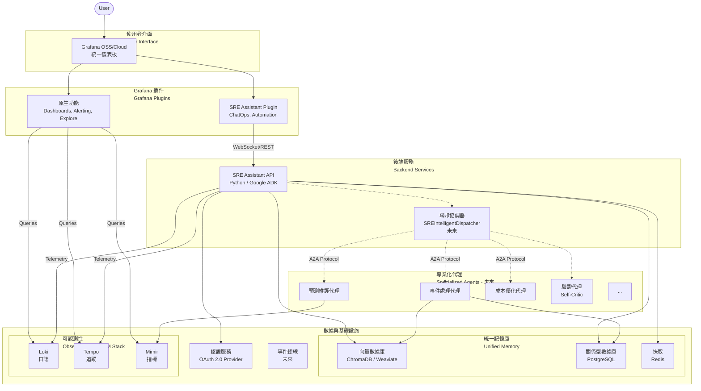

# ARCHITECTURE.md - SRE Assistant 統一架構設計

**版本**: 2.0.0
**狀態**: 生效中 (Active)
**維護者**: SRE Platform Team

## 1. 核心理念 (Core Philosophy)

SRE Assistant 的核心是一個以 **Grafana 為統一操作介面**、由**多個專業化智能代理協同工作**的**聯邦化 SRE 生態系統**。我們的目標是打造一個不僅能自動化解決問題，更能預測和預防未來故障的智能平台。

- **程式碼優先 (Code-First)**: 所有代理、工具和工作流程都在 Python 程式碼中定義。
- **模組化與聯邦化 (Modularity & Federation)**: 複雜的 SRE 工作流程由一個主協調器 (透過 `SREWorkflowFactory` 構建的 `SequentialAgent`) 調用多個小型、專業的子代理來完成。
- **可擴展的服務 (Extensible Services)**: 認證、記憶體和會話管理等核心服務被設計為可插拔的提供者 (Provider) 模式，以適應不同的生產環境。

## 2. 架構願景 (Architectural Vision)

本架構旨在將 SRE Assistant 從一個單體智能代理，演進為一個以 **Grafana 為統一指揮中心**、由**多個專業化智能代理協同工作**的**聯邦化 SRE 生態系統**。我們的目標是打造一個不僅能自動化解決當前問題，更能預測和預防未來故障的智能平台，同時為 SRE 團隊提供無縫、統一的操作體驗。

- **短期目標 (Tactical Goal)**: 透過深度整合 Grafana，提供一個集監控、告警、日誌、追蹤和 ChatOps 於一體的單一操作平台，快速提升 SRE 工作效率，減少上下文切換。
- **長期願景 (Strategic Vision)**: 建立一個開放、可擴展的代理聯邦，每個代理都是特定領域（如事件處理、成本優化、混沌工程）的專家，它們可以獨立演進、自由組合，共同應對複雜的可靠性挑戰。

## 3. 核心設計原則 (Core Design Principles)

1.  **Grafana 中心化 (Grafana-Centric)**: 以 Grafana 為所有 SRE 工作流的統一入口和介面，最大化利用其生態系統能力。
2.  **後端即服務，前端即插件 (BaaS, FaaP)**: SRE Assistant 核心能力由基於 Google ADK 的後端服務提供，使用者主要透過 Grafana 插件與之互動。
2.  **聯邦化設計 (Federated Design)**: 後端架構遵循「一個代理，一個專業領域」的原則，為多代理協同工作設計。這支持了關注點分離、獨立演進和可組合性。上層的協調器應將專業化代理視為可調用的「工具 (Agent-as-Tool)」，並支援循序和並行執行，以應對複雜的工作流程。此設計的理論基礎源於《代理人指南》中闡述的多代理人系統優勢，包括：
    - **增強準確性 (Enhanced Accuracy)**: 專業化代理人可以交叉驗證彼此的工作。
    - **提高效率 (Improved Efficiency)**: 代理人可以並行工作，加速複雜任務的完成。
    - **更好地處理複雜任務 (Better Handling of Complex Tasks)**: 大型任務可以被分解為更小、更易於管理的子任務。
    - **增加可擴展性 (Increased Scalability)**: 可以透過增加新的專業代理人來輕鬆擴展系統能力。
    - **提高容錯性 (Improved Fault Tolerance)**: 單個代理人的故障不會導致整個系統癱瘓。
4.  **可觀測性驅動 (Observability-Driven)**: 深度整合 LGTM (Loki, Grafana, Tempo, Mimir) 技術棧，確保系統自身的每一個決策和行動都高度可觀測。
5.  **ADK 原生擴展 (ADK-Native Extensibility)**: 充分利用 ADK 的 Provider 模型，以符合框架最佳實踐的方式實現認證、記憶體和會話管理等核心功能。
- **應用程式為中心診斷 (Application-Centric Diagnosis)**: 診斷流程必須以「應用程式」為單位，理解其拓撲結構與依賴關係，而非僅僅處理單一、孤立的警報。診斷的起點應基於對「四大黃金訊號」的分析。
- **LLM 可觀測性 (LLM Observability)**: Agent 自身的決策過程（例如，工具選擇、提示生成、Token 消耗、成本、延遲）必須是完全可追蹤和可觀測的，以確保系統的可靠性和可維護性。這是一個關鍵的非功能性需求。
6.  **漸進式演進 (Phased Evolution)**: 優先交付價值最高的 Grafana 整合功能，並在此基礎上逐步、平滑地向聯邦化生態系統演進。

## 4. 總體架構 (Overall Architecture)



此架構圖描繪了一個**分層模式 (Hierarchical Pattern)** 的多代理人系統，其中 `SREBackend`（或未來的 `Orchestrator`）作為中央協調器，將任務路由到下游的專業化代理。這種模式的詳細討論，以及其他如協作模式 (Collaborative Pattern) 和點對點模式 (Peer-to-Peer)，請參閱《代理人指南》。

## 5. 系統組件 (System Components)

### 5.1 介面層 (Interface Layer)
- **Grafana**: 作為整個系統的基礎平台，提供儀表板、告警、探索等原生功能。
- **SRE Assistant Grafana Plugin**: 一個自定義的 Grafana 應用插件，是人機交互的核心。
  - **職責**: 提供 ChatOps 介面、自動化工作流觸發器、與 Grafana 原生功能（如圖表嵌入、註解創建）的深度整合。
  - **技術**: TypeScript, React, Grafana Plugin SDK。

#### 5.1.1 即時互動模式 (Real-time Interaction Patterns)
- **雙向串流 (Bidirectional Streaming)**: 除了傳統的請求/回應模式，ADK 也支援基於 WebSocket 或 gRPC 的雙向串流。這允許前端（如 Grafana 插件）與後端代理之間建立一個持久的、低延遲的通訊渠道，實現如即時語音輸入、工具執行狀態的即時更新等進階互動體驗。

### 5.2 後端服務層 (Backend Service Layer)
- **SRE Assistant API**: 系統的核心大腦，一個無狀態的後端服務。
  - **職責**: 處理來自 Grafana 插件的請求，執行核心業務邏輯（診斷、修復、覆盤），管理工具，協調對記憶庫的訪問。
  - **技術**: Python, Google Agent Development Kit (ADK)。
- **聯邦協調器 (Orchestrator)**: (未來階段) 負責將複雜任務分解並路由到不同專業化代理的服務。在初期，其部分職責由 SRE Assistant API 承擔。

### 5.3 核心工作流程代理 (Core Workflow Agents)

> **[實施狀態註記]**
> 以下章節描述的是 `EnhancedSREWorkflow` 的**目標架構**。在目前的 Phase 1 實作中 (`src/sre_assistant/workflow.py`)，我們已經搭建了此工作流程的骨架，但所有專業化的子代理（如 `MetricsAnalyzer`, `IntelligentDispatcher`）目前暫時使用簡單的 `LlmAgent` 作為佔位符 (placeholder)。這些佔位符將在後續的開發任務中被逐步替換為功能完備的真實代理。

根據 `review.md` 的建議，SRE Assistant 的核心工作流程將由以下關鍵的、符合 ADK 最佳實踐的代理組成：

- **`IntelligentDispatcher` (智能分診器)**:
    - **職責**: 作為修復階段的入口，取代簡單的 `if/else` 邏輯。它使用一個 LLM 來分析診斷階段的輸出，並動態地選擇一個或多個最合適的下游專家代理（如 `KubernetesRemediationAgent`）來執行修復。
    - **ADK 模式**: `Agent-as-Tool`, `LLM-as-a-Router`。

- **`VerificationAgent` (驗證代理)**:
    - **職責**: 在修復操作執行後，自動化地驗證問題是否已真正解決。它會執行一系列健康檢查（如 `HealthCheckAgent`, `SLOValidationAgent`）來確認系統狀態。
    - **ADK 模式**: `Self-Criticism` (自我審查)。如果驗證失敗，它可以觸發一個回呼函式 (`on_failure_callback`) 來啟動回滾程序。

- **`Planner` (規劃器)**:
    - **職責**: 對於需要多步驟、複雜推理的代理，我們可以為其配備一個 `Planner`（如 `PlanReActPlanner`）。這會強制代理在執行任何工具或動作之前，先生成一個清晰、分步驟的執行計畫。
    - **ADK 模式**: `Chain-of-Thought` (思維鏈)。這個計畫不僅提高了任務成功的機率，更重要的是，它將代理的「思考過程」完全暴露出來，使其決策路徑變得透明、可觀測，極大地增強了系統的可調試性和可靠性。

### 5.4 專業化代理層 (Specialized Agent Layer)
- (未來階段) 一系列獨立的、專注於特定領域的智能代理。例如：`IncidentHandlerAgent`, `PredictiveMaintenanceAgent`, `ChaosEngineeringAgent` 等。它們將透過 A2A 協議與協調器通訊。

### 5.4 數據與基礎設施層 (Data & Infrastructure Layer)
- **統一記憶庫 (Unified Memory)**: 為所有代理提供短期、長期、程序和語義記憶。
  - **短期記憶體 (會話狀態)**: 採用 ADK 的 `DatabaseSessionService`，後端使用 PostgreSQL，以支持生產環境下的多實例部署和可靠性。這確保了在單一調查流程中的上下文不會因服務重啟而丟失。
  - **長期記憶體 (知識庫)**: 採用 ADK 的 `MemoryProvider` 模式，後端使用 `ChromaDB` 進行本地開發，並可配置為在生產環境中使用 `Weaviate`。此服務負責將歷史事件、解決方案和文檔向量化，以支持 RAG。
  - **構件管理 (Artifact Management)**: 代理在執行過程中可能會產生或需要處理非結構化數據，如圖片、CSV 文件或 PDF 報告。ADK 的 `ArtifactService` 提供了一個標準化的方式來處理這些「構件」，將其上傳到如 Google Cloud Storage 等對象存儲中，並在會話狀態中保存一個可引用的 URI。
  - **快取**: Redis 用於高速快取常用數據和短期會話資訊。
- **可觀測性 (Observability)**: 採用 Grafana LGTM Stack。
  - **Loki**: 集中化日誌聚合。
  - **Tempo**: 分散式追蹤。
  - **Mimir/Prometheus**: 指標的長期存儲與查詢。
- **認證服務 (Authentication)**: 採用基於 OAuth 2.0/OIDC 的標準化認證流程，與 Grafana 的認證機制整合。

### 5.5 代理詳細資訊 (Agent Details)
- **類型 (Type)**: Workflow Orchestrator
- **框架 (Framework)**: Google Agent Development Kit (ADK)
- **模型 (LLM)**: Gemini Pro / GPT-4
- **部署目標 (Deployment)**: Kubernetes / Cloud Run / Local Docker

## 6. 技術棧 (Technology Stack)

| 類別 | 技術選型 | 備註 |
|---|---|---|
| **核心框架** | Google Agent Development Kit (ADK) | Python 3.11+ |
| **前端** | Grafana Plugin SDK, TypeScript, React | 內嵌於 Grafana |
| **後端語言** | Python 3.11+ | |
| **LLM** | Gemini Pro / GPT-4 | 可配置 |
| **可觀測性** | Grafana (OSS / Cloud), Loki, Tempo, Mimir | LGTM Stack |
| **向量數據庫** | ChromaDB (本地) / Weaviate | |
| **關係型數據庫** | PostgreSQL | |
| **快取** | Redis / InMemory | 支援記憶體快取以簡化本地開發 |
| **容器化** | Docker, Kubernetes | |
| **A2A 通訊** | gRPC + Protocol Buffers | 未來階段 |
| **認證授權** | OAuth 2.0 / OIDC / None | `None` 選項方便本地無認證測試 |

## 7. ADK 原生擴展性 (ADK-Native Extensibility)

為了構建一個**生產級、可擴展、可維護**的代理系統，我們必須**強制**遵循 ADK 的原生擴展模式，而非自行實現類似功能。這確保了我們能充分利用框架的內建能力、未來的優化和標準化的行為。

- **`session_service_builder` (短期記憶體)**: 這是實現**可靠的短期記憶體**的**唯一正確方式**。
    - **問題**: 預設的 `InMemorySessionService` **絕對不能用於生產**，因為它會在服務重啟或水平擴展時丟失所有對話上下文，導致任務中斷和用戶體驗不佳。
    - **解決方案**: 系統**已實現**一個由工廠模式驅動的會話服務 (`SessionFactory`)。根據配置，此工廠能夠提供基於 `DatabaseSessionService` 的持久化會話（後端使用 PostgreSQL），或是在開發環境中提供 `InMemorySessionService`。這確保了在生產環境中，即使用戶的請求被路由到不同的 Pod 或服務發生重啟，進行中的調查任務狀態也能被完整保留。

- **`MemoryProvider` (長期記憶體 / RAG)**: 這是實現**可擴展的長期記憶體**的標準模式。
    - **問題**: 將 RAG 邏輯直接寫在代理內部會導致程式碼耦合，難以測試和替換。
    - **解決方案**: 系統**已實現**一個自定義的 `MemoryProvider` (`ChromaBackend`)，它橋接到 `ChromaDB`。此提供者允許代理透過標準化的 `search_memory` 接口，從過去的事件和文檔中學習，同時將記憶體管理的複雜性與代理的核心邏輯分離。

- **`AuthProvider` (認證)**: 這是**整合認證**的標準介面。
    - **問題**: 自行實現的認證邏輯（如 `review.md` 中指出的舊版 `AuthManager`）容易出錯，且無法與 ADK 的生態系統（如 UI、工具）無縫協作。
    - **解決方案**: 系統**已實現**一個由工廠模式驅動、符合 `AuthProvider` 協議的可插拔認證框架 (`AuthFactory`)。此框架已整合至 API 層，並預設提供一個 `NoAuthProvider` 用於本地開發。這個基礎使得未來新增一個完整的 OAuth 2.0/OIDC 提供者變得簡單，並能確保與 Grafana 的用戶身份驗證和組織架構正確對接，實現單點登錄 (SSO) 和基於角色的訪問控制 (RBAC)。

- **`CodeExecution` (沙箱化程式碼執行)**: 這是賦予代理**動態解決問題能力**的強大擴展。
    - **問題**: 許多一次性的診斷或分析任務，如果為其編寫專門的工具，成本效益很低。
    - **解決方案**: 在需要時，我們可以為代理配備 ADK 的**沙箱化程式碼執行工具**。這允許代理安全地執行由 LLM 生成的 Python 腳本，用於進行複雜的資料轉換、臨時計算或與沒有現成工具的函式庫互動，極大地增強了代理的靈活性和解決未知問題的能力。

## 8. 安全架構 (Security Architecture)

安全是系統設計的基石，採用縱深防禦策略：
- **認證 (Authentication)**:
    - **協議**: 系統將強制使用 OAuth 2.0 / OIDC 作為標準協議。
    - **實現**: Grafana 和 SRE Assistant 後端共享同一個身份提供者。認證流程將由標準的 `AuthProvider` 擴展和符合 ADK 規範的**無狀態 `AuthenticationTool`** 來處理，取代任何有狀態的自定義管理器。
- **授權 (Authorization)**: 利用 Grafana 的團隊和角色，在 SRE Assistant 後端實現細粒度的 RBAC。
- **通訊加密 (Communication)**: 所有外部通訊使用 TLS 1.3。服務間通訊（K8s 內部）將利用 Service Mesh (如 Istio) 實現 mTLS。
- **秘密管理 (Secrets Management)**: 所有密鑰、API Token 等敏感資訊都將存儲在 HashiCorp Vault 或雲提供商的 Secret Manager 中。**Refresh Token 等敏感憑證絕不能直接存儲在會話狀態中**。
- **數據安全 (Data Security)**: 敏感數據在靜態時使用 AES-256 加密，並在日誌和追蹤中進行 PII 遮罩。
- **稽核日誌 (Audit Logging)**: 所有代理執行的操作都有完整的稽核追蹤。
- **合規性 (Compliance)**: 系統設計符合 SOC 2, GDPR, HIPAA 等規範。

## 9. 部署與配置 (Deployment & Configuration)

### 9.1 Grafana 插件安裝

```bash
grafana-cli plugins install sre-assistant-app
systemctl restart grafana-server
```

### 9.2 配置範例 (Configuration Example)

```yaml
# src/sre_assistant/config/production.yaml
deployment:
  platform: kubernetes
  replicas: 3

auth:
  provider: oauth2
  oidc_issuer: "https://accounts.google.com"

memory:
  backend: weaviate
  weaviate_url: "https://weaviate.example.com"

observability:
  prometheus_url: "http://prometheus:9090"
  loki_url: "http://loki:3100"

agents:
  incident_handler:
    auto_remediation_threshold: "P2"
    escalation_timeout: 300s

  predictive_maintenance:
    anomaly_detection_enabled: true
    forecast_horizon: "7d"
```

## 10. 韌性與故障處理 (Resilience and Fault Tolerance)

系統的韌性是確保服務可靠性的關鍵。我們將採用以下機制來處理故障：

- **斷路器 (Circuit Breaker)**:
  - **目的**: 防止對已失效或響應緩慢的下游服務的重複調用，避免級聯故障。
  - **實現**: 在與外部服務（如 Prometheus, GitHub API）的客戶端中實現。
  - **配置**:
    - `threshold`: 失敗率達到 50% 時開啟。
    - `timeout`: 斷路器開啟後，30 秒後進入半開狀態嘗試恢復。
- **降級策略 (Fallback Strategy)**:
  - **目的**: 在關鍵依賴不可用時，提供有損但仍然可用的服務。
  - **策略**:
    - `cache_response`: 返回來自快取的舊數據。
    - `degraded_mode`: 提供功能受限的回應（例如，只提供基於日誌的分析，而不查詢指標）。
    - `manual_override`: 允許操作員手動覆蓋自動化決策。

## 11. 性能基準 (Performance Targets)

為了量化和追蹤系統的性能，我們定義以下服務水平目標 (SLO)：

- **p50 延遲 (p50 Latency)**: `< 100ms` (對於簡單的聊天回應)
- **p99 延遲 (p99 Latency)**: `< 500ms` (對於需要單一工具執行的查詢)
- **吞吐量 (Throughput)**: `> 1000 req/s` (後端 API 服務)
- **可用性 (Availability)**: `99.9%`

這些目標將通過 Grafana 儀表板進行監控。

## 12. 監控告警規則 (Monitoring and Alerting Rules)

為了確保 SLO/SLI 被有效監控，我們定義以下告警規則範例。這些規則將在 Prometheus/Mimir 中實現。

```yaml
alerting_rules:
  high_latency:
    condition: p99_latency > 500ms
    duration: 5m
    severity: warning

  service_down:
    condition: availability < 99%
    duration: 1m
    severity: critical
```

## 13. 數據一致性 (Data Consistency)

在多個數據存儲之間保持一致性至關重要：

- **策略**: 採用**最終一致性 (Eventual Consistency)** 模型。
- **機制**:
  - **事件驅動同步**: 當主數據源（如 PostgreSQL 中的事件記錄）發生變更時，會發布一個事件到事件總線。
  - **異步更新**: 下游消費者（如 Weaviate 的向量化服務）訂閱這些事件，並異步更新其數據。
  - **冪等性**: 所有更新操作都設計為冪等的，以處理重複的事件消息。

## 14. 代理可靠性評估 (Agent Reliability Evaluation)

除了即時的監控和線上驗證 (`VerificationAgent`)，建立一個強健的**離線評估 (Offline Evaluation)** 框架對於確保代理的準確性、可靠性和持續改進至關重要。我們將採用 ADK 的原生評估框架來實現這一點。

- **核心策略**:
  - **黃金標準數據集 (Golden Datasets)**: 我們將建立並維護一組「黃金標準」的測試案例（例如，`eval/sre_incidents.jsonl`），其中每個案例都包含一個典型的輸入問題和一個由人類專家定義的理想輸出或執行軌跡。
  - **LLM 作為評審 (LLM-as-a-Judge)**: 對於評估最終回應的品質（例如，覆盤報告的清晰度、根因分析的準確性），我們將使用一個強大的 LLM（如 Gemini 1.5 Pro）作為自動評審，根據預定義的標準（如幫助性、事實一致性）進行打分。
  - **軌跡評估 (Trajectory Evaluation)**: 對於評估代理的「思考過程」，我們將比較代理執行的工具調用序列（軌跡）與黃金標準數據集中定義的理想軌跡。這確保了代理不僅得出正確答案，而且是以最高效、最合理的方式得出的。

- **實現方式**:
  - **`AgentEvaluator`**: 我們將使用 ADK 的 `AgentEvaluator` 來編排整個評估流程。
  - **CI/CD 整合**: 評估流程將被整合到我們的 CI/CD 管道中。每次程式碼合併前，都會自動運行評估，以防止模型或提示的變更導致性能迴歸。
  - **評估指標**: 我們將追蹤一系列關鍵指標，包括：
    - `accuracy`: 準確性
    - `latency`: 延遲
    - `cost`: Token 消耗成本
    - `tool_call_precision/recall`: 工具調用的精確度和召回率

## 15. 實施路線圖 (Implementation Roadmap)

本架構將分階段實施，詳細的時程、里程碑和交付物，請參閱我們的官方路線圖文件：
[**ROADMAP.md**](ROADMAP.md)
