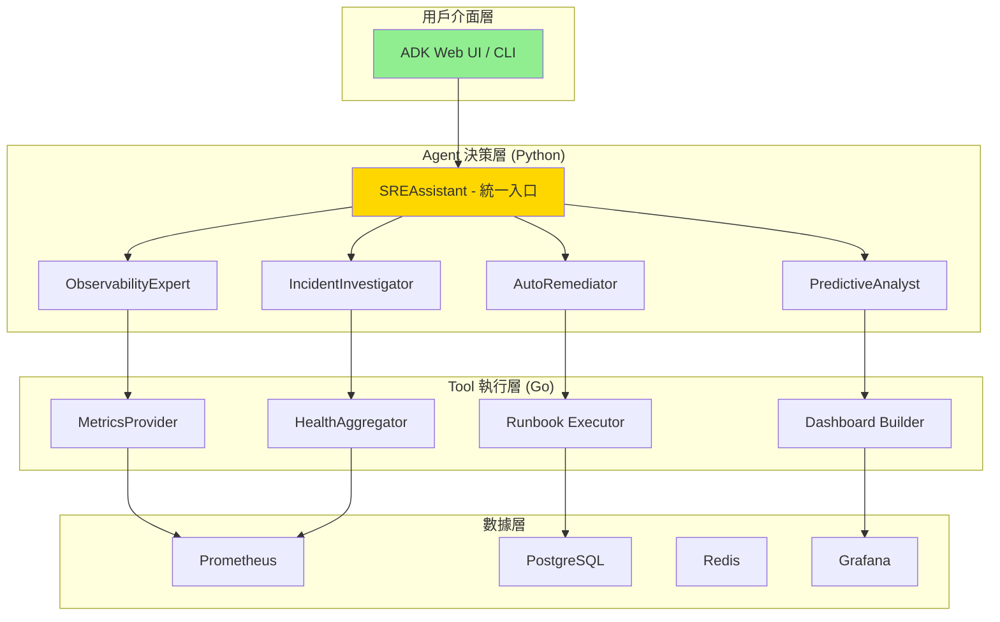

# 系統架構文檔

> **文檔職責**：定義 SRE Assistant 的系統架構、設計決策、AI Agent 架構和開發指導原則
> **版本**：1.0.0
> **最後更新**：2025-08-20

## 文檔定位

- **目標受眾**：架構師、AI工程師、開發者、技術負責人
- **更新頻率**：季度評審，重大架構變更時更新

## 文檔關係

```bash
README.md → AGENT.md → [ARCHITECTURE.md] → SPEC.md → TASKS.md
```

**相關文檔**：
- **前置閱讀**：[README.md - 專案概覽](README.md#專案概覽)
- **技術規格**：[SPEC.md - 技術實作規格](SPEC.md#技術棧與依賴)
- **協作指南**：[AGENT.md - AI協作指南](AGENT.md#ai協作原則)

---

## 系統架構設計

### 核心設計原則

1. **助理優先 (Assistant-First)**: 所有平台能力都必須透過一個統一的、對話式的 SREAssistant 暴露給使用者。使用者無需與後端系統直接互動。  
2. **專家解耦 (Decoupled Expertise)**: 平台的核心是一個輕量級的協調器。所有具體的業務邏輯（如診斷、配置）都必須被封裝在獨立、可插拔的「專家 Agent」中。  
3. **契約驅動 (Contract-Driven)**: 平台核心與 Agent 執行環境之間的通訊，必須透過一份最小化且極度穩定的 gRPC 契約來定義。  
4. **知識閉環 (Knowledge Loop)**: 平台必須內建一個核心的知識庫服務。所有 Agent 的行動和成果都應被記錄、學習，並反哺未來的決策。  
5. **開發者體驗至上 (DX First)**: Agent 的開發框架 (ADK) 必須極度簡潔，將所有底層複雜性（通訊、狀態管理）完全抽象，讓開發者能專注於創造價值。

### 系統架構

平台由三個主要部分構成：

1. **協調核心 (Orchestration Core)**:  
   * **語言**: Go  
   * **職責**: 穩定性、安全性、資源管理。作為平台的「作業系統」。  
2. **Agent 執行環境 (Agent Runtime)**:  
   * **語言**: Python  
   * **職責**: 敏捷性、智慧邏輯、快速迭代。作為 Agent 的「大腦和身體」。  
3. **通訊契約 (Communication Contract)**:  
   * **技術**: gRPC / Protobuf  
   * **職責**: 定義兩者之間清晰、高效的通訊邊界。

# 專案目錄結構

```bash
sre-assistant/
├── contracts/              # 🔥 契約層（語言無關）
│   ├── proto/             # gRPC 定義
│   └── schemas/           # JSON Schema
│
├── core/                  # 🔥 Go 協調核心
│   ├── cmd/               # 啟動入口
│   ├── internal/          # 內部實現
│   │   ├── orchestrator/ # 協調器
│   │   ├── bridge/       # Tool Bridge
│   │   └── security/     # 安全管理
│   └── tools/             # Shell 工具腳本
│       ├── diagnostic/    # 診斷腳本
│       ├── config/        # 配置腳本
│       └── remediation/   # 修復腳本
│
├── agents/                # 🔥 Python Agent 層
│   ├── sre_assistant/    # 主助理
│   │   ├── __init__.py
│   │   ├── assistant.py  # SREAssistant 實現
│   │   └── intent.py     # 意圖理解
│   ├── experts/          # 專家 Agents
│   │   ├── diagnostic/   # 診斷專家
│   │   ├── postmortem/   # 複盤專家
│   │   └── remediation/  # 修復專家
│   └── framework/        # ADK 框架
│       ├── base.py       # Agent 基類
│       ├── tools.py      # Tool 包裝
│       └── memory.py     # 狀態管理
│
├── deploy/               # 部署配置
│   ├── docker/          # Docker 相關
│   ├── k8s/             # Kubernetes 配置
│   └── compose/         # Docker Compose
│
├── tests/               # 測試套件
│   ├── unit/           # 單元測試
│   ├── integration/    # 集成測試
│   └── e2e/            # 端到端測試
│
├── docs/                # 文檔
│   ├── architecture/   # 架構文檔
│   ├── api/            # API 文檔
│   └── guides/         # 使用指南
│
├── scripts/            # 輔助腳本
│   ├── setup.sh       # 環境設置
│   ├── test.sh        # 測試腳本
│   └── deploy.sh      # 部署腳本
│
├── Makefile           # 構建自動化
├── project.toml       # 專案配置
├── README.md          # 專案說明
└── .env.example       # 環境變數範例
```

1. contracts/: 這是整個架構中**最重要**的目錄。它用 proto 檔案定義了 Go 和 Python 兩個世界之間唯一的、神聖的通訊協定。  
2. core/: 這裡只存放 Go 程式碼，負責平台的核心穩定性、資源管理和安全。  
3. agents/: 這裡只存放 Python 程式碼，負責所有 Agent 的智慧邏輯和快速迭代。  
4. project.toml (或 pyproject.toml): 標示著這是一個現代化的 Python 專案，並統一管理 Python 相關的依賴和配置。  
5. .env.example: 為新加入的開發者提供了最清晰的環境變數配置指南。  
6. Makefile: 作為頂層的「總指揮」，提供了如 make test, make build, make deploy 這樣簡潔的、與語言無關的命令，隱藏了底層的複雜性。

### 核心設計理念

#### Agent vs Tool 職責劃分

> **黃金準則**：Agent 負責智能決策，Tool 負責具體執行

```
Agent (決策大腦)           Tool (執行手臂)
────────────────           ──────────────
WHY - 為什麼做             HOW - 如何做
WHAT - 做什麼             WHERE - 在哪做
WHEN - 何時做             WITH - 用什麼做
```

**職責邊界**：
- **Agent 負責決策**：分析情況、制定策略、協調資源
- **Tool 負責執行**：查詢數據、調用 API、生成報告
- **Agent 不直接碰數據**：所有數據操作必須通過 Tool
- **Tool 不做決策**：只提供能力，不判斷是否應該執行

### AI Agent 分層架構



---

## 技術架構

### 技術棧

```yaml
UI 層:
  - MVP: ADK Web (內建)
  - 後續: 自定義 Web UI (可選)

AI/ML 框架:
  - LLM: ADK 原生支援 (Gemini/Claude/GPT)
  - 備選: Ollama + 開源模型
  - Agent Framework: Google ADK
  - 向量DB: pgvector

執行層:
  - 語言: Go
  - 框架: ToolBridge + Plugin Host
  - 通訊: gRPC + Protocol Buffers

數據層:
  - 時序數據: Prometheus
  - 關係數據: PostgreSQL
  - 狀態管理: Redis
  - 可視化: Grafana
```
