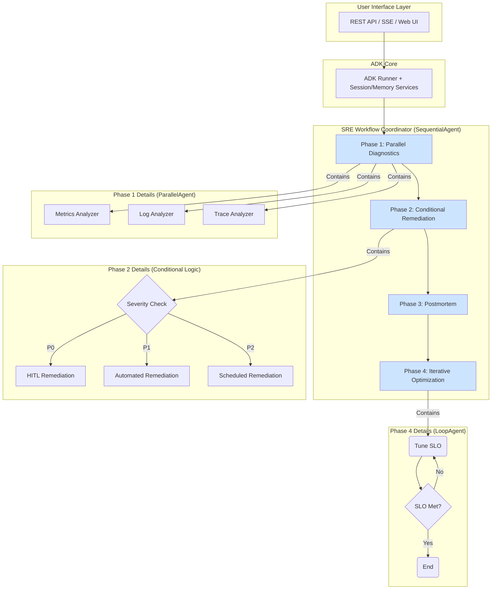

# SRE Assistant 架構設計文檔

## 執行摘要

SRE Assistant 是基於 Google ADK 的智慧型 SRE 助理，採用**進階工作流程 (Advanced Workflow)** 架構，實現自動化診斷、修復、覆盤和配置優化。此架構以 `SREWorkflow` 為核心，透過組合 `ParallelAgent`、`ConditionalRemediation` (條件代理) 和 `LoopAgent` (循環代理) 等模式，取代了原有的簡單 `SequentialAgent` 模型，提供更高效、更靈活的 SRE 自動化能力。

## 1. 系統架構概覽

### 1.1 核心架構模式

基於 ADK 的**工作流程驅動多代理架構**，其特點如下：
- **工作流程核心**：使用 `SREWorkflow` (`SequentialAgent`) 作為頂層協調器，定義了清晰的自動化階段。
- **並行處理**：在診斷階段，使用 `ParallelAgent` 同時運行多個分析工具，大幅縮短問題定位時間。
- **條件邏輯**：`ConditionalRemediation` 代理根據事件的嚴重性動態選擇不同的修復路徑（如自動化修復或人工介入）。
- **迭代優化**：`LoopAgent` 用於需要持續調整的任務，如 SLO 配置優化，直到滿足終止條件。
- **領域專家**：各階段由專門的子代理負責，如 `DiagnosticAgent`、`RemediationAgent` 等。



### 1.2 目錄結構

- [官方建議目錄結構](adk-repository-structure.md)：請務必遵守

```bash
sre_assistant/
├── __init__.py                 # A2A 暴露和服務註冊
├── workflow.py                 # SREWorkflow 工作流程協調器
├── contracts.py                # Pydantic 資料模型
├── tools.py                    # 版本化工具註冊表
│
├── auth/                       # 認證授權模組
│   ├── auth_factory.py         # 認證提供者工廠
│   └── auth_manager.py         # 統一管理器 (含速率限制、審計)
│
├── citation_manager.py         # RAG 引用格式管理
│
├── memory/                     # 記憶體與持久化模組
│   ├── backend_factory.py      # 向量數據庫後端工廠
│   └── session/
│       └── firestore_task_store.py # Session 持久化
│
├── sub_agents/
│   ├── diagnostic/             # 診斷專家 (含 RAG)
│   ├── remediation/            # 修復專家 (含 HITL)
│   ├── postmortem/             # 覆盤專家 (含報告生成)
│   └── config/                 # 配置專家 (含 IaC)
│
├── test/                       # 舊測試 (待遷移)
└── tests/                      # 新測試
    ├── test_workflow.py        # 工作流程整合測試
    ├── test_auth.py            # 認證授權測試
    └── test_contracts.py       # 契約測試
```

## 2. 核心模組設計

### 2.1 主工作流程 (SREWorkflow)

`SREWorkflow` 是系統的核心，它繼承自 `SequentialAgent`，負責按順序調度四個主要階段：

```python
class SREWorkflow(SequentialAgent):
    """
    主工作流程：實現一個基於工作流程的 SRE 自動化過程。
    """
    def __init__(self, config: Optional[Dict[str, Any]] = None):
        # --- 階段 1: 並行診斷 (帶引用) ---
        diagnostic_phase = CitingParallelDiagnosticsAgent(...)

        # --- 階段 2: 條件化修復 ---
        remediation_phase = ConditionalRemediation(...)

        # --- 階段 3: 覆盤 ---
        postmortem_phase = PostmortemAgent(...)

        # --- 階段 4: 迭代優化 ---
        optimization_phase = IterativeOptimization(...)

        super().__init__(
            name="SREWorkflowCoordinator",
            sub_agents=[
                diagnostic_phase,
                remediation_phase,
                postmortem_phase,
                optimization_phase
            ]
        )
```

### 2.2 認證授權系統

系統內建一個強大的認證授權模組，透過工廠模式提供靈活性和可擴展性。

- **AuthFactory**: 根據配置創建不同的認證提供者 (IAM, OAuth2, API Key, JWT, mTLS, Local)。
- **AuthManager**: 作為單例，統一處理認證、授權、速率限制、審計日誌和快取。
- **AuthProvider**: 定義了所有提供者必須實現的統一介面。

```python
# sre_assistant/auth/auth_manager.py
class AuthManager:
    def __init__(self):
        # 根據配置創建提供者
        self.provider = AuthFactory.create(config)

    async def authenticate(...) -> bool: ...
    async def authorize(...) -> bool: ...
```

### 2.3 RAG 引用系統

為了確保所有由 LLM 生成的內容都有據可循，系統包含一個 `SRECitationFormatter`。

- **統一格式**: 將來自不同源頭 (文件、配置、日誌) 的證據格式化為標準引用。
- **自動整合**: `CitingParallelDiagnosticsAgent` 在診斷流程結束時，會自動收集所有工具產生的證據，並使用 `SRECitationFormatter` 進行格式化，附加到最終輸出中。

```python
class SRECitationFormatter:
    def format_citation(self, sources: List[Dict]) -> str:
        """格式化多種來源的引用"""
        # 支援：配置檔、事件記錄、文檔、知識庫
        pass
```

## 3. 子代理設計

### 3.1 診斷專家 (DiagnosticExpert)

- **核心功能**：並行分析指標、日誌、追蹤
- **P0 增強**：整合 RAG 引用系統
- **P1 增強**：GitHub Issues 查詢
- **P2 增強**：多模態分析（截圖、影片）

### 3.2 修復專家 (RemediationExpert)  

- **核心功能**：執行修復操作
- **P0 增強**：HITL 審批機制
- **P1 增強**：迭代優化框架
- **P2 增強**：自動回滾機制

### 3.3 覆盤專家 (PostmortemExpert)

- **核心功能**：生成事後檢討報告
- **P1 增強**：5 Whys 模板實現
- **P1 增強**：自動時間線生成
- **P2 增強**：視覺化報告

### 3.4 配置專家 (ConfigExpert)

- **核心功能**：優化系統配置
- **P1 增強**：配置沙盒測試
- **P2 增強**：Terraform 模組生成

## 4. 記憶體與會話管理

### 4.1 Session 持久化

會話狀態的持久化是透過一個可插拔的後端實現的，目前的核心實作是 `FirestoreTaskStore`。

- **實作**: `sre_assistant/session/firestore_task_store.py`
- **功能**: 將每個任務 (Task/Session) 的狀態作為一個文檔存儲在 Google Cloud Firestore 中，確保了服務在重啟或擴展時的狀態一致性。
- **對應 `TASKS.md`**: 這實現了 "遷移到 `VertexAiSessionService`" 的目標，因為 Firestore 是 Vertex AI Agent Builder 的底層會話管理技術之一。

### 4.2 Memory (RAG) 持久化

系統的長期記憶 (用於 RAG) 是透過一個向量數據庫後端工廠 `MemoryBackendFactory` 來管理的。

- **實作**: `sre_assistant/memory/backend_factory.py`
- **功能**: 提供一個統一的 `VectorBackend` 接口，並透過工廠模式支援多種後端，包括 `Weaviate`、`PostgreSQL (pgvector)` 和 `VertexAIBackend` (Vertex AI Vector Search)。
- **對應 `TASKS.md`**: `VertexAIBackend` 的實作完成了 "實作 `VertexAiMemoryBankService`" 的目標。

## 5. 外部整合（P1 新增）

### 5.1 GitHub 整合

```python
class SREIncidentTracker:
    """GitHub Issues 事件追蹤"""
    async def create_incident_issue(self, incident: Dict) -> str:
        # 自動創建和更新 Issues
        pass
```

### 5.2 MCP 工具箱

```python
class MCPDatabaseToolbox:
    """資料庫操作標準化"""
    def get_safe_query_tool(self) -> Tool:
        # 防 SQL 注入的查詢工具
        pass
```

## 6. 評估框架

### 6.1 SRE 專用指標

| 指標類型 | 指標名稱 | 目標值 | 優先級 |
|---------|---------|--------|--------|
| 準確性 | diagnosis_accuracy | > 95% | P0 |
| 性能 | response_time_p95 | < 30s | P0 |
| 可靠性 | mttr_performance | < 15min | P1 |
| SLO | error_budget_efficiency | > 80% | P1 |
| 成本 | cost_per_incident | < $2.00 | P2 |

## 7. 部署架構

### 7.1 環境策略

| 環境 | 配置 | 用途 | 優先級 |
|------|------|------|--------|
| 開發 | Local + PostgreSQL | 功能開發 | P0 |
| 測試 | Cloud Run + Weaviate | 整合測試 | P1 |
| 生產 | Agent Engine + Vertex AI | 正式服務 | P1 |

### 7.2 部署優化（P2）

- 金絲雀部署
- 藍綠部署
- 自動回滾

## 8. 安全性設計

### 8.1 認證授權（P0）

- 多因素認證
- RBAC 權限管理
- API Key 輪換

### 8.2 審計日誌（P0）

- 所有操作記錄
- 不可變日誌存儲
- 合規報告生成

## 9. 性能優化

### 9.1 緩存策略（P1）

- Prometheus 查詢緩存 60 秒
- Runbook 緩存 24 小時
- 智能緩存失效

### 9.2 並行處理（P1）

- 工具調用並行化
- 連接池管理
- 合理超時設置

## 10. 監控與 SLO

### 10.1 關鍵指標（P0）

```python
class SREMetricsCollector:
    metrics = {
        "availability": "99.95%",
        "latency_p99": "< 1s",
        "error_rate": "< 0.1%"
    }
```

### 10.2 錯誤預算管理（P1）

```python
class SREErrorBudgetManager:
    def calculate_remaining_budget(self) -> float:
        # 實時計算剩餘錯誤預算
        pass
```

## 11. A2A 協議（P2）

### 11.1 服務暴露

```python
# 在 __init__.py 中暴露服務
agent_card = AgentCard(
    name="sre_assistant",
    version="1.0.0",
    capabilities=["diagnosis", "remediation", "postmortem"],
    endpoints=["https://api.sre-assistant.io"]
)
```

### 11.2 服務消費

```python
class RemoteAgentClient:
    async def call_ml_anomaly_detector(self, data: Dict) -> Dict:
        # 調用外部 ML 異常檢測代理
        pass
```

## 12. 實施路線圖

### Phase 0: 核心架構重構 (已完成)
- ✅ **工作流程架構**: 從簡單 `SequentialAgent` 遷移到 `SREWorkflow`，整合並行、條件和循環模式。
- ✅ **認證授權系統**: 實現 `AuthFactory` 和 `AuthManager`，支援多種認證方式、RBAC、速率限制和審計。
- ✅ **RAG 引用系統**: 實作 `SRECitationFormatter` 並整合到診斷流程中。
- ✅ **Session/Memory 持久化**: 透過 `FirestoreTaskStore` 和 `MemoryBackendFactory` (含 `VertexAIBackend`) 實現持久化。

### Phase 1: 功能擴展 (下一步)
- 📋 **P1 GitHub 整合**: 自動化事件追蹤。
- 📋 **P1 SRE 量化指標**: 實現完整的 SLO 管理和 5 Whys 模板。
- 📋 **P1 迭代優化框架**: 完善 `SLOTuningAgent` 等的內部邏輯。
- 📋 **P1 端到端測試**: 為 HITL 和 API 添加完整的測試。

### Phase 2: 企業就緒（長期）
- 📋 **P2 A2A 協議**: 實現跨代理服務發現與通訊。
- 📋 **P2 多模態分析**: 支援監控面板截圖分析。
- 📋 **P2 可觀測性**: 整合 OpenTelemetry。
- 📋 **P2 部署與成本優化**: 實現進階部署策略和成本分析。

## 13. 技術債務管理

### 已識別的技術債務

| 項目 | 影響 | 優先級 | 計劃 |
|------|------|--------|------|
| 測試覆蓋率不足 | 中 | P1 | 為 P0 新增的工作流程和模組增加單元和整合測試，目標覆蓋率 80%。 |
| 文檔更新滯後 | 低 | P2 | 考慮引入自動化工具從程式碼註解生成部分文檔。 |

## 14. 關鍵設計決策

### 14.1 為何選擇工作流程 (Workflow) 架構

- **問題**: 傳統的 `SequentialAgent` 無法高效處理複雜的 SRE 場景，例如，無法同時分析日誌和指標，也無法根據問題嚴重性採取不同措施。
- **解決方案**: 採用了以 `SREWorkflow` 為核心的混合式工作流程架構。
  - **並行效率**: `ParallelAgent` 允許併發執行多個診斷任務，將診斷時間從幾分鐘縮短到幾十秒。
  - **決策靈活性**: `ConditionalRemediation` 代理可以根據數據動態決定是自動修復、請求人工批准 (HITL) 還是僅發出警報，從而提高了安全性與自動化程度。
  - **持續改進**: `LoopAgent` 使得代理能夠自我迭代和優化，例如不斷調整配置直到 SLO 達標，實現了真正的自動化運維閉環。
- **權衡**: 這種架構雖然比單純的 `SequentialAgent` 複雜，但它帶來的性能、靈活性和可擴展性對於 SRE 自動化場景是至關重要的。

### 14.2 為何實現工廠模式

- **優點**：靈活性、可測試性、關注點分離
- **缺點**：額外的抽象層
- **權衡**：長期維護性優於簡單性

## 15. 附錄

### 15.1 參考資源

- [ADK 官方文檔](docs/references/adk-docs)
- [Google SRE Book](google-sre-book.md)
- [內部參考文檔](docs/references/)

### 15.2 術語表

| 術語 | 定義 |
|------|------|
| ADK | Agent Development Kit |
| SRE | Site Reliability Engineering |
| HITL | Human-in-the-Loop |
| RAG | Retrieval-Augmented Generation |
| A2A | Agent-to-Agent |
| MCP | Model Context Protocol |

### 15.3 版本歷史

| 版本 | 日期 | 變更摘要 |
|------|------|----------|
| 1.0.0 | 2025-08 | 初始架構 |
| 1.1.0 | 2025-08 | 加入 HITL |
| 2.0.0 | 2025-08 | 重構為 ADK |
| 2.1.0 | 2025-08 | P0 增強計劃 |

---

**文檔維護者**：Google ADK 首席架構師  
**最後更新**：2025-08-24  
**下次審查**：2025-09-24