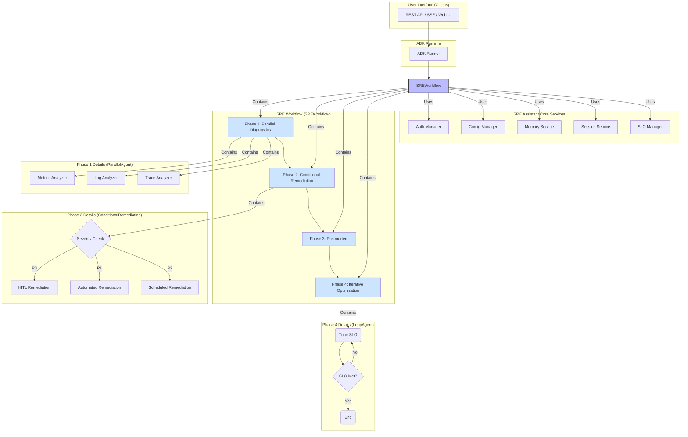

# SRE Assistant

**SRE Assistant** is an intelligent assistant built on the **Google Agent Development Kit (ADK)**, designed to automate and streamline Site Reliability Engineering (SRE) workflows. It handles the complete lifecycle of a production incident, from initial diagnosis to final postmortem and preventative optimization.

## Key Features

- **🤖 Advanced Workflow Automation**: Instead of a simple sequence of tasks, the SRE Assistant uses an advanced workflow that combines parallel processing, conditional logic, and iterative loops to handle complex SRE scenarios efficiently and flexibly.
- **🧠 RAG-Powered Diagnostics**: Utilizes Retrieval-Augmented Generation (RAG) to provide context-aware diagnostics. It consults internal documentation, historical incident data, and runbooks to identify the root cause of issues, providing citations for all its findings to ensure transparency.
- **🤝 Human-in-the-Loop (HITL)**: For critical operations, the assistant can pause and request human approval before proceeding, ensuring that automated actions are safe and supervised.
- **🧩 Multi-Agent System**: Composed of a team of specialized agents (Diagnostics, Remediation, Postmortem, Configuration) that collaborate to solve problems, each bringing its own expert skills to the table.
- **⚙️ Extensible & Pluggable**: Designed with a factory pattern for core services like authentication and data storage, allowing for easy extension and integration with different backends (e.g., Google IAM, OAuth, Weaviate, Vertex AI Vector Search).
- **📊 SLO-Driven Operations**: Natively understands Service Level Objectives (SLOs) and error budgets, enabling it to make data-driven decisions about incident response and system reliability.

## Architecture Overview

The SRE Assistant is built around a central `SREWorkflow` coordinator that orchestrates four key phases. This workflow-driven architecture allows for parallel execution of diagnostics and conditional logic for remediation, making it far more powerful than a simple sequential agent.



For a more detailed explanation of the architecture, please see [ARCHITECTURE.md](ARCHITECTURE.md).

## Getting Started

This project uses [Poetry](https://python-poetry.org/) for dependency management.

### Prerequisites

- Python 3.9+
- [Poetry](https://python-poetry.org/docs/#installation) installed on your system.

### Installation

1.  **Clone the repository:**
    ```sh
    git clone https://github.com/your-repo/sre-assistant.git
    cd sre-assistant
    ```

2.  **Install dependencies:**
    Use Poetry to install the required packages from the `pyproject.toml` file. This will create a virtual environment for the project.
    ```sh
    poetry install
    ```

### Configuration

1.  **Set up configuration files:**
    The application uses a tiered configuration system. Start by copying the base configuration.
    - Create an environment-specific config file in `sre_assistant/config/environments/`, for example, `development.yaml`.
    - Populate it with your settings, such as API keys and database connections. The system will automatically load `base.yaml`, then your environment-specific file, and finally override with any environment variables.

2.  **Set the environment:**
    Export an environment variable to tell the application which configuration to use.
    ```sh
    export APP_ENV=development
    ```

### Running the Assistant

Activate the virtual environment and run the main application (the exact entry point may vary, assuming a `main.py` or similar).

```sh
poetry shell
python -m sre_assistant.main  # Replace with the correct entry point
```

## Directory Structure

Here is a high-level overview of the repository's structure:

```
sre_assistant/
├── __init__.py                 # Service registration for A2A
├── README.md                   # This file
├── workflow.py                 # The core SREWorkflow implementation
├── contracts.py                # Pydantic data models for API contracts
├── tools.py                    # Central registry for versioned tools
├── config/                     # Configuration management (base, envs)
├── auth/                       # Authentication and authorization services
├── memory/                     # Long-term memory (RAG) backends
├── session/                    # Session (short-term memory) persistence
├── sub_agents/                 # Specialized agents (Diagnostic, Remediation, etc.)
├── tests/                      # Unit and integration tests
└── utils/                      # Shared utility functions
```

## Contributing

We welcome contributions! Please see our [Contributing Guide](docs/references/adk-docs/contributing-guide.md) for more details on how to get started, our code of conduct, and the process for submitting pull requests.

## License

This project is licensed under the Apache 2.0 License. See the `LICENSE` file for details.
