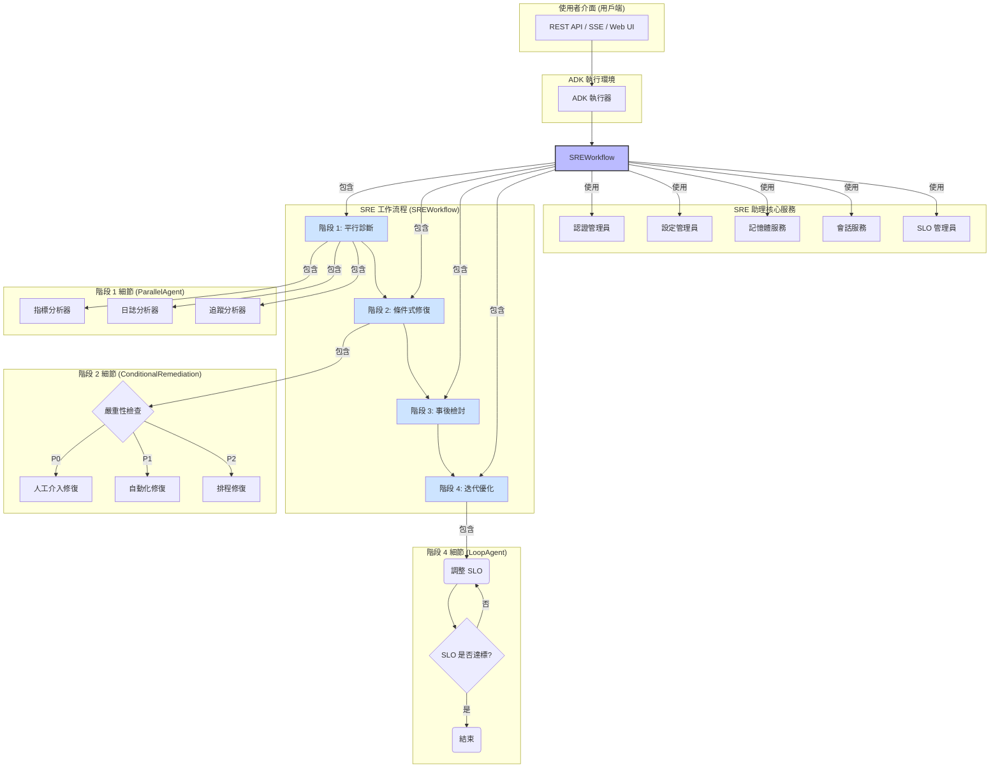

# SRE 助理

**SRE 助理**是一款基於 **Google Agent Development Kit (ADK)** 建構的智慧助理，旨在自動化並簡化網站可靠性工程 (SRE) 的工作流程。它能處理從初步診斷到最終的事後檢討及預防性優化的完整生產事件生命週期。

## 主要功能

- **🤖 先進的工作流程自動化**：SRE 助理採用先進的工作流程，結合了平行處理、條件邏輯和迭代循環，而非簡單的任務序列，從而高效且靈活地處理複雜的 SRE 場景。
- **🧠 RAG 驅動的診斷**：利用檢索增強生成 (RAG) 技術提供具備情境感知能力的診斷。它會查閱內部文件、歷史事件資料和操作手冊來找出問題的根本原因，並為所有發現提供引用來源，以確保透明度。
- **🤝 人工介入 (Human-in-the-Loop, HITL)**：對於關鍵操作，助理會暫停並請求人類批准後再繼續執行，確保自動化操作的安全與可監督性。
- **🧩 多代理系統**：由一個專業代理團隊（診斷、修復、事後檢討、設定）組成，它們協同解決問題，每個代理都貢獻其專業技能。
- **⚙️ 可擴充與可插拔設計**：核心服務（如認證和資料儲存）採用工廠模式設計，便於擴充並與不同的後端（例如 Google IAM、OAuth、Weaviate、Vertex AI Vector Search）整合。
- **📊 SLO 驅動的操作**：原生理解服務等級目標 (SLO) 和錯誤預算，使其能夠根據數據做出有關事件應對和系統可靠性的決策。

## 架構概覽

SRE 助理圍繞一個中央 `SREWorkflow` 協調器建構，該協調器負責調度四個關鍵階段。這種工作流程驅動的架構允許平行執行診斷和條件式修復邏輯，使其比簡單的順序執行代理更為強大。



關於架構的更詳細說明，請參閱 [ARCHITECTURE.md](ARCHITECTURE.md)。

## 開始使用

本專案使用 [Poetry](https://python-poetry.org/) 來管理相依套件。

### 前提條件

- Python 3.9+
- 系統上已安裝 [Poetry](https://python-poetry.org/docs/#installation)。

### 安裝

1.  **複製程式碼庫：**
    ```sh
    git clone https://github.com/your-repo/adk.git
    cd adk
    ```

2.  **安裝相依套件：**
    使用 Poetry 從 `pyproject.toml` 檔案安裝所需的套件。這會為專案建立一個虛擬環境。
    ```sh
    poetry install
    ```

### 設定

1.  **設定設定檔：**
    應用程式使用分層設定系統。首先複製基礎設定。
    - 在 `sre_assistant/config/environments/` 中建立一個特定環境的設定檔，例如 `development.yaml`。
    - 在其中填入您的設定，例如 API 金鑰和資料庫連線。系統會自動載入 `base.yaml`，然後是您的環境特定檔案，最後用任何環境變數覆寫。

2.  **設定環境：**
    匯出一個環境變數，告知應用程式要使用哪個設定。
    ```sh
    export APP_ENV=development
    ```

### 執行助理

啟動虛擬環境並執行主應用程式（確切的進入點可能會有所不同，假設為 `main.py` 或類似檔案）。

```sh
poetry shell
python -m sre_assistant.main  # 請替換為正確的進入點
```

## 目錄結構

以下是本專案程式碼庫的頂層結構概覽：

```
sre_assistant/
├── __init__.py                 # A2A 的服務註冊
├── README.md                   # 本檔案
├── workflow.py                 # 核心 SREWorkflow 實作
├── contracts.py                # API 的 Pydantic 資料模型
├── tools.py                    # 版本化工具的中央註冊表
├── config/                     # 設定管理 (基礎設定、各環境設定)
├── auth/                       # 認證與授權服務
├── memory/                     # 長期記憶體 (RAG) 後端
├── session/                    # 會話 (短期記憶體) 持久化
├── sub_agents/                 # 專業代理 (診斷、修復等)
├── tests/                      # 單元與整合測試
└── utils/                      # 共用工具函式
```

## 貢獻

我們歡迎各種貢獻！請參閱我們的 [貢獻指南](docs/references/adk-docs/contributing-guide.md) 以了解如何開始、我們的行為準則以及提交拉取請求的流程。

## 授權

本專案採用 Apache 2.0 授權。詳情請見 `LICENSE` 檔案。
