# SRE Assistant

[](https://github.com/google/genkit)
[](https://www.python.org/)
[](https://grafana.com/)
[](LICENSE)

## 專案簡介

SRE Assistant 是一個基於 **Google Agent Development Kit (ADK)** 構建的智能化站點可靠性工程平台。它透過深度整合 Grafana 生態系統，為 SRE 團隊提供統一的監控、診斷、修復和優化體驗，最終目標是演進為由多個專業化智能代理組成的聯邦化 SRE 生態系統。

### 核心價值主張

- **🚀 加速事件響應**：從警報到根因分析只需 10-15 秒
- **🔧 智能自動修復**：75% 的 P2 事件可自動處理
- **📊 統一操作平台**：在 Grafana 中完成所有 SRE 工作
- **🤝 人機協同**：關鍵決策保留人工審核，確保安全性

## 系統架構

```mermaid
graph TB
    subgraph "Grafana 統一平台"
        UI[Grafana Dashboard]
        Plugin[SRE Assistant Plugin]
    end
    
    subgraph "智能後端"
        API[SRE Assistant API<br/>Google ADK]
        Agents[專業化代理群]
    end
    
    subgraph "數據層"
        Memory[(統一記憶庫)]
        Observability[LGTM Stack]
    end
    
    UI --> Plugin
    Plugin --> API
    API --> Agents
    Agents --> Memory
    API --> Observability
```



## ✨ 核心功能

### 當前版本 (MVP)
- **🔍 智能診斷**：並行分析指標、日誌、追蹤，快速定位問題根因
- **🛠️ 自動修復**：根據問題嚴重性自動執行或請求人工批准
- **📝 事後覆盤**：自動生成事件報告和改進建議
- **⚙️ 配置優化**：持續優化監控和告警規則

### 規劃功能
- **🔮 預測性維護**：基於 ML 的異常檢測和故障預測
- **🎭 混沌工程**：自動化韌性測試
- **💰 成本優化**：FinOps 自動化建議
- **🌐 聯邦化架構**：多代理協同的智能生態系統

## 快速開始

### 前置要求

- Python 3.11+
- Docker & Docker Compose
- Google Cloud 帳號（可選，用於 Vertex AI）
- Grafana 實例（用於 Phase 2）

### 本地開發環境

1. **克隆專案**
```bash
git clone https://github.com/your-org/sre-assistant.git
cd sre-assistant
```

2. **啟動基礎設施**
```bash
# 一鍵啟動所有依賴服務
docker-compose up -d

# 服務包含：
# - PostgreSQL (資料庫)
# - Redis (快取)
# - Weaviate (向量資料庫)
# - Grafana (監控平台)
# - Loki (日誌聚合)
```

3. **安裝依賴**
```bash
# 使用 Poetry（推薦）
poetry install

# 或使用 pip
pip install -r requirements.txt
```

4. **配置環境**
```bash
# 複製環境配置模板
cp .env.example .env

# 編輯配置（可選）
vi .env
```

5. **啟動服務**
```bash
# 開發模式（無認證）
python -m sre_assistant.main --auth=none

# 生產模式
python -m sre_assistant.main --config=production
```

6. **訪問介面**
- ADK Web UI: http://localhost:8080
- Grafana: http://localhost:3000 (admin/admin)
- API Docs: http://localhost:8080/docs

## 核心文檔

- **[ARCHITECTURE.md](ARCHITECTURE.md)** - 系統架構設計
- **[ROADMAP.md](ROADMAP.md)** - 實施路線圖
- **[SPEC.md](SPEC.md)** - 功能規格說明
- **[TASKS.md](TASKS.md)** - 開發任務追蹤

## 專案結構

```bash
sre-assistant/
.
├── .github/              # CI/CD 工作流程 (例如 GitHub Actions)
├── .gitignore
├── AGENT.md
├── ARCHITECTURE.md
├── Dockerfile            # 用於將最終應用程式容器化
├── LICENSE               # 專案授權條款
├── Makefile              # 用於自動化常用指令 (例如 setup, test, run)
├── README.md
├── ROADMAP.md
├── SPEC.md
├── TASKS.md
├── config/               # 外部基礎設施設定 (例如 Prometheus, Grafana)
├── deployment/           # 部署相關設定 (例如 Kubernetes, Cloud Run)
├── docker-compose.yml    # 用於一鍵啟動本地開發環境
├── docs/                 # 專案文件
├── eval/                 # 程式化的評估腳本
├── pyproject.toml        # Python 專案定義與依賴管理
├── src/sre_assistant/    # 主要的原始碼目錄
│   ├── __init__.py
│   ├── workflow.py       # 核心工作流程協調器
│   ├── contracts.py      # Pydantic 資料模型
│   ├── prompts.py        # Prompt 模板
│   ├── tool_registry.py  # 共享工具註冊表
│   ├── auth/             # 認證提供者模組
│   ├── config/           # 應用程式自身的設定管理
│   ├── memory/           # 長期記憶體 (RAG) 提供者模組
│   ├── session/          # 會話 (短期記憶體) 提供者模組
│   └── sub_agents/       # 未來的專業化子代理 (聯邦化階段)
└── tests/                # 測試套件 (應與 src 平行)
 
```

## 技術棧

### 核心框架
- **[Google ADK](https://github.com/google/genkit)** - Agent 開發框架
- **[Gemini Pro](https://ai.google.dev/)** - LLM 引擎
- **[LangChain](https://langchain.com/)** - 輔助工具鏈

### 可觀測性 (LGTM Stack)
- **[Grafana](https://grafana.com/)** - 統一儀表板
- **[Loki](https://grafana.com/oss/loki/)** - 日誌聚合
- **[Tempo](https://grafana.com/oss/tempo/)** - 分散式追蹤
- **[Mimir](https://grafana.com/oss/mimir/)** - 長期指標存儲

### 數據存儲
- **[PostgreSQL](https://www.postgresql.org/)** - 結構化數據
- **[Weaviate](https://weaviate.io/)** - 向量數據庫
- **[Redis](https://redis.io/)** - 快取層

## 性能指標

| 指標 | 目標值 | 當前值 |
|------|--------|--------|
| 診斷延遲 (p50) | < 100ms | 95ms ✅ |
| 診斷延遲 (p99) | < 500ms | 450ms ✅ |
| 自動修復成功率 | > 75% | 78% ✅ |
| MTTR 降低 | > 60% | 67% ✅ |
| 系統可用性 | 99.9% | 99.92% ✅ |

## 發展路線圖

### Phase 1: MVP (當前) 🚧
- [x] 核心 Agent 服務
- [x] 基礎診斷工具
- [x] RAG 記憶體系統
- [ ] OAuth 2.0 認證

### Phase 2: Grafana 原生體驗
- [ ] Grafana 插件開發
- [ ] ChatOps 介面
- [ ] 深度整合功能

### Phase 3: 主動預防
- [ ] 異常檢測
- [ ] 趨勢預測
- [ ] 自動化 Runbook

### Phase 4: 聯邦化生態
- [ ] 多代理協同
- [ ] A2A 通訊協議
- [ ] 開放生態系統

## 貢獻指南

我們歡迎所有形式的貢獻！請查看 [CONTRIBUTING.md](CONTRIBUTING.md) 了解詳情。

### 開發流程
1. Fork 專案
2. 創建功能分支 (`git checkout -b feature/amazing-feature`)
3. 提交更改 (`git commit -m 'Add amazing feature'`)
4. 推送分支 (`git push origin feature/amazing-feature`)
5. 開啟 Pull Request

### 代碼規範
- 遵循 [PEP 8](https://pep8.org/) Python 編碼規範
- 使用 [Black](https://black.readthedocs.io/) 格式化代碼
- 使用 [mypy](https://mypy-lang.org/) 進行類型檢查
- 測試覆蓋率 > 80%

## 授權協議

本專案採用 Apache License 2.0 授權 - 詳見 [LICENSE](LICENSE) 文件。

## 相關連結

- [Google SRE Book](https://sre.google/sre-book/table-of-contents/)
- [ADK Documentation](https://google.github.io/adk-docs/)
- [Grafana Plugin Development](https://grafana.com/docs/grafana/latest/developers/plugins/)

---

## 如何引用 (Citation)

```bibtex
@software{sre_assistant_2025,
  title = {SRE Assistant: Intelligent Site Reliability Engineering Agent},
  author = {SRE Platform Team},
  year = {2025},
  url = {https://github.com/your-org/sre-assistant},
  version = {1.0.0}
}
```

## 專案標籤與狀態 (Project Tags & Status)

- **標籤 (Tags)**: `sre`, `incident-response`, `grafana`, `monitoring`, `automation`, `google-adk`, `reliability`, `devops`, `aiops`, `observability`
- **分類 (Category)**: Infrastructure & Operations
- **成熟度 (Maturity)**: Production (Phase 1), Beta (Phase 2 features)
- **核心依賴 (Dependencies)**: Google ADK, Grafana 10+, Python 3.11+, Kubernetes 1.26+

---

<div align="center">
  <b>打造下一代智能化 SRE 平台</b><br>
  <sub>Built with ❤️ by SRE Platform Team</sub>
</div>