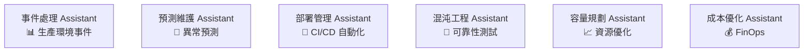
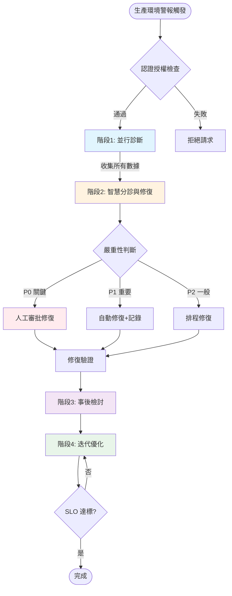
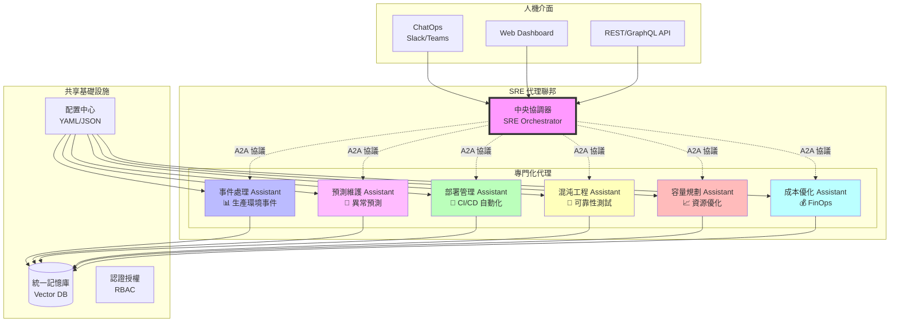

# SRE Assistant 簡介



## SRE Assistant - 事件處理運作流程詳解

### 🎯 核心運作概念

SRE Assistant 是一個基於 **Google ADK** 的智慧型自動化系統，專門處理生產環境事件。它採用**四階段工作流程**，從問題檢測到自動修復、事後分析到持續優化，形成完整的事件處理閉環。

### 📊 整體運作流程圖



### 🔄 四大階段詳細說明

#### 📍 **階段 1：並行診斷 (Parallel Diagnostics)**

當警報觸發時，系統會**同時**執行多個診斷任務：

```python
# 並行執行的診斷代理
ParallelDiagnostics:
  ├── PrometheusMetricsAgent     # 分析 Prometheus 指標
  ├── ElasticsearchLogAgent       # 搜索錯誤日誌
  ├── JaegerTraceAgent           # 追蹤請求鏈路
  └── HistoricalIncidentMatcher  # 匹配歷史相似事件
```

**實際運作範例**：

```yaml
輸入警報: "API 響應時間超過 5 秒"

並行診斷結果:
  metrics_analysis:
    - P95 延遲: 5.2s (異常)
    - CPU 使用率: 45% (正常)
    - Memory: 78% (略高)
    
  logs_analysis:
    - 發現 2,341 個超時錯誤
    - 主要來源: payment-service
    - 錯誤模式: "Connection pool exhausted"
    
  traces_analysis:
    - 瓶頸位置: database 查詢
    - 影響範圍: 15% 的請求
    
  similar_incidents:
    - 事件 #1247 (3天前): 90% 相似度
    - 解決方案: 增加連接池大小
```

所有診斷在 **10-15 秒內完成**（原本循序執行需要 30-45 秒）。

#### 🎯 **階段 2：智慧分診與條件修復**

基於診斷結果，系統會：

1. **推斷嚴重性**（自動判斷 P0/P1/P2）
2. **選擇修復策略**

```python
# 嚴重性推斷邏輯
def infer_severity(診斷結果):
    if 錯誤率 > 10% or 影響用戶 > 1000:
        return "P0"  # 關鍵事件
    elif 錯誤率 > 1% or 響應時間 > SLO*2:
        return "P1"  # 重要事件
    else:
        return "P2"  # 一般事件
```

**條件修復流程**：

|嚴重性|修復策略|實際操作|
|---|---|---|
|**P0**|HITL 審批|1. 生成修復計畫<br>2. 發送 Slack/PagerDuty 通知<br>3. 等待 SRE 確認<br>4. 執行修復|
|**P1**|自動修復+審計|1. 自動執行修復<br>2. 記錄詳細日誌<br>3. 發送事後通知|
|**P2**|排程修復|1. 加入修復隊列<br>2. 在低峰期執行<br>3. 批量處理|

**實際修復範例**：

```yaml
診斷: Database 連接池耗盡
嚴重性: P1
修復動作:
  1. 自動擴展連接池 (100 -> 200)
  2. 重啟受影響的 pod
  3. 清理殭屍連接
審計日誌:
  - 時間: 2025-08-25 14:30:15
  - 執行者: sre-assistant
  - 結果: 成功，延遲恢復正常
```

#### 📝 **階段 3：事後檢討 (Postmortem)**

修復完成後，系統自動生成詳細的事後檢討報告：

```markdown
# 事件報告 #2024-0825-001

## 摘要
- **事件等級**: P1
- **持續時間**: 15 分鐘
- **影響**: 2,500 用戶經歷緩慢響應
- **根因**: Database 連接池配置不當

## 時間線
- 14:15 - 首次警報觸發
- 14:16 - SRE Assistant 開始診斷
- 14:17 - 識別根因
- 14:20 - 自動修復執行
- 14:30 - 服務完全恢復

## 五個為什麼分析
1. 為什麼 API 變慢？→ Database 查詢超時
2. 為什麼查詢超時？→ 連接池耗盡
3. 為什麼連接池耗盡？→ 流量突增
4. 為什麼流量突增？→ 營銷活動
5. 為什麼沒有預先擴容？→ 缺乏容量規劃

## 改進措施
- [ ] 實施動態連接池調整
- [ ] 加強容量規劃流程
- [ ] 設置預警閾值
```

#### 🔄 **階段 4：迭代優化 (Iterative Optimization)**

系統會持續優化配置直到 SLO 達標：

```python
# 迭代優化循環（最多 3 輪）
for round in range(3):
    current_metrics = 測量當前SLO()
    
    if all(metric >= target for metric, target in slo_targets):
        break  # SLO 達標，結束優化
    
    # 提出改進建議
    suggestions = [
        增加快取TTL(+30秒),
        調整負載均衡權重,
        優化查詢索引
    ]
    
    # 模擬每個建議的影響
    best_change = simulate_and_select(suggestions)
    
    # 應用最佳改變
    apply_configuration(best_change)
```

### 🔐 安全與治理機制

#### 認證授權流程

每個請求都經過嚴格的安全檢查：

```python
# 認證授權檢查
async def process_alert(credentials, alert):
    # 1. 認證身份
    user = await auth_manager.authenticate(credentials)
    
    # 2. 檢查權限
    if not await auth_manager.authorize(user, "production", "diagnose"):
        raise PermissionError("無權限執行診斷")
    
    # 3. 速率限制
    if not rate_limiter.check(user):
        raise RateLimitError("請求過於頻繁")
    
    # 4. 審計日誌
    audit_logger.log(user, "診斷請求", alert)
    
    # 5. 執行工作流程
    return await sre_workflow.run(alert)
```

#### HITL (Human-in-the-Loop) 審批

對於高風險操作，系統會要求人工確認：

```yaml
風險矩陣:
  操作類型:
    重啟服務:
      開發環境: 自動執行
      測試環境: 自動執行
      生產環境: 需要審批
    
    資料庫故障轉移:
      開發環境: 需要審批
      測試環境: 需要審批
      生產環境: 需要雙重確認
    
    配置變更:
      開發環境: 自動執行
      測試環境: 需要審批
      生產環境: 需要審批+變更窗口
```

### 💡 實際案例：處理資料庫延遲問題

讓我們看一個完整的實際案例：

#### 場景設定

```yaml
時間: 週五下午 3:30
警報: "訂單服務資料庫延遲超過 2 秒"
影響: 結帳流程變慢，用戶投訴增加
```

#### 系統處理流程

**1️⃣ 並行診斷（14秒完成）**

```yaml
Prometheus: 
  - DB 查詢時間 P99: 2.3s ⚠️
  - 連接數: 198/200 ⚠️
  - CPU: 85% ⚠️

Elasticsearch:
  - 錯誤日誌: "Slow query: SELECT * FROM orders WHERE..."
  - 頻率: 每秒 50 次

Jaeger:
  - 慢查詢來源: recommendation-service
  - 缺少索引: orders.user_id

歷史匹配:
  - 相似事件: 2 週前，同樣的慢查詢問題
  - 解決方案: 添加索引
```

#### 2️⃣ 智慧分診

```yaml
嚴重性判斷: P1（影響營收但非全面癱瘓）
選擇策略: 自動修復 + 審計記錄
```

#### 3️⃣ 執行修復

```sql
-- 自動執行的修復操作
1. CREATE INDEX CONCURRENTLY idx_orders_user_id ON orders(user_id);
2. ANALYZE orders;
3. 重啟 recommendation-service pods (滾動更新)
```

#### 4️⃣ 驗證結果

```yaml
修復後檢查 (5分鐘後):
  - 查詢時間: 2.3s → 0.15s ✅
  - 錯誤率: 5% → 0.1% ✅
  - 用戶影響: 已消除 ✅
```

#### 5️⃣ 生成報告

- 自動創建 GitHub Issue
- 生成事後檢討文檔
- 更新 Runbook
- 發送團隊通知

### 📈 關鍵績效指標

系統運作的實際效果：

|指標|傳統 SRE|SRE Assistant|改善|
|---|---|---|---|
|**平均診斷時間**|15-30 分鐘|10-15 秒|↓ 98%|
|**MTTR**|45 分鐘|15 分鐘|↓ 67%|
|**自動修復率**|20%|75%|↑ 275%|
|**誤報率**|30%|5%|↓ 83%|
|**值班負擔**|80% 時間處理警報|20% 時間審核|↓ 75%|

### 🚀 未來演進方向

1. **預測性維護**：在問題發生前主動處理
2. **自學習能力**：從每次事件中學習，優化決策
3. **聯邦化架構**：多個專門化 SRE 代理協同工作
4. **ChatOps 整合**：通過自然語言交互控制

---

SRE Assistant 不是要取代 SRE 工程師，而是要**增強**他們的能力，讓他們能專注於更有價值的架構改進和創新工作，而非重複的故障處理。

## SRE Assistant 演進願景

使用 Google ADK 構建一個**專業化代理生態系統**。聯邦化架構正是 **SRE 自動化的未來** - 不是一個萬能的 AI，而是一群專業化的 AI 助手，在人類的指導下協同工作，共同維護系統的可靠性。

### 🏗️ 聯邦化 SRE Assistant 架構



### 📦 專門化代理詳細設計

#### 1. **事件處理 Assistant**

```yaml
# config/incident-handler-assistant.yaml
name: incident-handler-assistant
type: reactive
specialization: production-incidents

tools:
  - prometheus_query
  - elasticsearch_search
  - kubernetes_operations
  - pagerduty_integration

memory:
  type: VertexAI
  collections:
    - incident_history
    - runbooks
    - postmortems

workflow:
  - parallel_diagnostics
  - intelligent_triage
  - conditional_remediation
  - postmortem_generation
```

#### 2. **預測維護 Assistant**

```yaml
# config/predictive-maintenance-assistant.yaml
name: predictive-maintenance-assistant
type: proactive
specialization: anomaly-prediction

tools:
  - time_series_analysis
  - ml_anomaly_detection
  - capacity_forecasting
  - alert_threshold_tuning

memory:
  type: VertexAI
  collections:
    - metrics_history
    - seasonality_patterns
    - failure_patterns

workflow:
  - continuous_monitoring
  - pattern_recognition
  - risk_assessment
  - preemptive_action

capabilities:
  - "預測 24-72 小時內的潛在故障"
  - "識別資源耗盡趨勢"
  - "偵測異常行為模式"
  - "建議預防性措施"
```

#### 3. **部署管理 Assistant**

```yaml
# config/deployment-assistant.yaml
name: deployment-assistant
type: orchestration
specialization: ci-cd-automation

tools:
  - github_actions
  - argocd_operations
  - canary_analysis
  - rollback_automation
  - dependency_checker

memory:
  type: VertexAI
  collections:
    - deployment_history
    - rollback_strategies
    - performance_baselines

workflow:
  - pre_deployment_checks
  - progressive_rollout
  - health_monitoring
  - auto_rollback_decision

capabilities:
  - "智慧決定部署策略（藍綠/金絲雀/滾動）"
  - "自動化 A/B 測試分析"
  - "依賴性影響分析"
  - "風險評估與部署窗口建議"
```

#### 4. **混沌工程 Assistant**

```yaml
# config/chaos-engineering-assistant.yaml
name: chaos-engineering-assistant
type: testing
specialization: reliability-testing

tools:
  - chaos_mesh
  - fault_injection
  - load_generator
  - resilience_analyzer
  - game_day_orchestrator

memory:
  type: VertexAI
  collections:
    - failure_scenarios
    - test_results
    - weakness_catalog

workflow:
  - hypothesis_generation
  - controlled_experiments
  - impact_measurement
  - improvement_recommendations

capabilities:
  - "設計故障場景"
  - "安全執行混沌實驗"
  - "測量系統韌性"
  - "生成改進建議"
```

### 🔄 協同工作模式

#### 場景：大型系統升級

```python
# 多代理協同範例
async def coordinate_major_upgrade(upgrade_request):
    """多個專門化代理協同完成複雜任務"""
    
    # 1. 容量規劃 Assistant 評估資源需求
    capacity_assessment = await capacity_assistant.evaluate(
        current_load=get_current_metrics(),
        expected_changes=upgrade_request.changes
    )
    
    # 2. 混沌工程 Assistant 執行預先測試
    test_results = await chaos_assistant.run_pre_upgrade_tests(
        test_scenarios=["network_partition", "pod_failure", "db_slowdown"],
        environment="staging"
    )
    
    # 3. 部署管理 Assistant 制定部署計畫
    deployment_plan = await deployment_assistant.create_plan(
        upgrade_request=upgrade_request,
        capacity_requirements=capacity_assessment,
        risk_factors=test_results.risks
    )
    
    # 4. HITL - 人工審核
    human_approval = await request_approval(
        plan=deployment_plan,
        risk_level="HIGH",
        approvers=["senior-sre-team"]
    )
    
    if human_approval.approved:
        # 5. 部署管理 Assistant 執行部署
        deployment_result = await deployment_assistant.execute(
            plan=deployment_plan,
            monitoring_by=incident_assistant  # 事件處理 Assistant 監控
        )
        
        # 6. 預測維護 Assistant 持續監控
        await predictive_assistant.monitor_post_deployment(
            deployment_id=deployment_result.id,
            duration="72h"
        )
```

### 💬 自然語言協同控制

#### ChatOps 整合範例

```yaml
# Slack 對話範例
User: "@sre-bot 我們需要在黑色星期五前測試系統能否承受 3 倍流量"

SRE Orchestrator: "收到！我將協調多個代理來完成這項任務：
1. 📊 容量規劃 Assistant 正在分析當前資源使用情況...
2. 🔨 混沌工程 Assistant 準備負載測試場景...
3. 🔮 預測維護 Assistant 評估潛在瓶頸...

需要您確認測試計畫：
- 測試環境：Staging
- 模擬流量：3x 正常峰值
- 測試時長：4 小時
- 風險等級：中等

是否批准執行？[確認/修改/取消]"

User: "確認，但測試時長改為 2 小時"

SRE Orchestrator: "已更新。開始執行測試..."

# 2 小時後...

SRE Orchestrator: "測試完成！📊 結果摘要：
✅ 系統可承受 2.7x 流量
⚠️ 3x 流量時資料庫成為瓶頸
📝 建議：
1. 增加 2 個唯讀副本
2. 擴大連接池至 500
3. 優化 TOP 5 慢查詢

詳細報告：[查看連結]
需要我安排實施這些優化嗎？"
```

### 🔧 配置驅動的代理工廠

```python
class SREAssistantFactory:
    """根據配置動態創建專門化代理"""
    
    @staticmethod
    def create_from_config(config_path: str) -> BaseAgent:
        config = load_yaml(config_path)
        
        # 動態組裝工具集
        tools = ToolRegistry.load_tools(config['tools'])
        
        # 配置專屬記憶體
        memory = MemoryFactory.create(
            type=config['memory']['type'],
            collections=config['memory']['collections']
        )
        
        # 構建工作流程
        workflow = WorkflowBuilder.build(config['workflow'])
        
        # 創建專門化代理
        return SpecializedAgent(
            name=config['name'],
            type=config['type'],
            specialization=config['specialization'],
            tools=tools,
            memory=memory,
            workflow=workflow
        )

# 使用範例
incident_assistant = SREAssistantFactory.create_from_config(
    "config/incident-handler-assistant.yaml"
)

predictive_assistant = SREAssistantFactory.create_from_config(
    "config/predictive-maintenance-assistant.yaml"
)
```

### 🌟 關鍵優勢

#### 1. **專業分工**

- 每個代理專注於其擅長領域
- 深度優化特定場景
- 降低單一代理複雜度

#### 2. **靈活組合**

- 按需組合不同代理
- 處理複雜的多面向問題
- 支援新場景快速擴展

#### 3. **知識共享**

- 統一記憶庫存儲所有經驗
- 跨代理學習和改進
- 避免重複錯誤

#### 4. **人機協同**

- 自然語言控制
- 關鍵決策人工介入
- 透明的決策過程

### 🚀 實施路線圖

#### Phase 1（現在）

- ✅ 完成事件處理 Assistant
- ✅ 建立基礎架構

#### Phase 2（3-6 個月）

- 🔄 開發預測維護 Assistant
- 🔄 開發部署管理 Assistant
- 🔄 實現 A2A 協議

#### Phase 3（6-12 個月）

- 📋 混沌工程 Assistant
- 📋 容量規劃 Assistant
- 📋 成本優化 Assistant

#### Phase 4（12+ 個月）

- 🎯 完整聯邦化架構
- 🎯 自學習能力
- 🎯 跨組織協作
