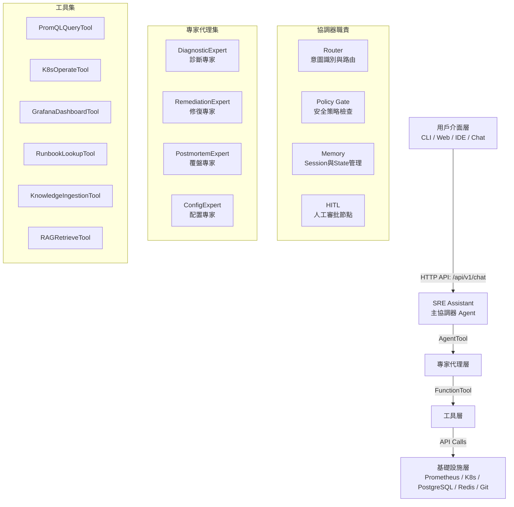

# SRE Assistant 技術白皮書

## 執行摘要 (Executive Summary)

### 產品願景：從「救火隊」到「系統的靈魂工程師」
SRE Assistant 不僅是一個工具，而是將 SRE 專家的知識、經驗和工作流程，轉化為一個**永不疲倦、持續學習的數位化身**。它代表著 AI 時代 SRE 角色的根本轉型：從「執行者」進化為「智慧系統的設計者和管理者」，實現 **「一人獨角獸」** 的賦能願景。

### 核心價值主張
- **一人獨角獸賦能**：讓個人 SRE 能夠管理過去需要整個團隊才能維護的系統。
- **知識資產化**：將隱性經驗轉化為可計算、可擴展的智慧系統（RAG + 結構化 Runbook）。
- **從實作到編排**：專注於高層次系統設計與可靠性劇本編排，而非低層次實現細節。
- **7x24 智慧運維**：AI Agent 自主處理 80% 重複性工作，人類專注於 20% 高價值決策。

### 成功指標 (SLO)
- **對話體驗**: P95 < 2s
- **工具執行**: P95 < 10s
- **端到端處理**: P95 < 30s
- **一線告警處理**: 80% 在 5 分鐘內完成「分類+初診+建議」
- **新服務監控上線時間 (TTM)**: ≤ 5 分鐘

---

## 1. 核心設計原則 (Core Design Principles)

本專案嚴格遵循以下五大原則，確保系統的可維護性、安全性與擴展性。

| 原則 | 實現方式 (ADK 落地條款) | 驗收標準 (Acceptance Criteria) |
| :--- | :--- | :--- |
| **助理優先** <br/> (Assistant-First) | 所有能力透過單一 `SREAssistant` 對話入口；工具與專家一律由主 Agent 協調與調用。 | 單一 `/api/v1/chat` 端點完成診斷→工具→回覆；規劃、分流、工具 I/O、回覆全事件可回放。 |
| **專家解耦** <br/> (Decoupled Expertise) | 以獨立 Expert Agent (Diagnostic/Remediation/Postmortem/Config) 封裝，透過 `AgentTool` 掛載。 | 支援熱插拔免重啟；跨專家故障隔離，交叉失敗率 < 1%。 |
| **知識閉環** <br/> (Knowledge Loop) | RAG + `ToolContext.state` + 事件採集；`FeedbackAgent` 將處理經驗沉澱為可執行的 Runbook。 | 回覆必附引用與信心分數；知識項有版本與審核；同類告警二次命中率 > 70%。 |
| **工具抽象** <br/> (Tool Abstraction) | 外部操作一律封裝為 `FunctionTool`/`AgentTool`，具備嚴格的 I/O Schema、錯誤碼、冪等性、重試策略與超時。 | 工具合約測試 100% 通過；冪等失誤率 < 0.5%。 |
| **開發者體驗至上** <br/> (DX First) | 一鍵 dev/test/deploy (`Makefile`); 標準化腳手架生成 Expert/Tool/Schema；預設開啟觀測。 | 新增一個 Tool 上線 < 2 小時；對話回放一致性 > 99%。 |

---

## 2. 系統架構 (System Architecture)

### 2.1 總體架構
本設計實現了從「資產孤島」到「智慧中樞」的轉型，其總體架構如下圖所示，體現了清晰的層次結構與數據流。



### 2.2 核心組件詳解

#### 2.2.1 SREAssistant (主協調器 Agent)
**職責**：理解意圖→規劃步驟→選擇專家→調用工具→整合結果→可追溯回覆。
```python
# 基於 ADK LoopAgent 實現
class SREAssistant(loop_agent.LoopAgent):
    def __init__(self, model: str = "gemini-2.0-flash", enable_security: bool = True):
        self.experts = {
            "diagnostic": DiagnosticExpert(model=model),
            "remediation": RemediationExpert(model=model),
            ... # 其他專家
        }
        self.main_llm = llm_agent.LlmAgent(
            name="SREMainAgent",
            model=model,
            instruction=self._get_main_instruction(),
            tools=get_all_tools() # 整合所有工具
        )
        self.security_policy = SRESecurityPolicy() if enable_security else None
        super().__init__(agents=[self.main_llm] + list(self.experts.values()), max_iterations=10)

    def route(self, intent: Intent) -> Agent: ...
    def plan(self, intent: Intent) -> List[Step]: ...  # 生成 Sequential/Loop 計畫
    async def gate(self, step: Step) -> bool: ...    # 執行 CaMeL/Policy 安全檢查
```

#### 2.2.2 專家代理 (Expert Agents)
每個專家都是獨立的 ADK Agent，專注於特定領域。
```python
# 專家標準模板
class DiagnosticExpert(llm_agent.LlmAgent):
    def __init__(self, model: str = "gemini-2.0-flash"):
        super().__init__(
            name="DiagnosticExpert",
            model=model,
            instruction=self._get_instruction(), # 包含專家的領域知識與流程指令
            tools=[health_checker, log_analyzer, metric_reader] # 專用工具集
        )
```

#### 2.2.3 工具層 (Tool Layer)
所有外部操作都透過標準化的 Tool 介面進行，這是實現安全可控的基石。
```python
# 工具契約標準範例 (對齊附錄 B)
@tool.tool
async def promql_query_tool(
    query: str,
    range: str  # RFC3339 時間範圍
) -> Dict[str, Any]:
    """
    名稱: PromQLQueryTool
    描述: 以 PromQL 查詢指標並回傳聚合結果
    錯誤碼:
      - E_TIMEOUT: 查詢逾時
      - E_BAD_QUERY: 語法錯誤
      - E_BACKEND: 後端錯誤
    超時: 30秒
    冪等: True
    重試策略: 指數退避，最多2次
    """
    # 工具實現... (呼叫 Prometheus HTTP API)
    pass
```

### 2.3 知識與記憶設計
- **ToolContext.state**: 用於保存跨專家、跨步驟的會話狀態，實現長任務的斷點續跑。
- **RAG 知識庫**: 透過 `KnowledgeIngestionTool` 從 Markdown、手冊、註解、事故報告中提取知識，由 `RAGRetrieveTool` 進行檢索，回覆時附帶引用來源與信心分數，確保可追溯性。
- **反饋循環**: `FeedbackAgent` 會自動將成功的處理經驗結構化後存入知識庫，形成知識閉環。

### 2.4 安全與策略 (Security & Policy)
借鑒 **CaMeL** 框架思想，實現細粒度的安全控制。
```python
class SRESecurityPolicy:
    def evaluate_tool_call(self, tool_name: str, kwargs: Dict) -> Tuple[bool, str, RiskLevel]:
        # 1. 白名單檢查
        # 2. 參數驗證 (如: 禁止對生產環境 namespace 進行刪除操作)
        # 3. 風險等級評估 (Low, Medium, High, Critical)
        # 4. 對於 High/Critical 風險操作，觸發 HITL (人工審批)
        pass
```

---

## 3. 實施路線圖 (Implementation Roadmap)

我們採用分階段滾動交付策略，每個階段都交付明確的商業價值。

| 階段 | 時間框 | 核心目標與交付物 | 成功指標 |
| :--- | :--- | :--- | :--- |
| **MVP** <br/> (智慧診斷助手) | 4 週 | `DiagnosticExpert` + `PromQLQueryTool` + `RAGRetrieveTool`；實現事件與指標的最小集合。 | 一線告警 50% 自動初診；對話 P95 < 2s。 |
| **Phase 1** <br/> (協作修復平台) | 8 週 | 引入 `RemediationExpert`, `K8sOperateTool`, `HITL` 審批節點；實現配置即代碼（儀表板自動生成）。 | 一線告警 70% 自動化處理；新服務監控 TTM < 10 分鐘。 |
| **Phase 2** <br/> (自主運維系統) | 12 週 | 引入 `PostmortemExpert`；強化 `FeedbackAgent` 實現知識閉環；實施成本優化策略（模型分級、快取）。 | 同類告警二次命中率 > 70%；E2E P95 < 25s；月度運維成本降低 20%。 |

---

## 4. 生產化考量 (Production Readiness)

### 4.1 可觀測性 (Observability)
**指標 (Metrics):**
- `agent_requests_total{agent, status}`
- `agent_request_duration_seconds_bucket{agent}`
- `tool_executions_total{tool, status}`
- `tool_execution_duration_seconds_bucket{tool}`
- `knowledge_hits_total{source}`
- `rag_confidence_bucket`

**告警規則 (Alerting Rules):**
```yaml
- alert: SREAssistantHighErrorRate
  expr: rate(agent_requests_total{status="error"}[5m]) > 0.05
  for: 5m
  labels: { severity: 'warning' }
  annotations: { summary: 'SRE Assistant 錯誤率過高' }

- alert: SREAssistantSlowResponse
  expr: histogram_quantile(0.95, rate(agent_request_duration_seconds_bucket[5m])) > 2
  for: 10m
  labels: { severity: 'warning' }
```

### 4.2 部署與擴展
- **本地開發**: ADK Runner + Docker Compose。
- **生產環境**: Kubernetes (配置 HPA、反親和性) 或直接部署至 **Vertex AI Agent Engine**。
- **數據持久化**: PostgreSQL (存儲 session、decision、knowledge)、Redis (緩存、狀態管理、分散式鎖)。

### 4.3 測試策略
- **單元測試**: 工具契約、Schema 驗證、安全策略白名單。
- **整合測試**: Expert-Tool 間的通訊、錯誤處理、重試與超時邏輯。
- **E2E 測試**: 透過 `/api/v1/chat` 端點測試完整對話流，並驗證是否符合 SLO 指標。

### 4.4 風險與緩解
- **模型漂移**: 建立評測集持續監控，效果下降時自動回退至穩定模型版本。
- **工具風險**: 透過 CaMeL 策略嚴格限制參數範圍，高風險操作強制 HITL，並準備手動回滾腳本。
- **數據品質**: 對 RAG 知識來源進行嚴格版本管理與質量審核，確保引用可追溯。

---

## 5. 技術決策（ADK 對齊 ADR 摘要）

> 目的：將關鍵架構選擇固化為可追溯的技術決策，全面對齊 python/agents 官方 17 範例之 ADK 範式。

### ADR-001｜協調器選型：LoopAgent + Planner + 多代理掛載
- 決策：以 `LoopAgent` 作為頂層協調器，內建 `BuiltInPlanner` 規劃步驟，透過 `AgentTool` 掛載子代理（Diagnostic/Remediation/Postmortem/Provisioning）。
- 依據：`/python/agents/gemini-fullstack/app/agent.py` 使用 `LlmAgent/LoopAgent/SequentialAgent` 與 `AgentTool` 的組合；事件透過 `CallbackContext` 收集。
- 約束：最大迭代 `max_iterations=10`；每步必經 Policy Gate。
- 片段：
```python
from google.adk.agents import LlmAgent, LoopAgent, SequentialAgent
from google.adk.planners import BuiltInPlanner
from google.adk.tools.agent_tool import AgentTool

coordinator = LoopAgent(agents=[main_llm, diag_agent, remed_agent], planner=BuiltInPlanner(), max_iterations=10)
```

### ADR-002｜工具契約：FunctionTool / AgentTool 與嚴格 I/O Schema
- 決策：所有外部操作以 `FunctionTool`；跨代理調用以 `AgentTool`。每個 Tool 必備 `args_schema`、`returns_schema`、`errors`、`timeout_seconds`、`idempotent`、`retry`。
- 依據：`/python/agents/data-science/data_science/tools.py` 以 `AgentTool` 呼叫子代理；多處示例採 Pydantic 結構化輸出。
- 片段：
```python
from pydantic import BaseModel, Field

class PromQueryArgs(BaseModel):
    query: str = Field(...)
    range: str = Field(..., description="RFC3339 時間範圍")

class PromQueryRet(BaseModel):
    series: list[dict]
    stats: dict | None = None
```

### ADR-003｜意圖與計畫資料契約
- 決策：統一 Intent/Step/Result 結構，便於追蹤與回放。
- 片段：
```python
from pydantic import BaseModel

class Intent(BaseModel):
    type: str  # diagnostic|remediation|postmortem|provisioning
    parameters: dict
    confidence: float
    raw_input: str

class Step(BaseModel):
    tool: str
    args: dict
    require_approval: bool = False

class StepResult(BaseModel):
    ok: bool
    data: dict | None = None
    error_code: str | None = None
    latency_ms: int
```

### ADR-004｜記憶與狀態：ToolContext.state + 回放事件
- 決策：以 `ToolContext.state` 保存跨步驟狀態與中間資料；所有事件經由 Callback 收集至可觀測儲存。
- 依據：`/python/agents/gemini-fullstack/app/agent.py` 之 `collect_research_sources_callback`；多範例皆以 `CallbackContext.state` 聚合證據。

### ADR-005｜RAG 設計：VertexAiRagRetrieval + 引用與信心
- 決策：採 Vertex Retrieval，設定 `similarity_top_k=10`、`vector_distance_threshold=0.6` 作為初始值；回覆必附來源與信心分數。
- 依據：`/python/agents/RAG/rag/agent.py` 之 `ask_vertex_retrieval`。
- 片段：
```python
from google.genai import rag
from google.adk.tools.rag import VertexAiRagRetrieval

retrieve = VertexAiRagRetrieval(
    name="retrieve_docs",
    rag_resources=[rag.RagResource(rag_corpus=os.environ["RAG_CORPUS"])],
    similarity_top_k=10,
    vector_distance_threshold=0.6,
)
```

### ADR-006｜安全策略：Policy Gate（CaMeL 思想）
- 決策：在計畫每步執行前進行策略檢查；高風險工具必須 `require_approval=True`。
- 依據：`/python/agents/camel` 安全代理示例。
- 片段：
```python
def gate(step: Step) -> bool:
    allowed, reason, risk = policy.evaluate_tool_call(step.tool, step.args)
    return allowed if risk in ("Low","Medium") else False
```

### ADR-007｜HITL 審批：變更類操作強制人工確認
- 決策：對重啟、擴縮容、配置寫入等動作，預設 HITL；UI 顯示差異預覽與回滾指令。
- 依據：多範例之高風險節點設計與 `require_approval` 欄位慣例。

### ADR-008｜可觀測性：事件、指標、追蹤三合一
- 決策：指標包含 `agent_requests_total`、`agent_request_duration_seconds_bucket`、`tool_executions_total` 等；每 Tool 呼叫一個 span，入參/出參做摘要。
- 依據：`/python/agents/gemini-fullstack/app/agent.py` 事件收集模式。

### ADR-009｜測試矩陣：合約/整合/E2E
- 決策：
  - 合約測試：Tool I/O Schema 與錯誤碼 100% 覆蓋。
  - 整合測試：Expert↔Tool 的錯誤分支、超時、重試。
  - E2E：`/api/v1/chat` 端到端，SLO 自動守門。

### ADR-010｜部署路徑：本地 ADK Runner → K8s → Vertex AI Agent Engine
- 決策：保留三段式環境；設定以環境變數驅動（model、RAG_CORPUS、API endpoints）。
- 依據：`/python/agents/gemini-fullstack/Makefile` 與配置樣式。

### ADR-011｜成本與延遲控制：模型分級 + 快取/批次/去抖動
- 決策：互動預設 `gemini-2.5-flash`，需要高推理改用 `-pro`；對工具呼叫結果進行 TTL 快取，允許批次查詢與抖動壓制。

### ADR-012｜資料契約與版本治理
- 決策：所有 Pydantic 輸出含 `schema_version`；破壞性變更需升 major，並提供兼容轉換器。

---

## 6. 追蹤到範例（Traceability Matrix）

| ADR | 主要參考路徑 |
|---|---|
| ADR-001 | `/python/agents/gemini-fullstack/app/agent.py` |
| ADR-002 | `/python/agents/data-science/data_science/tools.py` |
| ADR-003 | 多範例 Pydantic 結構化輸出慣例 |
| ADR-004 | `/python/agents/gemini-fullstack/app/agent.py`（callbacks） |
| ADR-005 | `/python/agents/RAG/rag/agent.py` |
| ADR-006 | `/python/agents/camel` |
| ADR-007 | 多範例 `require_approval` 慣例 |
| ADR-008 | `/python/agents/gemini-fullstack/app/agent.py`（events） |
| ADR-009 | 各範例測試與工具分層慣例 |
| ADR-010 | `/python/agents/gemini-fullstack/Makefile` |
| ADR-011 | 多範例模型選型與成本控制描述 |
| ADR-012 | 多範例 Schema 治理慣例 |

> 註：本表對齊 python.zip 之實際 17 個目錄：`RAG`、`academic-research`、`auto-insurance-agent`、`brand-search-optimization`、`camel`、`customer-service`、`data-science`、`financial-advisor`、`fomc-research`、`gemini-fullstack`、`image-scoring`、`llm-auditor`、`machine-learning-engineering`、`marketing-agency`、`personalized-shopping`、`software-bug-assistant`、`travel-concierge`。

---

## 附錄

### 附錄 A: 標準工具契約 (YAML 範例)
```yaml
name: K8sRolloutRestartTool
description: 重啟 Kubernetes Deployment 的 Pods
args_schema:
  type: object
  required: [namespace, deployment_name]
  properties:
    namespace:
      type: string
      description: Kubernetes 命名空間
    deployment_name:
      type: string
      description: Deployment 名稱
    reason:
      type: string
      description: 重啟原因，用於審計日誌
returns_schema:
  type: object
  properties:
    success: { type: boolean }
    message: { type: string }
errors:
  E_NAMESPACE_PROTECTED: 嘗試在受保護的命名空間中操作
  E_DEPLOYMENT_NOT_FOUND: 未找到指定的 Deployment
timeout_seconds: 60
idempotent: true # 重啟操作是冪等的
retry:
  max_retries: 2
  backoff: exponential
```

### 附錄 B: 關鍵數據模型 (PostgreSQL)
```sql
-- 決策記錄表，用於審計與分析
CREATE TABLE decisions (
  id BIGSERIAL PRIMARY KEY,
  session_id UUID NOT NULL,
  agent_name TEXT NOT NULL,
  decision_type TEXT NOT NULL,
  input JSONB NOT NULL,
  output JSONB NOT NULL,
  confidence FLOAT,
  execution_time_ms INT,
  created_at TIMESTAMPTZ DEFAULT NOW()
);
-- 工具執行記錄表，用於監控與計費
CREATE TABLE tool_executions (
  id BIGSERIAL PRIMARY KEY,
  decision_id BIGINT REFERENCES decisions(id),
  tool_name TEXT NOT NULL,
  parameters JSONB,
  result JSONB,
  status TEXT NOT NULL,
  error_message TEXT,
  duration_ms INT,
  executed_at TIMESTAMPTZ DEFAULT NOW()
);
```

### 附錄 C: API 介面 (OpenAPI 3.0 精簡)
```yaml
/api/v1/chat:
  post:
    summary: 與 SRE Assistant 進行對話
    requestBody:
      content:
        application/json:
          schema:
            type: object
            properties:
              message:
                type: string
              session_id:
                type: string
                format: uuid
    responses:
      '200':
        description: 成功回應
        content:
          application/json:
            schema:
              type: object
              properties:
                response:
                  type: string
                actions_taken:
                  type: array
                  items:
                    $ref: '#/components/schemas/Action'
                metrics:
                  $ref: '#/components/schemas/PerformanceMetrics'
```
