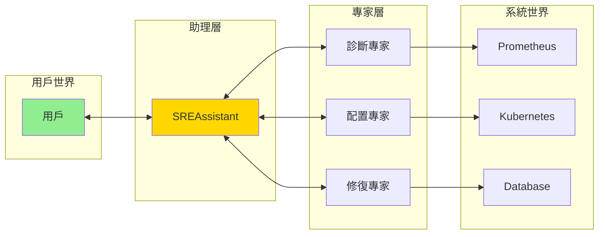
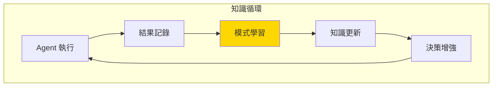
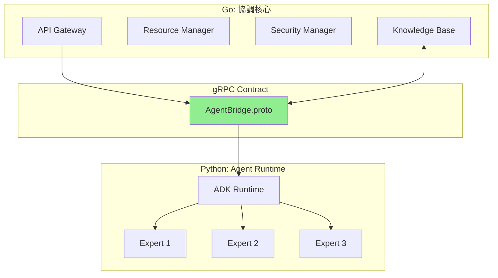
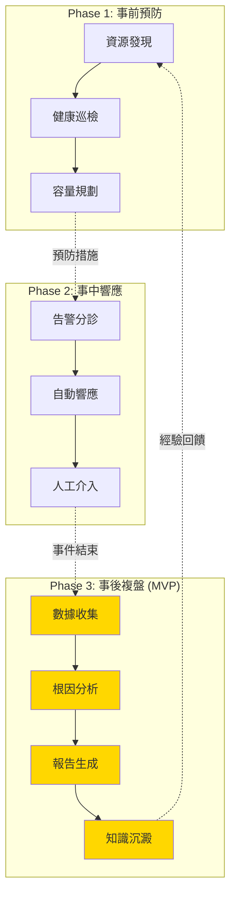

# SRE Assistant 平台架構規格書

> **基於核心設計原則，構建純粹而強大的助理平台**

## 一、核心設計原則實現

### 1.1 助理優先架構 (Assistant-First)



**實現原則**：
- 用戶**只需要**記住一個入口：SREAssistant
- 所有複雜操作都通過**自然對話**完成
- 助理負責理解意圖並**路由**到合適的專家

### 1.2 專家解耦設計 (Decoupled Expertise)

```python
# 核心協調器 - 極簡實現
class SREAssistant:
    """輕量級協調器，不含業務邏輯"""
    
    def __init__(self):
        self.experts = ExpertRegistry()  # 專家註冊表
        self.memory = Memory()           # 對話記憶
    
    async def handle(self, message: str) -> str:
        intent = self.understand(message)
        expert = self.experts.find(intent)
        result = await expert.execute(intent)
        return self.explain(result)

# 專家 Agent - 可插拔模組
class DiagnosticExpert:
    """診斷專家 - 獨立部署、獨立迭代"""
    
    async def execute(self, intent: Intent) -> Result:
        # 完整的診斷邏輯封裝在此
        pass
```

### 1.3 契約驅動通訊 (Contract-Driven)

```protobuf
// 最小化、穩定的核心契約
syntax = "proto3";

service AgentBridge {
    // 唯一的通訊方法
    rpc Execute(Request) returns (Response);
}

message Request {
    string intent_type = 1;  // 意圖類型
    string context = 2;      // 上下文
    map<string, string> parameters = 3;  // 參數
}

message Response {
    bool success = 1;
    string result = 2;       // 結果
    string explanation = 3;  // 解釋
}
```

### 1.4 知識閉環系統 (Knowledge Loop)



### 1.5 開發者體驗 (DX First)

```python
# 極簡的 Agent 開發體驗
from sre_adk import Agent, tool

class MyExpert(Agent):
    """開發者只需關注業務邏輯"""
    
    @tool("診斷服務健康")
    async def diagnose(self, service: str):
        # 框架自動處理：
        # - 參數驗證
        # - 錯誤處理
        # - 日誌記錄
        # - 性能追蹤
        # - 知識記錄
        return self.check_health(service)
```

## 二、系統架構實現

### 2.1 三層架構設計



### 2.2 協調核心 (Go)

```go
// 極簡、穩定、高效的核心
package core

type OrchestratorCore struct {
    gateway  *Gateway       // API 入口
    bridge   *AgentBridge   // Agent 通訊
    security *Security      // 安全管理
    resource *Resource      // 資源管理
    knowledge *Knowledge    // 知識服務
}

// 核心只做協調，不含業務邏輯
func (o *OrchestratorCore) Process(input string) (string, error) {
    // 1. 安全檢查
    if err := o.security.Validate(input); err != nil {
        return "", err
    }
    
    // 2. 資源分配
    resource := o.resource.Allocate()
    defer resource.Release()
    
    // 3. 轉發到 Agent
    result := o.bridge.Execute(input)
    
    // 4. 知識記錄
    o.knowledge.Record(input, result)
    
    return result, nil
}
```

### 2.3 Agent 執行環境 (Python)

```python
# ADK - 極簡的 Agent 開發框架
class ADKRuntime:
    """隱藏所有複雜性的運行時"""
    
    def __init__(self):
        self.bridge = GRPCBridge()      # 自動連接
        self.state = StateManager()      # 自動狀態
        self.metrics = MetricsCollector() # 自動監控
    
    def register(self, agent_class):
        """一行代碼註冊 Agent"""
        agent = agent_class()
        self.bridge.register(agent)
        return agent

# 開發者代碼 - 極度簡潔
from sre_adk import Agent, tool

@ADK.register
class NetworkDiagnostic(Agent):
    name = "網絡診斷專家"
    
    @tool
    async def check_latency(self, target: str) -> dict:
        """檢查網絡延遲"""
        # 純業務邏輯
        return {"latency": measure_latency(target)}
```

## 三、核心服務設計

### 3.1 知識庫服務

```yaml
知識結構:
  事件記錄:
    - 問題描述
    - 診斷過程
    - 解決方案
    - 效果評估
  
  模式庫:
    - 常見問題模式
    - 最佳實踐
    - 優化建議
  
  學習記錄:
    - 成功案例
    - 失敗教訓
    - 改進點
```

### 3.2 狀態管理

```python
class StateManager:
    """透明的狀態管理"""
    
    def __init__(self):
        self.session = {}     # 會話狀態
        self.context = {}     # 上下文
        self.history = []     # 歷史記錄
    
    def auto_save(self):
        """自動持久化，開發者無感"""
        pass
    
    def auto_restore(self):
        """自動恢復，開發者無感"""
        pass
```

## 四、極簡部署

### 4.1 單命令啟動

```bash
# 一行啟動整個平台
sre-assistant start

# 自動完成：
# - 環境檢測
# - 依賴安裝
# - 服務發現
# - Agent 加載
# - 健康檢查
```

### 4.2 Agent 熱部署

```bash
# 新增 Agent - 無需重啟
sre-assistant add-agent network-diagnostic.py

# 更新 Agent - 無縫切換
sre-assistant update-agent network-diagnostic.py

# 移除 Agent - 優雅下線
sre-assistant remove-agent network-diagnostic
```

## 五、開發體驗

### 5.1 Agent 開發模板

```python
# 標準 Agent 模板
from sre_adk import Agent, tool

class MyExpert(Agent):
    """
    最少代碼，最大價值
    """
    
    name = "我的專家"
    description = "解決特定問題"
    
    @tool("工具描述")
    async def my_tool(self, param: str):
        # 寫邏輯，不寫框架代碼
        return result
```

### 5.2 測試框架

```python
# 一鍵測試
from sre_adk.test import TestAgent

class TestMyExpert(TestAgent):
    agent = MyExpert
    
    async def test_diagnosis(self):
        result = await self.ask("診斷服務狀態")
        assert result.success
```

## 六、最小可行產品 (MVP)

### 階段一：基礎對話（1週）

參考 [TASKS.md](TASKS.md) 的階段一。

```yaml
功能:
  - 單一 SREAssistant
  - 基本意圖理解
  - 簡單問答

技術:
  - Go: HTTP Server
  - Python: ADK + 1個示例 Agent
  - gRPC: 最簡契約
```

### 階段二：專家協作（2週）

```yaml
功能:
  - 3個專家 Agent
  - 意圖路由
  - 上下文保持

技術:
  - 專家註冊機制
  - 狀態管理
  - 基礎知識庫
```

### 階段三：智能增強（1月）

```yaml
功能:
  - 10+ 專家 Agent
  - 模式學習
  - 自動優化

技術:
  - 完整知識閉環
  - Agent 熱部署
  - 性能優化
```

## 七、成功指標

### 開發效率
- **新 Agent 開發時間**: < 2小時
- **代碼行數**: < 100行/Agent
- **測試覆蓋**: > 90%

### 運行效率
- **響應時間**: < 1秒
- **並發處理**: > 1000 QPS
- **資源佔用**: < 1GB RAM

### 用戶價值
- **問題解決率**: > 80%
- **用戶滿意度**: > 4.5/5
- **知識積累**: > 1000 案例/月

---

*這份規格書嚴格遵循五大核心原則，構建了一個純粹、優雅、強大的 SRE Assistant 平台。*


---

# 舊版規格書

### MetricsProvider 架構

統一的指標查詢抽象層，支援多種數據源：

```go
type MetricsProvider interface {
    Query(ctx context.Context, query Query) (Result, error)
    HealthCheck(ctx context.Context) error
}

// 工廠模式支援多種實現
func NewMetricsProvider(config Config) (MetricsProvider, error) {
    switch config.Type {
    case "prometheus":
        return NewPrometheusProvider(config.Prometheus)
    case "memory":
        return NewMemoryProvider()
    default:
        return nil, fmt.Errorf("unsupported provider type: %s", config.Type)
    }
}
```

---

## Agent 開發指導

### Agent 架構模式

| 模式 | 適用場景 | 複雜度 | 範例 Agent |
|------|----------|--------|------------|
| **Simple Agent** | 單一功能、工具豐富 | 低 | ObservabilityExpert |
| **Coordinator Pattern** | 多專家協作 | 中 | SREAssistant |
| **Hierarchy Pattern** | 階段性流程 | 中 | IncidentInvestigator |
| **Workflow Pattern** | 迭代優化 | 高 | PredictiveAnalyst |


### SREAssistant (核心入口 Agent)

```python
class SREAssistant(adk.Agent):
    """
    統一的 SRE 交互入口
    架構模式：Coordinator Pattern
    部署方式：ADK Web UI (MVP)
    """
    
    def __init__(self):
        super().__init__(
            name="SRE Assistant",
            model="gemini-2.0-flash",
            description="您的 SRE 運維智能助理",
            instruction="""你是專業的 SRE 助理，能夠：
            1. 理解並回答運維相關問題
            2. 協助分析系統問題和故障
            3. 生成監控查詢和配置
            4. 提供最佳實踐建議
            """,
            sub_agents=[
                ObservabilityExpert(),
                IncidentInvestigator(),
                KnowledgeManager()
            ]
        )
```

### Agent 開發檢查清單

#### 設計階段
- [ ] 選擇合適的架構模式 (Simple/Coordinator/Hierarchy/Workflow)
- [ ] 明確定義 Agent 的決策職責
- [ ] 識別需要的 Tool 能力
- [ ] 設計與其他 Agent 的協作介面

#### 實作階段
- [ ] 繼承適當的 ADK 基類
- [ ] 實現決策邏輯（不直接操作數據）
- [ ] 通過 Tool 完成所有數據操作
- [ ] 添加決策日誌和可觀測性

#### 測試階段
- [ ] 利用 ADK Web UI 進行調試
- [ ] 驗證 Token 使用和成本
- [ ] 測試多輪對話能力
- [ ] 確認與其他 Agent 的協作

---

## 平台能力需求

### Tools 層

每個 Agent 需要的核心工具：

| Agent | 必需 Tools | RAG 需求 | Memory 需求 |
|-------|-----------|----------|-------------|
| SREAssistant | IntentRouter, TaskDelegation | SRE 術語庫 | 對話歷史 |
| ObservabilityExpert | PromQLTool, GrafanaTool | Dashboard 模板 | 查詢快取 |
| IncidentInvestigator | MetricsAnalyzer, LogAnalyzer | 歷史事件 | 分析狀態 |
| PredictiveAnalyst | TimeSeriesPredictor, AnomalyDetector | 模式庫 | 模型狀態 |
| AutoRemediator | RunbookExecutor, SafetyValidator | Runbook 庫 | 執行歷史 |

### RAG (檢索增強生成)

```yaml
知識庫組成:
  - SRE 最佳實踐
  - 系統架構文檔
  - 歷史事件報告
  - Runbook 模板
  - Dashboard 配置

向量化存儲:
  - 使用 pgvector (PostgreSQL 擴展)
  - 支援語義搜索
  - 自動知識更新
```

### Memory 管理

```yaml
會話記憶:
  - Redis 持久化
  - ADK SessionService
  - 跨對話狀態保持

長期記憶:
  - PostgreSQL 存儲
  - 事件歷史追蹤
  - 決策審計日誌
```

---

## SRE 生命週期架構

### 三階段生命週期設計



