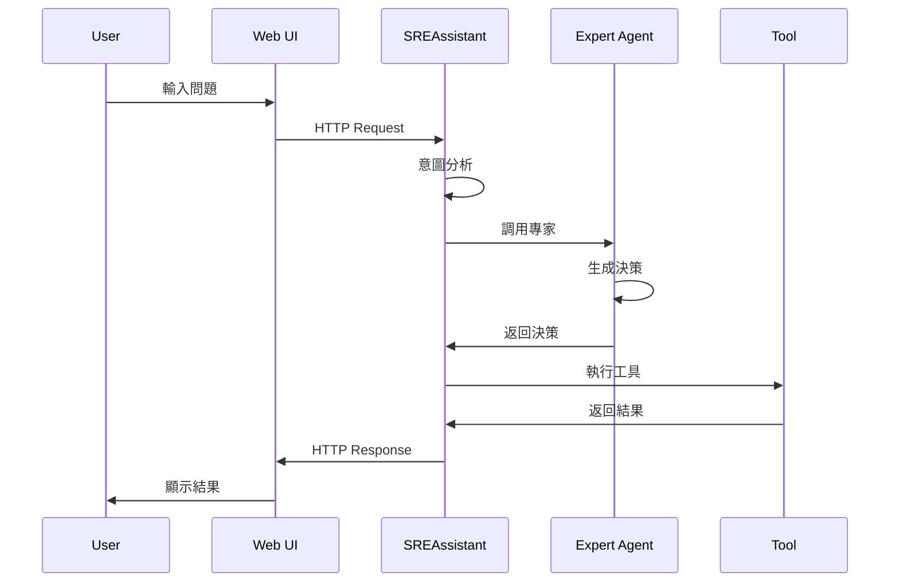
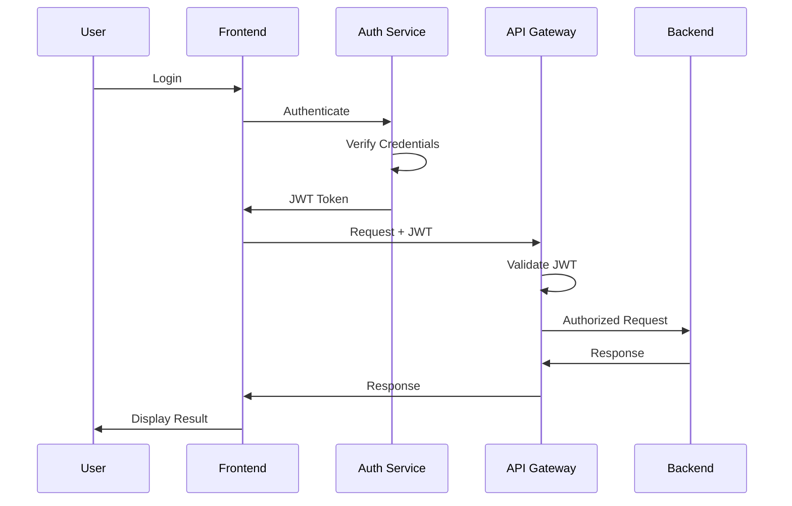

# 系統架構文檔

## 1. 架構概述

### 1.1 五大核心設計原則

#### 1. **助理優先 (Assistant-First)**
所有平台能力都必須透過統一的、對話式的 SREAssistant 暴露給使用者。使用者無需與後端系統直接互動。

#### 2. **專家解耦 (Decoupled Expertise)**
平台的核心是輕量級協調器。所有具體的業務邏輯都被封裝在獨立、可插拔的「專家 Agent」中。

#### 3. **知識閉環 (Knowledge Loop)**
平台內建核心知識庫服務。所有 Agent 的行動和成果都被記錄、學習，並反哺未來的決策。

#### 4. **工具抽象 (Tool Abstraction)**
所有外部系統交互透過標準化的 Tool 接口實現，確保 Agent 只關注決策邏輯。

#### 5. **開發者體驗至上 (DX First)**
Agent Development Kit (ADK) 必須極度簡潔，將所有底層複雜性完全抽象，讓開發者專注於創造價值。

### 1.2 分層架構設計

```
┌─────────────────────────────────────────────────────┐
│                    用戶介面層                         │
│                  (Web UI / CLI)                      │
│              【統一入口，自然語言交互】                  │
└─────────────────────────────────────────────────────┘
                           │
                           ▼
┌─────────────────────────────────────────────────────┐
│                  智能決策層 (Python)                  │
│         SREAssistant + Expert Agents                │
│            【WHY + WHAT + WHEN + HOW 決策與執行】      │
└─────────────────────────────────────────────────────┘
                           │
                           ▼
┌─────────────────────────────────────────────────────┐
│                     基礎設施層                        │
│        Prometheus / K8s / PostgreSQL / Redis        │
│                  【實際的系統資源】                    │
└─────────────────────────────────────────────────────┘
```

### 1.3 Agent vs Tool 職責劃分

> **黃金準則**：Agent 負責智能決策，Tool 負責具體執行

```
Agent (決策大腦)           Tool (執行手臂)
────────────────           ──────────────
WHY - 為什麼做             HOW - 如何做
WHAT - 做什麼             WHERE - 在哪做
WHEN - 何時做             WITH - 用什麼做

職責邊界：
• Agent 負責決策：分析情況、制定策略、協調資源
• Tool 負責執行：查詢數據、調用 API、生成報告
• Agent 不直接碰數據：所有數據操作必須通過 Tool
• Tool 不做決策：只提供能力，不判斷是否應該執行
```

### 1.4 設計原則實現範例

#### 原則 1：助理優先架構實現
```python
# 用戶只需要記住一個入口
class SREAssistant:
    """所有功能的統一入口"""
    
    async def chat(self, message: str) -> str:
        # 無論多複雜的操作，都通過自然對話完成
        intent = self.understand(message)
        expert = self.route_to_expert(intent)
        result = await expert.execute(intent)
        return self.explain_naturally(result)  # 自然語言回應
```

#### 原則 2：專家解耦實現
```python
# 協調器極簡，不含業務邏輯
class Orchestrator:
    def __init__(self):
        self.experts = {}  # 動態註冊
    
    def register_expert(self, expert):
        # 專家可以隨時插拔
        self.experts[expert.domain] = expert

# 專家完全獨立
class NetworkExpert:
    """可獨立部署、獨立更新"""
    def execute(self, intent):
        # 完整業務邏輯封裝
        pass
```

#### 原則 3：知識閉環實現
```python
class KnowledgeLoop:
    async def record_and_learn(self, action, result):
        # 每次執行都是學習機會
        self.record(action, result)
        pattern = self.extract_pattern(action, result)
        self.update_knowledge_base(pattern)
        self.improve_future_decisions(pattern)
```

#### 原則 4：工具抽象實現
```python
from adk.tool import Tool

class PingTool(Tool):
    async def execute(self, params):
        # 具體執行邏輯
        pass
```

#### 原則 5：開發者體驗實現
```python
# 開發者只需要寫這麼多
from adk import Agent, tool

class MyExpert(Agent):
    @tool("診斷網路")
    async def diagnose(self, target: str):
        # 框架自動處理所有複雜性
        return check_network(target)
```

### 1.5 技術選型理由

| 層級 | 技術選擇 | 選擇理由 |
|------|----------|----------|
| **智能層** | Python + ADK | • LLM 框架生態完整<br>• 快速原型開發<br>• AI/ML 庫豐富 |
| **存儲層** | PostgreSQL + Redis | • 結構化數據持久化<br>• 高速緩存與狀態管理 |

### 1.6 專案目錄結構

```bash
sre-assistant/
├── README.md                       # 專案說明
├── Makefile                        # 🔥 頂層協調所有構建
├── .env.example                    # 🔥 共用環境變數
│
├── agents/                        # 🔥 Python Agent 層
│   ├── pyproject.toml             # Python 專屬 Makefile
│   ├── poetry.lock                # Python 依賴鎖定
│   ├── Makefile                   # Python 專屬 Makefile
│   ├── sre_assistant/             # 主助理
│   │   ├── __init__.py
│   │   ├── assistant.py           # SREAssistant 實現
│   │   ├── intent.py              # 意圖理解
│   │   └── router.py              # 專家路由
│   ├── experts/                   # 專家 Agents
│   │   ├── __init__.py
│   │   ├── diagnostic/           # 診斷專家
│   │   │   ├── __init__.py
│   │   │   ├── system_diagnostic.py
│   │   │   ├── network_diagnostic.py
│   │   │   └── app_diagnostic.py
│   │   ├── postmortem/           # 複盤專家
│   │   │   ├── __init__.py
│   │   │   └── incident_analyzer.py
│   │   └── remediation/          # 修復專家
│   │       ├── __init__.py
│   │       └── auto_remediation.py
│   ├── framework/                # ADK 框架
│   │   ├── __init__.py
│   │   ├── base.py               # Agent 基類
│   │   ├── interfaces.py         # 介面定義
│   │   ├── decorators.py         # 裝飾器
│   │   ├── tools.py              # Tool 包裝
│   │   ├── memory.py             # 狀態管理
│   │   └── cache.py              # 快取管理
│   ├── tools/                    # Tool 實現
│   │   ├── __init__.py
│   │   ├── diagnostic/           # 診斷工具
│   │   │   ├── health_checker.py
│   │   │   └── network_diag.py
│   │   ├── config/               # 配置工具
│   │   │   └── update_config.py
│   │   └── remediation/          # 修復工具
│   │       ├── restart_service.py
│   │       └── clear_cache.py
│   ├── config/                   # 配置
│   │   ├── __init__.py
│   │   └── settings.py           # 環境配置
│   └── requirements.txt          # Python 依賴
│
├── deploy/                      # 部署配置
│   ├── docker/                  # Docker 相關
│   └── k8s/                     # Kubernetes 配置
│
├── tests/                       # 測試套件
│   ├── unit/                    # 單元測試
│   │   └── python/              # Python 單元測試
│   ├── integration/             # 集成測試
│   │   └── test_tool_execution.py
│   └── e2e/                     # 端到端測試
│       ├── test_full_flow.py
│       └── scenarios/
│
├── docs/                        # 文檔
│   ├── architecture/            # 架構文檔
│   │   ├── ARCHITECTURE.md      # 系統架構
│   │   ├── SPEC.md              # 技術規格
│   │   └── diagrams/            # 架構圖
│   ├── api/                     # API 文檔
│   │   ├── rest-api.md
│   │   └── grpc-api.md
│   ├── guides/                  # 使用指南
│   │   ├── developer-guide.md   # 開發指南
│   │   ├── deployment-guide.md  # 部署指南
│   │   └── agent-guide.md       # Agent 開發指南
│   └── adr/                     # 架構決策記錄
│       └── 001-tech-stack.md
│
├── scripts/           # 輔助腳本
│   ├── setup.sh       # 環境設置
│   ├── build.sh       # 構建腳本
│   ├── test.sh        # 測試腳本
│   └── deploy.sh      # 部署腳本
│
└── monitoring/         # 監控配置
    ├── prometheus/     # Prometheus
    └── grafana/        # Grafana
```

### 1.7 目錄職責說明

#### 🔥 核心目錄（最重要）

1. **agents/** - Python Agent 層
   - 所有智能決策邏輯
   - 專家 Agent 實現
   - ADK 框架封裝
   - Tool 實現

#### 📦 支援目錄

2. **deploy/** - 部署配置
   - Docker 映像定義
   - Kubernetes 部署檔案
   - 環境配置管理

3. **tests/** - 測試套件
   - 確保系統品質
   - 自動化測試流程

4. **docs/** - 文檔
   - 架構說明
   - API 文檔
   - 開發指南

#### 🛠️ 開發工具

5. **scripts/** - 輔助腳本
   - 自動化常見任務
   - 簡化開發流程

6. **monitoring/** - 監控配置
   - Prometheus 規則
   - Grafana 儀表板

### 1.8 檔案命名規範

```yaml
命名規範:
  Python 檔案:
    - 小寫 + 底線: system_diagnostic.py
    - 測試檔案: test_xxx.py
    
  配置檔案:
    - 小寫 + 連字號: docker-compose.yml
    - 環境配置: .env.{environment}
    
  文檔:
    - 大寫: README.md, ARCHITECTURE.md
    - 指南: xxx-guide.md
```

## 2. 系統組件詳解

### 2.1 智能決策層 (Python)

#### 2.1.1 SREAssistant - 統一入口

```python
# agents/sre_assistant/assistant.py
class SREAssistant:
    """
    核心協調器，負責：
    1. 意圖識別與分類
    2. 專家調度
    3. 結果整合與呈現
    """
    
    def __init__(self):
        self.intent_classifier = IntentClassifier()
        self.expert_registry = ExpertRegistry()
        self.session_manager = SessionManager()
    
    async def process_request(self, user_input: str) -> Response:
        # 1. 意圖分析
        intent = await self.intent_classifier.classify(user_input)
        
        # 2. 專家選擇
        expert = self.expert_registry.get_expert(intent.type)
        
        # 3. 執行決策
        decision = await expert.analyze(intent, self.session_manager.context)
        
        # 4. 調用工具
        result = await self.execute_decision(decision)
        
        return self.format_response(result)
```

#### 2.1.2 Expert Agents 架構

```python
# agents/framework/base.py
class BaseExpert(ABC):
    """專家基類 - 定義標準介面"""
    
    @abstractmethod
    async def analyze(self, intent: Intent, context: Context) -> Decision:
        """分析並產生決策"""
        pass
    
    @abstractmethod
    def get_required_tools(self) -> List[str]:
        """聲明所需工具"""
        pass

# agents/experts/diagnostic/network_expert.py
class NetworkDiagnosticExpert(BaseExpert):
    """網路診斷專家實現"""
    
    async def analyze(self, intent: Intent, context: Context) -> Decision:
        # 智能分析邏輯
        if intent.params.get("type") == "latency":
            return Decision(
                action="check_network_latency",
                tools=["ping", "traceroute", "mtr"],
                parameters={
                    "target": intent.params["target"],
                    "count": 10,
                    "interval": 1
                }
            )
    
    def get_required_tools(self) -> List[str]:
        return ["ping", "traceroute", "mtr", "netstat", "ss"]
```

#### 2.1.3 Tool 實現

```python
# agents/tools/diagnostic/health_checker.py
from adk.tool import BaseTool

class HealthChecker(BaseTool):
    """系統健康檢查工具"""
    
    async def execute(self, params: Dict[str, Any]) -> Dict[str, Any]:
        target = params["target"]
        checks = params["checks"]
        
        results = {}
        for check in checks:
            if check == "cpu":
                results["cpu"] = self.check_cpu(target)
            # ... 其他檢查
        
        return results
```

## 3. 資料流設計

### 3.1 請求處理流程



### 3.2 狀態管理

```yaml
會話狀態 (Redis):
  key: session:{session_id}
  ttl: 30 minutes
  data:
    - user_id
    - context
    - history[]
    - current_expert
    
長期存儲 (PostgreSQL):
  tables:
    - conversations: 對話記錄
    - decisions: 決策審計
    - tool_executions: 執行日誌
    - knowledge_base: 知識庫
```

## 4. 部署架構

### 4.1 容器化部署

```yaml
# deploy/docker-compose.yml
version: '3.8'

services:
  # Python Agent 服務
  agent-runtime:
    build: ./agents
    environment:
      - ADK_MODEL=gemini-2.0-flash
    depends_on:
      - redis
      - postgres
    deploy:
      replicas: 2
      resources:
        limits:
          memory: 2G
          cpus: '1.0'
  
  # 前端 UI
  web-ui:
    image: adk-web:latest
    ports:
      - "3000:3000"
    environment:
      - API_ENDPOINT=http://agent-runtime:8000
  
  # 基礎設施
  redis:
    image: redis:7-alpine
    volumes:
      - redis-data:/data
  
  postgres:
    image: postgres:15
    environment:
      - POSTGRES_DB=sre_assistant
    volumes:
      - postgres-data:/var/lib/postgresql/data
```

### 4.2 Kubernetes 部署

```yaml
# deploy/k8s/deployment.yaml
apiVersion: apps/v1
kind: Deployment
metadata:
  name: sre-assistant
spec:
  replicas: 3
  selector:
    matchLabels:
      app: sre-assistant
  template:
    metadata:
      labels:
        app: sre-assistant
    spec:
      containers:
      - name: agent-runtime
        image: sre-assistant/agent:v1.0.0
        resources:
          requests:
            memory: "1Gi"
            cpu: "500m"
          limits:
            memory: "2Gi"
            cpu: "1000m"
```

## 5. 安全設計

### 5.1 認證與授權

```python
# agents/framework/security.py
class SecurityManager:
    def __init__(self):
        self.jwt_validator = JWTValidator()
        self.rbac = RBACManager()
        self.rate_limiter = RateLimiter()
    
    async def validate(self, req):
        claims = await self.jwt_validator.validate(req.token)
        if not self.rbac.has_permission(claims.user_id, req.action):
            raise ForbiddenError
        if not self.rate_limiter.allow(claims.user_id):
            raise RateLimitError
```

### 5.2 工具執行安全

```python
# agents/framework/sandbox.py
class Sandbox:
    async def execute(self, tool, params):
        # 命令白名單檢查
        if tool.name not in self.allowed_tools:
            raise PermissionError
        
        # 資源限制
        with resource_limit(cpu=1, memory=512*1024*1024):
            return await tool.execute(params)
```

## 6. 監控與可觀測性

### 6.1 指標收集

```yaml
關鍵指標:
  業務指標:
    - agent_requests_total: Agent 請求總數
    - expert_invocations_total: 專家調用次數
    - tool_executions_total: 工具執行次數
    - decision_accuracy: 決策準確率
  
  性能指標:
    - request_duration_seconds: 請求處理時間
    - tool_execution_duration: 工具執行時間
  
  資源指標:
    - memory_usage_bytes: 內存使用
    - cpu_usage_percent: CPU 使用率
```

### 6.2 日誌架構

```python
# 結構化日誌
import structlog

logger = structlog.get_logger()

logger.info("agent_decision",
    request_id=req.id,
    user_id=req.user_id,
    intent=intent.type,
    expert=expert.name,
    decision=decision.action,
    tools=decision.tools,
    duration_ms=elapsed_ms
)
```

## 7. 開發工具鏈

### 7.1 本地開發環境

#### 開發者體驗
```bash
make dev          # 啟動開發環境
make test         # 運行所有測試  
make build        # 構建所有服務
make deploy       # 部署到 K8s
```

```bash
# 根目錄 Makefile - 統一入口
.PHONY: all build test deploy clean

# 🎯 一鍵構建所有服務
all: build-agents

# Python 服務構建
build-agents:
	@echo "Building Python agents..."
	cd agents && $(MAKE) build

# 統一測試
test: test-agents

test-agents:
	cd agents && poetry run pytest

# 本地開發環境
dev:
	docker-compose -f deploy/docker/docker-compose.yml up

# 統一部署
deploy: build-all
	kubectl apply -f deploy/k8s/

# 清理
clean:
	cd agents && $(MAKE) clean
```

### 7.2 CI/CD 流程

```yaml
# .github/workflows/ci.yml
name: CI Pipeline

on: [push, pull_request]

jobs:
  test:
    runs-on: ubuntu-latest
    steps:
    - uses: actions/checkout@v2
    
    # Python 測試
    - name: Python Tests
      run: |
        cd agents
        poetry install
        poetry run pytest --cov
```

## 8. 效能優化策略

### 8.1 快取設計

```python
# agents/framework/cache.py
class AgentCache:
    """多層快取策略"""
    
    def __init__(self):
        self.l1_cache = {}  # 進程內快取
        self.l2_cache = Redis()  # 分散式快取
    
    async def get_or_compute(self, key: str, compute_func):
        # L1 查詢
        if key in self.l1_cache:
            return self.l1_cache[key]
        
        # L2 查詢
        value = await self.l2_cache.get(key)
        if value:
            self.l1_cache[key] = value
            return value
        
        # 計算並快取
        value = await compute_func()
        self.l1_cache[key] = value
        await self.l2_cache.set(key, value, ttl=300)
        return value
```

### 8.2 並發控制

```python
# agents/framework/pool.py
from concurrent.futures import ThreadPoolExecutor

class WorkerPool:
    def __init__(self, max_workers=10):
        self.executor = ThreadPoolExecutor(max_workers=max_workers)
    
    async def submit(self, fn, *args):
        return await asyncio.wrap_future(self.executor.submit(fn, *args))
``` 

# 技術規格書

## 1. 系統需求規格

### 1.1 功能需求

| 需求編號 | 功能描述 | 優先級 | 實現階段 |
|----------|----------|--------|----------|
| FR-001 | 自然語言對話介面 | P0 | MVP |
| FR-002 | 意圖識別與路由 | P0 | MVP |
| FR-003 | 多專家協同決策 | P0 | Phase 1 |
| FR-004 | 工具執行與結果回傳 | P0 | MVP |
| FR-005 | 會話狀態管理 | P1 | Phase 1 |
| FR-006 | 知識庫學習與優化 | P1 | Phase 2 |
| FR-007 | 實時監控整合 | P1 | Phase 2 |
| FR-008 | 自動化修復執行 | P2 | Phase 3 |

### 1.2 非功能需求

```yaml
性能需求:
  響應時間: < 2秒 (95th percentile)
  並發用戶: 100 concurrent sessions
  吞吐量: 1000 requests/minute
  
可用性需求:
  SLA: 99.9% uptime
  故障恢復: < 5 minutes
  數據持久性: 99.999%
  
安全需求:
  認證: JWT + OAuth 2.0
  授權: RBAC
  加密: TLS 1.3
  審計: 全量操作日誌
  
擴展性需求:
  水平擴展: 支援 Kubernetes HPA
  Agent 熱插拔: 無需重啟
  工具動態加載: 運行時註冊
```

## 2. API 規格

### 2.1 REST API

```yaml
openapi: 3.0.0
info:
  title: SRE Assistant API
  version: 1.0.0

paths:
  /api/v1/chat:
    post:
      summary: 發送對話請求
      requestBody:
        content:
          application/json:
            schema:
              type: object
              properties:
                message:
                  type: string
                  description: 用戶輸入
                session_id:
                  type: string
                  description: 會話ID
                context:
                  type: object
                  description: 上下文資訊
      responses:
        200:
          description: 成功響應
          content:
            application/json:
              schema:
                type: object
                properties:
                  response:
                    type: string
                  actions_taken:
                    type: array
                    items:
                      type: object
                  metadata:
                    type: object
  
  /api/v1/sessions:
    post:
      summary: 創建新會話
      responses:
        201:
          description: 會話創建成功
          content:
            application/json:
              schema:
                type: object
                properties:
                  session_id:
                    type: string
                  expires_at:
                    type: string
                    format: date-time
```

## 3. 資料模型規格

### 3.1 核心實體

```sql
-- PostgreSQL Schema

-- 會話表
CREATE TABLE sessions (
    id UUID PRIMARY KEY DEFAULT gen_random_uuid(),
    user_id VARCHAR(255) NOT NULL,
    created_at TIMESTAMPTZ DEFAULT NOW(),
    updated_at TIMESTAMPTZ DEFAULT NOW(),
    expires_at TIMESTAMPTZ,
    state JSONB,
    metadata JSONB
);

-- 對話記錄表
CREATE TABLE conversations (
    id BIGSERIAL PRIMARY KEY,
    session_id UUID REFERENCES sessions(id),
    message_type VARCHAR(50) NOT NULL, -- 'user' | 'assistant' | 'system'
    content TEXT NOT NULL,
    intent_type VARCHAR(100),
    timestamp TIMESTAMPTZ DEFAULT NOW(),
    metadata JSONB
);

-- 決策審計表
CREATE TABLE decisions (
    id BIGSERIAL PRIMARY KEY,
    session_id UUID REFERENCES sessions(id),
    agent_name VARCHAR(100) NOT NULL,
    decision_type VARCHAR(100) NOT NULL,
    input JSONB NOT NULL,
    output JSONB NOT NULL,
    confidence FLOAT,
    execution_time_ms INT,
    created_at TIMESTAMPTZ DEFAULT NOW()
);

-- 工具執行日誌表
CREATE TABLE tool_executions (
    id BIGSERIAL PRIMARY KEY,
    decision_id BIGINT REFERENCES decisions(id),
    tool_name VARCHAR(100) NOT NULL,
    parameters JSONB,
    result JSONB,
    status VARCHAR(50) NOT NULL, -- 'success' | 'failed' | 'timeout'
    error_message TEXT,
    duration_ms INT,
    executed_at TIMESTAMPTZ DEFAULT NOW()
);

-- 知識庫表
CREATE TABLE knowledge_base (
    id BIGSERIAL PRIMARY KEY,
    category VARCHAR(100) NOT NULL,
    title VARCHAR(500) NOT NULL,
    content TEXT NOT NULL,
    embedding vector(1536), -- pgvector 向量存儲
    tags TEXT[],
    source VARCHAR(255),
    confidence_score FLOAT,
    created_at TIMESTAMPTZ DEFAULT NOW(),
    updated_at TIMESTAMPTZ DEFAULT NOW()
);

-- 索引優化
CREATE INDEX idx_sessions_user_id ON sessions(user_id);
CREATE INDEX idx_conversations_session_id ON conversations(session_id);
CREATE INDEX idx_decisions_session_id ON decisions(session_id);
CREATE INDEX idx_tool_executions_decision_id ON tool_executions(decision_id);
CREATE INDEX idx_knowledge_base_embedding ON knowledge_base USING ivfflat (embedding vector_cosine_ops);
```

### 3.2 Redis 資料結構

```yaml
# 會話狀態
session:{session_id}:
  type: Hash
  fields:
    user_id: string
    current_intent: string
    current_expert: string
    context: JSON string
    last_activity: timestamp
  TTL: 1800 seconds

# 用戶配額
quota:{user_id}:
  type: String (counter)
  TTL: 3600 seconds (sliding window)

# Agent 狀態快取
agent:{agent_name}:state:
  type: Hash
  fields:
    status: ready|busy|error
    current_task: string
    last_update: timestamp

# 工具執行鎖
lock:tool:{tool_name}:{resource_id}:
  type: String
  value: holder_id
  TTL: 60 seconds
```

## 4. Agent 開發規格

### 4.1 Agent 介面定義

```python
# agents/framework/interfaces.py
from abc import ABC, abstractmethod
from typing import List, Dict, Any, Optional
from dataclasses import dataclass
from enum import Enum

class IntentType(Enum):
    """意圖類型枚舉"""
    DIAGNOSTIC = "diagnostic"
    CONFIGURATION = "configuration"
    REMEDIATION = "remediation"
    QUERY = "query"
    ANALYSIS = "analysis"

@dataclass
class Intent:
    """意圖資料結構"""
    type: IntentType
    confidence: float
    parameters: Dict[str, Any]
    raw_input: str

@dataclass
class Decision:
    """決策資料結構"""
    action: str
    tools: List[str]
    parameters: Dict[str, Any]
    priority: int = 0
    timeout_seconds: int = 30
    require_approval: bool = False

@dataclass
class Context:
    """執行上下文"""
    session_id: str
    user_id: str
    history: List[Dict[str, Any]]
    environment: Dict[str, str]
    
class IExpertAgent(ABC):
    """專家 Agent 介面"""
    
    @property
    @abstractmethod
    def name(self) -> str:
        """Agent 名稱"""
        pass
    
    @property
    @abstractmethod
    def description(self) -> str:
        """Agent 描述"""
        pass
    
    @property
    @abstractmethod
    def supported_intents(self) -> List[IntentType]:
        """支援的意圖類型"""
        pass
    
    @abstractmethod
    async def analyze(self, intent: Intent, context: Context) -> Decision:
        """分析並生成決策"""
        pass
    
    @abstractmethod
    def validate_decision(self, decision: Decision) -> bool:
        """驗證決策有效性"""
        pass
    
    @abstractmethod
    def get_required_tools(self) -> List[str]:
        """獲取所需工具列表"""
        pass
```

### 4.2 Agent 實作範例

```python
# agents/experts/diagnostic/system_diagnostic.py
from agents.framework.interfaces import IExpertAgent, Intent, Decision, Context, IntentType
from agents.framework.decorators import agent, tool_requirement, metric
import logging

@agent(
    name="SystemDiagnosticExpert",
    version="1.0.0",
    author="SRE Team"
)
class SystemDiagnosticExpert(IExpertAgent):
    """系統診斷專家 Agent"""
    
    def __init__(self):
        self.logger = logging.getLogger(self.__class__.__name__)
        self.confidence_threshold = 0.7
    
    @property
    def name(self) -> str:
        return "SystemDiagnosticExpert"
    
    @property
    def description(self) -> str:
        return "專門處理系統診斷、性能分析和故障排查"
    
    @property
    def supported_intents(self) -> List[IntentType]:
        return [IntentType.DIAGNOSTIC, IntentType.ANALYSIS]
    
    @metric("agent_analysis_duration")
    async def analyze(self, intent: Intent, context: Context) -> Decision:
        """
        分析系統問題並生成診斷決策
        """
        self.logger.info(f"Analyzing intent: {intent.type}")
        
        # 解析診斷目標
        target = intent.parameters.get("target", "system")
        diagnostic_type = intent.parameters.get("type", "health_check")
        
        # 根據不同診斷類型生成決策
        if diagnostic_type == "health_check":
            return self._health_check_decision(target)
        elif diagnostic_type == "performance":
            return self._performance_analysis_decision(target)
        elif diagnostic_type == "connectivity":
            return self._connectivity_check_decision(target)
        else:
            return self._general_diagnostic_decision(target)
    
    def _health_check_decision(self, target: str) -> Decision:
        """健康檢查決策"""
        return Decision(
            action="system_health_check",
            tools=["health_checker", "metrics_collector"],
            parameters={
                "target": target,
                "checks": ["cpu", "memory", "disk", "network"],
                "threshold": {
                    "cpu_usage": 80,
                    "memory_usage": 90,
                    "disk_usage": 85
                }
            },
            timeout_seconds=60
        )
    
    def _performance_analysis_decision(self, target: str) -> Decision:
        """性能分析決策"""
        return Decision(
            action="performance_analysis",
            tools=["perf_analyzer", "metrics_aggregator", "report_generator"],
            parameters={
                "target": target,
                "duration": "5m",
                "metrics": ["latency", "throughput", "error_rate"],
                "aggregation": "percentile"
            },
            timeout_seconds=120
        )
    
    def validate_decision(self, decision: Decision) -> bool:
        """驗證決策有效性"""
        # 檢查必要參數
        if not decision.action:
            return False
        
        # 檢查工具可用性
        required_tools = set(decision.tools)
        available_tools = set(self.get_required_tools())
        
        return required_tools.issubset(available_tools)
    
    @tool_requirement
    def get_required_tools(self) -> List[str]:
        """聲明所需工具"""
        return [
            "health_checker",
            "metrics_collector",
            "perf_analyzer",
            "metrics_aggregator",
            "report_generator",
            "log_analyzer",
            "trace_collector"
        ]
```

### 4.3 Tool 規格定義

```python
# agents/framework/tools.py
from abc import ABC, abstractmethod
from typing import Dict, Any
import asyncio

class BaseTool(ABC):
    """Tool 基類定義"""
    
    @property
    @abstractmethod
    def name(self) -> str:
        """Tool 名稱"""
        pass
    
    @property
    @abstractmethod
    def description(self) -> str:
        """Tool 描述"""
        pass
    
    @abstractmethod
    def validate_params(self, params: Dict[str, Any]) -> None:
        """驗證參數"""
        pass
    
    @abstractmethod
    async def execute(self, params: Dict[str, Any]) -> Dict[str, Any]:
        """執行工具"""
        pass

# Tool 實作範例
class HealthChecker(BaseTool):
    @property
    def name(self) -> str:
        return "health_checker"
    
    @property
    def description(self) -> str:
        return "執行系統健康檢查"
    
    def validate_params(self, params: Dict[str, Any]) -> None:
        required = {"target", "checks"}
        if not required.issubset(params.keys()):
            raise ValueError("Missing parameters")
    
    async def execute(self, params: Dict[str, Any]) -> Dict[str, Any]:
        target = params["target"]
        checks = params["checks"]
        
        results = {}
        # 模擬執行
        for check in checks:
            if check == "cpu":
                results["cpu"] = {"usage": 45.0, "status": "healthy"}
            elif check == "memory":
                results["memory"] = {"usage": 60.0, "status": "healthy"}
        
        return {
            "success": True,
            "data": results,
            "metrics": {"execution_time_ms": 100}
        }
```

## 5. 部署規格

### 5.1 環境配置

```yaml
# 環境變數配置
environments:
  development:
    LOG_LEVEL: debug
    DB_POOL_SIZE: 5
    REDIS_POOL_SIZE: 10
    AGENT_TIMEOUT: 30s
    TOOL_TIMEOUT: 60s
    
  staging:
    LOG_LEVEL: info
    DB_POOL_SIZE: 20
    REDIS_POOL_SIZE: 50
    AGENT_TIMEOUT: 60s
    TOOL_TIMEOUT: 120s
    
  production:
    LOG_LEVEL: warning
    DB_POOL_SIZE: 50
    REDIS_POOL_SIZE: 100
    AGENT_TIMEOUT: 120s
    TOOL_TIMEOUT: 300s
    ENABLE_TRACING: true
    ENABLE_METRICS: true
```

### 5.2 資源配置

```yaml
# Kubernetes 資源配置
resources:
  agent-runtime:
    requests:
      cpu: 500m
      memory: 1Gi
    limits:
      cpu: 2000m
      memory: 4Gi

# 自動擴展配置
autoscaling:
  agent-runtime:
    min_replicas: 2
    max_replicas: 10
    target_cpu: 70
    target_memory: 80
```

## 6. 測試規格

### 6.1 單元測試

```python
# tests/unit/test_diagnostic_expert.py
import pytest
from unittest.mock import Mock, AsyncMock
from agents.experts.diagnostic import SystemDiagnosticExpert
from agents.framework.interfaces import Intent, IntentType, Context

class TestSystemDiagnosticExpert:
    
    @pytest.fixture
    def expert(self):
        return SystemDiagnosticExpert()
    
    @pytest.fixture
    def context(self):
        return Context(
            session_id="test-session",
            user_id="test-user",
            history=[],
            environment={}
        )
    
    @pytest.mark.asyncio
    async def test_health_check_decision(self, expert, context):
        intent = Intent(
            type=IntentType.DIAGNOSTIC,
            confidence=0.9,
            parameters={
                "target": "web-server",
                "type": "health_check"
            },
            raw_input="check web server health"
        )
        
        decision = await expert.analyze(intent, context)
        
        assert decision.action == "system_health_check"
        assert "health_checker" in decision.tools
        assert decision.parameters["target"] == "web-server"
    
    def test_validate_decision_valid(self, expert):
        decision = Decision(
            action="test_action",
            tools=["health_checker"],
            parameters={}
        )
        
        assert expert.validate_decision(decision) == True
    
    def test_validate_decision_invalid_tool(self, expert):
        decision = Decision(
            action="test_action",
            tools=["non_existent_tool"],
            parameters={}
        )
        
        assert expert.validate_decision(decision) == False
```

### 6.2 整合測試

```python
# tests/integration/test_tool_execution.py
import pytest
from agents.tools.diagnostic.health_checker import HealthChecker

@pytest.mark.asyncio
async def test_health_checker_execution():
    tool = HealthChecker()
    
    params = {
        "target": "localhost",
        "checks": ["cpu", "memory"]
    }
    
    result = await tool.execute(params)
    
    assert result["success"] == True
    assert "cpu" in result["data"]
    assert "memory" in result["data"]
```

### 6.3 端到端測試

```python
# tests/e2e/test_full_flow.py
import pytest
import asyncio
from httpx import AsyncClient

@pytest.mark.e2e
class TestEndToEnd:
    
    @pytest.fixture
    async def client(self):
        async with AsyncClient(base_url="http://localhost:8000") as client:
            yield client
    
    @pytest.mark.asyncio
    async def test_diagnostic_flow(self, client):
        # 1. 創建會話
        session_resp = await client.post("/api/v1/sessions")
        session_id = session_resp.json()["session_id"]
        
        # 2. 發送診斷請求
        chat_resp = await client.post(
            "/api/v1/chat",
            json={
                "message": "檢查 web-server 的健康狀態",
                "session_id": session_id
            }
        )
        
        assert chat_resp.status_code == 200
        result = chat_resp.json()
        
        # 3. 驗證響應
        assert "response" in result
        assert "web-server" in result["response"].lower()
        assert len(result["actions_taken"]) > 0
        
        # 4. 驗證執行的工具
        actions = result["actions_taken"]
        assert any(action["tool"] == "health_checker" for action in actions)
```

## 7. 監控與告警規格

### 7.1 Prometheus 指標

```yaml
# 業務指標
sre_assistant_requests_total:
  type: Counter
  labels: [agent, intent_type, status]
  description: Total number of requests processed

sre_assistant_request_duration_seconds:
  type: Histogram
  labels: [agent, operation]
  buckets: [0.1, 0.5, 1, 2, 5, 10]
  description: Request processing duration

sre_assistant_active_sessions:
  type: Gauge
  labels: []
  description: Number of active sessions

# 系統指標
tool_execution_total:
  type: Counter
  labels: [tool, status]
  description: Total tool executions

tool_execution_duration_seconds:
  type: Histogram
  labels: [tool]
  buckets: [0.5, 1, 5, 10, 30, 60]
  description: Tool execution duration

# 錯誤指標
error_rate:
  type: Gauge
  labels: [component, error_type]
  description: Error rate per component
```

### 7.2 告警規則

```yaml
# Prometheus 告警規則
groups:
  - name: sre_assistant_alerts
    interval: 30s
    rules:
      # 高錯誤率告警
      - alert: HighErrorRate
        expr: rate(sre_assistant_requests_total{status="error"}[5m]) > 0.05
        for: 5m
        labels:
          severity: warning
        annotations:
          summary: "High error rate detected"
          description: "Error rate is {{ $value }} (> 5%)"
      
      # 響應時間告警
      - alert: SlowResponse
        expr: histogram_quantile(0.95, rate(sre_assistant_request_duration_seconds_bucket[5m])) > 2
        for: 10m
        labels:
          severity: warning
        annotations:
          summary: "Slow response time"
          description: "95th percentile response time is {{ $value }}s"
      
      # 資源使用告警
      - alert: HighMemoryUsage
        expr: container_memory_usage_bytes{pod=~"sre-assistant.*"} / container_spec_memory_limit_bytes > 0.9
        for: 5m
        labels:
          severity: critical
        annotations:
          summary: "High memory usage"
          description: "Memory usage is above 90%"
```

## 8. 安全規格

### 8.1 認證流程



### 8.2 資料加密

```yaml
encryption:
  at_rest:
    database: AES-256-GCM
    file_storage: AES-256-CBC
    key_management: AWS KMS / HashiCorp Vault
    
  in_transit:
    external: TLS 1.3
    internal: mTLS
    
  sensitive_data:
    passwords: bcrypt (cost=12)
    api_keys: HMAC-SHA256
    pii_data: field-level encryption
```

## 9. 維運規格

### 9.1 備份策略

```yaml
backup:
  database:
    type: PostgreSQL
    schedule: "0 2 * * *"  # 每日凌晨 2 點
    retention: 30 days
    method: pg_dump with compression
    storage: S3 compatible
    
  redis:
    type: Redis
    schedule: "*/30 * * * *"  # 每 30 分鐘
    retention: 7 days
    method: RDB snapshot
    
  knowledge_base:
    type: Incremental
    schedule: "0 */6 * * *"  # 每 6 小時
    retention: 90 days
    versioning: enabled
```

### 9.2 災難恢復

```yaml
disaster_recovery:
  rpo: 1 hour  # Recovery Point Objective
  rto: 4 hours # Recovery Time Objective
  
  strategies:
    - Multi-region deployment
    - Automated failover
    - Data replication
    - Regular DR drills
    
  procedures:
    detection:
      - Health check failures
      - Metric anomalies
      - Alert triggers
      
    response:
      - Automatic failover to standby
      - DNS update
      - Cache warming
      - Notification to on-call
```

## 10. 效能基準

### 10.1 效能目標

| 操作類型 | P50 | P95 | P99 |
|----------|-----|-----|-----|
| 簡單查詢 | 200ms | 500ms | 1s |
| 診斷執行 | 1s | 2s | 5s |
| 複雜分析 | 5s | 10s | 30s |
| 批量操作 | 10s | 30s | 60s |

### 10.2 負載測試

```yaml
load_test:
  tool: K6 / Locust
  
  scenarios:
    steady_load:
      duration: 30m
      vus: 100  # Virtual Users
      rps: 50
      
    spike_test:
      stages:
        - duration: 5m, target: 100
        - duration: 1m, target: 500
        - duration: 5m, target: 100
        
    stress_test:
      duration: 1h
      vus: 500
      rps: 200
      
  acceptance_criteria:
    error_rate: < 1%
    p95_latency: < 2s
    success_rate: > 99%
```