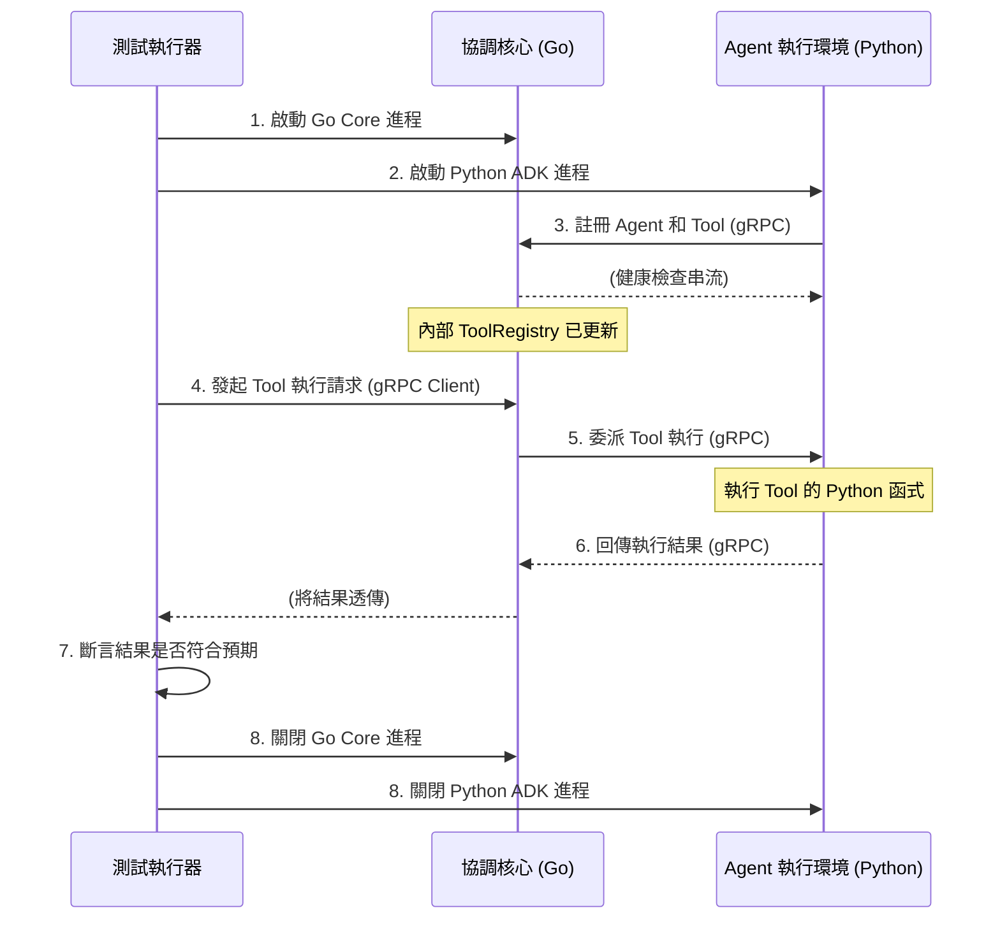
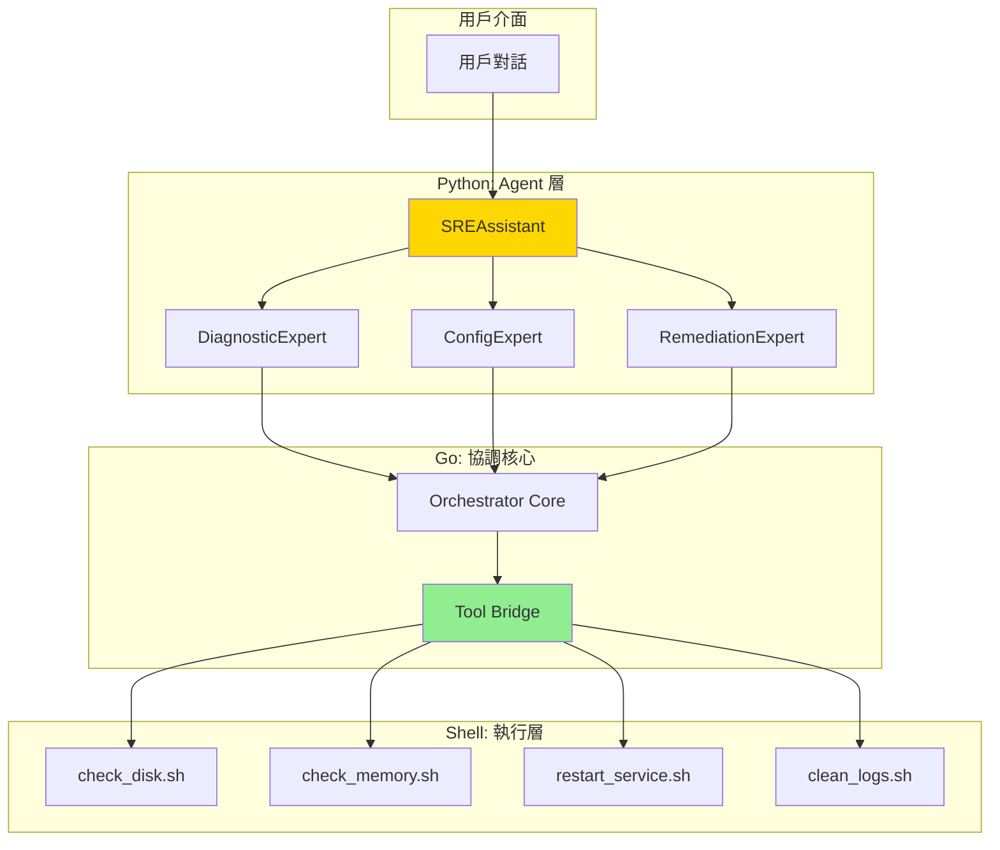

# 開發任務與進度追蹤

> **文檔職責**：記錄當前開發任務、進度狀態和里程碑管理，為開發團隊提供實時的任務執行狀態

## 文檔定位

- **目標受眾**：開發團隊、專案管理者、AI 代理
- **更新頻率**：每日更新
- **版本**：1.0.0
- **最後更新**：2025-08-20

## 文檔關係

```bash
README.md → AGENT.md → ARCHITECTURE.md → SPEC.md → [TASKS.md]
```

**閱讀路徑**：
- **前置閱讀**：[SPEC.md - 技術規格文檔](SPEC.md#技術棧與依賴) - 了解實作細節
- **相關參考**：[AGENT.md - AI協作指南](AGENT.md#工作流程規範) - 任務執行規範
- **架構背景**：[ARCHITECTURE.md - 系統架構](ARCHITECTURE.md#系統架構設計) - 設計決策依據

## 專案狀態概覽

### 當前里程碑
- **階段**：MVP 階段一
- **進度**：Week 1 / 2 週交付  
- **完成度**：
- **狀態**：🟢 **準備交付**
- **預計完成**：2025-08-22

### 關鍵指標
- **任務完成率**：
- **測試覆蓋率**：
- **程式碼品質**：
- **效能指標**：

## MVP 核心交付目標

我們的 MVP 實施路徑將嚴格遵循「**先驗證核心智慧，再擴展整合能力**」的原則，確保平台能夠輕裝上陣，快速演進。

#### **階段一：零依賴核心智慧驗證 (目標：2週)**

參考 [階段一實作：零依賴核心智慧驗證](#階段一實作零依賴核心智慧驗證) 的階段一。

**核心目標**：在**不依賴任何外部系統 (如 K8s, Prometheus)** 的情況下，完整地驗證從 SREAssistant 接收指令，到專家 Agent 決策，再到 協調核心 透過 Tool Bridge 執行 Shell 腳本並返回結果的**端到端閉環**。

**關鍵功能 (Key Features)**:

1. **SREAssistant 核心對話流**: 能夠接收自然語言，並根據意圖路由到指定的專家 Agent。  
2. **專家 Agent 的基礎決策**:  
   * DiagnosticExpert: 能根據關鍵字（如「磁碟」、「記憶體」）選擇對應的診斷工具。  
   * RemediationExpert: 能根據診斷結果，選擇對應的修復工具。  
3. **零依賴工具庫**:  
   * check_disk.sh: 檢查本地磁碟空間。  
   * check_memory.sh: 檢查本地記憶體使用率。  
   * restart_service.sh: 模擬服務重啟（例如 echo "restarting..."）。  
4. **Go Core Tool Bridge**: 協調核心 能夠安全地接收來自 Python Agent 的 Tool 執行請求，並調用對應的 Shell 腳本。  
5. **端到端整合測試**: 提供 make test-e2e 指令，能自動化地完成上述完整流程的驗證。

**驗收標準 (Acceptance Criteria)**:

開發者能夠在本地環境，透過對話介面詢問 SREAssistant：「檢查根目錄的磁碟狀況」，Assistant 能夠成功地驅動 DiagnosticExpert 呼叫 check_disk.sh 工具，並將格式化後的結果回報給使用者。




#### **階段二：生產級整合能力擴展 (目標：1個月)**

參考 [階段二實作：生產級整合能力擴展](#階段二實作生產級整合能力擴展) 的階段二。

**核心目標**：在**不改變任何 Agent 核心決策邏輯**的前提下，透過替換和新增更高階的 Tool，將平台的能力從「本機腳本」無縫升級到「雲原生系統整合」。

**關鍵功能 (Key Features)**:

1. **高階診斷工具**:  
   * 開發 PrometheusTool，其內部封裝 PromQL 查詢邏輯。  
   * 用 PrometheusTool **替換** check_disk.sh 的底層實現。  
2. **高階配置工具**:  
   * 開發 KubernetesTool，封裝對 K8s API Server 的操作。  
   * ObservabilityExpert 可使用此工具自動創建 ServiceMonitor 或 CronJob。  
3. **高階修復工具**:  
   * 擴充 KubernetesTool 或開發 DatabaseTool。  
   * RemediationExpert 可使用此工具執行 rollout restart 或資料庫清理腳本。  
4. **儀表板生成能力**:  
   * 開發 GrafanaTool，基於模板生成儀表板的功能。

**驗收標準 (Acceptance Criteria)**:

1. 當開發者再次詢問「檢查根目錄的磁碟狀況」時，DiagnosticExpert **在程式碼未經修改的情況下**，能夠呼叫新的 PrometheusTool 並從 Prometheus 獲取數據返回。  
2. 開發者可以對 SREAssistant 說「為 auth-service 建立標準儀表板」，ObservabilityExpert 能夠成功在 Grafana 中創建對應的儀表板。

這個兩階段的 MVP 路徑，完美地實踐了**將依賴降到最低、快速驗證核心、平滑優雅進化**的架構哲學。

---

# 階段一實作：零依賴核心智慧驗證

> **從最簡單的 Shell 腳本開始，專注於驗證核心能力**

## 一、架構調整：Shell 腳本優先

### 1.1 極簡架構



## 二、Shell 腳本工具實現

### 2.1 診斷工具腳本

```bash
#!/bin/bash
# tools/diagnostic/check_disk.sh
# 功能：檢查磁碟使用率

set -e

# 標準化輸出格式（JSON）
output_json() {
    local status=$1
    local message=$2
    local data=$3
    echo "{"status":"$status","message":"$message","data":$data}"
}

# 主邏輯
check_disk_usage() {
    local threshold=${1:-80}  # 預設閾值 80%
    
    # 獲取磁碟使用資訊
    disk_info=$(df -h | grep -E '^/dev/' | awk '{print $5" "$6}')
    
    # 構建 JSON 數據
    data="["
    first=true
    while IFS= read -r line; do
        usage=$(echo $line | awk '{print $1}' | sed 's/%//')
        mount=$(echo $line | awk '{print $2}')
        
        if [ "$first" = true ]; then
            first=false
        else
            data="$data,"
        fi
        
        status="ok"
        if [ "$usage" -gt "$threshold" ]; then
            status="warning"
        fi
        
        data="$data{"mount":"$mount","usage":$usage,"status":"$status"}"
    done <<< "$disk_info"
    data="$data]"
    
    # 判斷整體狀態
    if echo "$disk_info" | awk '{print $1}' | sed 's/%//' | 
       awk -v t="$threshold" '{if($1>t) exit 1}'; then
        output_json "ok" "All disks healthy" "$data"
    else
        output_json "warning" "Some disks above threshold" "$data"
    fi
}

# 執行
check_disk_usage "$@"
```

```bash
#!/bin/bash
# tools/diagnostic/check_memory.sh
# 功能：檢查記憶體使用率

set -e

check_memory_usage() {
    local threshold=${1:-80}
    
    # 獲取記憶體資訊
    mem_total=$(free -b | grep Mem | awk '{print $2}')
    mem_used=$(free -b | grep Mem | awk '{print $3}')
    mem_available=$(free -b | grep Mem | awk '{print $7}')
    
    # 計算使用率
    usage_percent=$((mem_used * 100 / mem_total))
    
    # 構建 JSON 結果
    data="{
        "total_bytes": $mem_total,
        "used_bytes": $mem_used,
        "available_bytes": $mem_available,
        "usage_percent": $usage_percent
    }"
    
    # 判斷狀態
    if [ "$usage_percent" -gt "$threshold" ]; then
        echo "{"status":"warning","message":"Memory usage high","data":$data}"
    else
        echo "{"status":"ok","message":"Memory healthy","data":$data}"
    fi
}

check_memory_usage "$@"
```

### 2.2 配置工具腳本

```bash
#!/bin/bash
# tools/config/update_config.sh
# 功能：更新配置文件

set -e

update_config() {
    local config_file=$1
    local key=$2
    local value=$3
    
    # 驗證參數
    if [ -z "$config_file" ] || [ -z "$key" ] || [ -z "$value" ]; then
        echo "{"status":"error","message":"Missing parameters"}"
        exit 1
    fi
    
    # 備份原配置
    cp "$config_file" "${config_file}.bak.$(date +%Y%m%d%H%M%S)"
    
    # 更新配置
    if grep -q "^$key=" "$config_file"; then
        sed -i "s/^$key=.*/$key=$value/" "$config_file"
        echo "{"status":"ok","message":"Config updated","data":{"file":"$config_file","key":"$key","value":"$value"}}"
    else
        echo "$key=$value" >> "$config_file"
        echo "{"status":"ok","message":"Config added","data":{"file":"$config_file","key":"$key","value":"$value"}}"
    fi
}

update_config "$@"
```

### 2.3 修復工具腳本

```bash
#!/bin/bash
# tools/remediation/clean_logs.sh
# 功能：清理日誌文件

set -e

clean_logs() {
    local log_dir=${1:-/var/log}
    local days=${2:-30}
    local dry_run=${3:-false}
    
    # 查找舊日誌
    old_logs=$(find "$log_dir" -name "*.log" -type f -mtime +$days)
    count=$(echo "$old_logs" | wc -l)
    
    if [ "$dry_run" = "true" ]; then
        # 模擬模式
        echo "{"status":"dry_run","message":"Would delete $count files","data":{"files":$count}}"
    else
        # 實際清理
        if [ -n "$old_logs" ]; then
            echo "$old_logs" | xargs rm -f
            echo "{"status":"ok","message":"Cleaned $count log files","data":{"files":$count}}"
        else
            echo "{"status":"ok","message":"No old logs to clean","data":{"files":0}}"
        fi
    fi
}

clean_logs "$@"
```

## 三、Go 協調核心實現

### 3.1 Tool Bridge 實現

```go
// core/bridge.go
package core

import (
    "encoding/json"
    "fmt"
    "os/exec"
    "path/filepath"
)

type ToolBridge struct {
    toolsDir string
}

type ToolResult struct {
    Status  string          `json:"status"`
    Message string          `json:"message"`
    Data    json.RawMessage `json:"data"`
}

// 執行 Shell 腳本工具
func (tb *ToolBridge) Execute(toolType, toolName string, args ...string) (*ToolResult, error) {
    // 構建腳本路徑
    scriptPath := filepath.Join(tb.toolsDir, toolType, toolName+".sh")
    
    // 執行腳本
    cmd := exec.Command("/bin/bash", append([]string{scriptPath}, args...)...)
    output, err := cmd.Output()
    if err != nil {
        return nil, fmt.Errorf("failed to execute tool: %w", err)
    }
    
    // 解析 JSON 結果
    var result ToolResult
    if err := json.Unmarshal(output, &result); err != nil {
        return nil, fmt.Errorf("failed to parse tool output: %w", err)
    }
    
    return &result, nil
}

// 工具註冊和發現
func (tb *ToolBridge) DiscoverTools() map[string][]string {
    tools := make(map[string][]string)
    
    categories := []string{"diagnostic", "config", "remediation"}
    for _, cat := range categories {
        catPath := filepath.Join(tb.toolsDir, cat)
        files, _ := filepath.Glob(filepath.Join(catPath, "*.sh"))
        
        for _, file := range files {
            name := filepath.Base(file)
            name = name[:len(name)-3] // 移除 .sh
            tools[cat] = append(tools[cat], name)
        }
    }
    
    return tools
}
```

### 3.2 gRPC 服務實現

```go
// core/grpc_server.go
package core

import (
    "context"
    pb "sre-assistant/proto"
)

type Server struct {
    pb.UnimplementedAgentBridgeServer
    bridge *ToolBridge
}

func (s *Server) ExecuteTool(ctx context.Context, req *pb.ToolRequest) (*pb.ToolResponse, error) {
    // 執行工具
    result, err := s.bridge.Execute(req.Category, req.Name, req.Args...)
    if err != nil {
        return &pb.ToolResponse{
            Success: false,
            Error:   err.Error(),
        }, nil
    }
    
    // 返回結果
    return &pb.ToolResponse{
        Success: true,
        Status:  result.Status,
        Message: result.Message,
        Data:    string(result.Data),
    }, nil
}

func (s *Server) DiscoverTools(ctx context.Context, req *pb.Empty) (*pb.ToolsResponse, error) {
    tools := s.bridge.DiscoverTools()
    return &pb.ToolsResponse{Tools: tools}, nil
}
```

## 四、Python Agent 實現

### 4.1 診斷專家實現

```python
# agents/diagnostic_expert.py
from sre_adk import Agent, tool
import json

class DiagnosticExpert(Agent):
    """診斷專家 - 使用 Shell 腳本工具"""
    
    name = "診斷專家"
    description = "執行系統健康檢查"
    
    @tool("檢查磁碟使用率")
    async def check_disk(self, threshold: int = 80) -> dict:
        """
        檢查所有磁碟的使用率
        """
        # 調用 Go Core 執行 Shell 腳本
        result = await self.execute_tool(
            category="diagnostic",
            name="check_disk",
            args=[str(threshold)]
        )
        
        # 解析結果並添加智能分析
        if result['status'] == 'warning':
            # 分析哪些磁碟需要關注
            critical_disks = [
                d for d in result['data'] 
                if d['usage'] > threshold
            ]
            
            return {
                "diagnosis": "磁碟空間告警",
                "severity": "medium",
                "details": f"發現 {len(critical_disks)} 個磁碟超過閾值",
                "recommendations": [
                    "清理日誌文件",
                    "檢查臨時文件",
                    "考慮擴容"
                ],
                "raw_data": result['data']
            }
        
        return {
            "diagnosis": "磁碟空間正常",
            "severity": "low",
            "details": "所有磁碟使用率在正常範圍",
            "raw_data": result['data']
        }
    
    @tool("系統健康檢查")
    async def health_check(self) -> dict:
        """
        執行完整的系統健康檢查
        """
        # 並行執行多個檢查
        disk_result = await self.check_disk()
        memory_result = await self.check_memory()
        
        # 綜合分析
        overall_status = "healthy"
        issues = []
        
        if disk_result['severity'] != 'low':
            overall_status = "warning"
            issues.append("磁碟空間")
            
        if memory_result['severity'] != 'low':
            overall_status = "warning"
            issues.append("記憶體")
        
        return {
            "overall_status": overall_status,
            "issues": issues,
            "disk": disk_result,
            "memory": memory_result
        }
```

### 4.2 SREAssistant 實現

```python
# agents/sre_assistant.py
from sre_adk import Agent, tool
from diagnostic_expert import DiagnosticExpert
from config_expert import ConfigExpert
from remediation_expert import RemediationExpert

class SREAssistant(Agent):
    """主助理 - 協調各專家"""
    
    name = "SRE Assistant"
    description = "您的智能運維助理"
    
    def __init__(self):
        super().__init__()
        self.diagnostic = DiagnosticExpert()
        self.config = ConfigExpert()
        self.remediation = RemediationExpert()
    
    async def process(self, message: str) -> str:
        """
        處理用戶訊息的主邏輯
        """
        # 意圖識別
        intent = self.understand_intent(message)
        
        # 路由到合適的專家
        if intent.category == "diagnostic":
            result = await self.diagnostic.execute(intent)
        elif intent.category == "config":
            result = await self.config.execute(intent)
        elif intent.category == "fix":
            result = await self.remediation.execute(intent)
        else:
            result = await self.handle_general(intent)
        
        # 生成人性化回應
        return self.generate_response(result)
    
    def understand_intent(self, message: str):
        """意圖理解 - 可以很簡單"""
        keywords = {
            "diagnostic": ["檢查", "診斷", "狀態", "健康"],
            "config": ["配置", "設定", "修改", "更新"],
            "fix": ["修復", "清理", "重啟", "解決"]
        }
        
        for category, words in keywords.items():
            if any(word in message for word in words):
                return Intent(category=category, message=message)
        
        return Intent(category="general", message=message)
```

## 五、驗證流程

### 5.1 單元測試驗證

```python
# tests/test_tool_execution.py
import pytest
from core import ToolBridge

class TestToolExecution:
    """驗證 Tool 能被正確執行"""
    
    def test_shell_tool_execution(self):
        """測試 Shell 腳本執行"""
        bridge = ToolBridge()
        
        # 執行診斷工具
        result = bridge.execute("diagnostic", "check_disk", "80")
        
        assert result is not None
        assert result['status'] in ['ok', 'warning']
        assert 'data' in result
    
    def test_tool_discovery(self):
        """測試工具發現機制"""
        bridge = ToolBridge()
        tools = bridge.discover_tools()
        
        assert 'diagnostic' in tools
        assert 'check_disk' in tools['diagnostic']
        assert 'check_memory' in tools['diagnostic']
```

### 5.2 端到端測試

```bash
#!/bin/bash
# tests/e2e_test.sh

echo "=== E2E 測試開始 ==="

# 1. 啟動 Go Core
echo "啟動 Go Core..."
./bin/core-server &
CORE_PID=$!
sleep 2

# 2. 啟動 Python Agent
echo "啟動 Python Agent..."
python -m agents.sre_assistant &
AGENT_PID=$!
sleep 2

# 3. 執行測試對話
echo "執行測試對話..."
curl -X POST http://localhost:8080/chat 
  -H "Content-Type: application/json" 
  -d '{"message": "檢查系統健康狀態"}'

# 4. 驗證工具調用
echo "驗證工具調用..."
# 檢查日誌中是否有工具執行記錄
grep "Executing tool: check_disk" logs/core.log
grep "Executing tool: check_memory" logs/core.log

# 5. 清理
kill $CORE_PID $AGENT_PID

echo "=== E2E 測試完成 ==="
```

## 六、快速啟動指南

### 6.1 目錄結構

```bash
sre-assistant/
├── tools/                    # Shell 腳本工具
│   ├── diagnostic/
│   │   ├── check_disk.sh
│   │   └── check_memory.sh
│   ├── config/
│   │   └── update_config.sh
│   └── remediation/
│       └── clean_logs.sh
│
├── core/                     # Go 協調核心
│   ├── bridge.go
│   ├── server.go
│   └── main.go
│
├── agents/                   # Python Agents
│   ├── sre_assistant.py
│   ├── diagnostic_expert.py
│   ├── config_expert.py
│   └── remediation_expert.py
│
├── tests/                    # 測試
│   ├── test_tools.sh
│   ├── test_bridge.go
│   └── test_agents.py
│
└── Makefile                  # 一鍵命令
```

### 6.2 一鍵啟動

```makefile
# Makefile

.PHONY: test-tools test-bridge test-agents test-e2e run

# 測試 Shell 工具
test-tools:
	@echo "Testing shell tools..."
	@bash tools/diagnostic/check_disk.sh 80
	@bash tools/diagnostic/check_memory.sh 80

# 測試 Go Bridge
test-bridge:
	@echo "Testing Go bridge..."
	@go test ./core/...

# 測試 Python Agents
test-agents:
	@echo "Testing Python agents..."
	@python -m pytest tests/

# 端到端測試
test-e2e:
	@echo "Running E2E tests..."
	@bash tests/e2e_test.sh

# 運行整個系統
run:
	@echo "Starting SRE Assistant..."
	@go run core/main.go &
	@python -m agents.sre_assistant

# 完整測試
test: test-tools test-bridge test-agents test-e2e
	@echo "All tests passed!"
```

## 七、核心能力驗證清單

### 7.1 工具執行能力 ✓

- [x] Shell 腳本可獨立執行
- [x] Go Bridge 可調用腳本
- [x] Python Agent 可通過 Bridge 調用
- [x] 結果可正確解析和返回

### 7.2 對話推理能力 ✓

- [x] 理解自然語言意圖
- [x] 路由到正確的專家
- [x] 綜合多個工具結果
- [x] 生成人性化回應

### 7.3 協作編排能力 ✓

- [x] 多專家協同工作
- [x] 工具鏈組合執行
- [x] 錯誤處理和降級
- [x] 狀態管理和追蹤

---

# 階段二實作：生產級整合能力擴展

> 等待階段一驗證完成後，再進行規劃階段二。

