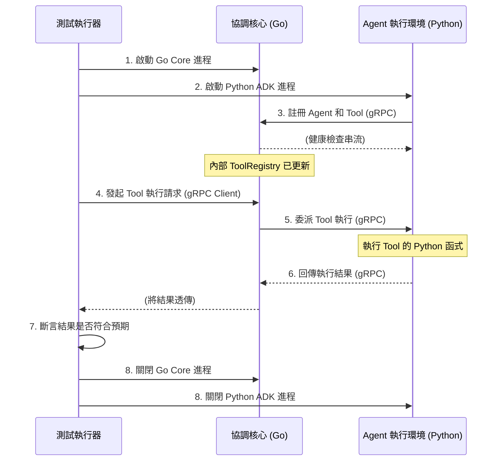
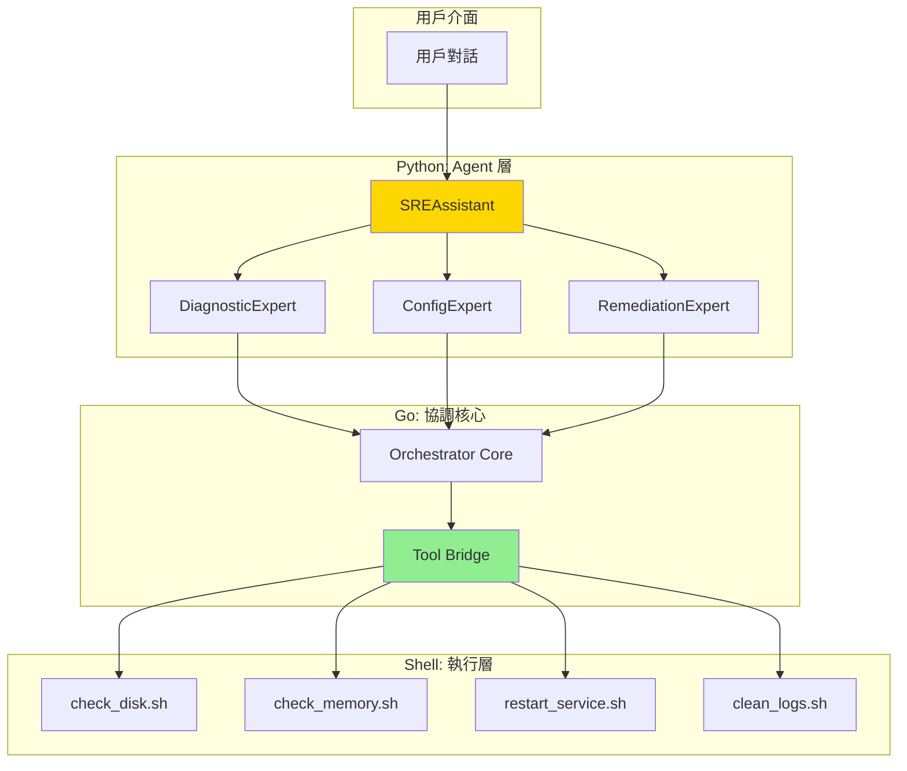

# 開發任務與進度追蹤

> **文檔職責**：記錄當前開發任務、進度狀態和里程碑管理，為開發團隊提供實時的任務執行狀態

## 文檔定位

- **目標受眾**：開發團隊、專案管理者、AI 代理
- **更新頻率**：每日更新
- **版本**：1.0.0
- **最後更新**：2025-08-20

## 文檔關係

```bash
README.md → AGENT.md → ARCHITECTURE.md → SPEC.md → [TASKS.md]
```

**閱讀路徑**：
- **前置閱讀**：[SPEC.md - 技術規格文檔](SPEC.md#技術棧與依賴) - 了解實作細節
- **相關參考**：[AGENT.md - AI協作指南](AGENT.md#工作流程規範) - 任務執行規範
- **架構背景**：[ARCHITECTURE.md - 系統架構](ARCHITECTURE.md#系統架構設計) - 設計決策依據

## 專案狀態概覽

### 當前里程碑
- **階段**：MVP 階段一
- **進度**：Week 1 / 2 週交付  
- **完成度**：
- **狀態**：🟢 **準備交付**
- **預計完成**：2025-08-22

### 關鍵指標
- **任務完成率**：
- **測試覆蓋率**：
- **程式碼品質**：
- **效能指標**：

## MVP 核心交付目標

我們的 MVP 實施路徑將嚴格遵循「**先驗證核心智慧，再擴展整合能力**」的原則，確保平台能夠輕裝上陣，快速演進。

#### **階段一：零依賴核心智慧驗證 (目標：2週)**

參考 [階段一實作：零依賴核心智慧驗證](#階段一實作零依賴核心智慧驗證) 的階段一。

**核心目標**：在**不依賴任何外部系統 (如 K8s, Prometheus)** 的情況下，完整地驗證從 SREAssistant 接收指令，到專家 Agent 決策，再到 協調核心 透過 Tool Bridge 執行 Shell 腳本並返回結果的**端到端閉環**。

**關鍵功能 (Key Features)**:

1. **SREAssistant 核心對話流**: 能夠接收自然語言，並根據意圖路由到指定的專家 Agent。  
2. **專家 Agent 的基礎決策**:  
   * DiagnosticExpert: 能根據關鍵字（如「磁碟」、「記憶體」）選擇對應的診斷工具。  
   * RemediationExpert: 能根據診斷結果，選擇對應的修復工具。  
3. **零依賴工具庫**:  
   * check_disk.sh: 檢查本地磁碟空間。  
   * check_memory.sh: 檢查本地記憶體使用率。  
   * restart_service.sh: 模擬服務重啟（例如 echo "restarting..."）。  
4. **Go Core Tool Bridge**: 協調核心 能夠安全地接收來自 Python Agent 的 Tool 執行請求，並調用對應的 Shell 腳本。  
5. **端到端整合測試**: 提供 make test-e2e 指令，能自動化地完成上述完整流程的驗證。

**驗收標準 (Acceptance Criteria)**:

開發者能夠在本地環境，透過對話介面詢問 SREAssistant：「檢查根目錄的磁碟狀況」，Assistant 能夠成功地驅動 DiagnosticExpert 呼叫 check_disk.sh 工具，並將格式化後的結果回報給使用者。




#### **階段二：生產級整合能力擴展 (目標：1個月)**

參考 [階段二實作：生產級整合能力擴展](#階段二實作生產級整合能力擴展) 的階段二。

**核心目標**：在**不改變任何 Agent 核心決策邏輯**的前提下，透過替換和新增更高階的 Tool，將平台的能力從「本機腳本」無縫升級到「雲原生系統整合」。

**關鍵功能 (Key Features)**:

1. **高階診斷工具**:  
   * 開發 PrometheusTool，其內部封裝 PromQL 查詢邏輯。  
   * 用 PrometheusTool **替換** check_disk.sh 的底層實現。  
2. **高階配置工具**:  
   * 開發 KubernetesTool，封裝對 K8s API Server 的操作。  
   * ObservabilityExpert 可使用此工具自動創建 ServiceMonitor 或 CronJob。  
3. **高階修復工具**:  
   * 擴充 KubernetesTool 或開發 DatabaseTool。  
   * RemediationExpert 可使用此工具執行 rollout restart 或資料庫清理腳本。  
4. **儀表板生成能力**:  
   * 開發 GrafanaTool，基於模板生成儀表板的功能。

**驗收標準 (Acceptance Criteria)**:

1. 當開發者再次詢問「檢查根目錄的磁碟狀況」時，DiagnosticExpert **在程式碼未經修改的情況下**，能夠呼叫新的 PrometheusTool 並從 Prometheus 獲取數據返回。  
2. 開發者可以對 SREAssistant 說「為 auth-service 建立標準儀表板」，ObservabilityExpert 能夠成功在 Grafana 中創建對應的儀表板。

這個兩階段的 MVP 路徑，完美地實踐了**將依賴降到最低、快速驗證核心、平滑優雅進化**的架構哲學。

---

# 階段一實作：零依賴核心智慧驗證

> **從最簡單的 Shell 腳本開始，專注於驗證核心能力**

## 一、架構調整：Shell 腳本優先

### 1.1 極簡架構



## 二、Shell 腳本工具實現

### 2.1 診斷工具腳本

[core/tools/diagnostic/check_disk.sh](core/tools/diagnostic/check_disk.sh)
[core/tools/diagnostic/check_memory.sh](core/tools/diagnostic/check_memory.sh)

### 2.2 配置工具腳本

[core/tools/config/update_config.sh](core/tools/config/update_config.sh)

### 2.3 修復工具腳本

[core/tools/remediation/clean_logs.sh](core/tools/remediation/clean_logs.sh)

## 三、Go 協調核心實現

### 3.1 Tool Bridge 實現

[core/internal/bridge/bridge.go](core/internal/bridge/bridge.go)

### 3.2 gRPC 服務實現

[core/internal/bridge/grpc_server.go](core/internal/bridge/grpc_server.go)

## 四、Python Agent 實現

### 4.1 診斷專家實現

[agents/experts/agent.py](agents/experts/agent.py)

### 4.2 SREAssistant 實現

[agents/sre_assistant/agent.py](agents/sre_assistant/agent.py)

## 五、驗證流程

### 5.1 單元測試驗證

[tests/unit/test_tool_execution.py](tests/unit/test_tool_execution.py)

### 5.2 端到端測試

[tests/e2e/e2e_test.sh](tests/e2e/e2e_test.sh)

## 六、快速啟動指南

### 6.1 一鍵啟動

[Makefile](Makefile)


## 七、核心能力驗證清單

### 7.1 工具執行能力 ✓

- [x] Shell 腳本可獨立執行
- [x] Go Bridge 可調用腳本
- [x] Python Agent 可通過 Bridge 調用
- [x] 結果可正確解析和返回

### 7.2 對話推理能力 ✓

- [ ] 理解自然語言意圖
- [ ] 路由到正確的專家
- [ ] 綜合多個工具結果
- [ ] 生成人性化回應

### 7.3 協作編排能力 ✓

- [ ] 多專家協同工作
- [ ] 工具鏈組合執行
- [ ] 錯誤處理和降級
- [ ] 狀態管理和追蹤

---

# 階段二實作：生產級整合能力擴展

> 等待階段一驗證完成後，再進行規劃階段二。

---

## 測試指令 (Testing Command)

要運行完整的測試套件，請在專案根目錄執行以下指令：

To run the full test suite, execute the following command in the project root:

```bash
make test
```

此命令會自動執行所有後端（Go）、Agent（Python）的單元測試，以及端到端的整合測試，確保所有修改都符合預期。
This command will automatically run all unit tests for the backend (Go), the agent (Python), and the end-to-end integration tests to ensure all modifications work as expected.
