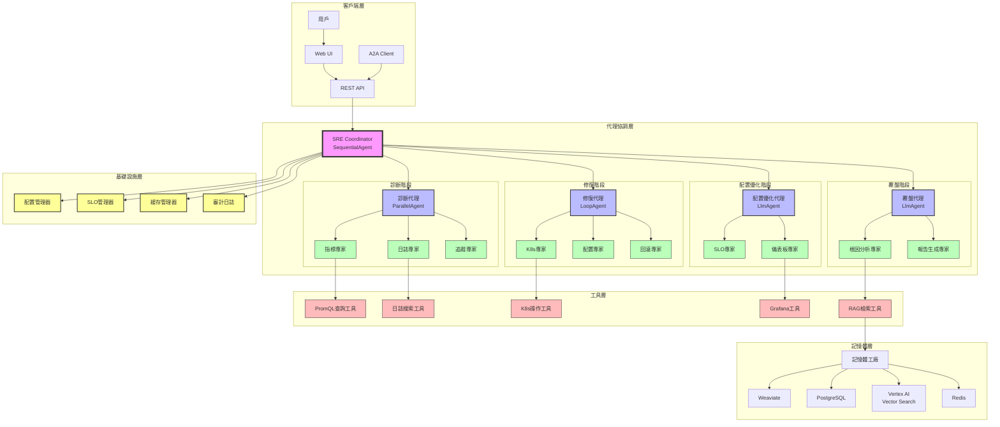
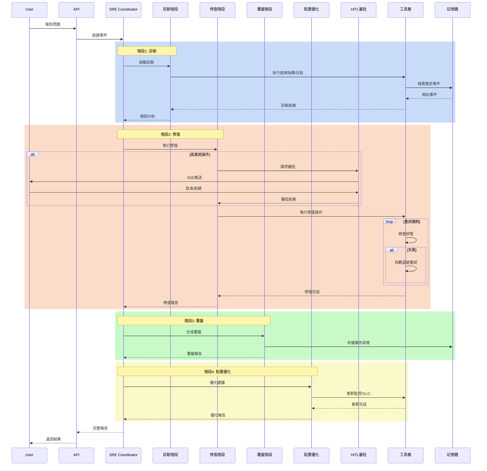
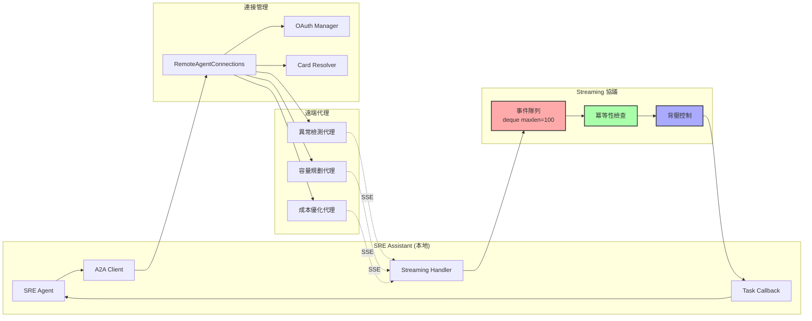
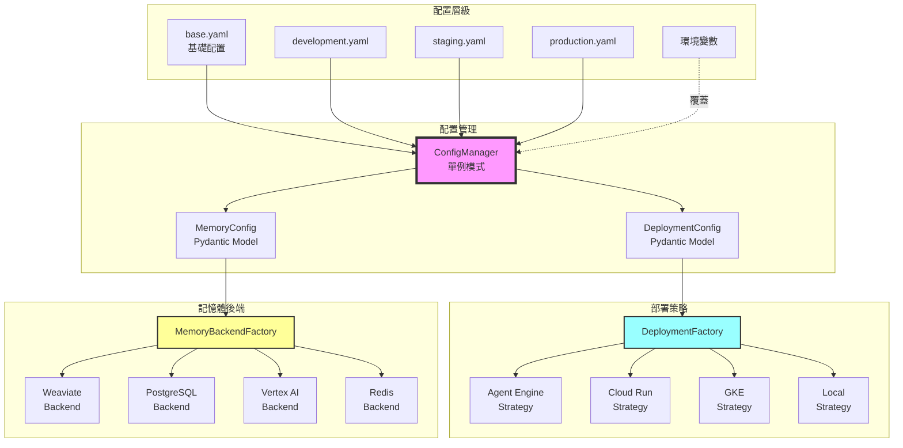
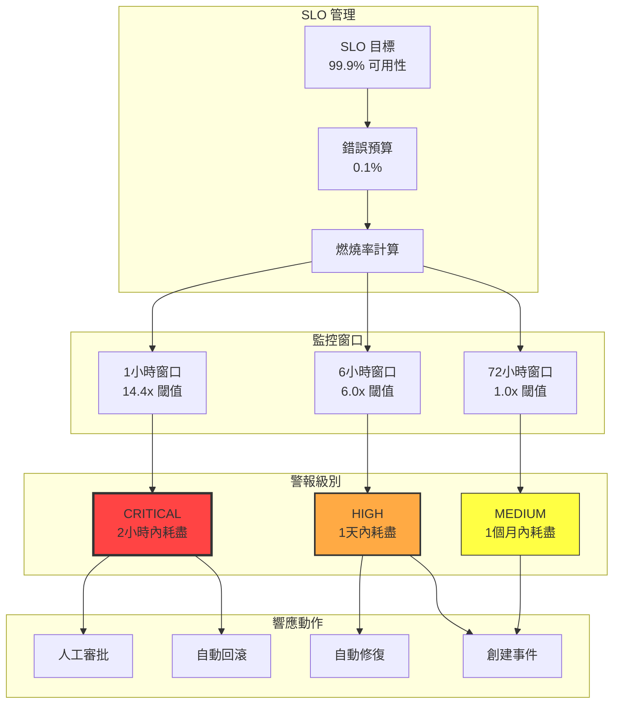
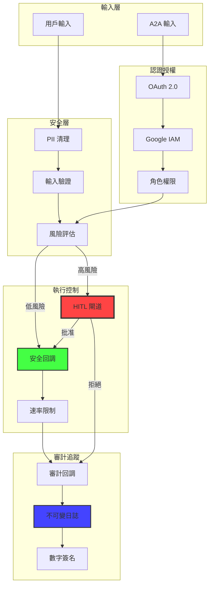
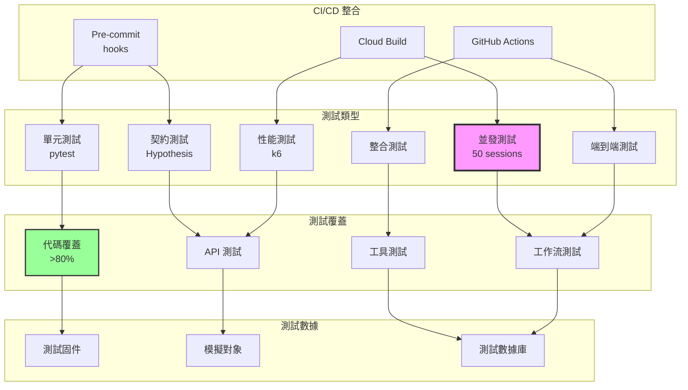

# SRE Assistant 架構圖 (Mermaid)

## 1. 系統整體架構圖



## 2. 工作流程圖



## 3. A2A Streaming 架構圖



## 4. 配置與部署架構圖



## 5. SRE 量化指標管理圖



## 6. 工具版本管理圖

```mermaid
graph LR
    subgraph "版本註冊"
        Registry[VersionedToolRegistry]
        ToolV1[PromQL v2.0.0]
        ToolV2[PromQL v2.1.0]
        ToolV3[K8s v3.0.0]
    end
    
    subgraph "相容性檢查"
        Matrix[相容性矩陣]
        Check[check_compatibility()]
        Fallback[降級策略]
    end
    
    subgraph "環境要求"
        Env1[Prometheus 2.35]
        Env2[Prometheus 2.40]
        K8sEnv[Kubernetes 1.25]
    end
    
    subgraph "版本選擇"
        Selector[版本選擇器]
        Default[默認版本]
        Compatible[相容版本]
    end
    
    Registry --> ToolV1
    Registry --> ToolV2
    Registry --> ToolV3
    
    ToolV1 --> Matrix
    ToolV2 --> Matrix
    ToolV3 --> Matrix
    
    Matrix --> Check
    Check --> Env1
    Check --> Env2
    Check --> K8sEnv
    
    Check --> Selector
    Selector --> Default
    Selector --> Compatible
    Selector --> Fallback
    
    style Registry fill:#9f9,stroke:#333,stroke-width:3px
    style Check fill:#99f,stroke:#333,stroke-width:2px
```

## 7. 安全與審計流程圖



## 8. 測試架構圖



## 總結

這些 Mermaid 圖表完整展示了 SRE Assistant 的：

1. **系統架構**：多層級代理協調設計
2. **工作流程**：四階段順序執行流程
3. **A2A 協議**：完整的 streaming 和連接管理
4. **配置管理**：三層配置和工廠模式
5. **SRE 指標**：錯誤預算和多窗口監控
6. **版本管理**：工具相容性檢查機制
7. **安全審計**：多層安全控制流程
8. **測試架構**：全面的測試覆蓋策略

每個圖表都反映了最新的技術實現，包括所有已解決的技術債務和最佳實踐。