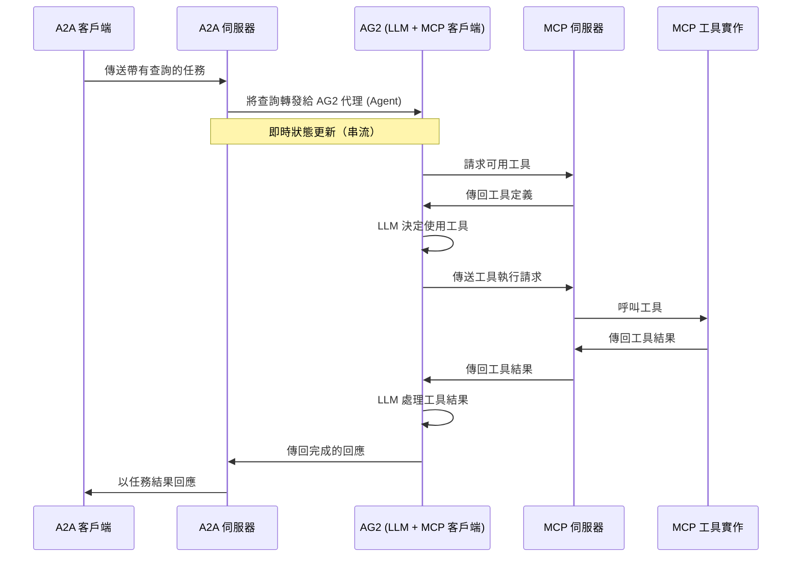

# 具有 A2A 協定的 AG2 MCP 代理 (Agent)

此範例示範了一個使用 [AG2](https://github.com/ag2ai/ag2) 建置並透過 A2A 協定公開的已啟用 MCP 的代理 (Agent)。它展示了不同的代理 (Agent) 框架（LangGraph、CrewAI，以及現在的 AG2）如何使用 A2A 作為通用語言進行通訊。

## 運作方式

此代理 (Agent) 使用 AG2 的 `AssistantAgent` 搭配 MCP (模型上下文協定，Model Context Protocol) 整合來存取各種工具和功能。A2A 協定可實現與代理 (Agent) 的標準化互動，讓客戶端能夠發現並向具有透過 MCP 公開以處理複雜任務之工具的代理 (Agent) 發送請求。



## 主要功能

- **工具存取**：利用各種 MCP 工具處理複雜任務。
- **網頁瀏覽**：存取網頁瀏覽功能。
- **程式碼執行**：執行 Python 程式碼進行資料分析任務。
- **圖片產生**：根據文字描述建立圖片。
- **即時串流**：在處理過程中取得狀態更新。
- **跨框架通訊**：展示 A2A 連接不同代理 (Agent) 框架的能力。

## 先決條件

- Python 3.12 或更高版本
- UV 套件管理器
- OpenAI API 金鑰（用於預設設定）
- MCP YouTube 伺服器（請參閱下方的安裝步驟）

## 設定與執行

1. 安裝 MCP YouTube 伺服器：

    ```bash
    uv tool install git+https://github.com/sparfenyuk/mcp-youtube
    ```

2. 導覽至範例目錄：

    ```bash
    cd samples/python/agents/ag2
    ```

3. 建立包含您的 API 金鑰的環境檔案（使用 `openai gpt-4o`）：

    ```bash
    echo "OPENAI_API_KEY=your_api_key_here" > .env
    ```

4. 執行代理 (Agent)：

    ```bash
    # 在預設通訊埠 10003 上基本執行
    uv run .

    # 在自訂主機/通訊埠上執行
    uv run . --host 0.0.0.0 --port 8080
    ```

5. 在新的終端機中，啟動一個 A2AClient 介面以與遠端 (ag2) 代理 (Agent) 互動。您可以使用以下任一方法：

    - **方法 A：執行 CLI 客戶端**

        從 `samples/python` 目錄：

        ```bash
        cd samples/python
        uv run hosts/cli --agent http://localhost:10003
        ```

    - **方法 B：使用示範網頁 UI**

        此方法使用 `google/gemini-2.0-flash-001` 模型。

        1. 導覽至示範目錄並設定您的環境：

            ```bash
            cd demo/ui
            echo "GOOGLE_API_KEY=your_api_key_here" > .env
            ```

        2. 執行 UI：

            ```bash
            uv run main.py
            ```

        3. 導覽至網頁 UI（通常是 `http://localhost:12000`）並依照下列步驟操作：
            - 點擊 **Agents** 標籤。
            - 新增遠端代理 (Remote Agent)。
            - 輸入代理 (Agent) URL：`localhost:10003`（或您的自訂主機/通訊埠）。
            - 點擊 **Home** 標籤（對話）。
            - 建立並開始一個新對話（`+`）以測試互動。

## 建置容器映像

代理 (Agent) 也可以使用容器檔案來建置和執行。

1. 導覽至 `samples/python` 目錄：

    ```bash
    cd samples/python
    ```

2. 建置容器映像：

    ```bash
    podman build -f agents/ag2/Containerfile . -t ag2-a2a-server
    ```

    > [!TIP]
    > `podman` 是 `docker` 的直接替代品，也可以在這些指令中使用。

3. 執行您的容器：

    ```bash
    podman run -p 10010:10010 -e OPENAI_API_KEY=your_api_key_here ag2-a2a-server
    ```

4. 執行 A2A 客戶端（請遵循上一節的步驟 5，指向容器的通訊埠）。

> [!IMPORTANT]
>
> - **存取 URL：** 您必須透過 URL `0.0.0.0:10010` 存取 A2A 客戶端。使用 `localhost` 將無法運作。
> - **主機名稱覆寫：** 如果您要部署到容器外部主機名稱定義不同的環境中，請使用 `HOST_OVERRIDE` 環境變數來設定代理卡 (Agent Card) 上預期的主機名稱。這可確保與您的用戶端應用程式進行適當的通訊。

## 使用範例

MCP YouTube 伺服器可讓代理 (Agent) 下載 YouTube 影片的隱藏式字幕（注意：不適用於 YouTube Shorts）。您可以嘗試以下範例提示：

```text
總結這段影片：https://www.youtube.com/watch?v=kQmXtrmQ5Zg (Building Agents with Model Context Protocol - Full Workshop with Mahesh Murag of Anthropic)
```

## 技術實作

- **AG2 MCP 整合**：與 MCP 工具套件整合以存取工具。
- **串流支援**：在任務處理期間提供即時更新。
- **A2A 協定整合**：完全符合 A2A 規範。

## 幕後花絮：A2A 通訊

此示範提供兩種不同的介面來與 AG2 代理 (Agent) 互動，兩者都使用 A2A 協定：

### CLI 客戶端（直接互動）

使用 CLI 客戶端時，您可以直接與一個簡單的 A2A 客戶端互動，該客戶端會將請求傳送給 AG2 代理 (Agent)：

```text
使用者 → CLI (A2AClient) → AG2 代理 (Agent)
```

### 網頁 UI（主機代理委派）

使用網頁 UI 時，您會與一個 Google ADK 主機代理 (Agent) 互動，該代理 (Agent) 作為 A2A 客戶端來委派任務：

```text
使用者 → 網頁 UI → ADK 主機代理 (A2A 客戶端) → AG2 代理 (Agent)
```

在這兩種情況下，底層的 A2A 協定通訊如下所示：

```json
POST http://localhost:10003
Content-Type: application/json

{
  "jsonrpc": "2.0",
  "id": 1,
  "method": "message/stream",
  "params": {
    "id": "mcp-task-01",
    "sessionId": "user-session-123",
    "acceptedOutputModes": [
      "text"
    ],
    "message": {
      "role": "user",
      "parts": [
        {
          "type": "text",
          "text": "總結這段影片：https://www.youtube.com/watch?v=kQmXtrmQ5Zg"
        }
      ]
    }
  }
}
```

這種標準化的通訊格式使不同的代理 (Agent) 框架能夠無縫地互通。

如果您想直接透過 `curl` 測試 API：

```bash
curl -X POST http://localhost:10003 \
-H "Content-Type: application/json" \
-d '{"jsonrpc": "2.0", "id": 1, "method": "message/stream", "params": {"id": "mcp-task-01", "sessionId": "user-session-123", "acceptedOutputModes": ["text"], "message": {"role": "user", "parts": [{"type": "text", "text": "總結這段影片：https://www.youtube.com/watch?v=kQmXtrmQ5Zg"}]}}}'
```

注意：此代理 (Agent) 僅支援非同步串流端點 (`message/stream`)。同步端點 (`message/send`) 未實作。

## 了解更多

- [A2A 協定文件](https://google.github.io/A2A/#/documentation)
- [AG2 文件](https://docs.ag2.ai/)
- [MCP 文件](https://modelcontextprotocol.io/introduction)

## 免責聲明

> [!WARNING]
> **所提供的範例程式碼僅供示範之用。** 在建構實際應用程式時，至關重要的是將任何在您直接控制範圍之外運作的代理 (Agent) 視為潛在不受信任的實體。
>
> 所有從外部代理 (Agent) 接收的資料——包括但不限於其 AgentCard、訊息、產物和任務狀態——都應作為不受信任的輸入來處理。舉例來說，一個惡意代理 (Agent) 可能在其 AgentCard 的欄位（例如：`description`、`name`、`skills.description`）中提供經過精心設計的資料。如果這些資料在未經清理的情況下被用來建構大型語言模型 (LLM) 的提示，可能會使您的應用程式遭受提示注入攻擊 (prompt injection attacks)。若未能在使用前對這些資料進行適當的驗證和清理，可能會為您的應用程式帶來安全漏洞。
>
> 開發人員有責任實施適當的安全措施，例如輸入驗證和安全處理憑證，以保護他們的系統和使用者。
