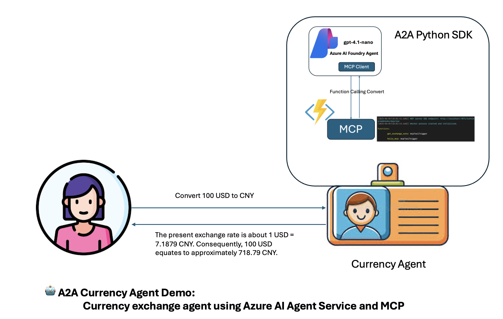

# 🤖 A2A 貨幣代理 (Agent) 示範：使用 Azure AI Agent Service 和 MCP 的貨幣兌換代理 (Agent)

此專案**🏗️ 核心元件：**
- `CurrencyAgent`：處理 Azure AI Foundry 整合的主要代理 (Agent) 類別
- `CurrencyAgentExecutor`：用於處理代理 (Agent) 執行工作流程的 A2A 執行器
- `MCPToolManager`：管理 MCP 工具連線與互動
- `A2AStarletteApplication`：用於 A2A 通訊的網頁伺服器實作



## 📦 主要相依性

### 🔌 MCP 伺服器示範如何使用 Azure AI Foundry Agent Service 和模型上下文協定 (MCP) 服務建立 AI 代理 (Agent)，並與 Google 的代理對代理 (A2A) Python SDK 整合，以建置一個基於 A2A 協定的貨幣兌換代理 (Agent)。

## 📋 專案總覽

此示範展示了多種尖端 AI 技術的整合：

- **🎯 Azure AI Agent Service**：利用 Azure AI Foundry 提供智慧代理 (Agent) 功能
- **🔧 模型上下文協定 (MCP)**：實作標準化的工具通訊協定
- **🤝 Google A2A SDK**：提供代理對代理 (agent-to-agent) 的通訊框架
- **☁️ Azure Functions**：在無伺服器環境中託管 MCP 服务

## 🏗️ 架構

該專案由兩個主要元件組成，它們協同工作以提供貨幣兌換服務：

1. **🔌 MCP 伺服器** (`mcp_server/`)：提供貨幣兌換工具的基於 Azure Functions 的 MCP 服務
2. **💱 貨幣代理 (Currency Agent)** (`currencyagent/`)：使用 Azure AI Foundry SDK 連接到 MCP 服務，並使用 Google A2A Python SDK 建立一個基於 A2A 協定的代理 (Agent)

## 📁 專案結構

```
aiagentdemo/
├── 📄 README.md                           # 簡介
├── 🔌 mcp_server/                         # MCP 服務 (Azure Functions)
│   ├── function_app.py                 # 帶有 MCP 工具的主要 Azure Function 應用程式
│   ├── host.json                       # Azure Functions 主機設定
│   ├── local.settings.json             # 本機開發設定
│   └── requirements.txt                # Azure Functions 的 Python 相依性
└── 💱 currencyagent/                      # 貨幣兌換代理 (Agent)
    ├── __init__.py                     # 套件初始化
    ├── __main__.py                     # 主要進入點和 A2A 伺服器設定
    ├── agent.py                        # 具有 Azure AI Foundry Agent Service SDK 整合的核心 CurrencyAgent 類別
    ├── agent_executor.py               # A2A 代理 (Agent) 執行器實作
    ├── pyproject.toml                  # 專案設定與相依性
    ├── README.md                       # 元件特定文件
    ├── uv.lock                         # 相依性鎖定檔案
    ├── .env.examples                   # 設定您的環境組態，包括 Azure AI Foundry Service 端點、Azure AI Foundry 模型部署、您的 MCP 端點。將此內容複製到 .env
    └── utils/                          # 公用程式模組
        ├── __init__.py                 # Utils 套件初始化
        ├── mcp_tool_manager.py         # MCP 工具管理公用程式
        └── server_connection.py        # 伺服器連線管理
```

## 🔧 元件詳細資料

### 1. 🔌 MCP 伺服器 (Azure Functions)

MCP 伺服器是作為一個 Azure Functions 應用程式實作的，它提供了用於貨幣兌換操作的標準化工具。

**✨ 主要功能：**
- **👋 Hello MCP 工具**：一個用於測試 MCP 連線性的簡單問候函式
- **💰 匯率工具**：使用 Frankfurter API 擷取即時貨幣匯率
- **⚡ 無伺服器架構**：部署在 Azure Functions 上以實現可擴充性和成本效益
- **🔄 標準化協定**：實作 MCP 規範以進行工具通訊

**🛠️ 可用工具：**
- `hello_mcp`：基本連線性測試工具
- `get_exchange_rate`：接受 `currency_from` 和 `currency_to` 參數的貨幣換算工具


**🚀 執行：**

- 在 Docker 中執行您的 Azure Blob 儲存體

```
docker run -p 10000:10000 -p 10001:10001 -p 10002:10002 \                 
    mcr.microsoft.com/azure-storage/azurite
```

- 啟動 Azure Function

```
func start
```

- 使用 VSCode 或 MCP Inspector 測試您的 MCP 服務


### 2. 💱 貨幣代理 (Agent) (Azure AI Foundry + A2A)

貨幣代理 (Agent) 是一個專為貨幣兌換查詢而設計的智慧助理，它使用 Azure AI Foundry Agent Service 建置並與 Google 的 A2A 框架整合。

**✨ 主要功能：**
- **🎯 專門的 AI 代理 (Agent)**：專注於貨幣換算和匯率查詢
- **🔗 Azure AI 整合**：使用 Azure AI Foundry Agent Service 提供智慧回應
- **🔧 MCP 工具整合**：連接到 MCP 伺服器以存取貨幣兌換工具
- **🤝 A2A 框架**：實作 Google 的代理對代理 (Agent-to-Agent) 通訊協定
- **📡 串流回應**：向使用者查詢提供即時串流回應
- **📋 任務管理**：處理任務狀態，包括輸入要求和完成狀態

**🏗️ 核心元件：**
- `CurrencyAgent`：處理 Azure AI Foundry 整合的主要代理 (Agent) 類別
- `CurrencyAgentExecutor`：用於處理代理 (Agent) 執行工作流程的 A2A 執行器
- `MCPToolManager`：管理 MCP 工具連線與互動
- `A2AStarletteApplication`：用於 A2A 通訊的網頁伺服器實作


**🚀 執行：**

- 執行代理 (Agent)

```
uv run .
```

or

```
# 在自訂主機/通訊埠上
uv run . --host 0.0.0.0 --port 8080
```

- 在 Thunder Client VS Code 擴充功能中測試

  - 輸入端點 http://localhost:47128

  - 新增 Post Body

```json
{
  "jsonrpc": "2.0",
  "id": 1,
  "method": "message/send",
  "params": {
    "message": {
      "role": "user",
      "parts": [
        {
          "kind": "text",
          "text": "將 100 美元換算成人民幣"
        }
      ],
      "messageId": "9229e770-767c-417b-a0b0-f0741243c589"
    },
    "metadata": {}
  }
}
```
  - 取得結果


```json
{
  "id": 1,
  "jsonrpc": "2.0",
  "result": {
    "artifacts": [
      {
        "artifactId": "02ba1828-8faa-4e53-8c89-237998c054ae",
        "description": "對代理 (Agent) 的請求結果。",
        "name": "current_result",
        "parts": [
          {
            "kind": "text",
            "text": "目前匯率約為 1 美元 = 7.1879 人民幣。因此，100 美元約為 718.79 人民幣。"
          }
        ]
      }
    ],
    "contextId": "b797cfb0-e94c-4727-ae65-a00de325f395",
    "history": [
      {
        "contextId": "b797cfb0-e94c-4727-ae65-a00de325f395",
        "kind": "message",
        "messageId": "9229e770-767c-417b-a0b0-f0741243c589",
        "parts": [
          {
            "kind": "text",
            "text": "將 100 美元換算成人民幣"
          }
        ],
        "role": "user",
        "taskId": "845b7ceb-5cdb-431f-85e5-0d2129145f3e"
      },
      {
        "contextId": "b797cfb0-e94c-4727-ae65-a00de325f395",
        "kind": "message",
        "messageId": "da1c935b-1366-4e7d-b72d-cf81ea8fbf49",
        "parts": [
          {
            "kind": "text",
            "text": "正在處理您的請求..."
          }
        ],
        "role": "agent",
        "taskId": "845b7ceb-5cdb-431f-85e5-0d2129145f3e"
      },
      {
        "contextId": "b797cfb0-e94c-4727-ae65-a00de325f395",
        "kind": "message",
        "messageId": "45606d7e-40c4-4832-a8c4-d5dc0ae41774",
        "parts": [
          {
            "kind": "text",
            "text": "正在處理資料來源..."
          }
        ],
        "role": "agent",
        "taskId": "845b7ceb-5cdb-431f-85e5-0d2129145f3e"
      }
    ],
    "id": "845b7ceb-5cdb-431f-85e5-0d2129145f3e",
    "kind": "task",
    "status": {
      "state": "completed"
    }
  }
}
```


## 📦 主要相依性

### 🔌 MCP 伺服器
- `azure-functions`：Azure Functions 執行階段
- `httpx`：用於外部 API 呼叫的 HTTP 客戶端

### 💱 貨幣代理 (Agent)
- `a2a-sdk>=0.2.5`：Google 代理對代理 (Agent-to-Agent) SDK
- `azure-ai-agents>=1.0.0`：Azure AI Agent Service SDK
- `azure-ai-projects>=1.0.0b11`：Azure AI Projects SDK
- `azure-identity>=1.23.0`：Azure 驗證
- `mcp>=1.9.2`：模型上下文協定 (Model Context Protocol) 實作
- `starlette>=0.47.0`：用於 A2A 伺服器的網頁框架
- `uvicorn>=0.34.3`：ASGI 伺服器

## 💡 使用情境

此示範非常適合用於了解：

1. **🔧 MCP 實作**：如何使用 Azure Functions 建立和部署 MCP 服務
2. **🎯 Azure AI Agent 整合**：使用 Azure AI Foundry 建置智慧代理 (Agent)
3. **🤝 A2A 通訊**：實作代理對代理 (agent-to-agent) 的通訊協定
4. **🔗 工具整合**：將 AI 代理 (Agent) 與外部工具和服務連接
5. **☁️ 無伺服器 AI 架構**：使用無伺服器技術設計可擴充的 AI 解決方案

## 📚 學習資源

1. **⚡ 適用於 MCP 的 Azure Function Python** [https://learn.microsoft.com/en-us/samples/azure-samples/remote-mcp-functions-python/remote-mcp-functions-python/](https://learn.microsoft.com/en-us/samples/azure-samples/remote-mcp-functions-python/remote-mcp-functions-python/)

2. **🎯 Azure AI Foundry Agent Service** [https://learn.microsoft.com/en-us/azure/ai-services/agents/overview](https://learn.microsoft.com/en-us/azure/ai-services/agents/overview)

3. **🤝 Google A2A** [https://a2a-protocol.org/](https://a2a-protocol.org/)

4. **🐍 Google A2A Python SDK** [https://github.com/a2aproject/a2a-python](https://github.com/a2aproject/a2a-python)
