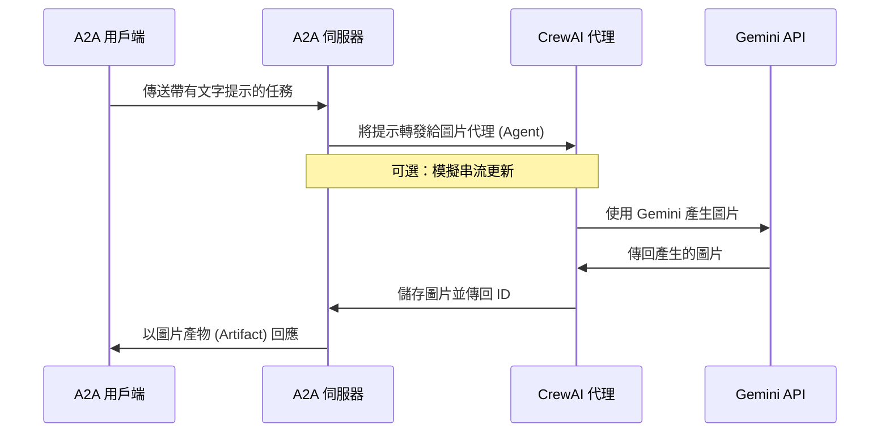

# 使用 A2A 協定的 CrewAI 代理 (Agent)

此範例展示了一個使用 [CrewAI](https://www.crewai.com/open-source) 建立並透過 A2A 協定公開的簡單圖片產生代理 (Agent)。

## 運作方式

此代理 (Agent) 利用 CrewAI 和 Google Gemini API 根據文字提示產生圖片。A2A 協定可與代理 (Agent) 進行標準化互動，允許用戶端傳送請求並接收圖片作為產物 (Artifact)。



## 主要元件

- **CrewAI 代理 (Agent)**：具有專用工具的圖片產生代理 (Agent)
- **A2A 伺服器**：提供與代理 (Agent) 互動的標準化協定
- **圖片產生**：使用 Gemini API 從文字描述建立圖片
- **快取系統**：儲存產生的圖片以供擷取（記憶體內或基於檔案）

## 先決條件

- Python 3.12 或更高版本
- [UV](https://docs.astral.sh/uv/) 套件管理器（建議）
- Google API 金鑰（用於 Gemini 存取）

## 設定與執行

1.  導覽至範例目錄：

    ```bash
    cd samples/python/agents/crewai
    ```

2.  使用您的 API 金鑰（或 Vertex AI 憑證）建立環境檔案：

    ```bash
    echo "GOOGLE_API_KEY=your_api_key_here" > .env
    ```

3.  設定 Python 環境：

    ```bash
    uv python pin 3.13
    uv venv
    source .venv/bin/activate
    ```

4.  使用所需選項執行代理 (Agent)：

    ```bash
    # 基本執行
    uv run .

    # 在自訂主機/連接埠上執行
    uv run . --host 0.0.0.0 --port 8080
    ```

5.  執行 A2A 用戶端：

    在另一個終端機中：

    ```bash
    # 連接到代理 (Agent) (指定具有正確連接埠和主機的代理 URL)
    cd samples/python/hosts/cli
    uv run . --agent http://localhost:10001

    # 如果您在啟動代理 (Agent) 時變更了連接埠，請改用該連接埠
    # uv run . --agent http://localhost:YOUR_PORT
    ```

## 建置容器映像

代理 (Agent) 也可以使用容器檔案建置。

1.  導覽至 `samples/python` 目錄：

    ```bash
    cd samples/python
    ```

2.  建置容器檔案

    ```bash
    podman build -f agents/crewai/Containerfile . -t crewai-a2a-server
    ```

    > [!Tip]
    > Podman 是 `docker` 的直接替代品，也可以在這些指令中使用。

3.  執行您的容器

    ```bash
    podman run -p 10001:10001 -e GOOGLE_API_KEY=your_api_key_here crewai-a2a-server
    ```

4.  執行 A2A 用戶端（請遵循上一節的步驟 5）

> [!Important]
>
> - **存取 URL：** 您必須透過 URL `0.0.0.0:10001` 存取 A2A 用戶端。使用 `localhost` 將無法運作。
> - **主機名稱覆寫：** 如果您要部署到容器外部主機名稱定義不同的環境中，請使用 `HOST_OVERRIDE` 環境變數來設定代理名片 (Agent Card) 上預期的主機名稱。這可確保與您的用戶端應用程式正常通訊。

## 功能與改進

**功能：**

- 使用 Google Gemini 進行文字轉圖片產生
- 支援使用參考來修改現有圖片
- 具有自動重試功能的強大錯誤處理
- 可選的基於檔案的快取持續性
- 改進從查詢中提取產物 (Artifact) ID 的功能

**限制：**

- 沒有真正的串流（CrewAI 本身不支援）
- 有限的代理 (Agent) 互動（沒有多輪對話）

## 了解更多

- [A2A 協定文件](https://a2a-protocol.org)
- [CrewAI 文件](https://docs.crewai.com/introduction)
- [Google Gemini API](https://ai.google.dev/gemini-api)
