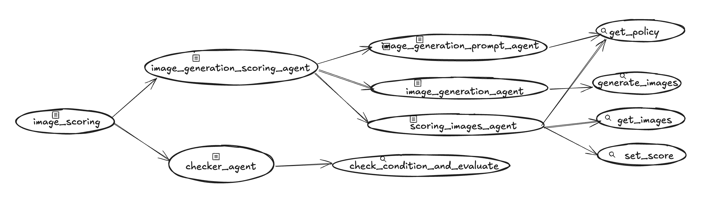

# 圖像評分代理 (Image Scoring Agent)

此代理作為一個自動化的圖像生成與評估系統，專門根據文字描述來建立並驗證圖像，同時遵守預定義的政策。其主要職責是確保生成的圖像符合特定的合規性與品質標準，透過反覆生成與評估圖像，直到滿足政策要求為止。

## 總覽
此代理根據文字描述生成並評估圖像，同時確保符合預定義的政策。其主要目的是作為一個自動化的圖像生成與驗證系統，以維持高品質與政策合規性。

*   使用 Imagen 根據文字描述生成圖像
*   根據一組預定義的政策評估生成的圖像
*   反覆改善不符合政策要求的圖像
*   為每個生成的圖像提供詳細的評分與回饋

這個範例代理讓使用者能根據文字描述生成圖像，同時透過自動化的評估與迭代過程，確保輸出結果符合特定的政策要求。

## 代理詳細資訊

圖像評分代理 (Image Scoring Agent) 的主要功能包括：

| 功能 | 描述 |
| --- | --- |
| **互動類型** | 工作流程 (Workflow) |
| **複雜度**  | 中等 |
| **代理類型**  | 多代理 (Multi Agent) |
| **元件**  | 工具：Imagen、圖像評估工具 (Image Evaluation Tools) |
| **垂直領域**  | 水平 (Horizontal) |

### 代理架構：

此圖表顯示了用於實作此工作流程的代理與工具的詳細架構。

  


## 設定與安裝

1.  **先決條件**

    *   Python 3.11+
    *   Poetry
        *   用於依賴管理與打包。請依照官方
            [Poetry 網站](https://python-poetry.org/docs/) 的說明進行安裝。

        ```bash
        pip install poetry
        ```

    *   一個 Google Cloud Platform 專案
    *   Google Cloud CLI
        *   關於安裝，請依照官方
            [Google Cloud 網站](https://cloud.google.com/sdk/docs/install) 的說明操作。

2.  **安裝**

    ```bash
    # 複製此儲存庫。
    git clone https://github.com/google/adk-samples.git
    cd adk-samples/python/agents/image-scoring
    # 安裝套件與依賴。
    poetry install --with deployment
    ```

3.  **設定**

    *   設定 Google Cloud 憑證。

        *   儲存庫中包含一個 `.env-example` 檔案。請根據您的專案更新此檔案中的
            值，並將其另存為 `.env`。此檔案中的值將被讀取到您應用程式的環境中。

       
    *   驗證您的 GCloud 帳戶。

        ```bash
        gcloud auth application-default login
        gcloud auth application-default set-quota-project $GOOGLE_CLOUD_PROJECT
        ```

## 執行代理

**使用 `adk`**

ADK 提供了便利的方式來在本機啟動代理並與其互動。
以下是您可以要求圖像評分代理 (Image Scoring Agent) 處理的範例請求：

*   `a peaceful mountain landscape at sunset` (一個寧靜的日落山景)
*   `a cat riding a bicycle` (一隻騎腳踏車的貓)

您可以使用 CLI 與代理對話：

```bash
adk run image_scoring
```

或透過網頁介面：

```bash
adk web
```

`adk web` 指令會在您的機器上啟動一個網頁伺服器並印出 URL。
您可以開啟該 URL，在左上角的下拉式選單中選擇 "image_scoring"，
右側將會出現一個聊天機器人介面。對話最初是空白的。


## 部署

圖像評分代理 (Image Scoring Agent) 可以使用以下指令部署到 Vertex AI Agent Engine：

```bash
poetry install --with deployment
poetry run python3 deployment/deploy.py --create
```

部署完成後，將會印出類似這樣的一行：

```
Created remote agent: projects/<PROJECT_NUMBER>/locations/<PROJECT_LOCATION>/reasoningEngines/<AGENT_ENGINE_ID>
```

如果您忘記了 AGENT_ENGINE_ID，可以使用以下指令列出現有的代理：

```bash
poetry run python3 deployment/deploy.py --list
```

若要測試您在 Agent Engine 中部署的代理，您可以執行以下的測試部署腳本。
首先，在部署後，將 `.env` 檔案中的 `<AGENT_ENGINE_ID>` 替換掉。

```bash
python3 deployment/test_deployment.py
```

若要刪除已部署的代理，您可以執行以下指令：

```bash
export AGENT_ENGINE_ID=<AGENT_ENGINE_ID>
poetry run python3 deployment/deploy.py --delete --resource_id=${AGENT_ENGINE_ID}
```

## 評估部署

若要執行評估，請安裝額外的依賴：

```bash
poetry install --with dev
```

然後，可以在 `image_scoring` 目錄下使用 `pytest` 模組執行測試與評估：

```bash
poetry run pytest eval
```

`eval` 是一個如何評估代理的示範，它使用了 ADK 中的
`AgentEvaluator`。它會向 image_scoring 代理發送一個範例請求，
並檢查工具的使用是否如預期。

## 客製化

圖像評分代理 (Image Scoring Agent) 可以被客製化以更好地滿足您的需求。例如：

1.  **政策客製化 (Policy Customization)**：修改政策評估標準以符合您的特定要求與標準。
2.  **圖像生成參數 (Image Generation Parameters)**：調整 Imagen 參數以控制圖像生成的品質與特性。
3.  **評估指標 (Evaluation Metrics)**：新增或修改評估指標以評估生成圖像的不同面向。
4.  **迭代策略 (Iteration Strategy)**：客製化迭代過程以針對圖像品質或政策合規性的特定面向進行優化。

## 子代理與工作流程

圖像評分代理 (Image Scoring Agent) 使用以下子代理實作一個循序的工作流程：

1. **提示生成代理 (Prompt Generation Agent)** (`prompt_agent.py`)
   * 主要職責：根據輸入的文字描述為 Imagen 建立優化的提示
   * 使用 Gemini 模型生成符合政策的提示
   * 輸出的提示會被儲存在會話狀態 (session state) 中以供圖像生成使用

2. **圖像生成代理 (Image Generation Agent)** (`imagen_agent.py`)
   * 主要職責：根據提示使用 Imagen 3.0 生成圖像
   * 設定圖像生成參數 (長寬比、安全過濾器等)
   * 將生成的圖像儲存到 Google Cloud Storage (GCS)
   * 將圖像成品與 GCS URI 儲存在會話狀態 (session state) 中

3. **評分代理 (Scoring Agent)** (`scoring_agent.py`)
   * 主要職責：根據政策規則評估生成的圖像
   * 從 `policy.json` 載入政策規則
   * 分析圖像並為每個政策標準評分 (0-5)
   * 計算總分並將其儲存在會話狀態 (session state) 中
   * 為每個政策規則提供詳細的評分回饋

4. **檢查代理 (Checker Agent)** (`checker_agent.py`)
   * 主要職責：評估生成的圖像是否達到品質門檻
   * 管理迭代次數與最大迭代限制
   * 將總分與設定的門檻 (預設為 10) 進行比較
   * 根據分數或迭代限制控制工作流程的終止


### 工作流程順序
1. 工作流程從提示生成代理 (Prompt Generation Agent) 建立一個優化的提示開始
2. 圖像生成代理 (Image Generation Agent) 使用此提示透過 Imagen 3.0 建立一個圖像
3. 評分代理 (Scoring Agent) 根據政策規則評估生成的圖像
4. 檢查代理 (Checker Agent) 判斷分數是否達到門檻
5. 如果分數低於門檻且未達到最大迭代次數，則重複此過程
6. 當以下任一條件滿足時，工作流程終止：
   * 圖像分數達到或超過門檻
   * 達到最大迭代次數
