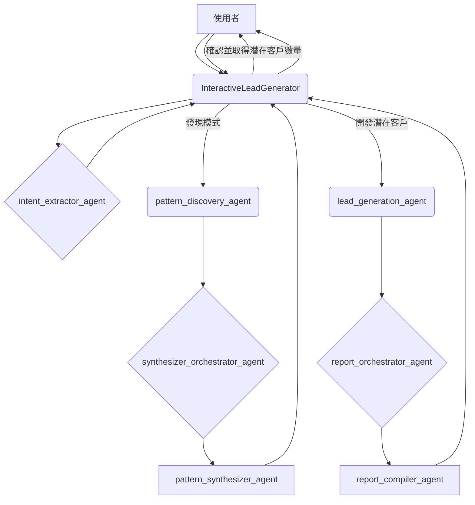
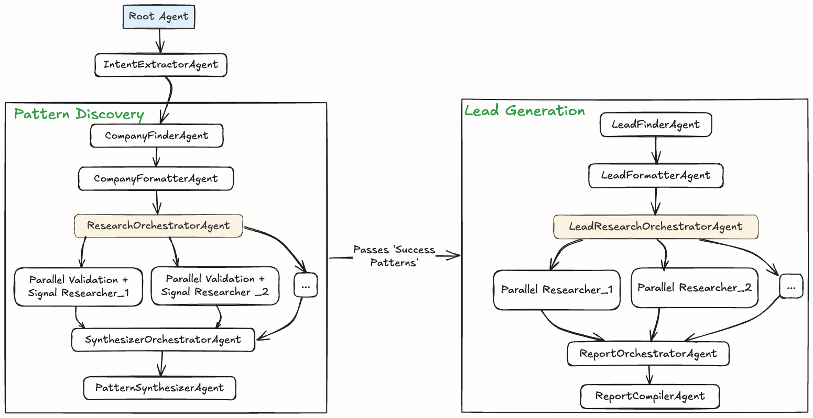

# 互動式潛在客戶開發代理

本專案是一個基於代理框架（agentic framework）建構的進階互動式潛在客戶開發系統。它能智慧地從成功企業中發現投資模式（investment patterns），並利用這些知識在目標市場中識別新的潛在客戶。此代理的設計旨在實現高度互動，允許使用者在關鍵節點引導工作流程並做出重要決策。

## 代理架構：學習與預測

本系統的核心是其代理設計（agentic design），它模仿人類的研究過程，從過去學習並預測未來。工作流程分為兩個主要階段：

1.  **模式發現（學習）：** 代理首先會識別出一組近期在目標市場成功投資的公司。接著，它會研究這些公司，以了解它們的「投資前信號」（pre-investment signals）——即在投資前幾個月所從事的活動。透過綜合這些資訊，代理能發現成功進入市場所需的共同模式與策略。

2.  **潛在客戶開發（預測）：** 一旦使用者發現並核准了這些模式，代理便會利用這些知識尋找目前正展現類似信號的新公司。這種預測性方法使代理能夠識別出可能在不久的將來進行投資的高潛力潛在客戶。

## 互動式工作流程

代理的工作流程設計為高度互動，讓使用者能掌控關鍵決策：

1.  **意圖提取：** 對話由使用者陳述其目標開始（例如：「尋找在泰國的金融科技潛在客戶」）。`intent_extractor_agent` 會解析此請求，以識別目標國家與產業。

2.  **模式發現範圍：** 代理會詢問使用者希望分析多少家公司來發現模式（1-10家）。

3.  **模式審查與確認：** 在 `pattern_discovery_agent` 運行後，發現的模式將呈現給使用者。代理接著會請求確認，以繼續進行潛在客戶開發。

4.  **潛在客戶開發範圍：** 使用者確認後，代理會詢問希望尋找多少位潛在客戶（1-10位）。

5.  **最終報告：** `lead_generation_agent` 會找到要求數量的潛在客戶，並在最終報告中呈現，附上完整的分析與資料來源。

## 架構圖

下圖說明了本系統的邏輯代理架構：



### 高階工作流程



## 元件代理

本系統由一個階層化的專業代理組成，每個代理都有特定的角色：

*   **`InteractiveLeadGenerator` (根代理):** 整個工作流程的主要協調者。它與使用者互動、呼叫適當的子代理，並管理對話的整體狀態。

*   **`intent_extractor_agent`:** 一個專門負責理解使用者初始請求並提取目標國家和產業等關鍵資訊的代理。

*   **`pattern_discovery_agent`:** 一個協調代理，負責管理模式發現流程。它使用一組子代理來尋找和分析成功的公司。
    *   **`company_finder_agent`:** 尋找指定數量的近期在目標市場投資的公司。
    *   **`validator_agent`:** 驗證找到的公司是否符合指定標準（例如：外國公司、近期投資）。
    *   **`signal_searcher_agent`:** 研究已驗證公司的投資前信號。
    *   **`synthesizer_orchestrator_agent`:** 收集並整合研究結果。
    *   **`pattern_synthesizer_agent`:** 分析整合後的研究結果，以識別共同模式和支持來源。

*   **`lead_generation_agent`:** 一個協調代理，負責管理潛在客戶開發流程。它利用發現的模式來尋找新的潛在客戶。
    *   **`lead_finder_agent`:** 尋找指定數量展現出已發現模式的新公司。
    *   **`lead_signal_analyzer_agent`:** 分析新的潛在客戶，以識別他們正在顯示的具體信號。
    *   **`report_orchestrator_agent`:** 收集並整合潛在客戶分析結果。
    *   **`report_compiler_agent`:** 將整合後的結果編譯成一份最終的、易於人類閱讀的報告，附上分析與資料來源。

## 開始使用

### 先決條件

*   Python 3.9+
*   存取 Google ADK 的權限。
*   一個已啟用 Vertex AI API 的 Google Cloud 專案。
*   一個包含必要 API 金鑰與模型設定的環境檔案。

### 安裝

1.  **複製儲存庫：**
    ```bash
    git clone <your-repository-url>
    cd LeadGenerationResearch
    ```

2.  **使用 Poetry 安裝依賴套件：**
    ```bash
    pip install poetry
    poetry install
    ```

3.  **設定您的環境：**
    -   將 `env_example` 檔案複製為一個名為 `.env` 的新檔案：
        ```bash
        cp env_example .env
        ```
    -   編輯 `.env` 檔案，填入您特定的專案 ID 和模型設定。

### 設定

您的 `.env` 檔案應包含以下變數：

```
# 潛在客戶開發代理的環境變數
# 將此檔案複製為 .env 並更新為您的實際值

# Vertex AI 設定 - 必要
GOOGLE_CLOUD_PROJECT="您的專案-id"
GOOGLE_CLOUD_LOCATION="您的地區"
GOOGLE_GENAI_USE_VERTEXAI="True"
GOOGLE_CLOUD_STORAGE_BUCKET="您的-gcs-bucket-名稱"

# 模型設定
# 對於簡單任務使用較快的模型，對於複雜推理使用更進階的模型。
GEN_FAST_MODEL="gemini-1.5-flash"
GEN_ADVANCED_MODEL="gemini-1.5-pro"

# 部署設定
# 已部署代理的 ID，在執行 `python deployment/deploy.py --create` 後返回
REASONING_ENGINE_ID=""
```

### 執行代理

可以使用 Google ADK CLI 從命令列執行代理：

```bash
poetry run adk run
```

這將啟動一個互動式聊天會話，您可以在其中開始潛在客戶開發流程。

### 查詢範例

以下是一些與代理互動的範例：

*   **簡單請求：** "尋找在泰國的金融科技潛在客戶"
*   **更具體的請求：** "我正在尋找近期在越南投資的可再生能源領域的公司。"
*   **直接開發潛在客戶：** "為我尋找5個正在擴展到巴西的SaaS公司的潛在客戶。"
*   **後續問題：** "告訴我更多關於您在印尼電子商務產業中發現的模式。"

## 部署至代理引擎 (Agent Engine)

若要將代理部署到 Google Cloud 代理引擎 (Google Cloud Agent Engine)，您可以使用提供的 `deploy.py` 指令碼。

### 先決條件

*   確保您已通過 Google Cloud 驗證：
    ```bash
    gcloud auth application-default login
    ```
*   確保您的 `.env` 檔案已填入您的 `GOOGLE_CLOUD_PROJECT`、`GOOGLE_CLOUD_LOCATION` 和 `GOOGLE_CLOUD_STORAGE_BUCKET`。

### 部署步驟

1.  **在雲端建立代理：**
    ```bash
    poetry run python deployment/deploy.py --create
    ```
    這將在代理引擎中建立一個新代理，並印出資源名稱。

2.  **列出代理：**
    ```bash
    poetry run python deployment/deploy.py --list
    ```
    這將列出您專案中的所有代理。

3.  **刪除代理：**
    ```bash
    poetry run python deployment/deploy.py --delete --resource_id <your-agent-resource-id>
    ```
    這將刪除指定的代理。

### 測試已部署的代理

代理部署完成後，您可以使用 `test_deploy.py` 指令碼進行測試。

1.  **更新您的 `.env` 檔案：**
    -   執行 `deploy.py --create` 指令碼後，複製返回的資源 ID。
    -   將該 ID 貼到您 `.env` 檔案的 `REASONING_ENGINE_ID` 欄位中。

2.  **執行測試指令碼：**
    ```bash
    poetry run python deployment/test_deploy.py
    ```

這將與您已部署的代理啟動一個互動式聊天會話。

## 發布至 AgentSpace

將代理部署到代理引擎後，您可以將其發布到您的 AgentSpace，讓使用者可以使用。

### 先決條件

*   您已使用 `deploy.py` 指令碼成功部署您的代理。
*   您已在您的 AgentSpace 中建立了一個應用程式並擁有應用程式 ID。

### 發布步驟

1.  **更新您的 `.env` 檔案：**
    -   開啟您的 `.env` 檔案。
    -   新增一個名為 `AGENT_SPACE_ID` 的新變數，並將其設定為您在 AgentSpace 中建立的應用程式 ID。

2.  **執行指令碼：**
    ```bash
    bash publish/publish.sh
    ```

這會將您的代理發布到指定的 AgentSpace。