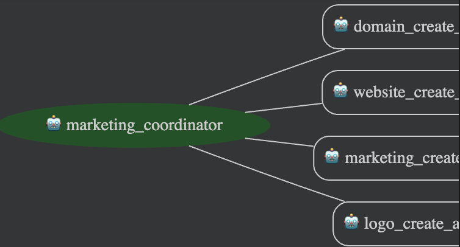

# 行銷代理 (Marketing Agency)


## 總覽

這個由人工智慧驅動的助理旨在增強創意代理在推出新網站或產品時的能力。流程始於一個智慧代理，它會引導使用者選擇最佳的 DNS 網域，確保其與網站主題或產品識別完美對齊。在這個基礎步驟之後，另一個專門的代理將接手，協助全面建立整個網站。隨後，會部署一個專門的代理來產生全套的行銷材料。工作流程的最後，由一個專注於設計與專案核心主題一致的獨特標誌的代理來完成。這個多代理系統旨在簡化並增強代理在整個推出生命週期中的創意產出。

## 代理詳細資訊

行銷代理 (Marketing Agency) 的主要功能包括：

| 功能 | 描述 |
| --- | --- |
| **互動類型** | 對話式 (Conversational) |
| **複雜度**  | 中等 |
| **代理類型**  | 多代理 (Multi Agent) |
| **元件**  | 工具：內建 Google 搜尋 |
| **垂直領域**  | 行銷 (Marketing) |


### 代理架構：

此圖表顯示了用於實作此工作流程的代理與工具的詳細架構。


## 設定與安裝

1.  **先決條件**

    *   Python 3.11+
    *   Poetry
        *   用於依賴管理與打包。請依照官方
            [Poetry 網站](https://python-poetry.org/docs/) 的說明進行安裝。

        ```bash
        pip install poetry
        ```

    *   一個 Google Cloud Platform 專案
    *   Google Cloud CLI
        *   關於安裝，請依照官方
            [Google Cloud 網站](https://cloud.google.com/sdk/docs/install) 的說明操作。

2.  **安裝**

    ```bash
    # 複製此儲存庫。
    git clone https://github.com/google/adk-samples.git
    cd adk-samples/python/agents/marketing-agency
    # 安裝套件與依賴。
    poetry install
    ```

3.  **設定**

    *   設定 Google Cloud 憑證。

        *   您可以在您的 shell 中設定以下環境變數，或改用一個
            `.env` 檔案。

        ```bash
        export GOOGLE_GENAI_USE_VERTEXAI=true
        export GOOGLE_CLOUD_PROJECT=<your-project-id>
        export GOOGLE_CLOUD_LOCATION=<your-project-location>
        export GOOGLE_CLOUD_STORAGE_BUCKET=<your-storage-bucket>  # 僅在 Agent Engine 上部署時需要
        ```

    *   驗證您的 GCloud 帳戶。

        ```bash
        gcloud auth application-default login
        gcloud auth application-default set-quota-project $GOOGLE_CLOUD_PROJECT
        ```

## 執行代理

**使用 `adk`**

ADK 提供了便利的方式來在本機啟動代理並與其互動。
您可以使用 CLI 與代理對話：

```bash
adk run marketing_agency
```

或透過網頁介面：

```bash
 adk web
```

`adk web` 指令會在您的機器上啟動一個網頁伺服器並印出 URL。
您可以開啟該 URL，在左上角的下拉式選單中選擇 "marketing_agency"，
右側將會出現一個聊天機器人介面。對話最初是空白的。
以下是您可以要求行銷代理 (Marketing Agency) 驗證的一些範例請求：

```
who are you
```

這些請求的範例回應如下方的 [範例互動](#範例互動) 章節所示。

```
我是一位行銷專家，我的目標是幫助您建立強大的線上形象並有效地與您的受眾建立聯繫。我將引導您定義您的數位身份，從選擇完美的網域名稱和打造專業網站，到策劃線上行銷活動、設計令人難忘的標誌，以及創作引人入勝的短片。

哪些關鍵字與您的品牌相關？我將用它們來建議一些網域名稱。
```

### 範例互動

以下是與行銷代理 (Marketing Agency) 的範例互動。請注意，代理的確切輸出每次可能會不同。

```
user: who are you (你是誰)

我是一位行銷專家，我的目標是幫助您建立強大的線上形象並有效地與您的受眾建立聯繫。我將引導您定義您的數位身份，從選擇完美的網域名稱和打造專業網站，到策劃線上行銷活動、設計令人難忘的標誌，以及創作引人入勝的短片。

help me to find the perfect domain (幫我找到完美的網域)

好的，我可以幫忙！首先，請告訴我一些與您的品牌相關的關鍵字。例如，如果您銷售手工珠寶，關鍵字可能是「手工」、「珠寶」、「工匠」、「獨特」、「禮物」。

user: i want to sell cakes organic cakes (我想賣蛋糕 有機蛋糕)

太好了！我將使用「有機」和「蛋糕」作為關鍵字，為您尋找一些網域名稱選項。

domain_create_agent tool reported: {'result': '1. PureOrganicBakes.com\n2. EarthlyCakes.com\n3. Organocake.com\n4. FarmFreshCakes.com\n5. ArtisanOrganicCakes.com\n6. SimplyOrganicCakes.com\n7. TrueOrganicBaking.com\n8. GoldenOrganicCakes.com\n9. BloomOrganicCakes.com\n10. PetalOrganicCakes.com'}

根據您的關鍵字，這裡有一些可用的網域名稱：

PureOrganicBakes.com
EarthlyCakes.com
Organocake.com
FarmFreshCakes.com
ArtisanOrganicCakes.com
SimplyOrganicCakes.com
TrueOrganicBaking.com
GoldenOrganicCakes.com
BloomOrganicCakes.com
PetalOrganicCakes.com
請檢視此列表，並告訴我您想選擇哪個網域名稱。

user: let's go go 9 i love it (我選第9個 我喜歡它)

絕佳的選擇！"BloomOrganicCakes.com" 聽起來很可愛。

接下來，我們將為您選擇的網域打造一個專業的網站。

website_create_agent tool reported: {'result': "To proceed with website creation, please obtain the following missing essential information from the user:\n\n* Brand/Project Name (Please confirm if 'Bloom Organic Cakes', derived from the domain 'BloomOrganicCakes.com', is the correct brand name to be displayed. If not, please provide the official Brand/Project Name.)\n* Primary Goal/Purpose of the Website (e.g., 'Showcase handmade organic cakes and attract local customers,' 'Facilitate online orders and inquiries for custom organic cakes,' 'Build brand awareness for our organic bakery.')\n* Key services, products, or information to be featured (e.g., 'Specific types of cakes offered (wedding, birthday, cupcakes, vegan, gluten-free), information about organic ingredients, a gallery of cake designs, pricing tiers, how to order, baking philosophy.')"}

在我們建立網站之前，我需要更多資訊：

品牌/專案名稱：我們應該使用從您的網域衍生的 "Bloom Organic Cakes" 作為網站上顯示的品牌名稱，還是您有偏好的官方品牌/專案名稱？
網站的主要目標/目的：您希望您的網站達成的主要目標是什麼？例如，是為了展示您的蛋糕並吸引當地客戶、接受線上訂單，還是建立品牌知名度？
要展示的主要服務、產品或資訊：您希望在網站上突顯的最重要的東西是什麼？這可能包括您提供的特定類型的蛋糕（如婚禮蛋糕、生日蛋糕、杯子蛋糕、素食選項、無麩質選項）、關於您有機成分的詳細資訊、您的蛋糕設計圖庫、定價資訊、如何訂購，或您的烘焙理念。
一旦我有了這些詳細資訊，我就可以指示網站建立工具。

The Brand is "Antonio's perfect cakes" the primary target is young generation for 20 years old and i need an image gallery and a shopping gallery (品牌是 "Antonio's perfect cakes"，主要目標是20歲的年輕一代，我需要一個圖片庫和一個購物庫)

好的，感謝您提供的資訊！所以品牌名稱是 "Antonio's perfect cakes"，網站應針對年輕受眾（約20歲），並包含一個圖片庫和一個購物庫。

我們將使用您之前選擇的網域 "BloomOrganicCakes.com"。

user: show me the answer detailed (給我看詳細的答案)

website_create_agent tool reported: {'result': 'Okay, I will now generate the HTML, CSS, and JavaScript for the "Antonio's Perfect Cakes" website, designed for BloomOrganicCakes.com, targeting a young audience and featuring an image gallery and a shopping gallery.\n\nHere's the file structure:\n* index.html (Homepage)\n* gallery.html (Image Gallery)\n* shop.html (Shopping Gallery / Our Cakes)\n* about.html (About Us)\n* contact.html (Contact & Orders)\n* style.css (Stylesheet)\n* script.js (JavaScript for mobile menu)\n\n---\nindex.html\n

html\n<!DOCTYPE html>\n<html lang="en">\n<head>\n <meta charset="UTF-8">\n <meta name="viewport" content="width=device-width, initial-scale=1.0">\n <title>Antonio\'s Perfect Cakes - Organic Delights</title>\n <link rel="stylesheet" href="style.css">\n <link href="https://fonts.googleapis.com/css2?family=Poppins:wght@700&family=Lato:wght@400;700&display=swap" rel="stylesheet">\n</head>\n<body>\n <header>\n <div class="container">\n <a href="index.html" class="logo">Antonio\'s Perfect Cakes</a>\n <nav>\n <button class="nav-toggle" aria-label="toggle navigation">\n <span class="hamburger"></span>\n </button>\n <ul class="nav-links">\n <li><a href="index.html" class="active">Home</a></li>\n <li><a href="shop.html">Our Cakes</a></li>\n <li><a href="gallery.html">Gallery</a></li>\n <li><a href="about.html">About</a></li>\n <li><a href="contact.html">Contact/Order</a></li>\n </ul>\n </nav>\n </div>\n </header>\n\n <main>\n <section class="hero">\n <div class="hero-content container">\n <h1>Baked with Love, Designed for You!</h1>\n <p>Discover Antonio\'s stunning organic cakes, perfect for every celebration. Fresh ingredients, vibrant designs.</p>\n <a href="shop.html" class="btn btn-primary">Explore Our Cakes</a>\n </div>\n </section>\n\n <section class="featured-cakes section-padding">\n <div class="container">\n <h2>Our Signature Bakes</h2>\n <p class="section-intro">A taste of what we offer. Each cake is a masterpiece of flavor and art.</p>\n <div class="grid-3">\n <!-- Featured Cake 1 -->\n <div class="card">\n \n <h3>Chocolate Dream Cake</h3>\n <p>[Short description of the Chocolate Dream Cake - e.g., Rich organic cocoa, velvety smooth ganache.]</p>\n <a href="shop.html#chocolate-dream" class="btn btn-secondary">View Details</a>\n </div>\n <!-- Featured Cake 2 -->\n <div class="card">\n \n <h3>Berry Bliss Celebration</h3>\n <p>[Short description of the Berry Bliss Cake - e.g., Light sponge with fresh organic berries and cream.]</p>\n <a href="shop.html#berry-bliss" class="btn btn-secondary">View Details</a>\n </div>\n <!-- Featured Cake 3 -->\n <div class="card">\n \n <h3>Your Custom Creation</h3>\n <p>[Short description about custom cakes - e.g., Tell us your dream, we\'ll bake it into reality!]</p>\n <a href="contact.html" class="btn btn-secondary">Design Yours</a>\n </div>\n </div>\n </div>\n </section>\n\n <section class="why-organic section-padding bg-light">\n <div class="container">\n <h2>Why Organic? Why Antonio\'s?</h2>\n <div class="flex-container">\n <div class="flex-item">\n \n </div>\n <div class="flex-item">\n <h3>Pure Ingredients, Pure Joy</h3>\n <p>[Elaborate on your commitment to organic ingredients. E.g., We believe the best cakes start with the best ingredients. That\'s why we source certified organic flours, sugars, eggs, and fruits. Taste the difference quality makes!]</p>\n <h3>Artistry in Every Slice</h3>\n <p>[Talk about the design and appeal to a younger audience. E.g., Cakes that don\'t just taste amazing but look incredible too! Perfect for your Insta-worthy moments.]</p>\n </div>\n </div>\n </div>\n </section>\n\n <section class="gallery-teaser section-padding">\n <div class="container">\n <h2>A Peek into Our Gallery</h2>\n <p class="section-intro">Get inspired by some of our favorite cake designs.</p>\n <div class="grid-4">\n <!-- Gallery Teaser Image 1 -->\n \n <!-- Gallery Teaser Image 2 -->\n \n <!-- Gallery Teaser Image 3 -->\n \n <!-- Gallery Teaser Image 4 -->\n \n </div>\n <div style="text-align: center; margin-top: 20px;">\n <a href="gallery.html" class="btn btn-primary">View Full Gallery</a>\n </div>\n </div>\n </section>\n\n <section class="cta section-padding">\n <div class="container">\n <h2>Got a Special Occasion?</h2>\n <p>Let\'s bake something amazing together! Tell us about your event and cake ideas.</p>\n <a href="contact.html" class="btn btn-secondary">Order Your Custom Cake</a>\n </div>\n </section>\n </main>\n\n <footer>\n <div class="container">\n <div class="footer-content">\n <div class="footer-social">\n <p>Follow us:</p>\n <!-- Replace # with your actual social media links -->\n <a href="#" aria-label="Facebook"></a>\n <a href="#" aria-label="Instagram"></a>\n <a href="#" aria-label="Pinterest"></a>\n </div>\n <p>&copy; <span id="currentYear"></span> Antonio\'s Perfect Cakes | BloomOrganicCakes.com</p>\n </div>\n </div>\n </footer>\n\n <script src="script.js"></script>\n</body>\n</html>\n

\n\n---\ngallery.html\n

html\n<!DOCTYPE html>\n<html lang="en">\n<head>\n <meta charset="UTF-8">\n <meta name="viewport" content="width=device-width, initial-scale=1.0">\n <title>Cake Gallery - Antonio\'s Perfect Cakes</title>\n <link rel="stylesheet" href="style.css">\n <link href="https://fonts.googleapis.com/css2?family=Poppins:wght@700&family=Lato:wght@400;700&display=swap" rel="stylesheet">\n</head>\n<body>\n <header>\n <div class="container">\n <a href="index.html" class="logo">Antonio\'s Perfect Cakes</a>\n <nav>\n <button class="nav-toggle" aria-label="toggle navigation">\n <span class="hamburger"></span>\n </button>\n <ul class="nav-links">\n <li><a href="index.html">Home</a></li>\n <li><a href="shop.html">Our Cakes</a></li>\n <li><a href="gallery.html" class="active">Gallery</a></li>\n <li><a href="about.html">About</a></li>\n <li><a href="contact.html">Contact/Order</a></li>\n </ul>\n </nav>\n </div>\n </header>\n\n <main>\n <section class="page-header section-padding">\n <div class="container">\n <h1>Our Cake Creations</h1>\n <p>Feast your eyes on some of our most loved designs. Get inspired for your next event!</p>\n </div>\n </section>\n\n <section class="gallery-grid section-padding">\n <div class="container">\n <h2>Cake Artistry Showcase</h2>\n <div class="grid-3 gallery-items">\n <!-- Image 1 -->\n <div class="gallery-item">\n \n <p class="caption">[Caption for Elegant Celebration Cake - e.g., Perfect for anniversaries]</p>\n </div>\n <!-- Image 2 -->\n <div class="gallery-item">\n \n <p class="caption">[Caption for Fun Birthday Cake - e.g., Kids\' favorite character cake]</p>\n </div>\n <!-- Image 3 -->\n <div class="gallery-item">\n \n <p class="caption">[Caption for Beautiful Wedding Cake - e.g., Multi-tiered floral design]</p>\n </div>\n <!-- Image 4 -->\n <div class="gallery-item">\n \n <p class="caption">[Caption for Cupcakes - e.g., A vibrant assortment for parties]</p>\n </div>\n <!-- Image 5 -->\n <div class="gallery-item">\n \n <p class="caption">[Caption for Modern Cake - e.g., Geometric patterns, bold colors]</p>\n </div>\n <!-- Image 6 -->\n <div class="gallery-item">\n \n <p class="caption">[Caption for Themed Cake - e.g., Super-hero themed delight]</p>\n </div>\n <!-- Add more gallery items as needed -->\n <!-- Example:\n <div class="gallery-item">\n \n <p class="caption">[Another amazing cake design description]</p>\n </div>\n -->\n </div>\n <p style="margin-top: 20px; text-align: center;">[Feel free to add more images! We recommend high-quality photos of your best cakes.]</p>\n </div>\n </section>\n </main>\n\n <footer>\n <div class="container">\n <div class="footer-content">\n <div class="footer-social">\n <p>Follow us:</p>\n <a href="#" aria-label="Facebook"></a>\n <a href="#" aria-label="Instagram"></a>\n <a href="#" aria-label="Pinterest"></a>\n </div>\n <p>&copy; <span id="currentYear"></span> Antonio\'s Perfect Cakes | BloomOrganicCakes.com</p>\n </div>\n </div>\n </footer>\n\n <script src="script.js"></script>\n</body>\n</html>\n

\n\n---\nshop.html (Our Cakes / Shopping Gallery)\n

html\n<!DOCTYPE html>\n<html lang="en">\n<head>\n <meta charset="UTF-8">\n <meta name="viewport" content="width=device-width, initial-scale=1.0">\n <title>Our Cakes - Antonio\'s Perfect Cakes</title>\n <link rel="stylesheet" href="style.css">\n <link href="https://fonts.googleapis.com/css2?family=Poppins:wght@700&family=Lato:wght@400;700&display=swap" rel="stylesheet">\n</head>\n<body>\n <header>\n <div class="container">\n <a href="index.html" class="logo">Antonio\'s Perfect Cakes</a>\n <nav>\n <button class="nav-toggle" aria-label="toggle navigation">\n <span class="hamburger"></span>\n </button>\n <ul class="nav-links">\n <li><a href="index.html">Home</a></li>\n <li><a href="shop.html" class="active">Our Cakes</a></li>\n <li><a href="gallery.html">Gallery</a></li>\n <li><a href="about.html">About</a></li>\n <li><a href="contact.html">Contact/Order</a></li>\n </ul>\n </nav>\n </div>\n </header>\n\n <main>\n <section class="page-header section-padding">\n <div class="container">\n <h1>Browse Our Cakes</h1>\n <p>Find the perfect organic cake for your next occasion. All cakes are customizable!</p>\n </div>\n </section>\n\n <section class="shop-grid section-padding">\n <div class="container">\n <h2>Signature & Seasonal Cakes</h2>\n <div class="grid-3 product-cards">\n <!-- Product 1 -->\n <div class="card product-card" id="chocolate-dream">\n \n <h3>Gourmet Chocolate Fudge</h3>\n <p class="price">[Starting from $XX.XX]</p>\n <p>[Detailed description: e.g., Layers of rich, dark organic chocolate cake with a decadent fudge frosting. A true chocoholic\'s dream.]</p>\n <a href="contact.html?cake=Gourmet Chocolate Fudge" class="btn btn-primary">Inquire to Order</a>\n </div>\n <!-- Product 2 -->\n <div class="card product-card" id="berry-bliss">\n \n <h3>Fresh Strawberry Swirl</h3>\n <p class="price">[Starting from $XX.XX]</p>\n <p>[Detailed description: e.g., Light vanilla bean sponge, layered with fresh organic strawberries and a light cream cheese frosting.]</p>\n <a href="contact.html?cake=Fresh Strawberry Swirl" class="btn btn-primary">Inquire to Order</a>\n </div>\n <!-- Product 3 -->\n <div class="card product-card">\n \n <h3>Zesty Lemon Delight</h3>\n <p class="price">[Starting from $XX.XX]</p>\n <p>[Detailed description: e.g., Tangy and sweet organic lemon cake with a delicate lemon glaze. Refreshingly light.]</p>\n <a href="contact.html?cake=Zesty Lemon Delight" class="btn btn-primary">Inquire to Order</a>\n </div>\n <!-- Product 4 -->\n <div class="card product-card">\n \n <h3>Vegan Velvet Dream (Vegan)</h3>\n <p class="price">[Starting from $XX.XX]</p>\n <p>[Detailed description: e.g., Our popular red velvet cake, made completely vegan with organic plant-based ingredients. Deliciously moist.]</p>\n <a href="contact.html?cake=Vegan Velvet Dream" class="btn btn-primary">Inquire to Order</a>\n </div>\n <!-- Product 5 -->\n <div class="card product-card">\n \n <h3>Classic Carrot Cake</h3>\n <p class="price">[Starting from $XX.XX]</p>\n <p>[Detailed description: e.g., Spiced organic carrot cake with walnuts and a traditional cream cheese frosting.]</p>\n <a href="contact.html?cake=Classic Carrot Cake" class="btn btn-primary">Inquire to Order</a>\n </div>\n <!-- Product 6 -->\n <div class="card product-card">\n \n <h3>Your Custom Masterpiece</h3>\n <p class="price">[Price Varies]</p>\n <p>[Detailed description: e.g., Have a unique idea? We love creating custom cakes! Share your vision with us.]</p>\n <a href="contact.html?cake=Custom Masterpiece" class="btn btn-primary">Design Your Cake</a>\n </div>\n <!-- Add more product cards as needed -->\n </div>\n <p style="margin-top: 30px; text-align: center;">[Remember to update cake names, descriptions, prices, and images with your actual offerings!]</p>\n </div>\n </section>\n </main>\n\n <footer>\n <div class="container">\n <div class="footer-content">\n <div class="footer-social">\n <p>Follow us:</p>\n <a href="#" aria-label="Facebook"></a>\n <a href="#" aria-label="Instagram"></a>\n <a href="#" aria-label="Pinterest"></a>\n </div>\n <p>&copy; <span id="currentYear"></span> Antonio\'s Perfect Cakes | BloomOrganicCakes.com</p>\n </div>\n </div>\n </footer>\n\n <script src="script.js"></script>\n</body>\n</html>\n

\n\n---\nabout.html\n

html\n<!DOCTYPE html>\n<html lang="en">\n<head>\n <meta charset="UTF-8">\n <meta name="viewport" content="width=device-width, initial-scale=1.0">\n <title>About Us - Antonio\'s Perfect Cakes</title>\n <link rel="stylesheet" href="style.css">\n <link href="https://fonts.googleapis.com/css2?family=Poppins:wght@700&family=Lato:wght@400;700&display=swap" rel="stylesheet">\n</head>\n<body>\n <header>\n <div class="container">\n <a href="index.html" class="logo">Antonio\'s Perfect Cakes</a>\n <nav>\n <button class="nav-toggle" aria-label="toggle navigation">\n <span class="hamburger"></span>\n </button>\n <ul class="nav-links">\n <li><a href="index.html">Home</a></li>\n <li><a href="shop.html">Our Cakes</a></li>\n <li><a href="gallery.html">Gallery</a></li>\n <li><a href="about.html" class="active">About</a></li>\n <li><a href="contact.html">Contact/Order</a></li>\n </ul>\n </nav>\n </div>\n </header>\n\n <main>\n <section class="page-header section-padding">\n <div class="container">\n <h1>Meet Antonio & Our Story</h1>\n <p>The passion behind every perfect cake.</p>\n </div>\n </section>\n\n <section class="about-content section-padding">\n <div class="container">\n <div class="flex-container about-section">\n <div class="flex-item">\n \n </div>\n <div class="flex-item">\n <h2>Hi, I\'m Antonio!</h2>\n <p>[Insert Antonio\'s story here. E.g., From a young age, I found joy in the warmth of the kitchen and the magic of baking. My journey started with simple family recipes, evolving into a deep passion for creating edible art. For me, a cake isn\'t just a dessert; it\'s a centerpiece of celebration, a carrier of joy, and a delicious memory in the making.]</p>\n <p>[Continue the story. E.g., I founded \'Antonio\'s Perfect Cakes\' with a commitment to using only the finest organic ingredients because I believe that what goes into our bodies matters. My mission is to craft cakes that are not only visually stunning but also bursting with natural, wholesome flavor.]</p>\n </div>\n </div>\n\n <div class="our-philosophy section-padding bg-light">\n <h2>Our Philosophy: Organic, Artistic, Yours</h2>\n <div class="grid-3">\n <div>\n \n <h3>Purely Organic</h3>\n <p>[Describe your commitment to organic. E.g., We use certified organic ingredients to ensure every bite is pure, wholesome, and environmentally conscious. No artificial stuff, just real goodness.]</p>\n </div>\n <div>\n \n <h3>Artistically Crafted</h3>\n <p>[Describe your design approach. E.g., Each cake is a canvas. We love to play with modern designs, vibrant colors, and personalized touches to create something truly unique for you.]</p>\n </div>\n <div>\n \n <h3>Made for You</h3>\n <p>[Describe customer focus. E.g., Your vision is our inspiration. We work closely with you to bring your dream cake to life, ensuring it\'s perfect for your special moment.]</p>\n </div>\n </div>\n </div>\n\n <div class="behind-the-scenes section-padding">\n <h2>Behind the Scenes</h2>\n <p class="section-intro">[A little glimpse into our creative process or bakery environment. Add a few images below representing this.]</p>\n <div class="grid-3">\n \n \n \n </div>\n <p style="margin-top: 20px; text-align: center;">[Consider adding photos of your workspace, ingredient sourcing, or the team if applicable.]</p>\n </div>\n </div>\n </section>\n </main>\n\n <footer>\n <div class="container">\n <div class="footer-content">\n <div class="footer-social">\n <p>Follow us:</p>\n <a href="#" aria-label="Facebook"></a>\n <a href="#" aria-label="Instagram"></a>\n <a href="#" aria-label="Pinterest"></a>\n </div>\n <p>&copy; <span id="currentYear"></span> Antonio\'s Perfect Cakes | BloomOrganicCakes.com</p>\n </div>\n </div>\n </footer>\n\n <script src="script.js"></script>\n</body>\n</html>\n

\n\n---\ncontact.html\n

html\n<!DOCTYPE html>\n<html lang="en">\n<head>\n <meta charset="UTF-8">\n <meta name="viewport" content="width=device-width, initial-scale=1.0">\n <title>Contact & Order - Antonio\'s Perfect Cakes</title>\n <link rel="stylesheet" href="style.css">\n <link href="https://fonts.googleapis.com/css2?family=Poppins:wght@700&family=Lato:wght@400;700&display=swap" rel="stylesheet">\n</head>\n<body>\n <header>\n <div class="container">\n <a href="index.html" class="logo">Antonio\'s Perfect Cakes</a>\n <nav>\n <button class="nav-toggle" aria-label="toggle navigation">\n <span class="hamburger"></span>\n </button>\n <ul class="nav-links">\n <li><a href="index.html">Home</a></li>\n <li><a href="shop.html">Our Cakes</a></li>\n <li><a href="gallery.html">Gallery</a></li>\n <li><a href="about.html">About</a></li>\n <li><a href="contact.html" class="active">Contact/Order</a></li>\n </ul>\n </nav>\n </div>\n </header>\n\n <main>\n <section class="page-header section-padding">\n <div class="container">\n <h1>Get in Touch / Order Your Cake</h1>\n <p>We\'d love to hear from you! Let\'s discuss your perfect cake.</p>\n </div>\n </section>\n\n <section class="contact-form-section section-padding">\n <div class="container">\n <div class="flex-container contact-layout">\n <div class="flex-item contact-form-container\">\n <h2>Send Us a Message</h2>\n <form id="contactForm">\n <!-- This is a front-end form structure only. Backend processing is required for it to function. -->\n <div class="form-group">\n <label for="name">Full Name:</label>\n <input type="text" id="name" name="name" required placeholder="Your Name">\n </div>\n <div class="form-group">\n <label for="email">Email Address:</label>\n <input type="email" id="email" name="email" required placeholder="you@example.com">\n </div>\n <div class="form-group">\n <label for="phone">Phone Number (Optional):</label>\n <input type="tel" id="phone" name="phone" placeholder="Your Phone Number">\n </div>\n <div class="form-group">\n <label for="cake_interest">Cake of Interest (Optional):</label>\n <input type="text" id="cake_interest" name="cake_interest" placeholder="e.g., Gourmet Chocolate Fudge, Custom Design">\n </div>\n <div class="form-group">\n <label for="event_date">Date of Event/Pickup (Optional):</label>\n <input type="date" id="event_date" name="event_date">\n </div>\n <div class="form-group">\n <label for="message">Your Message / Cake Idea:</label>\n <textarea id="message" name="message" rows="6" required placeholder="Tell us about your desired cake, theme, servings, etc."></textarea>\n </div>\n <button type="submit" class="btn btn-primary">Send Inquiry</button>\n <p class="form-notice">[Note: This form is for inquiry purposes. We will contact you to confirm details and finalize your order.]</p>\n </form>\n </div>\n\n <div class="flex-item contact-details-container">\n <h2>Contact Information</h2>\n <p>[Let us know how customers can best reach you. Below are placeholders.]</p>\n <ul class="contact-info-list">\n <li><strong>Email:</strong> <a href="mailto:[your-email@bloomorganiccakes.com]">[your-email@bloomorganiccakes.com]</a></li>\n <li><strong>Phone:</strong> <a href="tel:[Your Phone Number]\">[Your Phone Number Here]</a></li>\n <li><strong>Service Area:</strong> [e.g., Zurich & Surrounding Areas]</li>\n <li><strong>Order Lead Time:</strong> [e.g., Please allow at least 1 week for custom orders.]</li>\n </ul>\n \n <h3>Follow Us</h3>\n <div class="contact-social">\n <!-- Replace # with your actual social media links -->\n <a href="#" aria-label="Facebook"></a>\n <a href="#" aria-label="Instagram"></a>\n <a href="#" aria-label="Pinterest"></a>\n </div>\n\n <!-- Optional: Placeholder for a small map if you have a pickup location -->\n <!-- \n <h3>Find Us (Pickup Location)</h3>\n <p>[Your Address for Pickup, City]</p>\n <div class="map-placeholder">\n \n <p><a href="[Link to Google Maps]" target="_blank">Get Directions</a></p>\n </div>\n -->\n </div>\n </div>\n </div>\n </section>\n </main>\n\n <footer>\n <div class="container">\n <div class="footer-content">\n <div class="footer-social">\n <p>Follow us:</p>\n <a href="#" aria-label="Facebook"></a>\n <a href="#" aria-label="Instagram"></a>\n <a href="#" aria-label="Pinterest"></a>\n </div>\n <p>&copy; <span id="currentYear"></span> Antonio\'s Perfect Cakes | BloomOrganicCakes.com</p>\n </div>\n </div>\n </footer>\n\n <script src="script.js"></script>\n</body>\n</html>\n

user: ok perfect next step is? (好的，完美，下一步是什麼？)

太好了！網站結構已經準備就緒。

下一步是為 "BloomOrganicCakes.com" 策劃您的線上行銷活動。這將幫助您觸及目標受眾並推廣 "Antonio's perfect cakes"。

marketing_create_agent tool reported: {'result': 'To proceed with crafting a marketing strategy, please obtain the following missing essential information from the user:\n\n1. Product/Service Details (for "Antonio's perfect cakes" - organic cakes):\n * What are the key features and benefits of the organic cakes (e.g., specific organic ingredients, unique flavors, health aspects, certifications, taste profile, occasion suitability)?\n * What is its Unique Selling Proposition (USP)? What makes "Antonio's perfect cakes" different from other organic cake providers or regular cake shops targeting a young audience?\n\n2. Primary Marketing Goal(s):\n * What are the main objectives the online marketing campaign should achieve for "Antonio's perfect cakes" (e.g., "Increase brand awareness among 18-22 year olds in [City/Region]," "Drive X number of online orders per month through BloomOrganicCakes.com," "Grow social media following to Y users," "Generate Z leads for custom cake orders")? Please be as specific as possible.\n\n3. Target Audience Profile (more details for "young audience, around 20 years old"):\n * Demographics: Specific age range (e.g., 18-24), gender distribution (if relevant), primary geographic location(s) to target (e.g., specific city, region, or if it's online nationwide/international), typical income level or spending habits (important for premium/organic products), education level (e.g., university students, young professionals).\n * Psychographics: Lifestyle (e.g., students, part-time workers, health-conscious individuals, foodies, environmentally aware), values (e.g., sustainability, health, quality ingredients, aesthetics, ethical sourcing, supporting small businesses), interests (e.g., food trends, veganism/vegetarianism if applicable, social media trends, specific types of events like birthdays/celebrations, fitness, fashion), pain points (e.g., difficulty finding truly organic and tasty cakes, concerns about hidden unhealthy ingredients, high prices of organic goods, lack of appealing options for younger tastes), motivations for buying organic cakes (e.g., health reasons, gifting, special occasions, treating oneself, aligning with personal values), online behavior (e.g., which social media platforms are most used – Instagram, TikTok, Pinterest, Facebook? Are they active in online communities? Do they follow food bloggers/influencers? How do they discover new food brands?).\n * Where do they spend their time (online and offline beyond just social media platforms)? (e.g., specific apps, forums, university events, local cafes, health food stores).'}

在我們制定行銷策略之前，我需要更多關於 "Antonio's perfect cakes" 和您的目標的資訊：

產品/服務詳情：

您的有機蛋糕有哪些主要特色和優點？例如，您是否使用特定的有機成分、擁有獨特的口味、提供健康益處、擁有任何認證，或有特定的口味特徵？它們是否適合特定場合？
您的獨特銷售主張 (USP) 是什麼？是什麼讓 "Antonio's perfect cakes" 與其他針對年輕受眾的有機蛋糕店或普通蛋糕店有所不同？
主要行銷目標：

您的線上行銷活動的主要目標是什麼？例如，您是想「提高在您所在城市 18-22 歲年輕人中的品牌知名度」、「每月透過網站推動一定數量的線上訂單」、「增加社交媒體粉絲」，還是「為客製化蛋糕訂單產生潛在客戶」？您能提供的資訊越具體越好。
目標受眾輪廓（關於「年輕受眾，約20歲」的更多細節）：

人口統計資料：具體的年齡範圍（例如18-24歲）？是否有特定的性別分佈？您想針對的主要地理位置是什麼（特定城市、地區，還是全國/國際線上）？他們的典型收入水平或消費習慣是什麼（這對高價/有機產品很重要）？他們的教育水平是什麼（例如，大學生、年輕專業人士）？
心理特徵：他們的生活方式是什麼樣的（例如，學生、注重健康、美食家、環保意識）？他們的價值觀是什麼（例如，可持續性、健康、優質成分、美學、道德採購）？他們的興趣是什麼（例如，食物趨勢、社交媒體趨勢、特定類型的活動如生日、健身、時尚）？他們的痛點是什麼（例如，難以找到真正有機又美味的蛋糕、擔心不健康的成分、有機商品價格高昂）？他們購買有機蛋糕的動機是什麼（例如，健康、送禮、特殊場合、個人價值觀）？他們的線上行為如何（例如，他們最常使用哪些社交媒體平台——Instagram、TikTok、Pinterest、Facebook？他們是否關注美食部落客/影響者？他們如何發現新的美食品牌？）？
他們在哪裡度過他們的時間（線上和線下，不僅僅是社交媒體）？例如，是否有他們經常光顧的特定應用程式、論壇、大學活動、當地咖啡館或健康食品店？
一旦我有了這些細節，我就可以幫助您制定更有效的行銷策略。

user: key benefits is to have fresh ingredients and people are located in Europe, lifestyle is nomadic (主要優點是食材新鮮，人們位於歐洲，生活方式是遊牧式的)

好的，「新鮮食材」是一個很棒的優點，並且知道目標受眾是「遊牧式」且位於「歐洲」，這為我們在 19-30 歲年齡組中提供了更多的工作方向。這種「遊牧式生活」是一個有趣的利基市場！

讓我們將這些更新後的資訊輸入到行銷策略工具中。

策略重點：

了解您的簡報：確認您的品牌、產品（採用新鮮食材的有機蛋糕）、目標（提高受眾觸及率/知名度）以及目標受眾（19-30歲，遊牧式，歐洲）。
目標受眾畫像：建立兩個詳細的畫像（「數位探險家艾蓮娜」和「創意自由工作者馬可」），以幫助視覺化和理解您的理想客戶，包括他們的人口統計、價值觀、痛點和線上出沒地。
基礎分析：
USP：建議一個獨特銷售主張：「安東尼奧的完美蛋糕：沉浸在手工製作的有機美味中，專為您的歐洲冒險而設計。新鮮、充滿活力，並為有意識的遊牧者用愛製作。」（它指出為遊牧者解決物流問題的重要性）。
SWOT 分析：概述潛在的優勢（有機、新鮮、手工）、劣勢（物流、新品牌知名度、網域名稱較不具情感）、機會（受眾線上參與度高、對有機/手工製品的需求、影響者行銷）和威脅（本地競爭、物流挑戰）。
核心行銷策略：
方法：內容行銷與社群建立，並由影響者行銷支援。
核心訊息：「安東尼奧的完美蛋糕：美味有機，用心製作。您的完美放縱時刻，專為充滿活力的遊牧精神而設計。」
定位：年輕、有眼光的歐洲遊牧者的首選。
策略支柱：有意識的放縱、遊牧生活方式整合、真實的手工藝、社群與連結。
品牌聲音：友好、真實、充滿活力、溫暖、有意識。
推薦的行銷管道與策略：
Instagram（主要）：視覺上令人驚嘆的內容、Reels、使用者生成內容 (UGC) 活動、影響者合作、定向廣告、互動式限時動態。
TikTok（次要）：簡短、新潮的影片、真實的說故事、創作者合作。
內容行銷（在 BloomOrganicCakes.com 上的部落格）：SEO 優化的文章（例如，「歐洲遊牧者的正念放縱指南」、「在路上慶祝里程碑」），線上雜誌的感覺。
電子郵件行銷：引導磁鐵（例如，折扣、指南）、包含更新和遊牧技巧的電子報。
合作夥伴關係：與共同工作/共同生活空間、互補的以遊牧者為中心的品牌合作，並參與線上遊牧社群。
解決物流問題：強調需要清楚地溝通遊牧者如何以及在哪裡可以買到蛋糕（配送區域、取貨點、「蛋糕空投」）。
內容策略大綱：
主題：意識（有機的樂趣、旅行/飲食文化）、考慮（蛋糕如何提升遊牧生活、食材焦點）、決定（特定蛋糕、訂購資訊、UGC）。
格式：視覺（Instagram、TikTok）、書面（部落格、電子郵件）、社群導向（UGC、問答）。
分發：跨平台、主題標籤、積極參與、推廣貼文、影響者網絡。
實施與衡量指南：
分階段方法（前 3-6 個月）：
第 1-2 個月：基礎與初始內容發布（設定個人資料、內容日曆、部落格、電子郵件列表、研究影響者）。
第 3-4 個月：參與與早期活動（啟動影響者合作、UGC 活動、開始適度廣告、社群參與）。
第 5-6 個月：優化與擴展（分析數據、擴大合作、開發更深入的內容）。
KPI：社交媒體成長與參與度、網站流量、品牌提及、UGC、電子郵件列表指標。
監控：定期審查分析、A/B 測試、受眾回饋。
預算考量：為低、中、高預算提供建議，建議從有機內容和微型影響者開始，然後擴大規模。
後續步驟與免責聲明：
關鍵後續步驟：釐清物流、確保強大的品牌資產、制定內容日曆、設定工具並開始創作！
免責聲明：這是一個策略大綱；需要詳細的執行和持續的調整。
這是一個非常可靠的計劃！特別強調與遊牧生活方式的整合，以及內容和管道策略的清晰、可行的步驟。

您對這個策略有什麼看法？您準備好進入下一步，即為 "Antonio's perfect cakes" 設計一個令人難忘的標誌，並使用網域 "BloomOrganicCakes.com" 嗎？

user: yes please (好的 請)

太好了！讓我們為 "Antonio's perfect cakes" 設計一個令人難忘的標誌，並與您的網域 "BloomOrganicCakes.com" 相關聯。

image
logo_create_agent tool reported: {'result': "OK. I've created a logo for "Antonio's perfect cakes" and saved it as image.png. You can view it in the artifacts panel.\n"}

請看一下，讓我知道您的想法！

一旦您對標誌滿意，我們的最後一步將是創作一些引人入勝的短片。

user: can you create a different one (你能做一個不同的嗎)
```

## 執行測試

若要執行測試與評估，請安裝額外的依賴：

```bash
poetry install --with dev
```

然後可以從 `marketing_agency` 目錄使用
`pytest` 模組執行測試與評估：

```bash
python3 -m pytest tests
python3 -m pytest eval
```

`tests` 會對一個範例請求執行代理，並確保每個元件都能正常運作。
`eval` 則示範如何評估代理，它使用了 ADK 中的 `AgentEvaluator`。
它會向代理發送幾個請求，並期望代理的回應能合理地匹配一個預先定義的回應。


## 部署

行銷代理 (Marketing Agency) 可以使用以下
指令部署到 Vertex AI Agent Engine：

```bash
poetry install --with deployment
python3 deployment/deploy.py --create
```

當部署完成後，將會印出類似這樣的一行：

```
Created remote agent: projects/<PROJECT_NUMBER>/locations/<PROJECT_LOCATION>/reasoningEngines/<AGENT_ENGINE_ID>
```

如果您忘記了 AGENT_ENGINE_ID，可以使用以下指令列出現有的代理：

```bash
python3 deployment/deploy.py --list
```

輸出將會像這樣：

```
All remote agents:

123456789 ("marketing_agency")
- Create time: 2025-05-12 12:45:36.342561+00:00
- Update time: 2025-05-12 12:47:01.453252+00:00
```

您可以在 Python 中以程式化方式與已部署的代理互動：

您可以使用 `test_deployment.py` 腳本與已部署的代理互動
```bash
$ export USER_ID=<any string>
$ python3 deployment/test_deployment.py --resource_id=${AGENT_ENGINE_ID} --user_id=${USER_ID}
Found agent with resource ID: ...
Created session for user ID: ...
Type 'quit' to exit.
Input: Hello. What can you do for me?

```

若要刪除已部署的代理，您可以執行以下指令：

```bash
python3 deployment/deploy.py --delete --resource_id=${AGENT_ENGINE_ID}
```

## 客製化

行銷代理 (Marketing Agency) 平台設計具有內在的靈活性，允許進行大量客製化，以精確地與您獨特的營運需求和行銷目標保持一致。其核心功能可以透過有針對性的升級來大幅增強，例如：

1. 升級 DNS 建議與即時可用性檢查：目前的 DNS 建議功能雖然有幫助，但可以透過整合即時可用性檢查來顯著改善。這項增強功能將確保任何建議的網域名稱都會立即與現有的註冊進行驗證，從而消除建議不可用選項的挫敗感。透過提供有關網域可用性的即時回饋，該平台簡化了網站建立過程，加快了客戶的決策速度，並提高了啟動新線上形象的整體效率。

2. 實作持久性網站成品儲存以進行版本控制和封存：為了提供更大的控制、問責制和靈活性，可以增加功能以將任何產生的網站儲存為持久的數位成品。這意味著完整的網站結構、內容和資產將被安全地儲存和檢索。此功能對於實現穩健的版本控制至關重要，允許使用者追蹤隨時間的變化，如果需要可以恢復到先前的迭代，並保持清晰的開發歷史。此外，它為將來的參考、審計或潛在的重用提供了必要的備份和封存，確保寶貴的創意工作永不丟失。

3. 擴展媒體創作工具與整合式影片製作（例如，Veo 整合）：為了擴大平台可以產生的行銷材料的範圍，可以顯著擴展現有的媒體創作工具以包括影片製作功能。透過整合像 Veo 這樣的服務，代理將能夠有效地製作高品質的短片、社交媒體短片或解說內容。在今日的數位環境中，這種向影片行銷的多元化發展至關重要，它能夠創造出更具吸引力、動態和多功能的行銷資產，可用於各種管道，從社交媒體活動到網站嵌入，從而大大增強客戶的觸及率和參與度。
