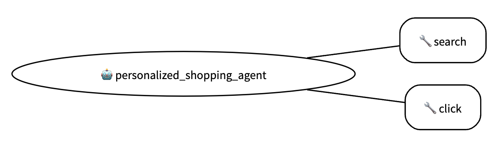

# 個人化購物

## 代理總覽

此代理範例能有效地在特定品牌、商家或線上市場的生態系統內提供量身訂製的產品推薦。它透過使用目標資料並提供相關建議，來增強其自身情境內的購物體驗。

### 代理詳細資訊

個人化購物代理具有以下功能：

*   導覽特定網站以收集產品資訊並了解可用選項。

*   使用應用於特定目錄的文字和圖片搜尋來識別合適的產品。

*   在定義的品牌或市場範圍內比較產品功能。

*   根據使用者行為和個人資料推薦產品。

代理的預設設定可讓您模擬與專注購物者的互動。它展示了代理如何在特定的零售環境中導覽。

| <div align="center">功能</div> | <div align="center">描述</div> |
| --- | --- |
| <div align="center">**互動類型**</div> | <div align="center">對話式</div> |
| <div align="center">**複雜度**</div>  | <div align="center">簡單</div> |
| <div align="center">**代理類型**</div>  | <div align="center">單一代理</div> |
| <div align="center">**元件**</div>  | <div align="center">網路環境：存取預先索引的產品網站</div> |
|  | <div align="center">搜尋工具 (SearchTool)（用於擷取相關產品資訊）</div> |
|  | <div align="center">點擊工具 (ClickTool)（用於導覽網站）</div> |
|  | <div align="center">對話記憶</div> |
| <div align="center">**垂直領域**</div>  | <div align="center">電子商務</div> |


### 架構


### 主要功能

個人化購物代理的主要功能包括：
*   **環境：** 代理可以在擁有 118 萬種產品的電子商務網路環境中互動。
*   **記憶體：** 代理在其內容視窗中維護一個包含所有先前對話資訊的對話記憶體。
*   **工具：**

    _搜尋_：代理可以存取搜尋檢索引擎，在其中可以對相關產品執行關鍵字搜尋。

    _點擊_：代理可以存取產品網站，並可以透過點擊按鈕來導覽網站。
*   **評估：**
    代理使用 `tool_trajectory_avg_score` 和 `response_match_score` 來衡量使用者滿意度。

    評估程式碼位於 `eval/test_eval.py` 下。

    工具的單元測試位於 `tests/test_tools.py` 下。


## 設定與安裝

重要提示：
* 您應該使用 [poetry](https://python-poetry.org/docs/) 來管理 Python 中的依賴和打包。
* 您的儲存庫應包含一個 .env 範例檔案，突顯使用了哪些環境變數以及如何啟動 .env。

1.  **先決條件：**

* 首先，請先 _複製此儲存庫_，然後使用下面的 poetry 指令安裝所需的套件。

    ```bash
    cd ~
    python3 -m venv myenv
    source ~/myenv/bin/activate
    pip install poetry
    ```

* 然後進入專案資料夾，並執行此指令：

    ```bash
    cd adk-samples/python/agents/personalized-shopping
    poetry install
    ```

2.  **安裝：**

* 若要執行代理，請先下載包含產品資訊的 JSON 檔案，這些檔案是初始化代理將互動的網路環境所必需的。

    ```bash
    cd personalized_shopping/shared_libraries
    mkdir data
    cd data

    # 下載 items_shuffle_1000 (4.5MB)
    gdown https://drive.google.com/uc?id=1EgHdxQ_YxqIQlvvq5iKlCrkEKR6-j0Ib;

    # 下載 items_ins_v2_1000 (147KB)
    gdown https://drive.google.com/uc?id=1IduG0xl544V_A_jv3tHXC0kyFi7PnyBu;

    # 下載 items_shuffle (5.1GB)
    gdown https://drive.google.com/uc?id=1A2whVgOO0euk5O13n2iYDM0bQRkkRduB;

    # 下載 items_ins_v2 (178MB)
    gdown https://drive.google.com/uc?id=1s2j6NgHljiZzQNL3veZaAiyW_qDEgBNi;

    # 下載 items_human_ins (4.9MB)
    gdown https://drive.google.com/uc?id=14Kb5SPBk_jfdLZ_CDBNitW98QLDlKR5O
    ```

* 然後您需要為產品資料建立索引，以便搜尋引擎可以使用它們：

    ```bash
    # 轉換 items.json => 所需的檔案格式
    cd ../search_engine
    mkdir -p resources_100 resources_1k resources_10k resources_50k
    python convert_product_file_format.py

    # 為產品建立索引
    mkdir -p indexes
    bash run_indexing.sh
    cd ../../
    ```
3.  **設定：**

* 使用您的雲端專案名稱和地區更新 `.env.example` 檔案，然後將其重新命名為 `.env`。

* 驗證您的 GCloud 帳戶。

    ```bash
    gcloud auth application-default login
    ```

## 執行代理

- **選項 1**：您可以使用 CLI 與代理對話：

    ```bash
    adk run personalized_shopping
    ```

- **選項 2**：您可以在網頁介面上執行代理。這將在您的機器上啟動一個網頁伺服器。您可以前往螢幕上印出的 URL，並在聊天機器人介面中與代理互動。

    ```bash
    cd personalized-shopping
    adk web
    ```
    請從螢幕左上方的下拉式選單中選擇 `personalized_shopping` 選項。現在您可以開始與代理對話了！


> **注意**：第一次執行可能需要一些時間，因為系統會將大約 50,000 個產品項目載入到搜尋引擎的網路環境中。:)

### 範例互動

使用者可以使用文字搜尋和圖片搜尋來尋找產品推薦。以下是使用者可能如何與代理互動的兩個快速範例。

____________

#### 範例 1：文字搜尋

* 工作階段檔案：[text_search_floral_dress.session.json](tests/example_interactions/text_search_floral_dress.session.md)

#### 範例 2：圖片搜尋

* 工作階段檔案：[image_search_denim_skirt.session.json](tests/example_interactions/text_search_floral_dress.session.md) (此工作階段的輸入圖片檔案為 [example_product.png](tests/example_interactions/example_product.png))

## 執行評估

評估會評量代理在評估集中定義的任務上的表現。評估集中的每個範例都包含一個查詢、預期的工具使用和一個參考答案。判斷標準在 `test_config.json` 中指定。

代理的評估可以從 `personalized-shopping` 目錄使用
`pytest` 模組執行：

```bash
python3 -m pytest eval
```

您可以透過將資料集新增到 `eval/eval_data` 資料夾來新增更多評估提示。

若要執行工具的單元測試，您可以從 `personalized-shopping` 目錄執行以下指令：

```bash
python3 -m pytest tests
```

## 部署

* 個人化購物代理範例可以部署到 Vertex AI Agent Engine。為了繼承代理的所有依賴項，您可以建置代理的 wheel 檔案並執行部署。

1.  **建置個人化購物代理 WHL 檔案**

    ```bash
    cd agents/personalized-shopping
    poetry build --format=wheel --output=deployment
    ```

1.  **將代理部署到 Agents Engine**

    ```bash
    cd agents/personalized-shopping/deployment
    python3 deploy.py
    ```

    > **注意**：此過程可能需要超過 10 分鐘才能完成，請耐心等候。

部署完成後，它會印出一行像這樣的內容：

```
Created remote agent: projects/<PROJECT_NUMBER>/locations/<PROJECT_LOCATION>/reasoningEngines/<AGENT_ENGINE_ID>
```

您可以在 Python 中以程式化方式與已部署的代理互動：

```python
import dotenv
dotenv.load_dotenv()  # 如果您已匯出環境變數，則可略過。
from vertexai import agent_engines

agent_engine_id = "AGENT_ENGINE_ID" #記得在此處更新 ID。
user_input = "你好，可以幫我找一件夏天的洋裝嗎？我想要飄逸的花卉款式。"

agent_engine = agent_engines.get(agent_engine_id)
session = agent_engine.create_session(user_id="new_user")
for event in agent_engine.stream_query(
    user_id=session["user_id"], session_id=session["id"], message=user_input
):
    for part in event["content"]["parts"]:
        print(part["text"])
```

若要刪除已部署的代理，您可以執行以下指令：

```bash
python3 deployment/deploy.py --delete --resource_id=${AGENT_ENGINE_ID}
```

## 客製化

此代理範例使用 [princeton-nlp/WebShop](https://github.com/princeton-nlp/WebShop) 的網路商店環境，其中包含 118 萬個真實世界的產品和 12,087 個眾包的文字說明。

預設情況下，代理僅將 50,000 個產品載入到環境中以防止記憶體不足 (OOM) 問題。您可以透過修改 [init_env.py](personalized_shopping/shared_libraries/init_env.py) 中的 `num_product_items` 參數來調整此設定。

對於客製化，您可以新增自己的產品資料並將註釋放在 `items_human_ins.json`、`items_ins_v2.json` 和 `items_shuffle.json` 中，然後輕鬆啟動代理範例。

## 疑難排解

* **問題 1：** 我在代理設定期間遇到 `gdown` 的問題。我該怎麼辦？
* **答案 1：** 您可以從個別的 Google Drive 連結手動下載檔案，並將它們放在 `personalized-shopping/personalized_shopping/shared_libraries/data` 資料夾中。

## 致謝
我們感謝 [princeton-nlp/WebShop](https://github.com/princeton-nlp/WebShop) 的開發人員提供他們的模擬環境。此代理整合了他們專案的修改後程式碼。


## 免責聲明

此代理範例僅供說明之用，不適用於生產環境。它作為一個代理的基本範例，以及個人或團隊開發自己代理的基礎起點。

此範例未經嚴格測試，可能包含錯誤或限制，且不包含生產環境通常所需的功能或優化（例如，穩健的錯誤處理、安全措施、可擴展性、效能考量、全面的日誌記錄或進階設定選項）。

使用者對基於此範例的任何進一步開發、測試、安全強化和部署負全部責任。我們建議在使用任何衍生的代理於即時或關鍵系統之前，進行徹底的審查、測試並實施適當的保護措施。
