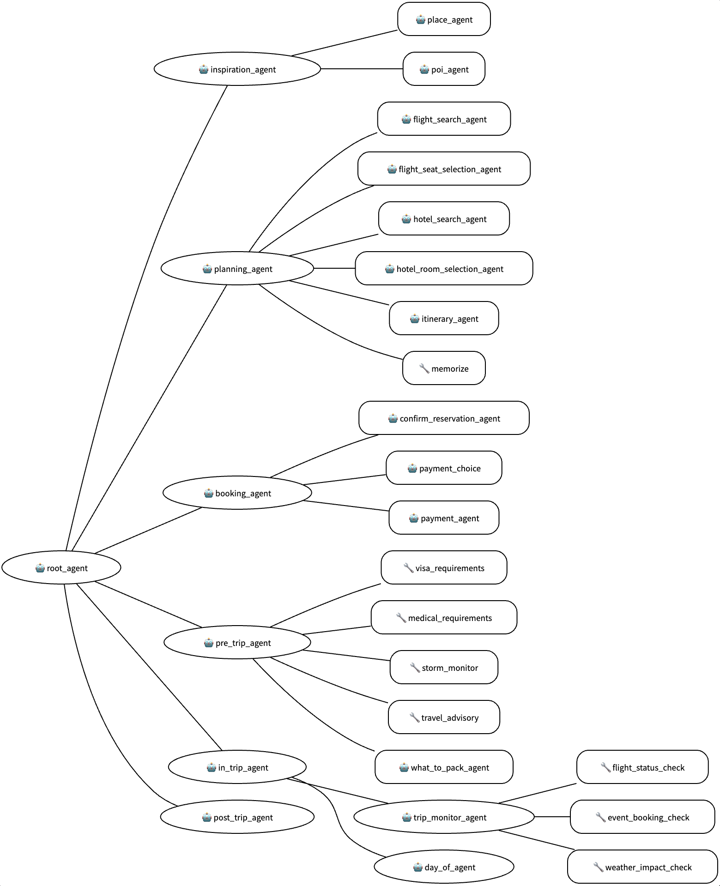

# 旅遊禮賓服務

本範例展示如何使用代理程式開發套件 (Agent Development Kit)，為旅客提供全新的使用者體驗。一群代理程式模仿個人旅遊禮賓服務的概念，從行程構思、規劃和預訂，到為旅程做準備、在旅途中協助從 A 點到 B 點，同時兼任資訊豐富的導遊，滿足旅客的需求。

本範例包含使用 ADK 支援的工具（例如 Google Places API、Google Search Grounding 和 MCP）的說明。

## 總覽

旅客的體驗可分為兩個階段：預訂前和預訂後。在本範例中，每個階段都涉及多個專業代理程式協同合作，以提供禮賓服務體驗。

在預訂前階段，會建構不同的代理程式來協助旅客尋找假期靈感、規劃活動、尋找航班和飯店，並協助處理預訂付款。預訂前階段以一份行程表結束。

在預訂後階段，根據具體的行程表，一組不同的代理程式會在旅程前、旅程中和旅程後支援旅客的需求。例如，行前代理程式會檢查簽證和醫療要求、旅遊建議和風暴狀態。旅程中代理程式會監控預訂的任何變更，並有一個當日代理程式協助旅客在旅途中從 A 點到 B 點。旅程後代理程式則協助收集回饋並識別未來旅遊計畫的其他偏好。


## 代理程式詳細資訊
旅遊禮賓服務的主要功能包括：

| 功能 | 描述 |
| --- | --- |
| **互動類型：** | 對話式 |
| **複雜度：**  | 進階 |
| **代理程式類型：**  | 多代理程式 |
| **元件：**  | 工具、代理程式工具、記憶體 |
| **垂直領域：**  | 旅遊 |

有關使用 Airbnb 的 MCP 搜尋工具的範例，請參閱 [MCP](#mcp) 一節。

### 代理程式架構
旅遊禮賓服務代理程式架構



### 元件詳細資訊

擴充上述的「主要元件」。
*   **代理程式：**
    * `inspiration_agent` - 與使用者互動，提供目的地和活動建議，激發使用者做出選擇。
    * `planning_agent` - 給定目的地、開始日期和持續時間，規劃代理程式會協助使用者選擇航班、座位和飯店（模擬），然後產生包含活動的行程表。
    * `booking_agent` - 給定行程表，預訂代理程式將協助處理行程表中需要付款的項目。
    * `pre_trip_agent` - 預計在旅程開始前定期調用；此代理程式會根據出發地、目的地和使用者的國籍擷取相關的行程資訊。
    * `in_trip_agent`- 預計在旅程中頻繁調用。此代理程式提供三項服務：監控預訂的任何變更（模擬）、擔任資訊豐富的導遊，並提供交通協助。
    * `post_trip_agent` - 在本範例中，旅程後代理程式會詢問旅客的體驗，並嘗試根據行程擷取並儲存他們的各種偏好，以便這些資訊在未來的互動中發揮作用。
*   **工具：**
    * `map_tool` - 擷取經緯度；使用 Google Map API 對地址進行地理編碼。
    * `memorize` - 一個用於記住對話中對行程規劃和提供旅程中支援很重要的資訊的函式。
*   **代理程式工具：**
    * `google_search_grounding` - 在範例中用於行前資訊收集，例如簽證、醫療、旅遊建議等。
    * `what_to_pack` - 根據出發地和目的地建議打包物品。
    * `place_agent` - 推薦目的地。
    * `poi_agent` - 根據目的地建議活動。
    * `itinerary_agent` - 由 `planning_agent` 呼叫，以遵循 pydantic 結構描述完整建構並以 JSON 格式表示行程表。
    * `day_of_agent` - 由 `in_trip_agent` 呼叫，以提供當天和當下的旅程中交通資訊，從 A 點到 B 點。使用動態指令實作。
    * `flight_search_agent` -  模擬的航班搜尋，給定出發地、目的地、出發和回程日期。
    * `flight_seat_selection_agent` -  模擬的座位選擇，部分座位不可用。
    * `hotel_search_agent` - 模擬的飯店選擇，給定目的地、出發和回程日期。
    * `hotel_room_selection_agent` - 模擬的飯店房間選擇。
    * `confirm_reservation_agent` - 模擬的預訂。
    * `payment_choice` - 模擬的付款選擇，Apple Pay 將不會成功，Google Pay 和信用卡將會成功。
    * `payment_agent` - 模擬的付款處理。
*   **記憶體：**
    * 本範例中的所有代理程式和工具都使用代理程式開發套件的內部工作階段狀態作為記憶體。
    * 工作階段狀態用於儲存行程表等資訊，以及暫時的代理程式工具回應。
    * 有一些預製的行程表可以載入以進行測試。有關如何執行它們，請參閱下文的「執行代理程式」。

## 設定與安裝

### 資料夾結構
```
.
├── README.md
├── travel-concierge-arch.png
├── pyproject.toml
├── travel_concierge/
│   ├── shared_libraries/
│   ├── tools/
│   └── sub_agents/
│       ├── inspiration/
│       ├── planning/
│       ├── booking/
│       ├── pre_trip/
│       ├── in_trip/
│       └── post_trip/
├── tests/
│   └── unit/
├── eval/
│   └── data/
└── deployment/
```

### 先決條件

- Python 3.11+
- Google Cloud 專案（用於 Vertex AI 整合）
- [Google Maps Platform Places API](https://developers.google.com/maps/documentation/places/web-service/get-api-key) 的 API 金鑰
- Google 代理程式開發套件 1.0+
- Poetry：按照官方 Poetry [網站](https://python-poetry.org/docs/) 上的說明安裝 Poetry

### 安裝

1.  複製儲存庫：

    ```bash
    git clone https://github.com/google/adk-samples.git
    cd adk-samples/python/agents/travel-concierge
    ```
    注意：從此處開始，除非另有說明，否則所有指令行說明都應在 `travel-concierge/` 目錄下執行。

2.  使用 Poetry 或 pip 安裝依賴項：

    ```bash
    poetry install
    ```

3.  設定 Google Cloud 憑證：

    否則：
    - 在頂層目錄 `travel-concierge/` 中，透過複製 `.env.example` 來建立一個 `.env` 檔案
    - 設定以下環境變數。
    - 若要使用 Vertex，請確保您已在專案中啟用 Vertex AI API。
    ```
    # 選擇模型後端：0 -> ML 開發，1 -> Vertex
    GOOGLE_GENAI_USE_VERTEXAI=1
    # ML 開發後端設定，當 GOOGLE_GENAI_USE_VERTEXAI=0 時，如果使用 Vertex，則忽略。
    # GOOGLE_API_KEY=YOUR_VALUE_HERE

    # Vertex 後端設定
    GOOGLE_CLOUD_PROJECT=__YOUR_CLOUD_PROJECT_ID__
    GOOGLE_CLOUD_LOCATION=us-central1

    # Places API
    GOOGLE_PLACES_API_KEY=__YOUR_API_KEY_HERE__

    # GCS 儲存貯體名稱 - 用於代理程式引擎部署測試
    GOOGLE_CLOUD_STORAGE_BUCKET=YOUR_BUCKET_NAME_HERE

    # 範例情境路徑 - 預設為空行程表
    # 這將在第一次使用者互動時載入。
    #
    # 取消註解以下兩者之一，或建立您自己的。
    #
    # TRAVEL_CONCIERGE_SCENARIO=travel_concierge/profiles/itinerary_seattle_example.json
    TRAVEL_CONCIERGE_SCENARIO=travel_concierge/profiles/itinerary_empty_default.json
    ```

4. 驗證您的 GCloud 帳戶。
    ```bash
    gcloud auth application-default login
    ```

5. 啟動由 Poetry 設定的虛擬環境，執行：
    ```bash
    eval $(poetry env activate)
    (travel-concierge-py3.12) $ # 已進入虛擬環境
    ```
    每當您有新的 shell 時，在執行本 README 中的指令之前，請重複此指令。

## 執行代理程式

### 使用 `adk`

ADK 提供了在本機啟動代理程式並與其互動的便利方法。
您可以使用 CLI 與代理程式交談：

```bash
# 在 travel-concierge 目錄下：
adk run travel_concierge
```

或透過其網頁介面：
```bash
# 在 travel-concierge 目錄下：
adk web
```

這將在您的機器上啟動一個本地網頁伺服器。您可以開啟該 URL，在左上角的下拉式選單中選擇 "travel_concierge"，
一個聊天機器人介面將出現在右側。

對話最初是空白的。有關禮賓服務互動的大綱，請參閱 [範例代理程式互動](#sample-agent-interaction) 一節。

這裡有一些可以嘗試的內容：
* "需要一些關於美洲的目的地想法"
* 與代理程式互動一會兒後，您可以問："繼續規劃"。


### 程式化存取

以下是使用 Python 作為伺服器與代理程式互動的範例。
在 travel-concierge 目錄下嘗試：

首先，為 travel_concierge 套件建立一個快速的開發 API 伺服器。
```bash
adk api_server travel_concierge
```
這將在 http://127.0.0.1:8000 啟動一個 fastapi 伺服器。
您可以在 http://127.0.0.1:8000/docs 存取其 API 文件。

這是一個僅呼叫伺服器兩次的範例客戶端：
```bash
python tests/programmatic_example.py
```

您可能會注意到有處理函式回應的程式碼。我們將在下面的 [GUI](#gui) 一節中重新討論這一點。


### 範例代理程式互動

提供了兩個範例工作階段來說明旅遊禮賓服務的運作方式。
- 從靈感到最終預訂的祕魯之旅規劃 ([`tests/pre_booking_sample.md`](tests/pre_booking_sample.md))。
- 前往西雅圖的短途旅行的旅程中體驗，使用工具模擬時間的流逝 ([`tests/post_booking_sample.md`](tests/post_booking_sample.md))。

### 值得一試

與其一次只與禮賓服務互動一次，不如嘗試給它完整的指令，包括決策標準，然後看著它運作，例如：

  *"尋找 4 月 20 日從 JFK 飛往倫敦的 4 天航班。選擇任何航班和任何座位；也選擇任何飯店和房型。確保為兩趟航班都選擇座位。繼續代表我行動，無需我的輸入，直到您選擇好所有東西，在產生行程表之前與我確認。"*

在沒有特別針對此類用法進行優化的情況下，這群代理程式似乎能夠在您的授權下，以極少的輸入自行運作。


## 執行測試

若要執行說明性測試和評估，請安裝額外的依賴項並執行 `pytest`：

```
poetry install --with dev
pytest
```

也可以分別執行不同的測試：

若要執行單元測試，只需檢查所有代理程式和工具是否回應：
```
pytest tests
```

若要執行代理程式軌跡測試：
```
pytest eval
```

## 部署代理程式

若要將代理程式部署到 Vertex AI Agent Engine，請在 `travel-concierge` 下執行以下指令：

```bash
poetry install --with deployment
python deployment/deploy.py --create
```
當此指令返回時，如果成功，它將列印一個看起來像這樣的 AgentEngine 資源 ID：
```
projects/************/locations/us-central1/reasoningEngines/7737333693403889664
```

若要快速測試代理程式是否已成功部署，
請使用代理程式 "正在尋找美洲各地的靈感" 執行以下指令一輪：
```bash
python deployment/deploy.py --quicktest --resource_id=<RESOURCE_ID>
```
這將返回一個 JSON 酬載流，表示已部署的代理程式正常運作。

若要刪除代理程式，請執行以下指令（使用先前返回的資源 ID）：
```bash
python3 deployment/deploy.py --delete --resource_id=<RESOURCE_ID>
```

## 應用程式開發

### 回呼和初始狀態

本示範中的 `root_agent` 目前註冊了一個 `before_agent_callback`，用於從檔案將初始狀態（例如使用者偏好和行程表）載入到工作階段狀態以進行互動。這樣做的主要原因是減少必要的設定量，並使其易于使用 ADK UI。

在實際的應用程式情境中，可以在建立新的 `Session` 時包含初始狀態，從而滿足使用者偏好和其他資訊很可能從外部資料庫載入的使用案例。
 
### 記憶體與狀態

在本範例中，我們使用工作階段狀態作為禮賓服務的記憶體，以儲存行程表以及中介代理程式/工具/使用者偏好回應。在實際的應用程式情境中，使用者設定檔的來源應為外部資料庫，並且從工具對工作階段狀態的
相互寫入應額外持久化為直寫到專用於使用者設定檔和行程表的外部資料庫。

### MCP

包含一個使用 Airbnb 的 MCP 伺服器的範例。ADK 支援 MCP 並提供數個 MCP 工具。
本範例將 Airbnb 搜尋和列表 MCP 工具附加到 `planning_agent`，並要求禮賓服務在給定特定日期的情況下簡單地尋找一個 airbnb。禮賓服務會將請求轉發給規劃代理程式，後者將呼叫 Airbnb 搜尋 MCP 工具。

若要嘗試此範例，請先從 Node.js [網站](https://nodejs.org/en/download) 設定 nodejs 和 npx

確保：
```
$ which node
/Users/USERNAME/.nvm/versions/node/v22.14.0/bin/node

$ which npx
/Users/USERNAME/.nvm/versions/node/v22.14.0/bin/npx
```

然後，在 `travel-concierge/` 目錄下，使用以下指令執行測試：
```
python -m tests.mcp_abnb
```

您將在主控台上看到類似以下的輸出：
```
[user]: 幫我在 4 月 9 日至 4 月 13 日期間在聖地牙哥找一個 airbnb，不需要航班也不需要行程表。無需確認，只需返回 5 個選擇，記得包含網址。

( 正在設定代理程式和工具 )

伺服器已啟動，選項：ignore-robots-txt
Airbnb MCP 伺服器正在 stdio 上執行

正在將 Airbnb MCP 工具插入旅遊禮賓服務...
...
找到 planning_agent

( 執行：Runner.run_async() )

[root_agent]: transfer_to_agent( {"agent_name": "planning_agent"} )
...
[planning_agent]: airbnb_search( {"checkout": "2025-04-13", "location": "San Diego", "checkin": "2025-04-09"} )

[planning_agent]: airbnb_search 回應 -> {
  "searchUrl": "https://www.airbnb.com/s/San%20Diego/homes?checkin=2025-04-09&checkout=2025-04-13&adults=1&children=0&infants=0&pets=0",
  "searchResults": [
    {
      "url": "https://www.airbnb.com/rooms/24669593",
      "listing": {
        "id": "24669593",
        "title": "聖地牙哥的房間",
        "coordinate": {
          "latitude": 32.82952,
          "longitude": -117.22201
        },
        "structuredContent": {
          "mapCategoryInfo": "與 Stacy 同住，主持 7 年"
        }
      },
      "avgRatingA11yLabel": "平均評分 4.91/5，211 則評論",
      "listingParamOverrides": {
        "categoryTag": "Tag:8678",
        "photoId": "1626723618",
        "amenities": ""
      },
      "structuredDisplayPrice": {
        "primaryLine": {
          "accessibilityLabel": "4 晚 9,274 新台幣"
        },
        "explanationData": {
          "title": "價格詳情",
          "priceDetails": "每晚 2,319 新台幣 x 4 晚：9,274 新台幣"
        }
      }
    },
    ...
    ...
  ]
}

[planning_agent]: 這裡有 5 個聖地牙哥的 Airbnb 選項，供您 4 月 9 日至 4 月 13 日的旅程參考，包含網址：

1.  **聖地牙哥的房間：** [https://www.airbnb.com/rooms/24669593](https://www.airbnb.com/rooms/24669593)
2.  **聖地牙哥的房間：** [https://www.airbnb.com/rooms/5360158](https://www.airbnb.com/rooms/5360158)
3.  **聖地牙哥的房間：** [https://www.airbnb.com/rooms/1374944285472373029](https://www.airbnb.com/rooms/1374944285472373029)
4.  **聖地牙哥的公寓：** [https://www.airbnb.com/rooms/808814447273523115](https://www.airbnb.com/rooms/808814447273523115)
5.  **聖地牙哥的房間：** [https://www.airbnb.com/rooms/53010806](https://www.airbnb.com/rooms/53010806)
```

### GUI

典型的終端使用者將透過 GUI 而非純文字與代理程式互動。前端禮賓服務應用程式可能會以圖形化和/或富媒體的方式呈現數種代理程式回應，例如：
- 以卡片輪播方式呈現的目的地想法，
- 地圖上的景點/路線，
- 可展開的影片、圖片、連結。
- 以帶有標誌的列表形式選擇航班和飯店，
- 在座位表上選擇飛機座位，
- 可點擊的範本化回應。

其中許多可以透過 ADK 的事件來實現。這是因為：
- 所有函式呼叫和函式回應都由工作階段執行器回報為事件。
- 在這個旅遊禮賓服務範例中，數個子代理程式和工具使用明確的 pydantic 結構描述和受控生成來產生 JSON 回應。這些代理程式是：地點代理程式（用於目的地）、景點代理程式（用於景點和活動）、航班和飯店選擇代理程式、座位和房間選擇代理程式以及行程表。
- 當工作階段執行器服務被包裝成伺服器端點時，攜帶這些 JSON 酬載的事件序列可以串流到應用程式。
- 當應用程式透過其來源代理程式識別酬載結構描述時，它便可以相應地呈現酬載。

若要了解如何使用事件、代理程式和工具回應，請開啟檔案 [`tests/programmatic_example.py`](tests/programmatic_example.py)。

使用以下指令執行測試客戶端程式碼：
```
python tests/programmatic_example.py 
```

您將獲得類似以下的輸出：
```
[user]: "給我一些關於馬爾地夫的靈感"

...

[root_agent]: transfer_to_agent( {"agent_name": "inspiration_agent"} )

...

[inspiration_agent]: place_agent 回應 -> {
  "id": "af-be786618-b60b-45ee-a801-c40fd6811e60",
  "name": "place_agent",
  "response": {
    "places": [
      {
        "name": "馬利",
        "country": "馬爾地夫",
        "image": "https://upload.wikimedia.org/wikipedia/commons/thumb/1/1c/Male%2C_Maldives_panorama_2016.jpg/1280px-Male%2C_Maldives_panorama_2016.jpg",
        "highlights": "充滿活力的首都，提供繁華的市場、歷史悠久的清真寺，並可一窺當地的馬爾地夫生活。",
        "rating": "4.2"
      },
      {
        "name": "芭環礁",
        "country": "馬爾地夫",
        "image": "https://upload.wikimedia.org/wikipedia/commons/thumb/9/95/Baa_Atoll_Maldives.jpg/1280px-Baa_Atoll_Maldives.jpg",
        "highlights": "聯合國教科文組織生物圈保護區，以其豐富的海洋生物多樣性而聞名，包括鬼蝠魟和鯨鯊，非常適合浮潛和潛水。",
        "rating": "4.8"
      },
      {
        "name": "阿杜環礁",
        "country": "馬爾地夫",
        "image": "https://upload.wikimedia.org/wikipedia/commons/thumb/c/c3/Addu_Atoll_Maldives.jpg/1280px-Addu_Atoll_Maldives.jpg",
        "highlights": "最南端的環礁，以其獨特的赤道植被、二戰歷史遺址和擁有各種珊瑚礁的絕佳潛水點而聞名。",
        "rating": "4.5"
      }
    ]
  }
}

[app]: 呈現目的地輪播

[inspiration_agent]: 馬爾地夫是一個很棒的目的地！我看到三個很棒的選擇：

1.  **馬利：** 首都，您可以在這裡體驗當地生活、市場和清真寺。
2.  **芭環礁：** 聯合國教科文組織生物圈保護區，非常適合浮潛和潛水，有鬼蝠魟和鯨鯊。
3.  **阿杜環礁：** 最南端的環礁，提供獨特的植被、二戰歷史和各種珊瑚礁供潛水。

這些目的地中有沒有聽起來有趣的？我可以為您提供一些您在所選目的地可以從事的活動。

[user]: "建議一些芭環礁周圍的活動"

...

```

在一個事件從執行代理程式的伺服器傳遞到應用程式前端的環境中，應用程式可以使用本範例中的方法來剖析和識別正在傳送的酬載，並選擇最合適的酬載呈現器/處理常式。

### 客製化

以下是一些關於如何重複使用禮賓服務並將其變成您自己的的一些想法。

### 載入預製的行程表以展示旅程中流程
- 預設情況下，會從 `travel_concierge/profiles/itinerary_empty_default.json` 載入使用者設定檔和空行程表。
- 若要指定載入不同的檔案，例如西雅圖範例 `travel_concierge/profiles/itinerary_seattle_example.json`：
  - 在 `.env` 中將環境變數 `TRAVEL_CONCIERGE_SCENARIO` 設定為 `travel_concierge/profiles/itinerary_seattle_example.json`。
  - 然後重新啟動 `adk web` 並載入旅遊禮賓服務。
- 當您開始與代理程式互動時，狀態將被載入。
- 當您在 GUI 中選擇「狀態」時，您可以看到載入的使用者設定檔和行程表。


### 為示範製作您自己的預製行程表

- 行程表結構描述定義在 types.py 中
- 複製一份 `itinerary_seattle_example.json` 並按照結構描述製作您自己的 `itinerary`。
- 使用上述步驟載入並測試您的新行程表。
- 對於 `user_profile` dict：
  - `passport_nationality` 和 `home` 是必填欄位，僅修改 `address` 和 `local_prefer_mode`。
  - 您可以修改/新增額外的設定檔欄位


### 與外部 API 整合

本範例中有許多增強、客製化和整合的機會：
- 連接到真實的航班/座位選擇系統
- 連接到真實的飯店/房間選擇系統
- 使用外部記憶體持久性服務或資料庫，而非工作階段狀態
- 在 `day_of` 代理程式中使用 Google Maps [Route API](https://developers.google.com/maps/documentation/routes)。
- 連接到外部 API 以取得簽證/醫療/旅遊建議和 NOAA 風暴資訊，而非使用 Google Search Grounding。


### 優化代理程式

以下只是一些初步的想法：
- 一個更精密的行程表和活動規劃代理程式；例如，目前代理程式不處理有中途停留的航班。
- 更好的會計 - 計算航班、飯店和其他費用的準確性。
- 一個不那麼單調乏味且更有效率的預訂代理程式
- 對於行前和旅程中代理程式，有機會動態調整行程表並解決行程例外狀況

## 疑難排解

與代理程式互動時偶爾會發生以下情況：
- 「格式錯誤」的函式呼叫或回應，或 pydantic 錯誤 - 發生這種情況時，只需告訴代理程式「再試一次」。
- 如果代理程式嘗試呼叫一個不存在的工具，告訴代理程式那是「錯誤的工具，再試一次」，代理程式通常能夠自我修正。
- 同樣地，如果您等待了一段時間，而代理程式在一系列動作執行到一半時停止了，請詢問代理程式「下一步是什麼」以推動它前進。

這些情況偶爾會發生，很可能是由於 JSON 回應的變化，需要對提示和生成參數進行更嚴格的實驗才能獲得更穩定的結果。在應用程式中，這些重試也可以作為例外處理的一部分內建到應用程式中。


## 免責聲明

此代理程式範例僅供說明之用，不適用於生產環境。它作為代理程式的基本範例，以及個人或團隊開發自己代理程式的基礎起點。

此範例未經嚴格測試，可能包含錯誤或限制，且不包含生產環境通常所需的功能或優化（例如，穩健的錯誤處理、安全措施、可擴展性、效能考量、全面的日誌記錄或進階設定選項）。

使用者對基於此範例的任何進一步開發、測試、安全強化和部署負全部責任。我們建議在使用任何衍生的代理程式於即時或關鍵系統之前，進行徹底的審查、測試並實施適當的保護措施。