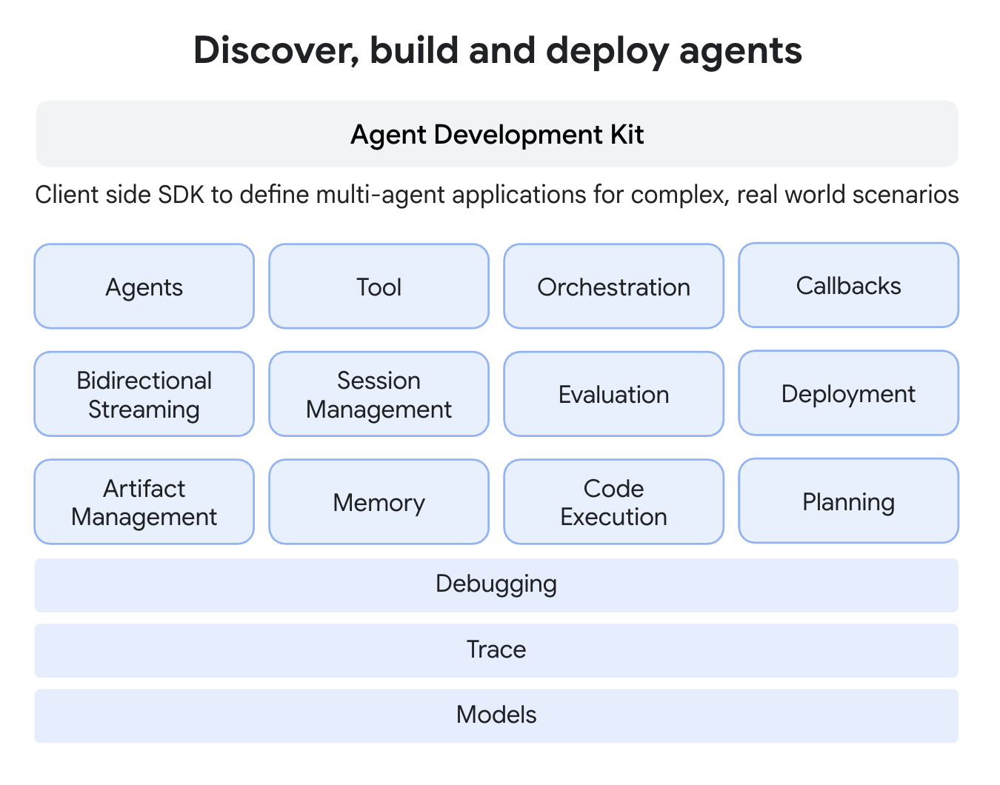
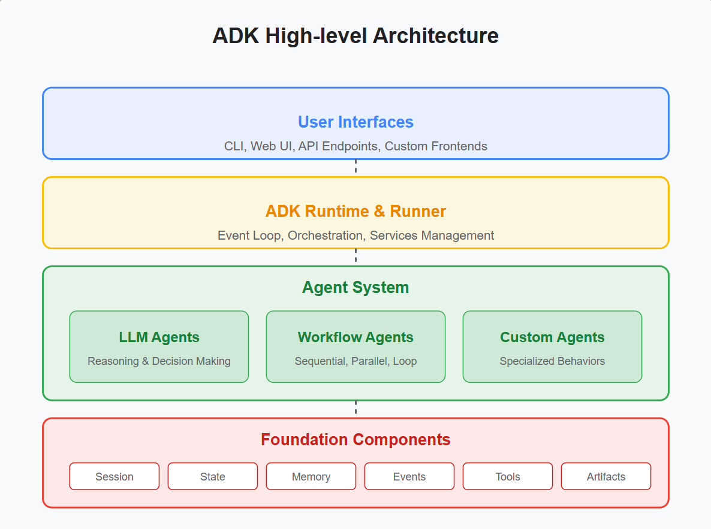
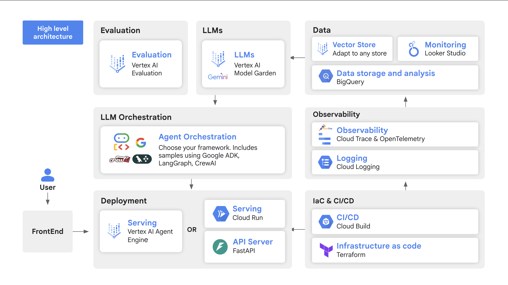

# ARCHITECTURE

## ADK 關鍵組件：

- **核心組件**：Agents (代理)、Tool (工具)、Orchestration (編排)、Callbacks (回調)。
- **功能組件**：Bidirectional Streaming (雙向串流)、Session Management (會話管理)、Evaluation (評估)、Deployment (部署)。
- **管理組件**：Artifact Management (構件管理)、Memory (記憶)、Code Execution (代碼執行)、Planning (規劃)。
- **支援組件**：Debugging (除錯)、Trace (追蹤)、Models (模型)。

## 高階架構組成 ADK High Level Architecture

### 該架構主要分為四個層次：

- **使用者介面(User Interfaces)**：位於最上層，包含
  - 命令列介面(CLI)
  - 網頁使用者介面(Web UI)
  - API 端點(API Endpoints)
  - 自訂前端(Custom Frontend)
  - 提供與使用者互動的管道

- **ADK 執行時與執行器(ADK Runtime & Runner)**：
  - 負責事件循環(Event Loop)
  - 協調(Orchestration)
  - 服務管理(Service Management)

- **代理系統(Agent System)**：
  - LLM 代理(LLM Agents)：負責推理和決策。
  - 工作流程代理(Workflow Agents)：處理順序、並行和循環的工作流程。
      - 順序代理(Sequential Agent)：當您希望執行按照固定、嚴格的順序進行時使用。
      - 並行代理(Parallel Agent)：當子代理彼此之間沒有依賴關係時，它們的任務可以並發執行，從而顯著縮短總體處理時間。
      - 循環代理(Loop Agent)：當您的工作流程涉及重複或迭代改進（例如修改程式碼）時使用。
  - 自訂代理(Custom Agents)：實現專門的行為。

- **基礎組件(Foundation Components)**：位於最底層，提供代理運作所需的基礎功能
  - 會話(Session)
  - 狀態(State)
  - 記憶體(Memory)
  - 事件(Events)
  - 工具(Tools) 
  - 構件(Artifacts)

---

## 基於代理程式的解決方案（原型概念）An Agent-Based Solution (Prototype Concept)

https://codelabs.developers.google.com/instavibe-adk-multi-agents/instructions
- **A Agent**:

- **B Agent**:

- **C Agent**:

- **Orchestrator Agent**: 

## 關鍵建築元素和技術 Key Architectural Elements and Technologies

Platform Overview:

- **Models**: 

- **Tools**: 

- **Orchestrator**: 

- **Callbacks**: 

---

## 正式專案架構文件

**撰寫建議：**  
- 每一大項之下可細分「設計原則」、「實作要點」、「範例／流程圖」與「注意事項」小節。
- 附錄可添加核心 API 介面設計、事件格式範例、主要模組程式碼摘要與參考鏈結，方便跨團隊溝通與維護。
- 此分項模板可協助架構師/團隊高效規劃、審核與落實 ADK 專案，有助於後續自動化工具開發、多代理協作及系統維運。

### 1. 系統總覽（System Overview & Concept）
- 架構背景與目標  
- 適用業務場景、預期效益
- 高階流程圖/架構圖

### 2. 組件設計（Component Architecture）
- Agent（代理）角色定義與分工
- Tool（工具）種類與協作方式
- Runner、Session、Memory 結構
- Component 互動序列圖

### 3. 多代理協作與通訊（Multi-Agent Collaboration & Messaging）
- 多代理分層/任務拆解規劃
- A2A（Agent-to-Agent）通訊協定
- 工作流（Workflow Agent）設計（順序/並行/循環）

### 4. 工具與外部服務整合（Tooling & External Integration）
- 工具/模型註冊與管理規則
- 外部 API, LLM, 內建/自訂工具擴充方式
- 授權、API Key 與安全控管

### 5. 工作流與事件處理（Workflow & Event Handling）
- 事件驅動機制與事件類型
- 流程代理設計（SequentialAgent, ParallelAgent, LoopAgent）
- 狀態追蹤與錯誤處理流程

### 6. 記憶體架構與知識管理（Memory & Knowledge Management）
- Session State、短/長期記憶體策略
- 外部知識庫/Vector Search 整合原則
- 記憶與檢索介面設計

### 7. 部署安排與伸縮性（Deployment & Scalability）
- 部署架構藍圖（本地/雲端/Hybrid）
- 負載均衡、資源管理、容錯設計
- 升級與版本控管策略

### 8. 監控、測試與評估（Observability, Testing & Evaluation）
- 監控指標（SRE Integration, Log, Trace, Alert）
- Evaluator/Testing Framework 整合
- 金標資料評估管道

### 9. 安全性與合規（Security & Compliance）
- 權限劃分、API 授權與機敏信息保護
- 系統安全維護、漏洞預防設計
- 操作稽核與可追蹤性

### 10. 系統維運與文件管理（Operations & Documentation）
- 常見維運工作與 SOP
- 日誌與問題回報處理規範
- 文件管理與版本同步策略

***

[1](https://google.github.io/adk-docs/)
[2](https://codelabs.developers.google.com/instavibe-adk-multi-agents/instructions?hl=zh-tw)
[3](https://wandb.ai/google_articles/articles/reports/Google-Agent-Development-Kit-ADK-A-hands-on-tutorial--VmlldzoxMzM2NTIwMQ)

---

## 架構藍圖

> 基於 Google Agent Development Kit (ADK) 的官方文檔和最佳實踐，ARCHITECTURE.md 作為專案的架構藍圖，必須明確定義 ADK 的關鍵要素，以確保系統設計符合框架的模組化、可擴展性和生產級要求。這些要素不僅涵蓋核心組件，還包括多代理互動模式、狀態管理和執行機制。以下是必須包含的關鍵要素定義，按邏輯分類列出，每項附帶解釋及其在 SRE Assistant 專案中的應用建議：

### 1. **代理定義與類型 (Agents and Types)**
   - **必須定義**：代理的核心屬性，包括名稱、模型 (e.g., Gemini Pro)、描述、指令 (instructions)、工具列表 (tools)、安全設定 (safety_settings) 和生成配置 (generate_content_config，如 temperature、max_output_tokens)。
   - **為何關鍵**：代理是 ADK 的基本單位，定義確保一致性和可測試性。支持多種類型，如 LLM Agents (語言模型驅動)、Workflow Agents (工作流協調)和 Custom Agents (自訂邏輯)。
   - **說明建議**：描述 SRE Assistant 的主代理 (e.g., SREWorkflow 作為 SequentialAgent 或 ParallelAgent) 和子代理 (e.g., IncidentHandlerAgent 作為 LLM Agent)，並提供範例配置代碼片段。

### 2. **工具整合 (Tools Integration)**
   - **必須定義**：工具的註冊和類型，包括 FunctionTools (標準函數)、AgentTools (代理作為工具)和 LongRunningFunctionTools (長運行任務，如人類介入 HITL)。
   - **為何關鍵**：工具是代理執行行動的核心，支持外部整合 (e.g., Grafana API) 和內部調用。必須強調工具的無狀態設計、註解完整性和本地測試。
   - **說明建議**：列出共享工具註冊表 (tool_registry.py)，如 PrometheusQueryTool 的簽名和配置，並說明如何將子代理封裝為 AgentTool 以支持聯邦化。

### 3. **多代理層級與模式 (Multi-Agent Hierarchy and Patterns)**
   - **必須定義**：代理層級 (parent-sub agents)、常見模式 (e.g., Coordinator/Dispatcher、Sequential Pipeline、Parallel Fan-Out/Gather、Hierarchical Decomposition、Review/Critique、Iterative Refinement、Human-in-the-Loop)。
   - **為何關鍵**：ADK 強調多代理系統以提升效率和容錯，支持關注點分離和動態路由。
   - **說明建議**：使用 Mermaid 圖展示 SREIntelligentDispatcher 作為 Coordinator，定義 VerificationAgent 作為 Self-Critic 模式，並說明 A2A 通訊 (e.g., gRPC) 如何實現點對點互動。

### 4. **工作流代理 (Workflow Agents)**
   - **必須定義**：特定工作流類型，如 SequentialAgent (循序執行)、ParallelAgent (並行執行)和 LoopAgent (循環精煉)。
   - **為何關鍵**：這些代理管理任務流，處理複雜邏輯如診斷並行分析或修復迭代。
   - **說明建議**：說明 SREWorkflow 如何使用 ParallelAgent 並行查詢 Loki/Tempo/Mimir，並定義 max_iterations 以避免無限循環。

### 5. **互動與通訊機制 (Interaction and Communication Mechanisms)**
   - **必須定義**：共享會話狀態 (session.state)、LLM 驅動轉移 (transfer_to_agent)、顯式調用 (AgentTool) 和事件 (Events) 作為通訊單位。
   - **為何關鍵**：確保代理間無縫協作，避免緊耦合，支持被動 (狀態讀寫) 和主動 (轉移/調用) 通訊。
   - **說明建議**：描述如何使用 session.state 儲存診斷結果，並在高風險操作中使用 HumanApprovalTool 實現 HITL。

### 6. **狀態與記憶管理 (State and Memory Management)**
   - **必須定義**：短期記憶 (Session Service，如 DatabaseSessionService for PostgreSQL)、長期記憶 (MemoryProvider，如 Weaviate for RAG) 和狀態作用域 (session/user/app)。
   - **為何關鍵**：維持上下文連續性，支持生產級持久化和多實例部署。避免使用 InMemorySessionService 在生產環境。
   - **說明建議**：定義 Unified Memory 層，強調自訂 Provider 模式，並說明如何使用 after-agent 回調自動更新記憶庫。

### 7. **事件與回調 (Events and Callbacks)**
   - **必須定義**：事件作為執行步驟 (e.g., escalate=True 以終止循環)和回調鉤子 (e.g., before_model_callback for 輸入驗證、before_tool_callback for 工具控制)。
   - **為何關鍵**：事件驅動架構支持模組化和錯誤處理，回調提升安全性和自訂化。
   - **說明建議**：說明事件總線 (EventBus) 如何處理代理間訊息，並定義回調用於認證強化或錯誤恢復。

### 8. **評估與可觀測性 (Evaluation and Observability)**
   - **必須定義**：評估框架 (AgentEvaluator、軌跡/最終回應評估)、可觀測性 (OpenTelemetry 追蹤、指標如 latency/token usage) 和監控模式。
   - **為何關鍵**：確保代理可靠性、成本控制和除錯，支持 CI/CD 整合。
   - **說明建議**：整合 LGTM Stack，定義 Grafana 儀表板追蹤 LLM 跨度，並說明評估管線如何測量診斷準確率。

### 9. **錯誤處理與韌性 (Error Handling and Resilience)**
   - **必須定義**：斷路器 (Circuit Breaker)、降級策略 (Fallbacks)、錯誤恢復工具和 SLO (e.g., p99 latency < 500ms)。
   - **為何關鍵**：生產級系統需處理故障，避免級聯效應。
   - **說明建議**：定義 recover_from_error 工具，並整合 Service Mesh (e.g., Istio) for mTLS。

### 10. **部署與擴展 (Deployment and Extensibility)**
   - **必須定義**：部署目標 (e.g., Kubernetes/Cloud Run)、Provider 模式 (e.g., AuthProvider) 和擴展點 (e.g., 自訂 SessionService)。
   - **為何關鍵**：ADK 支持本地 (adk web) 到雲端 (Vertex AI) 部署，強調無狀態和可插拔設計。
   - **說明建議**：提供配置範例 (YAML) 和漸進演進路徑，從 MVP 到聯邦化。