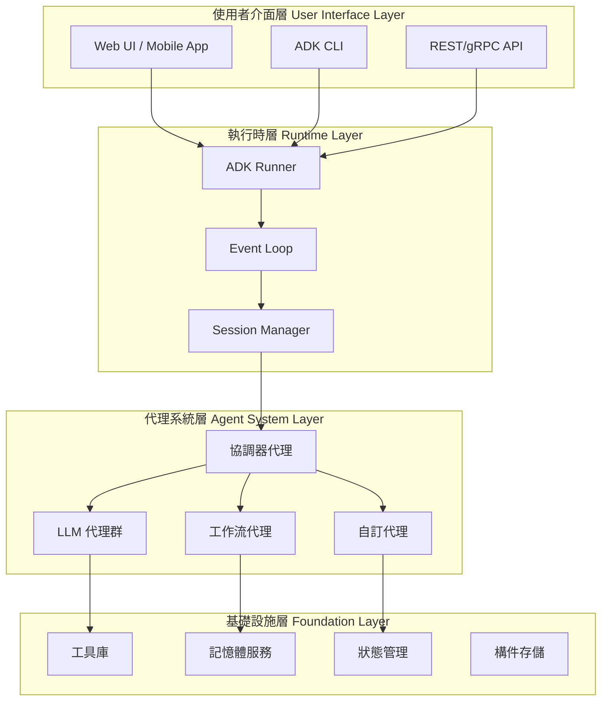
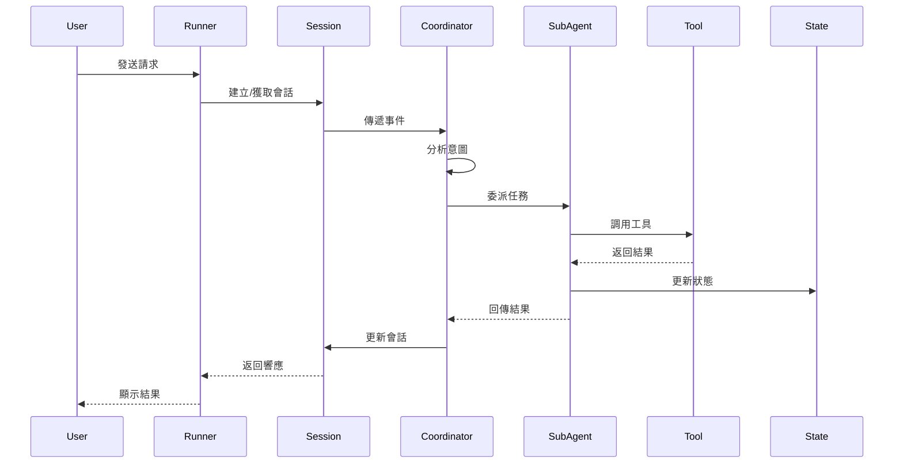

# Google ADK 多代理系統專案架構文件 v1.0

## 文件資訊
- **版本**: 1.0.0
- **日期**: 2025-01-08  
- **作者**: ADK 架構團隊
- **文件類型**: 技術架構規範書
- **適用框架**: Google Agent Development Kit (ADK)

---

## 1. 系統總覽（System Overview & Concept）

### 1.1 架構背景與目標

Google Agent Development Kit (ADK) 是一個彈性且模組化的框架，專為開發和部署 AI 代理而設計。本架構文件提供標準化的系統設計模板，確保團隊能夠：

- **建構可擴展的多代理系統**：支援複雜任務分解與協作
- **實現生產級部署**：從本地開發到雲端規模化部署
- **維護系統可觀測性**：完整的追蹤、監控與評估機制
- **確保安全合規**：內建安全防護與稽核能力

### 1.2 適用業務場景

- **對話式 AI 助理**：客服、技術支援、個人助理
- **工作流自動化**：文件處理、數據分析、報告生成
- **多模態應用**：即時音視頻互動、圖像分析
- **企業級整合**：CRM、ERP、知識庫系統對接

### 1.3 高階架構圖



---

## 2. 組件設計（Component Architecture）

### 2.1 Agent（代理）角色定義與分工

#### 2.1.1 代理類型定義

| 代理類型 | 用途 | 核心屬性 | 實作範例 |
|---------|------|---------|---------|
| **LlmAgent** | 語言理解與推理 | `model`, `instructions`, `tools`, `safety_settings` | 客服對話、內容生成 |
| **SequentialAgent** | 順序執行工作流 | `sub_agents`, `execution_order` | 多步驟表單處理 |
| **ParallelAgent** | 並行任務處理 | `sub_agents`, `max_concurrency` | 多源數據聚合 |
| **LoopAgent** | 迭代優化流程 | `sub_agents`, `max_iterations`, `exit_condition` | 程式碼重構、內容精煉 |
| **CustomAgent** | 特定業務邏輯 | 繼承 `BaseAgent` | 資料驗證、規則引擎 |

#### 2.1.2 代理配置範例

```python
# LlmAgent 配置範例
from google.adk.agents import LlmAgent
from google.genai import GenerationConfig, SafetySetting

coordinator = LlmAgent(
    name="MainCoordinator",
    model="gemini-2.0-flash",
    description="主協調器，負責任務分派與結果整合",
    instructions="""
    你是一個智慧任務協調器，負責：
    1. 分析使用者請求的意圖和複雜度
    2. 將任務分配給適當的專業代理
    3. 整合各代理的執行結果
    4. 確保回應的完整性和一致性
    """,
    tools=[search_tool, calculator_tool],
    safety_settings=[
        SafetySetting(
            category="HARM_CATEGORY_DANGEROUS_CONTENT",
            threshold="BLOCK_MEDIUM_AND_ABOVE"
        )
    ],
    generate_content_config=GenerationConfig(
        temperature=0.7,
        max_output_tokens=2048,
        top_p=0.95
    )
)
```

### 2.2 Tool（工具）種類與協作方式

#### 2.2.1 工具分類架構

```python
# 工具註冊表結構
tool_registry = {
    # 功能型工具
    "function_tools": [
        FunctionTool(get_weather, description="獲取天氣資訊"),
        FunctionTool(search_database, description="搜尋知識庫")
    ],
    
    # 代理工具（將代理作為工具）
    "agent_tools": [
        AgentTool(data_analyst_agent, description="數據分析專家"),
        AgentTool(code_generator_agent, description="程式碼生成器")
    ],
    
    # 長時運行工具
    "long_running_tools": [
        LongRunningFunctionTool(
            human_approval_workflow,
            description="需要人工審核的操作"
        )
    ],
    
    # 外部 API 工具
    "openapi_tools": [
        OpenAPIToolset(spec_url="https://api.example.com/openapi.json")
    ]
}
```

### 2.3 核心組件互動序列圖



---

## 3. 多代理協作與通訊（Multi-Agent Collaboration & Messaging）

### 3.1 多代理分層架構

#### 3.1.1 層級定義

```python
# 三層代理架構範例
class MultiAgentHierarchy:
    """
    Layer 1: 協調層 - 主要路由和任務分解
    Layer 2: 執行層 - 專業領域處理
    Layer 3: 工具層 - 原子操作執行
    """
    
    def __init__(self):
        # 第三層：工具代理
        self.db_agent = LlmAgent(name="DatabaseAgent", tools=[sql_tool])
        self.api_agent = LlmAgent(name="APIAgent", tools=[rest_tool])
        
        # 第二層：領域代理
        self.data_processor = SequentialAgent(
            name="DataProcessor",
            sub_agents=[self.db_agent, self.api_agent]
        )
        
        self.report_generator = LlmAgent(
            name="ReportGenerator",
            instruction="生成專業報告"
        )
        
        # 第一層：協調器
        self.coordinator = LlmAgent(
            name="MainCoordinator",
            sub_agents=[self.data_processor, self.report_generator],
            instruction="協調數據處理和報告生成"
        )
```

### 3.2 Agent-to-Agent (A2A) 通訊協定

#### 3.2.1 通訊機制

| 機制 | 描述 | 使用場景 | 實作方式 |
|-----|------|---------|---------|
| **共享狀態** | 透過 session.state 傳遞資料 | 簡單數據交換 | `context.state['shared_key']` |
| **LLM 驅動轉移** | 使用 transfer_to_agent | 動態任務委派 | `transfer_to_agent(agent_name='Expert')` |
| **顯式調用** | AgentTool 封裝 | 明確的功能調用 | `AgentTool(sub_agent)` |
| **事件驅動** | 發布/訂閱模式 | 異步協作 | Event-based messaging |

#### 3.2.2 A2A 協定實作

```python
# A2A 遠端代理整合
from google.adk.a2a import A2AAgent, A2ACredentials

remote_agent = A2AAgent(
    name="RemoteSpecialist",
    endpoint="https://remote-agent.example.com",
    credentials=A2ACredentials(
        api_key=os.environ["REMOTE_AGENT_KEY"]
    ),
    timeout=30,
    retry_policy={
        "max_attempts": 3,
        "backoff_multiplier": 2
    }
)
```

### 3.3 工作流設計模式

#### 3.3.1 協調器/分派器模式

```python
# Coordinator/Dispatcher Pattern
dispatcher = LlmAgent(
    name="IntelligentDispatcher",
    instruction="""
    根據請求類型分派到適當代理：
    - 技術問題 -> TechnicalAgent
    - 帳務問題 -> BillingAgent
    - 一般查詢 -> GeneralAgent
    """,
    sub_agents=[technical_agent, billing_agent, general_agent]
)
```

#### 3.3.2 MapReduce 模式

```python
# 並行處理後聚合
map_phase = ParallelAgent(
    name="DataMappers",
    sub_agents=[
        LlmAgent(name="Mapper1", output_key="result1"),
        LlmAgent(name="Mapper2", output_key="result2"),
        LlmAgent(name="Mapper3", output_key="result3")
    ]
)

reduce_phase = LlmAgent(
    name="Reducer",
    instruction="整合 {result1}, {result2}, {result3} 的分析結果"
)

mapreduce_workflow = SequentialAgent(
    name="MapReduceWorkflow",
    sub_agents=[map_phase, reduce_phase]
)
```

---

## 4. 工具與外部服務整合（Tooling & External Integration）

### 4.1 工具註冊與管理

#### 4.1.1 工具註冊規範

```python
from typing import Annotated
from google.adk.tools import FunctionTool

# 標準工具定義
@FunctionTool
def query_metrics(
    metric_name: Annotated[str, "指標名稱，如 cpu_usage, memory_usage"],
    time_range: Annotated[str, "時間範圍，如 1h, 24h, 7d"] = "1h",
    aggregation: Annotated[str, "聚合方式：avg, max, min, sum"] = "avg"
) -> dict:
    """查詢系統監控指標"""
    # 實作邏輯
    return {"metric": metric_name, "value": 75.5, "unit": "%"}

# 工具配置管理
class ToolManager:
    def __init__(self):
        self.tools = {}
        self.permissions = {}
    
    def register_tool(self, tool, required_permission=None):
        self.tools[tool.name] = tool
        if required_permission:
            self.permissions[tool.name] = required_permission
    
    def get_tools_for_agent(self, agent_name, user_permissions):
        return [
            tool for name, tool in self.tools.items()
            if self.check_permission(name, user_permissions)
        ]
```

### 4.2 外部服務整合模式

#### 4.2.1 API 整合架構

```python
# OpenAPI 整合
from google.adk.tools import OpenAPIToolset

crm_tools = OpenAPIToolset(
    spec_url="https://crm.company.com/openapi.json",
    auth_scheme=BearerTokenAuth(token=os.environ["CRM_TOKEN"]),
    rate_limit=RateLimit(calls=100, period="1m")
)

# 自訂 API 包裝
class ExternalServiceTool:
    def __init__(self, base_url, auth_config):
        self.client = httpx.AsyncClient(
            base_url=base_url,
            headers=auth_config.get_headers(),
            timeout=30.0
        )
    
    async def execute(self, operation, params):
        response = await self.client.request(
            method=operation.method,
            url=operation.path,
            json=params
        )
        return self.parse_response(response)
```

### 4.3 安全控管機制

```python
# API Key 和授權管理
class SecurityConfig:
    def __init__(self):
        self.auth_providers = {
            "oauth2": OAuth2Provider(
                client_id=os.environ["OAUTH_CLIENT_ID"],
                client_secret=os.environ["OAUTH_CLIENT_SECRET"],
                scope=["read:data", "write:reports"]
            ),
            "api_key": APIKeyProvider(
                key=os.environ["API_KEY"],
                header_name="X-API-Key"
            )
        }
    
    def get_credentials(self, service_name):
        return self.auth_providers.get(service_name)
```

---

## 5. 工作流與事件處理（Workflow & Event Handling）

### 5.1 事件驅動架構

#### 5.1.1 事件類型定義

```python
from enum import Enum
from dataclasses import dataclass
from typing import Any, Optional

class EventType(Enum):
    USER_MESSAGE = "user_message"
    AGENT_RESPONSE = "agent_response"
    TOOL_CALL = "tool_call"
    STATE_UPDATE = "state_update"
    ERROR = "error"
    TRANSFER = "transfer"

@dataclass
class Event:
    type: EventType
    source: str  # 來源代理或組件
    target: Optional[str]  # 目標代理或組件
    payload: Any
    timestamp: float
    correlation_id: str
    metadata: dict
```

#### 5.1.2 事件處理流程

```python
class EventProcessor:
    def __init__(self):
        self.handlers = {}
        self.event_queue = asyncio.Queue()
    
    def register_handler(self, event_type: EventType, handler):
        if event_type not in self.handlers:
            self.handlers[event_type] = []
        self.handlers[event_type].append(handler)
    
    async def process_event(self, event: Event):
        # 記錄事件
        await self.log_event(event)
        
        # 執行處理器
        if event.type in self.handlers:
            for handler in self.handlers[event.type]:
                try:
                    await handler(event)
                except Exception as e:
                    await self.handle_error(event, e)
```

### 5.2 工作流代理設計

#### 5.2.1 順序執行工作流

```python
# Sequential Workflow with Error Handling
validation_workflow = SequentialAgent(
    name="ValidationPipeline",
    sub_agents=[
        LlmAgent(name="DataValidator", instruction="驗證輸入數據格式"),
        LlmAgent(name="BusinessRuleChecker", instruction="檢查業務規則"),
        LlmAgent(name="ApprovalRouter", instruction="路由到審批流程")
    ],
    error_handling={
        "on_error": "stop",  # stop, continue, retry
        "max_retries": 3,
        "retry_delay": 1.0
    }
)
```

#### 5.2.2 並行執行工作流

```python
# Parallel Workflow with Timeout
parallel_analysis = ParallelAgent(
    name="MultiSourceAnalysis",
    sub_agents=[
        LlmAgent(name="DatabaseAnalyzer", output_key="db_insights"),
        LlmAgent(name="LogAnalyzer", output_key="log_insights"),
        LlmAgent(name="MetricsAnalyzer", output_key="metric_insights")
    ],
    execution_config={
        "max_concurrency": 3,
        "timeout_seconds": 30,
        "fail_fast": False  # 繼續執行即使部分失敗
    }
)
```

#### 5.2.3 循環優化工作流

```python
# Loop Workflow for Iterative Refinement
refinement_loop = LoopAgent(
    name="ContentRefinement",
    sub_agents=[
        LlmAgent(name="ContentGenerator", instruction="生成初始內容"),
        LlmAgent(name="QualityChecker", instruction="評估內容品質"),
        LlmAgent(name="ContentImprover", instruction="根據反饋改進")
    ],
    loop_config={
        "max_iterations": 5,
        "exit_condition": lambda state: state.get("quality_score", 0) >= 0.9,
        "iteration_delay": 0.5
    }
)
```

### 5.3 錯誤處理機制

```python
class ErrorHandler:
    def __init__(self):
        self.error_strategies = {
            "retry": self.retry_strategy,
            "fallback": self.fallback_strategy,
            "escalate": self.escalate_strategy,
            "compensate": self.compensate_strategy
        }
    
    async def handle_error(self, error, context):
        error_type = self.classify_error(error)
        strategy = self.error_strategies.get(
            error_type, 
            self.default_strategy
        )
        return await strategy(error, context)
    
    async def retry_strategy(self, error, context):
        for attempt in range(context.max_retries):
            try:
                return await context.retry_operation()
            except Exception as e:
                await asyncio.sleep(2 ** attempt)  # 指數退避
        raise error
```

---

## 6. 記憶體架構與知識管理（Memory & Knowledge Management）

### 6.1 記憶體層級設計

#### 6.1.1 記憶體類型與範圍

| 記憶體類型 | 範圍 | 生命週期 | 使用場景 |
|-----------|------|----------|---------|
| **Temp State** | 單次調用 | 立即清除 | 臨時計算結果 |
| **Session State** | 會話期間 | 會話結束清除 | 對話上下文 |
| **User Memory** | 跨會話用戶 | 持久化 | 用戶偏好設定 |
| **App Memory** | 應用全域 | 持久化 | 共享知識庫 |

#### 6.1.2 狀態管理實作

```python
class StateManager:
    def __init__(self, session_service, memory_service):
        self.session_service = session_service
        self.memory_service = memory_service
    
    async def get_context(self, session_id, user_id=None):
        """構建完整上下文"""
        context = {
            # 會話狀態
            "session": await self.session_service.get_state(session_id),
            
            # 用戶記憶（如果有用戶ID）
            "user_memory": await self.memory_service.search_memory(
                query=f"user:{user_id}",
                limit=10
            ) if user_id else None,
            
            # 應用級共享知識
            "app_knowledge": await self.memory_service.get_app_knowledge()
        }
        return context
    
    async def update_state(self, session_id, key, value, scope="session"):
        """更新不同範圍的狀態"""
        if scope == "temp":
            key = f"temp:{key}"
        elif scope == "user":
            key = f"user:{key}"
        elif scope == "app":
            key = f"app:{key}"
        
        await self.session_service.update_state(session_id, {key: value})
```

### 6.2 向量搜索與知識檢索

```python
from google.adk.memory import VertexAiRagMemoryService

# 配置向量搜索服務
memory_service = VertexAiRagMemoryService(
    project_id="your-project-id",
    location="us-central1",
    corpus_id="knowledge-corpus",
    embedding_model="text-embedding-004"
)

# 知識檢索工具
@FunctionTool
async def search_knowledge(
    query: Annotated[str, "搜索查詢"],
    filters: Annotated[dict, "過濾條件"] = None,
    top_k: Annotated[int, "返回結果數"] = 5
):
    """從知識庫檢索相關資訊"""
    results = await memory_service.search_memory(
        query=query,
        metadata_filters=filters,
        similarity_threshold=0.7,
        limit=top_k
    )
    return {
        "documents": results.documents,
        "scores": results.scores,
        "metadata": results.metadata
    }
```

### 6.3 記憶體持久化策略

```python
class MemoryPersistence:
    def __init__(self, storage_backend):
        self.storage = storage_backend
        self.cache = {}
    
    async def save_conversation(self, session_id, events):
        """持久化對話歷史"""
        summary = await self.summarize_events(events)
        embedding = await self.generate_embedding(summary)
        
        await self.storage.insert({
            "session_id": session_id,
            "summary": summary,
            "embedding": embedding,
            "timestamp": time.time(),
            "event_count": len(events)
        })
    
    async def retrieve_relevant_history(self, query, user_id):
        """檢索相關歷史記錄"""
        query_embedding = await self.generate_embedding(query)
        
        results = await self.storage.vector_search(
            vector=query_embedding,
            filter={"user_id": user_id},
            limit=5
        )
        
        return self.format_history(results)
```

---

## 7. 部署架構與伸縮性（Deployment & Scalability）

### 7.1 部署架構藍圖

#### 7.1.1 多環境部署策略

```yaml
# deployment-config.yaml
environments:
  development:
    platform: local
    resources:
      cpu: 2
      memory: 4Gi
    scaling:
      min_instances: 1
      max_instances: 1
  
  staging:
    platform: cloud_run
    resources:
      cpu: 4
      memory: 8Gi
    scaling:
      min_instances: 2
      max_instances: 10
      target_cpu_utilization: 70
  
  production:
    platform: gke
    resources:
      cpu: 8
      memory: 16Gi
    scaling:
      min_instances: 5
      max_instances: 50
      hpa:
        metric: custom/agent_queue_depth
        target_value: 10
```

#### 7.1.2 容器化配置

```dockerfile
# Dockerfile
FROM python:3.11-slim

WORKDIR /app

# 安裝系統依賴
RUN apt-get update && apt-get install -y \
    gcc \
    && rm -rf /var/lib/apt/lists/*

# 安裝 Python 依賴
COPY requirements.txt .
RUN pip install --no-cache-dir -r requirements.txt

# 複製應用程式碼
COPY . .

# 健康檢查
HEALTHCHECK --interval=30s --timeout=3s --start-period=5s --retries=3 \
  CMD python -c "import requests; requests.get('http://localhost:8080/health')"

# 啟動應用
CMD ["python", "-m", "google.adk.api_server", "--host", "0.0.0.0", "--port", "8080"]
```

### 7.2 負載均衡與資源管理

```python
# 負載均衡器配置
class LoadBalancer:
    def __init__(self):
        self.agent_pools = {
            "general": AgentPool(min_size=5, max_size=20),
            "specialized": AgentPool(min_size=2, max_size=10),
            "heavy_compute": AgentPool(min_size=1, max_size=5)
        }
        
    async def route_request(self, request):
        # 根據請求特徵選擇代理池
        pool = self.select_pool(request)
        
        # 獲取可用代理
        agent = await pool.acquire_agent()
        
        try:
            result = await agent.process(request)
            return result
        finally:
            # 釋放代理回池
            await pool.release_agent(agent)
    
    def select_pool(self, request):
        if request.requires_specialized_knowledge:
            return self.agent_pools["specialized"]
        elif request.computational_intensity > 0.8:
            return self.agent_pools["heavy_compute"]
        else:
            return self.agent_pools["general"]
```

### 7.3 版本管理與升級策略

```python
# 藍綠部署策略
class BlueGreenDeployment:
    def __init__(self):
        self.environments = {
            "blue": {"version": "v1.0", "traffic": 100},
            "green": {"version": "v1.1", "traffic": 0}
        }
    
    async def deploy_new_version(self, version):
        # 部署到綠環境
        await self.deploy_to_environment("green", version)
        
        # 健康檢查
        if await self.health_check("green"):
            # 漸進式流量切換
            for traffic_percent in [10, 25, 50, 75, 100]:
                await self.shift_traffic("green", traffic_percent)
                await asyncio.sleep(300)  # 監控5分鐘
                
                if await self.detect_issues():
                    await self.rollback()
                    break
```

---

## 8. 監控、測試與評估（Observability, Testing & Evaluation）

### 8.1 監控指標體系

#### 8.1.1 關鍵效能指標 (KPIs)

```python
# 監控指標定義
class MetricsCollector:
    def __init__(self):
        self.metrics = {
            # 系統指標
            "system": {
                "cpu_usage": Gauge("cpu_usage_percent"),
                "memory_usage": Gauge("memory_usage_bytes"),
                "request_rate": Counter("requests_total"),
                "error_rate": Counter("errors_total")
            },
            
            # 代理指標
            "agent": {
                "response_time": Histogram("agent_response_seconds"),
                "token_usage": Counter("llm_tokens_total"),
                "tool_calls": Counter("tool_invocations_total"),
                "transfer_count": Counter("agent_transfers_total")
            },
            
            # 業務指標
            "business": {
                "user_satisfaction": Gauge("user_satisfaction_score"),
                "task_completion": Counter("tasks_completed_total"),
                "conversation_length": Histogram("conversation_turns")
            }
        }
    
    async def record_metric(self, category, name, value, labels=None):
        metric = self.metrics[category][name]
        if labels:
            metric.labels(**labels).observe(value)
        else:
            metric.observe(value)
```

#### 8.1.2 分散式追蹤

```python
from opentelemetry import trace
from opentelemetry.trace import Status, StatusCode

tracer = trace.get_tracer(__name__)

class TracingMiddleware:
    async def trace_agent_execution(self, agent_name, operation):
        with tracer.start_as_current_span(
            f"agent.{agent_name}.{operation}",
            attributes={
                "agent.name": agent_name,
                "operation.type": operation
            }
        ) as span:
            try:
                result = await self.execute_operation()
                span.set_status(Status(StatusCode.OK))
                return result
            except Exception as e:
                span.record_exception(e)
                span.set_status(Status(StatusCode.ERROR))
                raise
```

### 8.2 測試框架整合

#### 8.2.1 單元測試與整合測試

```python
import pytest
from google.adk.testing import AgentTestHarness

class TestAgentSystem:
    @pytest.fixture
    def test_harness(self):
        return AgentTestHarness(
            agent_config="config/test_agents.yaml",
            mock_llm=True
        )
    
    async def test_coordinator_routing(self, test_harness):
        """測試協調器路由邏輯"""
        # 準備測試輸入
        test_input = {
            "message": "我需要技術支援",
            "expected_route": "TechnicalAgent"
        }
        
        # 執行測試
        result = await test_harness.run_agent(
            agent_name="Coordinator",
            input_data=test_input["message"]
        )
        
        # 驗證結果
        assert result.routed_to == test_input["expected_route"]
        assert result.confidence_score > 0.8
    
    async def test_parallel_execution(self, test_harness):
        """測試並行執行效能"""
        agents = ["Agent1", "Agent2", "Agent3"]
        
        start_time = time.time()
        results = await test_harness.run_parallel(agents, timeout=10)
        execution_time = time.time() - start_time
        
        assert len(results) == 3
        assert execution_time < 5  # 並行執行應該快於順序執行
```

#### 8.2.2 評估管道配置

```python
# 評估配置
from google.adk.evaluation import EvaluationFramework

evaluation_config = {
    "datasets": [
        {
            "name": "customer_service",
            "path": "data/eval/customer_service.jsonl",
            "metrics": ["accuracy", "relevance", "coherence"]
        }
    ],
    
    "evaluators": [
        {
            "type": "llm_judge",
            "model": "gemini-2.0-flash",
            "criteria": {
                "helpfulness": "回應是否有效解決用戶問題",
                "accuracy": "資訊是否準確無誤",
                "tone": "語氣是否專業友善"
            }
        },
        {
            "type": "trajectory_evaluator",
            "checks": [
                "no_unnecessary_transfers",
                "tool_usage_efficiency",
                "state_consistency"
            ]
        }
    ],
    
    "thresholds": {
        "min_accuracy": 0.90,
        "min_helpfulness": 0.85,
        "max_latency_p95": 3.0
    }
}

# 執行評估
evaluator = EvaluationFramework(evaluation_config)
results = await evaluator.run_evaluation("production_agents")
```

### 8.3 日誌與警報配置

```python
import logging
from typing import Dict, Any

class ObservabilityConfig:
    def __init__(self):
        self.setup_logging()
        self.setup_alerting()
    
    def setup_logging(self):
        """配置結構化日誌"""
        logging.basicConfig(
            level=logging.INFO,
            format='%(asctime)s - %(name)s - %(levelname)s - %(message)s',
            handlers=[
                logging.StreamHandler(),
                CloudLoggingHandler(
                    project_id="your-project",
                    log_name="adk-agents"
                )
            ]
        )
    
    def setup_alerting(self):
        """配置警報規則"""
        self.alert_rules = [
            {
                "name": "high_error_rate",
                "condition": "rate(errors_total[5m]) > 0.05",
                "severity": "critical",
                "notification": ["oncall-team@company.com"]
            },
            {
                "name": "high_latency",
                "condition": "histogram_quantile(0.95, response_time) > 5",
                "severity": "warning",
                "notification": ["dev-team@company.com"]
            },
            {
                "name": "token_usage_spike",
                "condition": "rate(llm_tokens_total[1h]) > 100000",
                "severity": "info",
                "notification": ["billing@company.com"]
            }
        ]
```

---

## 9. 安全性與合規（Security & Compliance）

### 9.1 權限管理架構

#### 9.1.1 基於角色的訪問控制 (RBAC)

```python
from enum import Enum
from typing import Set, List

class Permission(Enum):
    READ = "read"
    WRITE = "write"
    EXECUTE = "execute"
    ADMIN = "admin"

class Role:
    def __init__(self, name: str, permissions: Set[Permission]):
        self.name = name
        self.permissions = permissions

class SecurityManager:
    def __init__(self):
        self.roles = {
            "viewer": Role("viewer", {Permission.READ}),
            "operator": Role("operator", {Permission.READ, Permission.EXECUTE}),
            "developer": Role("developer", {Permission.READ, Permission.WRITE, Permission.EXECUTE}),
            "admin": Role("admin", {Permission.READ, Permission.WRITE, Permission.EXECUTE, Permission.ADMIN})
        }
        
        self.user_roles = {}
    
    def check_permission(self, user_id: str, resource: str, action: Permission) -> bool:
        user_role = self.user_roles.get(user_id)
        if not user_role:
            return False
        
        role = self.roles.get(user_role)
        return action in role.permissions
    
    def create_security_context(self, user_id: str) -> dict:
        return {
            "user_id": user_id,
            "role": self.user_roles.get(user_id),
            "permissions": list(self.roles[self.user_roles[user_id]].permissions),
            "timestamp": time.time()
        }
```

### 9.2 資料保護與加密

```python
from cryptography.fernet import Fernet
import hashlib

class DataProtection:
    def __init__(self):
        self.encryption_key = Fernet.generate_key()
        self.cipher = Fernet(self.encryption_key)
    
    def encrypt_sensitive_data(self, data: str) -> bytes:
        """加密敏感資料"""
        return self.cipher.encrypt(data.encode())
    
    def decrypt_sensitive_data(self, encrypted_data: bytes) -> str:
        """解密敏感資料"""
        return self.cipher.decrypt(encrypted_data).decode()
    
    def hash_pii(self, pii_data: str) -> str:
        """單向雜湊個人識別資訊"""
        return hashlib.sha256(pii_data.encode()).hexdigest()
    
    def sanitize_output(self, text: str) -> str:
        """清理輸出中的敏感資訊"""
        import re
        patterns = [
            (r'\b\d{3}-\d{2}-\d{4}\b', '[SSN]'),  # 社會安全號碼
            (r'\b\d{16}\b', '[CREDIT_CARD]'),      # 信用卡號
            (r'\b[A-Za-z0-9+/]{20,}\b', '[TOKEN]') # API令牌
        ]
        
        sanitized = text
        for pattern, replacement in patterns:
            sanitized = re.sub(pattern, replacement, sanitized)
        
        return sanitized
```

### 9.3 審計與合規追蹤

```python
class AuditLogger:
    def __init__(self, storage_backend):
        self.storage = storage_backend
    
    async def log_event(self, event_type: str, details: dict):
        """記錄審計事件"""
        audit_entry = {
            "timestamp": time.time(),
            "event_type": event_type,
            "user_id": details.get("user_id"),
            "agent_name": details.get("agent_name"),
            "action": details.get("action"),
            "resource": details.get("resource"),
            "result": details.get("result"),
            "ip_address": details.get("ip_address"),
            "session_id": details.get("session_id")
        }
        
        # 不可變儲存
        await self.storage.append_only_write(audit_entry)
    
    async def generate_compliance_report(self, start_date, end_date):
        """生成合規報告"""
        events = await self.storage.query_range(start_date, end_date)
        
        report = {
            "period": f"{start_date} to {end_date}",
            "total_events": len(events),
            "unique_users": len(set(e["user_id"] for e in events)),
            "access_patterns": self.analyze_access_patterns(events),
            "anomalies": self.detect_anomalies(events),
            "compliance_violations": self.check_compliance(events)
        }
        
        return report
```

---

## 10. 系統維運與文件管理（Operations & Documentation）

### 10.1 標準作業程序 (SOP)

#### 10.1.1 部署檢查清單

```yaml
# deployment-checklist.yaml
pre_deployment:
  - verify_environment_variables
  - run_unit_tests
  - run_integration_tests
  - security_scan
  - performance_baseline
  
deployment:
  - backup_current_version
  - deploy_to_staging
  - smoke_test_staging
  - gradual_rollout
  - monitor_metrics
  
post_deployment:
  - verify_health_checks
  - check_error_rates
  - validate_performance
  - update_documentation
  - notify_stakeholders
```

#### 10.1.2 故障處理流程

```python
class IncidentResponse:
    def __init__(self):
        self.severity_levels = {
            "P0": {"response_time": "15min", "escalation": "immediate"},
            "P1": {"response_time": "30min", "escalation": "1hour"},
            "P2": {"response_time": "2hours", "escalation": "4hours"},
            "P3": {"response_time": "24hours", "escalation": "48hours"}
        }
    
    async def handle_incident(self, incident):
        severity = self.classify_severity(incident)
        
        # 立即行動
        await self.create_incident_ticket(incident, severity)
        await self.notify_on_call(severity)
        
        # 診斷與緩解
        diagnosis = await self.run_diagnostics(incident)
        
        if self.can_auto_mitigate(diagnosis):
            await self.apply_auto_mitigation(diagnosis)
        else:
            await self.escalate_to_human(incident, diagnosis)
        
        # 記錄與學習
        await self.log_incident(incident, diagnosis)
        await self.schedule_post_mortem(incident)
```

### 10.2 文件自動生成

```python
class DocumentationGenerator:
    def __init__(self, agent_registry):
        self.registry = agent_registry
    
    def generate_agent_docs(self):
        """自動生成代理文件"""
        docs = []
        
        for agent_name, agent in self.registry.items():
            doc = {
                "name": agent_name,
                "type": type(agent).__name__,
                "description": agent.description,
                "tools": [tool.name for tool in agent.tools],
                "sub_agents": [sa.name for sa in agent.sub_agents],
                "configuration": self.extract_config(agent),
                "examples": self.generate_examples(agent)
            }
            docs.append(doc)
        
        return self.format_as_markdown(docs)
    
    def generate_api_docs(self):
        """生成 API 文件"""
        from openapi_spec_validator import validate_spec
        
        spec = {
            "openapi": "3.0.0",
            "info": {
                "title": "ADK Multi-Agent System API",
                "version": "1.0.0"
            },
            "paths": self.extract_api_paths(),
            "components": self.extract_components()
        }
        
        validate_spec(spec)
        return spec
```

### 10.3 知識管理系統

```python
class KnowledgeManagement:
    def __init__(self):
        self.knowledge_base = {
            "runbooks": {},
            "best_practices": {},
            "troubleshooting": {},
            "architecture_decisions": {}
        }
    
    async def update_knowledge(self, category, topic, content):
        """更新知識庫"""
        self.knowledge_base[category][topic] = {
            "content": content,
            "updated_at": time.time(),
            "version": self.get_next_version(category, topic),
            "tags": self.extract_tags(content)
        }
        
        # 通知相關團隊
        await self.notify_subscribers(category, topic)
    
    def search_knowledge(self, query):
        """搜索知識庫"""
        results = []
        for category, topics in self.knowledge_base.items():
            for topic, data in topics.items():
                if query.lower() in topic.lower() or \
                   query.lower() in data["content"].lower():
                    results.append({
                        "category": category,
                        "topic": topic,
                        "relevance": self.calculate_relevance(query, data),
                        "content": data["content"]
                    })
        
        return sorted(results, key=lambda x: x["relevance"], reverse=True)
```

---

## 附錄 A：核心 API 介面設計

### A.1 Agent 基礎介面

```python
from abc import ABC, abstractmethod
from typing import Any, Dict, List, Optional

class BaseAgent(ABC):
    """所有代理的基礎介面"""
    
    def __init__(
        self,
        name: str,
        description: Optional[str] = None,
        sub_agents: Optional[List['BaseAgent']] = None,
        tools: Optional[List[Any]] = None
    ):
        self.name = name
        self.description = description
        self.sub_agents = sub_agents or []
        self.tools = tools or []
        self.parent_agent = None
    
    @abstractmethod
    async def _run_async_impl(
        self,
        context: 'InvocationContext',
        input_text: str
    ) -> str:
        """代理執行邏輯"""
        pass
    
    async def run_async(
        self,
        input_text: str,
        session: Optional['Session'] = None,
        **kwargs
    ) -> str:
        """公開執行介面"""
        context = self._create_context(session, **kwargs)
        return await self._run_async_impl(context, input_text)
```

### A.2 Event 格式規範

```json
{
  "event_id": "evt_123456789",
  "type": "agent_response",
  "timestamp": 1704067200.123,
  "correlation_id": "corr_abc123",
  "source": {
    "type": "agent",
    "name": "Coordinator",
    "id": "agent_001"
  },
  "target": {
    "type": "agent",
    "name": "DataProcessor",
    "id": "agent_002"
  },
  "payload": {
    "message": "Process this data",
    "data": {
      "input": "user query",
      "context": {}
    }
  },
  "metadata": {
    "session_id": "sess_xyz789",
    "user_id": "user_456",
    "trace_id": "trace_def456"
  }
}
```

---

## 附錄 B：最佳實踐與設計模式

### B.1 代理設計原則

1. **單一職責原則**：每個代理專注於特定領域或任務
2. **介面隔離**：代理間通過明確定義的介面通訊
3. **依賴倒置**：高層代理不依賴低層實作細節
4. **開放封閉原則**：易於擴展，但不修改核心邏輯

### B.2 常見反模式與解決方案

| 反模式 | 問題 | 解決方案 |
|--------|------|----------|
| **超級代理** | 單一代理承擔過多職責 | 拆分為多個專門代理 |
| **緊密耦合** | 代理間直接依賴 | 使用事件驅動或狀態共享 |
| **無限循環** | 代理間循環調用 | 設置最大迭代次數和退出條件 |
| **狀態污染** | 全域狀態被意外修改 | 使用範圍前綴和訪問控制 |

### B.3 效能優化建議

1. **並行處理**：使用 ParallelAgent 處理獨立任務
2. **快取策略**：實施多層快取減少重複計算
3. **批次處理**：聚合請求減少 API 調用
4. **延遲載入**：按需初始化資源
5. **連接池**：重用網路連接和數據庫連接

---

## 附錄 C：參考資源

### C.1 官方文檔連結
- [ADK 官方文檔](https://google.github.io/adk-docs/)
- [ADK Python SDK](https://github.com/google/adk-python)
- [ADK 範例專案](https://github.com/google/adk-samples)
- [A2A 協定規範](https://a2aprotocol.ai/)
- [Codelabs 教學](https://codelabs.developers.google.com/instavibe-adk-multi-agents/instructions)

### C.2 相關技術資源
- [Gemini API 文檔](https://ai.google.dev/gemini-api/docs)
- [Vertex AI 文檔](https://cloud.google.com/vertex-ai/docs)
- [Cloud Run 部署指南](https://cloud.google.com/run/docs)
- [GKE 最佳實踐](https://cloud.google.com/kubernetes-engine/docs/best-practices)

### C.3 社群資源
- [ADK 開發者論壇](https://github.com/google/adk-docs/discussions)
- [範例代碼庫](https://github.com/GoogleCloudPlatform/agent-starter-pack)
- [教學影片](https://www.youtube.com/watch?v=zgrOwow_uTQ)
- [技術部落格](https://blog.gopenai.com/googles-agent-development-kit-adk-a-comprehensive-guide-to-building-intelligent-ai-agents-6ef8762e391e)

---

## 版本歷史

| 版本 | 日期 | 變更說明 |
|------|------|----------|
| 1.0.0 | 2025-01-08 | 初始版本，完整架構規範 |

---

**文件維護說明**：
本文件為活躍維護文件，將根據 ADK 框架更新和實踐經驗持續優化。建議定期查看官方 GitHub 倉庫獲取最新資訊。

**授權聲明**：
本文件遵循 Apache 2.0 授權協議，可自由使用、修改和分發，但需保留原始授權聲明。