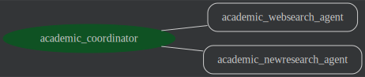

# 學術研究

## 總覽

這是一個由人工智慧驅動的代理，旨在促進對開創性研究著作周圍學術領域的探索。研究人員在瀏覽受基礎研究影響而日益擴大的文獻時面臨著挑戰，本代理體認到此一挑戰，並提供了一種簡化的方法。本代理接受以檔案形式提供的開創性論文，首先會分析指定著作的核心貢獻。

1.  接著，它會利用專門的代理工具，透過 Google 搜尋來識別和擷取引用該開創性論文的近期學術出版物，以描繪其當代影響力。
2.  最後，本代理會綜合對原始論文的分析與近期引用文獻的發現，並再次利用專門的分析工具，提出未來可能的研究方向。

此功能旨在為研究人員提供有關開創性研究持續影響的寶貴見解，並突顯有前景的新穎研究途徑，從而加速研究發現的過程。

## 代理詳情

學術研究代理的主要功能包括：

| 功能 | 描述 |
| --- | --- |
| **互動類型** | 對話式 (Conversational) |
| **複雜度** | 簡單 (Easy) |
| **代理類型** | 多代理 (Multi Agent) |
| **元件** | 工具：內建 Google 搜尋 |
| **垂直領域** | 教育 (Education) |

### 代理架構：

此圖顯示了用於實作此工作流程的代理和工具的詳細架構。


## 設定與安裝

1.  **先決條件**

    *   Python 3.11+
    *   Poetry
        *   用於依賴管理和封裝。請按照官方 [Poetry 網站](https://python-poetry.org/docs/) 上的說明進行安裝。

        ```bash
        pip install poetry
        ```

    *   Google Cloud Platform 上的專案
    *   Google Cloud CLI
        *   有關安裝，請按照官方 [Google Cloud 網站](https://cloud.google.com/sdk/docs/install) 上的說明進行。

2.  **安裝**

    ```bash
    # 複製此儲存庫。
    git clone https://github.com/google/adk-samples.git
    cd adk-samples/python/agents/academic-research
    # 安裝套件和依賴項。
    poetry install
    ```

3.  **設定**

    *   設定 Google Cloud 憑證。

        *   您可以在 shell 中或在 `.env` 檔案中設定以下環境變數。

        ```bash
        export GOOGLE_GENAI_USE_VERTEXAI=true
        export GOOGLE_CLOUD_PROJECT=<您的專案 ID>
        export GOOGLE_CLOUD_LOCATION=<您的專案位置>
        export GOOGLE_CLOUD_STORAGE_BUCKET=<您的儲存空間值區>  # 僅在 Agent Engine 上部署時需要
        ```

    *   驗證您的 GCloud 帳戶。

        ```bash
        gcloud auth application-default login
        gcloud auth application-default set-quota-project $GOOGLE_CLOUD_PROJECT
        ```

## 執行代理

**使用 `adk`**

ADK 提供了在本機啟動代理並與其互動的便利方式。
您可以使用 CLI 與代理交談：

```bash
adk run academic_research
```

或在網頁介面上：

```bash
 adk web
```

`adk web` 指令將在您的機器上啟動一個網頁伺服器並列印 URL。
您可以打開該 URL，在左上角的下拉式功能表中選擇「academic_research」，右側將出現一個聊天機器人介面。對話最初是空白的。以下是您可以要求學術研究代理驗證的一些範例請求：

```
你是誰
```

這些請求的範例回覆如下所示，請參閱 [範例互動](#範例互動) 部分。

```
您好！我是一位 AI 研究助理。

我的目的是幫助您探索與您感興趣的開創性論文相關的學術領域。我可以：

分析您提供的開創性論文（標題/作者、DOI 或 URL）。
使用專門的工具尋找引用該開創性著作的近期學術論文。
根據分析和近期發現，再次使用專門的工具，建議未來可能的研究方向。
今天我能如何幫助您？您想提供一篇開創性論文進行分析嗎？
```

### 範例互動

以下是與學術研究代理的範例互動。請注意，代理的確切輸出每次可能會有所不同。請注意，使用者提供了包含要分析的開創性論文的 pdf 檔案。

```
 * 使用者：你是誰

您好！我是一位 AI 研究助理。

我的目的是幫助您探索與您感興趣的開創性論文相關的學術領域。我可以：

分析您提供的開創性論文（標題/作者、DOI 或 URL）。
使用專門的工具尋找引用該開創性著作的近期學術論文。
根據分析和近期發現，再次使用專門的工具，建議未來可能的研究方向。
今天我能如何幫助您？您想提供一篇開創性論文進行分析嗎？

 * 使用者：1706.03762v7.pdf
 * 使用者：已附上

好的，我已收到論文「Attention Is All You Need」。感謝您的提供。

首先，我將分析這篇開創性論文以建立背景。

開創性論文分析

開創性論文：Attention Is All You Need, Vaswani et al., 2017 (發表於 NIPS 2017)

作者：

Ashish Vaswani (Google Brain)
Noam Shazeer (Google Brain)
Niki Parmar (Google Research)
Jakob Uszkoreit (Google Research)
Llion Jones (Google Research)
Aidan N. Gomez (University of Toronto / Google Brain)
Łukasz Kaiser (Google Brain)
Illia Polosukhin (Google Research)
摘要：主流的序列轉導模型基於複雜的遞歸或卷積神經網路，包括一個編碼器和一個解碼器。表現最好的模型還透過注意力機制連接編碼器和解碼器。我們提出了一種新的簡單網路架構，即 Transformer，它完全基於注意力機制，完全摒棄了遞歸和卷積。在兩項機器翻譯任務上的實驗表明，這些模型在品質上更優越，同時更易於平行化，並且需要顯著更少的訓練時間。我們的模型在 WMT 2014 英德翻譯任務上達到了 28.4 BLEU，比現有的最佳結果（包括集成模型）提高了 2 BLEU 以上。在 WMT 2014 英法翻譯任務上，我們的模型在八個 GPU 上訓練 3.5 天後，創下了 41.8 的新的單一模型最先進 BLEU 分數，這只是文獻中最佳模型訓練成本的一小部分。我們證明了 Transformer 可以很好地推廣到其他任務，並成功地將其應用於具有大量和有限訓練資料的英語成分句法分析。

總結：本文介紹了 Transformer，一種專為序列轉導任務（特別是機器翻譯）設計的新型神經網路架構。它標誌著與先前最先進模型的重大背離，這些模型嚴重依賴其編碼器-解碼器結構中的遞歸神經網路 (RNN) 或卷積神經網路 (CNN)。Transformer 的核心創新在於其完全依賴注意力機制，特別是自註意力（或內部注意力），從而消除了 RNN 中固有的順序處理需求。這使得訓練期間的平行化程度大大提高。該架構具有一個編碼器和一個解碼器，每個都由包含多頭自註意力機制和逐點前饋網路的層堆疊而成。該論文證明，Transformer 在英德和英法翻譯基準測試中取得了優異的結果，同時所需的訓練時間比以前的模型要少得多。它還顯示了該模型對其他任務（如英語成分句法分析）的適用性。

關鍵主題/關鍵字：

Transformer 模型
注意力機制
自註意力 / 內部注意力
多頭注意力
序列轉導
機器翻譯
編碼器-解碼器架構
平行化
位置編碼
自然語言處理 (NLP)
關鍵創新：

提出了完全基於注意力機制的 Transformer 架構，移除了序列到序列任務的遞歸和卷積。
引入了多頭注意力，使模型能夠在不同位置共同關注來自不同表示子空間的資訊。
利用縮放點積注意力作為一種高效的注意力機制。
結合了位置編碼，以在不依賴遞歸的情況下提供序列順序資訊。
在機器翻譯方面取得了最先進的性能，並顯著提高了訓練效率和可平行性。
開創性論文中引用的參考文獻：

Jimmy Lei Ba, Jamie Ryan Kiros, and Geoffrey E Hinton. Layer normalization. arXiv preprint arXiv:1607.06450, 2016.
Dzmitry Bahdanau, Kyunghyun Cho, and Yoshua Bengio. Neural machine translation by jointly learning to align and translate. CoRR, abs/1409.0473, 2014.
Denny Britz, Anna Goldie, Minh-Thang Luong, and Quoc V. Le. Massive exploration of neural machine translation architectures. CoRR, abs/1703.03906, 2017.
Jianpeng Cheng, Li Dong, and Mirella Lapata. Long short-term memory-networks for machine reading. arXiv preprint arXiv:1601.06733, 2016.
Kyunghyun Cho, Bart van Merrienboer, Caglar Gulcehre, Fethi Bougares, Holger Schwenk, and Yoshua Bengio. Learning phrase representations using rnn encoder-decoder for statistical machine translation. CoRR, abs/1406.1078, 2014.
Francois Chollet. Xception: Deep learning with depthwise separable convolutions. arXiv preprint arXiv:1610.02357, 2016.
Junyoung Chung, Çaglar Gülçehre, Kyunghyun Cho, and Yoshua Bengio. Empirical evaluation of gated recurrent neural networks on sequence modeling. CoRR, abs/1412.3555, 2014.
Chris Dyer, Adhiguna Kuncoro, Miguel Ballesteros, and Noah A. Smith. Recurrent neural network grammars. In Proc. of NAACL, 2016.
Jonas Gehring, Michael Auli, David Grangier, Denis Yarats, and Yann N. Dauphin. Convolutional sequence to sequence learning. arXiv preprint arXiv:1705.03122v2, 2017.
Alex Graves. Generating sequences with recurrent neural networks. arXiv preprint arXiv:1308.0850, 2013.
Kaiming He, Xiangyu Zhang, Shaoqing Ren, and Jian Sun. Deep residual learning for image recognition. In Proceedings of the IEEE Conference on Computer Vision and Pattern Recognition, pages 770–778, 2016.
Sepp Hochreiter, Yoshua Bengio, Paolo Frasconi, and Jürgen Schmidhuber. Gradient flow in recurrent nets: the difficulty of learning long-term dependencies, 2001.
Sepp Hochreiter and Jürgen Schmidhuber. Long short-term memory. Neural computation, 9(8):1735–1780, 1997.
Zhongqiang Huang and Mary Harper. Self-training PCFG grammars with latent annotations across languages. In Proceedings of the 2009 Conference on Empirical Methods in Natural Language Processing, pages 832–841. ACL, August 2009.
Rafal Jozefowicz, Oriol Vinyals, Mike Schuster, Noam Shazeer, and Yonghui Wu. Exploring the limits of language modeling. arXiv preprint arXiv:1602.02410, 2016.
Łukasz Kaiser and Samy Bengio. Can active memory replace attention? In Advances in Neural Information Processing Systems, (NIPS), 2016.
Łukasz Kaiser and Ilya Sutskever. Neural GPUs learn algorithms. In International Conference on Learning Representations (ICLR), 2016.
Nal Kalchbrenner, Lasse Espeholt, Karen Simonyan, Aaron van den Oord, Alex Graves, and Koray Kavukcuoglu. Neural machine translation in linear time. arXiv preprint arXiv:1610.10099v2, 2017.
Yoon Kim, Carl Denton, Luong Hoang, and Alexander M. Rush. Structured attention networks. In International Conference on Learning Representations, 2017.
Diederik Kingma and Jimmy Ba. Adam: A method for stochastic optimization. In ICLR, 2015.
Oleksii Kuchaiev and Boris Ginsburg. Factorization tricks for LSTM networks. arXiv preprint arXiv:1703.10722, 2017.
Zhouhan Lin, Minwei Feng, Cicero Nogueira dos Santos, Mo Yu, Bing Xiang, Bowen Zhou, and Yoshua Bengio. A structured self-attentive sentence embedding. arXiv preprint arXiv:1703.03130, 2017.
Minh-Thang Luong, Quoc V. Le, Ilya Sutskever, Oriol Vinyals, and Lukasz Kaiser. Multi-task sequence to sequence learning. arXiv preprint arXiv:1511.06114, 2015.
Minh-Thang Luong, Hieu Pham, and Christopher D Manning. Effective approaches to attention-based neural machine translation. arXiv preprint arXiv:1508.04025, 2015.
Mitchell P Marcus, Mary Ann Marcinkiewicz, and Beatrice Santorini. Building a large annotated corpus of english: The penn treebank. Computational linguistics, 19(2):313–330, 1993.
David McClosky, Eugene Charniak, and Mark Johnson. Effective self-training for parsing. In Proceedings of the Human Language Technology Conference of the NAACL, Main Conference, pages 152–159. ACL, June 2006.
Ankur Parikh, Oscar Täckström, Dipanjan Das, and Jakob Uszkoreit. A decomposable attention model. In Empirical Methods in Natural Language Processing, 2016.
Romain Paulus, Caiming Xiong, and Richard Socher. A deep reinforced model for abstractive summarization. arXiv preprint arXiv:1705.04304, 2017.
Slav Petrov, Leon Barrett, Romain Thibaux, and Dan Klein. Learning accurate, compact, and interpretable tree annotation. In Proceedings of the 21st International Conference on Computational Linguistics and 44th Annual Meeting of the ACL, pages 433–440. ACL, July 2006.
Ofir Press and Lior Wolf. Using the output embedding to improve language models. arXiv preprint arXiv:1608.05859, 2016.
Rico Sennrich, Barry Haddow, and Alexandra Birch. Neural machine translation of rare words with subword units. arXiv preprint arXiv:1508.07909, 2015.
Noam Shazeer, Azalia Mirhoseini, Krzysztof Maziarz, Andy Davis, Quoc Le, Geoffrey Hinton, and Jeff Dean. Outrageously large neural networks: The sparsely-gated mixture-of-experts layer. arXiv preprint arXiv:1701.06538, 2017.
Nitish Srivastava, Geoffrey E Hinton, Alex Krizhevsky, Ilya Sutskever, and Ruslan Salakhutdinov. Dropout: a simple way to prevent neural networks from overfitting. Journal of Machine Learning Research, 15(1):1929–1958, 2014.
Sainbayar Sukhbaatar, Arthur Szlam, Jason Weston, and Rob Fergus. End-to-end memory networks. In C. Cortes, N. D. Lawrence, D. D. Lee, M. Sugiyama, and R. Garnett, editors, Advances in Neural Information Processing Systems 28, pages 2440–2448. Curran Associates, Inc., 2015.
Ilya Sutskever, Oriol Vinyals, and Quoc VV Le. Sequence to sequence learning with neural networks. In Advances in Neural Information Processing Systems, pages 3104–3112, 2014.
Christian Szegedy, Vincent Vanhoucke, Sergey Ioffe, Jonathon Shlens, and Zbigniew Wojna. Rethinking the inception architecture for computer vision. CoRR, abs/1512.00567, 2015.
Vinyals & Kaiser, Koo, Petrov, Sutskever, and Hinton. Grammar as a foreign language. In Advances in Neural Information Processing Systems, 2015.
Yonghui Wu, Mike Schuster, Zhifeng Chen, Quoc V Le, Mohammad Norouzi, Wolfgang Macherey, Maxim Krikun, Yuan Cao, Qin Gao, Klaus Macherey, et al. Google's neural machine translation system: Bridging the gap between human and machine translation. arXiv preprint arXiv:1609.08144, 2016.
Jie Zhou, Ying Cao, Xuguang Wang, Peng Li, and Wei Xu. Deep recurrent models with fast-forward connections for neural machine translation. CoRR, abs/1606.04199, 2016.
Muhua Zhu, Yue Zhang, Wenliang Chen, Min Zhang, and Jingbo Zhu. Fast and accurate shift-reduce constituent parsing. In Proceedings of the 51st Annual Meeting of the ACL (Volume 1: Long Papers), pages 434–443. ACL, August 2013.
現在我已經分析了這篇開創性論文，我將搜尋引用這項工作的近期論文。我將尋找自 2023 年 1 月以來發表的論文（大約涵蓋過去一年多一點的時間）。

* 使用者：好的

好的，這是根據該工具的搜尋，自 2023 年 1 月以來發表的引用「Attention Is All You Need」(Vaswani et al., 2017) 的近期論文：

引用「Attention Is All You Need」的近期論文

（註：此列表包括預印本和一些由搜尋工具識別的未經同儕審查的文章/部落格文章。）

2025 年出版物/預印本

標題：Tensor Product Attention Is All You Need
作者：Yifan Zhang, Mengxuan Fu, Ximing Xiang, Zhiyuan Zhang, Yuexiang Xie, Dongsheng Li, Dawei Yin
出版年份：2025 年（v3 於 2025 年 4 月 9 日提交）
來源：arXiv
連結：https://arxiv.org/abs/2501.06425
標題：TransMLA: Multi-head Latent Attention Is All You Need
作者：Mengxuan Fu, Yifan Zhang, Zhiyuan Zhang, Xiaogang Chen, Dongsheng Li, Dawei Yin
出版年份：2025 年（v1 於 2025 年 2 月 11 日提交）
來源：arXiv
連結：https://arxiv.org/abs/2502.06816（推斷連結）
標題：Attention is All You Need Until You Need Retention
作者：M. Murat Yaslioglu
出版年份：2025 年（v1 於 2025 年 1 月 15 日提交）
來源：arXiv
連結：https://arxiv.org/abs/2501.09166
標題：Transferable-guided Attention Is All You Need for Video Domain Adaptation
作者：André Sacilotti, Samuel Felipe dos Santos, Nicu Sebe, Jurandy Almeida
出版年份：2025 年（已接受 WACV'25）
來源：IEEE/CVF WACV'25 / arXiv
連結：https://arxiv.org/abs/2407.01375
標題：Moral Attention Is All You Need
作者：Mark Graves
出版年份：2025 年（於 2025 年 3 月 17 日線上發表）
來源：Theology and Science
連結：https://doi.org/10.1080/14746700.2025.2472118
標題：「Attention」、「Transformers」，在神經網路「大型語言模型」中（參考近期工作的文章）
作者：Cosma Shalizi（參考 Farrell et al., 2025）
出版年份：2025 年（文章於 2025 年 3 月/4 月更新）
來源：作者網站/部落格
連結：https://www.stat.cmu.edu/~cshalizi/notebooks/attention-is-all-you-need.html
2024 年出版物/預印本/文章

標題：ATFF: Advanced Transformer with Multiscale Contextual Fusion for Medical Image Segmentation
作者：Xinping Guo, Lei Wang, Zizhen Huang, Yukun Zhang, Yaolong Han
出版年份：2024 年（於 2024 年 3 月 29 日發表）
來源：Journal of Computer and Communications, Vol.12 No.3
連結：https://www.scirp.org/reference/referencespapers?referenceid=3338278（引用頁面）
標題：Multimodal Attention is all you need
作者：Marco Saioni, Cristina Giannone
出版年份：2024 年（CEUR Workshop Proceedings，論文日期為 2024 年 12 月 4 日）
來源：CEUR Workshop Proceedings (Evalita 2023)
連結：https://ceur-ws.org/Vol-3616/paper34.pdf（推斷連結）
標題：Attention is all you need: utilizing attention in AI-enabled drug discovery
作者：Yang Zhang, Caiqi Liu, Mujiexin Liu, Tianyuan Liu, Hao Lin, Cheng-Bing Huang, Lin Ning
出版年份：2024 年（於 2024 年 1 月 6 日發表）
來源：Briefings in Bioinformatics, Volume 25, Issue 1
連結：https://doi.org/10.1093/bib/bbad467
標題：HIERARCHICAL ENCODING AND CONDITIONAL ATTENTION IN NEURAL MACHINE TRANSLATION
出版年份：2024 年（於 2024 年 9 月發表）
來源：The American Journal of Engineering and Technology, 6(09)
連結：https://doi.org/10.37547/tajet/Volume06Issue09-07
標題：Measurements With A Quantum Vision Transformer: A Naive Approach
出版年份：2024 年（論文集於 2024 年發表）
來源：EPJ Web of Conferences, Volume 295 (ICHEP 2022)
連結：https://www.epj-conferences.org/articles/epjconf/ref/2024/01/epjconf_ichep2022_12003/epjconf_ichep2022_12003.html
標題：Attention is all you need: discovering the Transformer paper（文章/部落格文章）
作者：Luis Serrano
出版年份：2024 年
來源：Towards Data Science
連結：https://towardsdatascience.com/attention-is-all-you-need-discovering-the-transformer-paper-731ad0737c6d
標題：Paper Walkthrough: Attention Is All You Need（文章/部落格文章）
作者：Muhammad Ardi
出版年份：2024 年（於 2024 年 11 月 3 日發表）
來源：Towards Data Science
連結：https://towardsdatascience.com/paper-walkthrough-attention-is-all-you-need-69388903b711
標題：Attention is all you need – Transformers（文章/部落格文章）
作者：Strahinja Zivkovic
出版年份：2024 年（於 2024 年 11 月 28 日發表）
來源：Master Data Science (Blog)
連結：https://masterdatascience.com/attention-is-all-you-need-transformers/
標題：The Groundbreaking Transformer Paper: “Attention is All You Need”（文章/部落格文章）
作者：Brian Carter
出版年份：2024 年（於 2024 年 10 月 5 日發表）
來源：The Brian Carter Group (Blog)
連結：https://briancartergroup.com/the-groundbreaking-transformer-paper-attention-is-all-you-need/
現在，根據開創性論文「Attention Is All You Need」和這些近期的引用著作，我將使用專門的工具來建議未來可能的研究方向。

* 使用者：好的

好的，這是該工具根據開創性論文「Attention Is All You Need」和近期引用著作所建議的未來可能研究方向：

未來可能的研究方向

超越點積注意力：探索非線性和可學習的相似性度量：不僅僅是縮放點積，研究不同、可能是非線性或完全學習到的方法來衡量注意力機制內的相似性。這可以捕捉更複雜的關係，並導致更穩健或高效的模型。
內在圖感知的注意力機制：開發能夠自然理解和操作圖結構（如分子或社交網路）的注意力機制，而無需先將其強制轉換為序列。
物理資訊和約束驅動的注意力：設計將已知的物理定律、規則或約束直接納入其結構的注意力機制。這可能會為科學發現和模擬帶來更準確、更高效的模型。
混合神經符號注意力架構：創建可以與符號知識庫或推理引擎互動的注意力機制，結合深度學習和傳統人工智慧的優勢，以實現更好的推理和事實查核。
注意力中的動態稀疏性和適應性計算：探索根據上下文動態調整哪些元素相互關注（稀疏注意力）或調整每個元素或層使用的計算量的注意力機制，使 Transformer 對於非常長的序列或有限的資源更有效率。
生物學上可信的注意力和記憶整合：研究受生物大腦處理注意力和記憶方式啟發的注意力架構，可能導致具有不同功能的新型模型。
用於可解釋性和可控制性的元注意力：開發可以觀察自身注意力模式（「元注意力」）的注意力機制。這可以增進我們對模型為何做出某些決策的理解，並可能允許對其焦點進行更多控制。
用於根本非序列資料結構的注意力機制：專門為沒有自然順序的資料（例如項目集或點雲）設計注意力機制，而無需強加人工序列。
用於串流資料的時間連續注意力：創建適用於連續、即時資料流的注意力機制，其中固定序列長度的概念不適用，這對於即時監控或控制至關重要。
跨模態關聯注意力核心：開發新的注意力「核心」，可以直接計算來自不同模態（例如，圖像區域和文本概念）的元素之間的相似性，而無需先將它們投影到一個共同的空間中，從而實現更緊密的跨模態整合。
此分析為探索 Transformer 架構和注意力機制的演變提供了一個起點。

您想深入研究這些特定的研究方向中的任何一個，還是探索另一篇開創性論文？

```

## 執行測試

若要執行測試和評估，請安裝額外的依賴項：

```bash
poetry install --with dev
```

然後可以從 `academic-research` 目錄中使用 `pytest` 模組執行測試和評估：

```bash
python3 -m pytest tests
python3 -m pytest eval
```

`tests` 會在範例請求上執行代理，並確保每個元件都能正常運作。`eval` 是如何評估代理的示範，它使用 ADK 中的 `AgentEvaluator`。它會向代理發送幾個請求，並期望代理的回應與預先定義的回應相當吻合。


## 部署

可以使用以下指令將學術協同研究代理部署到 Vertex AI Agent Engine：

```bash
poetry install --with deployment
python3 deployment/deploy.py --create
```

部署完成後，它將列印如下所示的一行：

```
已建立遠端代理：projects/<PROJECT_NUMBER>/locations/<PROJECT_LOCATION>/reasoningEngines/<AGENT_ENGINE_ID>
```

如果您忘記了 AGENT_ENGINE_ID，可以使用以下指令列出現有代理：

```bash
python3 deployment/deploy.py --list
```

輸出將如下所示：

```
所有遠端代理：

123456789 ("academic_research")
- 建立時間：2025-05-10 09:33:46.188760+00:00
- 更新時間：2025-05-10 09:34:32.763434+00:00

```

您可以使用 `test_deployment.py` 腳本與已部署的代理互動
```bash
$ export USER_ID=<任何字串>
$ python3 deployment/test_deployment.py --resource_id=${AGENT_ENGINE_ID} --user_id=${USER_ID}
找到具有資源 ID 的代理：...
為使用者 ID 建立的工作階段：...
輸入 'quit' 以退出。
輸入：您好。您能為我做什麼？
回應：您好！我是一位 AI 研究助理。我可以幫助您分析一篇開創性的學術論文。

若要開始，請提供您希望分析的開創性論文的 PDF 檔案。
```

若要刪除已部署的代理，您可以執行以下指令：

```bash
python3 deployment/deploy.py --delete --resource_id=${AGENT_ENGINE_ID}
```

## 客製化

可以客製化學術研究代理以更好地滿足您的要求。例如：

 1. 整合專門的搜尋工具：透過納入額外的學術搜尋功能（例如 ArXiv 專用的搜尋工具）來增強代理的發現能力，以補充或取代預設的搜尋機制，從而可以從專門的資料庫和預印本存檔中進行更有針對性的擷取。
 2. 實作輸出視覺化：透過新增模組來視覺化被引用論文的網路或以圖形方式表示建議的未來研究主題，以增強研究結果的呈現，從而提供對學術領域更直觀、更互聯的理解。
3. 客製化代理說明：修改指導 `academic_websearch` 和 `academic_newresearch` 子代理的提示。這使您可以指導其分析重點（例如，透過指定引文分析的深度、強調未來研究的跨學科聯繫，或確保遵守特定的學術寫作慣例）或完善其輸出的結構和細節。
4. 透過 DOI 或 URL 下載開創性論文：透過啟用直接下載開創性論文來增強代理的能力。此功能將允許代理：
* 將 DOI 解析為 PDF：給定數位物件識別碼 (DOI)，代理可以利用 API 或網路抓取技術來定位和下載相應的論文 PDF。這簡化了存取主要來源的過程，尤其是在 DOI 已知的情況下。
* 從 URL 下載：如果提供了論文 PDF 或學術儲存庫頁面的直接 URL，則可以將代理設定為導覽至該 URL 並啟動下載。這對於機構儲存庫、個人學術網站或可能沒有易於解析的 DOI 的預印本伺服器上可用的論文特別有用。
* 與參考文獻管理員整合：下載的論文可以自動匯入指定的參考文獻管理員（例如 Zotero、Mendeley、EndNote）以及其元數據，從而為使用者的研究圖書館提供無縫的組織和引文管理。這種整合將顯著提高文獻綜述和研究彙編的效率。
