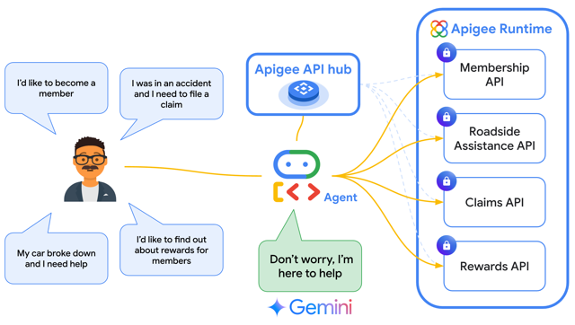

# 使用 Apigee API hub 的汽車保險代理 (Agent)

## 概觀

此代理 (agent) 範例可作為汽車保險公司的實用虛擬助理。它能夠註冊新會員，並為現有會員執行多項功能，包括提出索賠、提供路邊援助，以及回傳合作夥伴公司的獎勵優惠資訊。該代理 (agent) 使用多種工具來完成這些任務。這些工具是註冊在 [Apigee API hub](https://cloud.google.com/apigee/docs/apihub/what-is-api-hub) 中的自訂 API。

## 代理 (Agent) 詳細資訊

| 屬性 | 詳細資訊 |
|---|---|
| 互動類型 | 對話式 |
| 複雜度 | 簡單 |
| 代理 (Agent) 類型 | 多代理 (Multi Agent) |
| 元件 | 工具 (Tools)、ApiHubToolset |
| 垂直領域 | 金融服務 |

### 代理 (Agent) 架構



### 主要功能

#### 工具

此代理 (agent) 可以存取以下工具：

- `membership`：註冊新會員。
- `claims`：處理索賠。
- `roadsideAssistance`：提供路邊援助，包括拖車服務。
- `rewards`：尋找附近合作夥伴的獎勵優惠。

這些工具由自訂 API 提供。其規格被匯入到 [API hub](https://cloud.google.com/apigee/docs/apihub/what-is-api-hub)，然後在代理 (agent) 程式碼中使用 ADK 的內建 [ApiHubToolset](https://google.github.io/adk-docs/tools/google-cloud-tools/#apigee-api-hub-tools) 進行引用。這讓代理 (agent) 開發人員只需幾行程式碼，就能輕鬆地將其組織 API 目錄中的任何現有 API 轉換為工具。在此範例中，API 本身是使用 [Apigee](https://cloud.google.com/apigee) 提供的。

## 設定與安裝

### 先決條件

- Python 3.12+
-   用於依賴管理和打包的 Poetry
    -   有關更多資訊，請參閱官方
        [Poetry 網站](https://python-poetry.org/docs/)。要安裝 Poetry，請執行：
    ```bash
    pip install poetry
    ```
- 已指派以下角色的 Google Cloud 專案
  - Apigee 組織管理員
  - Secret Manager 管理員
  - 儲存空間管理員
  - Service Usage 消費者
  - 記錄檢視器

建立專案後，[安裝 Google Cloud SDK](https://cloud.google.com/sdk/docs/install)。然後執行以下命令進行驗證：
```bash
gcloud auth login
```
您還需要啟用某些 API。執行以下命令以啟用：
```bash
gcloud services enable aiplatform.googleapis.com
```

### Apigee 和 API hub

對於此範例，您還必須在您的專案中佈建 Apigee 和 API hub，以提供作為代理 (agent) 工具的 API。

API 資產和額外的先決條件說明可在 Apigee 範例 repo 中找到：[汽車保險代理 (Agent) API](https://github.com/GoogleCloudPlatform/apigee-samples/tree/main/adk-auto-insurance-agent)。

如果您已在專案中佈建了 Apigee 和 API hub，您可以按照下面的快速入門指南簡單地部署資產。

### 快速入門：使用 Cloud Shell 部署 API 資產

請遵循此 GCP Cloud Shell 教學課程中的說明。

[](https://ssh.cloud.google.com/cloudshell/open?cloudshell_git_repo=https://github.com/GoogleCloudPlatform/apigee-samples&cloudshell_git_branch=main&cloudshell_workspace=.&cloudshell_tutorial=adk-auto-insurance-agent/docs/cloudshell-tutorial.md)


## 代理 (Agent) 設定

1.  複製儲存庫：

    ```bash
    git clone https://github.com/google/adk-samples.git
    cd python/agents/auto-insurance-agent
    ```

    在本教學課程的其餘部分，**請確保您保持在 `python/agents/auto-insurance-agent` 目錄中**。

2.  安裝依賴項：

    ```bash
    poetry install
    ```

3.  配置設定：

    - 設定以下環境變數。您可以在您的 `.env` 檔案中設定它們 (修改並將 `.env.example` 檔案重新命名為 `.env`) 或直接在您的 shell 中設定它們。例如：

    ```bash
    export GOOGLE_GENAI_USE_VERTEXAI=1
    export GOOGLE_CLOUD_PROJECT=my-project
    export GOOGLE_CLOUD_LOCATION=my-region
    export GOOGLE_CLOUD_STORAGE_BUCKET=my-storage-bucket  # 僅在 Agent Engine 上部署時需要
    ```

## 在本機執行代理 (Agent)

您可以在終端機中使用 `adk` 命令在本機執行代理 (agent)：

1.  要從 CLI 執行代理 (agent)：

    ```bash
    adk run auto_insurance_agent
    ```

2.  要從 ADK Web UI 執行代理 (agent)：

    ```bash
    adk web
    ```
    然後從下拉式選單中選擇 `auto-insurance-agent`。

## 遠端部署代理 (Agent)

### 至 Agent Engine

此代理 (agent) 也可以使用以下命令部署到 [Vertex AI Agent Engine](https://cloud.google.com/vertex-ai/generative-ai/docs/agent-engine/overview)：

```bash
poetry install --with deployment
python3 deployment/deploy.py
```

部署完成後，它將輸出遠端代理 (agent) 部署的資源 ID，例如：
```
Created remote agent: projects/<PROJECT_NUMBER>/locations/<PROJECT_LOCATION>/reasoningEngines/<AGENT_ENGINE_ID>
```

有關部署到 Agent Engine 的更多資訊，請參閱[此處](https://google.github.io/adk-docs/deploy/agent-engine/#install-vertex-ai-sdk)。

部署腳本會將 `AGENT_ENGINE_ID` 新增至您的 `.env` 檔案。要測試遠端代理 (agent)，只需執行：
```bash
python3 deployment/test_deployment.py
```

然後您可以從 shell 與已部署的代理 (agent) 進行互動。您可以隨時輸入 `quit` 退出。

## 互動範例

以下是使用者可能如何與代理 (agent) 互動的快速範例：

**使用者：**
>你好

**代理 (Agent)：**
>歡迎來到 Cymbal 汽車保險！今天我能為您提供什麼幫助？您有會員 ID 嗎？

**使用者：**
>37184324

**代理 (Agent)：**
>謝謝，Tom！今天我能為您做些什麼？

**使用者：**
>我的車拋錨了，需要幫忙

**代理 (Agent)：**
>您需要哪種幫助？您需要拖車、搭電、加油、換輪胎，還是需要幫忙解鎖您的車輛？另外，您能提供您的位置嗎？您可以給我一個地址或一個大概的十字路口位置。

**使用者：**
>我沒油了。我在 I-70 東行線 Kipling 出口附近的輔路肩上

**代理 (Agent)：**
>好的，我現在正在為您建立一個請求。我已經找到附近一家可以提供幫助的公司。他們預計大約 45 分鐘後到達。這家公司叫做 Roadside Rescue。他們稍後會給您打電話。還有其他我可以幫您的嗎？

**使用者：**
>沒有了，謝謝

**代理 (Agent)：**
>感謝您聯繫 Cymbal 汽車保險。
