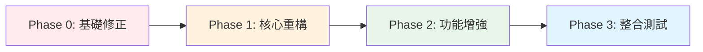
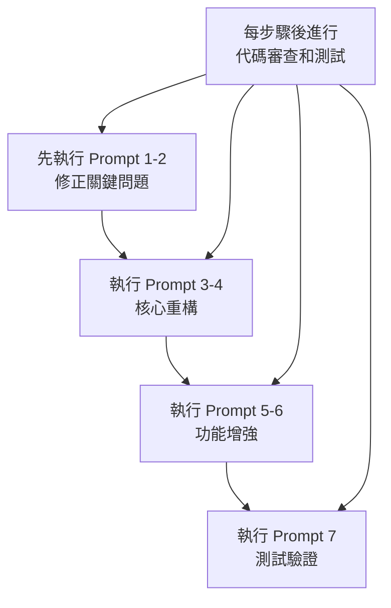

## 🚀 **AI 重構提示詞策略指南**

基於專案的高質量文檔，我為您設計了一套**分階段、模組化**的 AI 重構提示詞策略。

---

## 📋 **重構策略總覽**



---

## 🎯 **Phase 0: 基礎修正提示詞**（優先執行）

### Prompt 1: AuthManager 重構為 ADK Tool

```markdown
你是 Google ADK 專家。請根據以下要求重構 AuthManager：

**當前代碼路徑**: `src/sre_assistant/auth/auth_manager.py`

**重構要求**:
1. 將 AuthManager 從獨立類重構為 ADK FunctionTool
2. 移除所有實例變數（_auth_cache, _rate_limits）
3. 使用 ToolContext 而非 InvocationContext
4. 實現標準的 ToolResult 返回格式
5. 保持與現有 auth_factory.py 的兼容性

**參考規範**:
```python
from google.adk.tools import FunctionTool, ToolContext, ToolResult

class AuthenticationTool(FunctionTool):
    @tool_method
    async def authenticate(self, credentials: Dict, context: ToolContext) -> ToolResult:
        # 使用 context.session_state 替代實例變數
        pass
```

**必須遵循**:
- ADK 工具的標準錯誤處理模式
- 使用 context.session_state 進行狀態管理
- 返回標準化的 ToolResult

**保留功能**:
- OAuth 2.0 認證流程
- 速率限制邏輯
- 審計日誌記錄

請提供完整的重構代碼。
```

### Prompt 2: HITL 機制實現

```markdown
你是 Google ADK 專家。請實現 Human-in-the-Loop (HITL) 機制：

**需求背景**:
根據 SPEC.md，P0 級別事件需要人工審批才能執行修復操作。

**實現要求**:
1. 使用 ADK 的 LongRunningFunctionTool
2. 實現異步審批流程
3. 支援超時和預設動作
4. 整合到現有的 remediation 工作流程

**參考 ADK 範例**: `adk-examples/human_in_loop/`

**具體規格**:
```python
class HumanApprovalTool(LongRunningFunctionTool):
    """P0 事件的人工審批工具"""
    
    async def request_approval(
        self,
        incident_id: str,
        severity: str,
        proposed_action: str,
        context: ToolContext
    ) -> ApprovalResult:
        # 實現要求:
        # 1. 發送審批請求（Slack/Email）
        # 2. 等待人工響應（最長 5 分鐘）
        # 3. 超時自動拒絕
        # 4. 記錄審批決策
        pass
```

**整合點**: `src/sre_assistant/sub_agents/remediation/`

請提供完整實現和整合方案。
```

---

## 🔧 **Phase 1: 核心重構提示詞**

### Prompt 3: 工作流程增強

```markdown
你是 Google ADK 工作流程專家。請增強 SREWorkflow 實現：

**當前代碼**: `src/sre_assistant/workflow.py`

**增強要求**:
1. 為 ParallelAgent 添加自定義聚合策略
2. 實現完整的回調鏈（before/after callbacks）
3. 添加驗證階段（VerificationPhase）
4. 優化 LoopAgent 的終止條件

**必須包含的 ADK 最佳實踐**:
```python
# 1. 並行聚合策略
diagnostic_phase = ParallelAgent(
    sub_agents=[...],
    aggregation_strategy="custom",
    aggregation_function=self._aggregate_diagnostics,
    timeout_seconds=30,
    allow_partial_failure=True
)

# 2. 回調機制
before_agent_callback=self._pre_execution_check,
after_agent_callback=self._post_execution_process,
after_tool_callback=self._tool_monitoring

# 3. 循環終止
LoopAgent(
    max_iterations=5,
    termination_condition=self._check_slo_achieved,
    timeout_seconds=300
)
```

**參考範例**:
- `adk-examples/workflow_triage/`
- `google-adk-workflows/self_critic/`

請提供增強後的完整 workflow.py。
```

### Prompt 4: 智慧分診系統

```markdown
你是 ADK 動態路由專家。請實現智慧分診系統：

**目標**: 替換 `src/sre_assistant/sub_agents/remediation/` 中的靜態條件邏輯

**實現規格**（基於 SPEC.md）:
```python
class SREIntelligentDispatcher(BaseAgent):
    """基於 LLM 的動態分診器"""
    
    expert_registry = {
        "k8s_issues": KubernetesRemediationAgent(),
        "database_issues": DatabaseRemediationAgent(),
        "network_issues": NetworkRemediationAgent(),
        "config_issues": ConfigurationFixAgent(),
    }
    
    async def dispatch(self, diagnostic_summary: Dict) -> RemediationPlan:
        # 使用 LLM 分析診斷結果
        # 動態選擇一個或多個專家
        # 返回執行計劃
        pass
```

**參考實現**: `google-adk-workflows/dispatcher/agent.py`

**必須支援**:
1. 單專家執行
2. 多專家並行執行
3. 條件性執行（基於風險評估）
4. 失敗回退策略

請提供完整的分診系統實現。
```

---

## 🚀 **Phase 2: 功能增強提示詞**

### Prompt 5: Memory Bank 整合

```markdown
你是 ADK Memory 專家。請整合 Vertex AI Memory Bank：

**當前實現**: `src/sre_assistant/memory/`

**升級要求**:
1. 從自定義實現遷移到 ADK Memory Service
2. 配置事件歷史、Runbook、Postmortem 集合
3. 實現跨會話的事件關聯
4. 支援語義搜索和相似度匹配

**ADK Memory 配置**:
```python
from google.adk.memory import MemoryService
from google.adk.memory.providers import VertexAIMemoryProvider

memory_config = {
    "provider": "vertex_ai",
    "project_id": "your-project",
    "location": "us-central1",
    "collections": [
        {
            "name": "incident_history",
            "embedding_model": "text-embedding-004",
            "index_type": "tree-ah",
            "similarity_threshold": 0.7
        },
        {
            "name": "runbooks",
            "embedding_model": "text-embedding-004",
            "metadata_fields": ["service", "severity", "last_updated"]
        }
    ]
}
```

**參考**: `adk-agent-samples/RAG/`

請提供完整的 Memory 整合方案和遷移腳本。
```

### Prompt 6: Grafana Plugin 開發

```markdown
你是 Grafana Plugin 開發專家。請創建 SRE Assistant Plugin：

**基於 ROADMAP.md Phase 2 要求**:

**Plugin 結構**:
```typescript
// src/plugin.json
{
  "type": "app",
  "name": "SRE Assistant",
  "id": "sre-assistant-app",
  "includes": [
    {
      "type": "page",
      "name": "Chat Interface",
      "path": "/chat"
    },
    {
      "type": "panel",
      "name": "SRE Chat Panel"
    }
  ]
}
```

**核心功能實現**:
1. WebSocket 連接到後端
2. 聊天介面組件
3. Grafana 圖表嵌入
4. 告警靜音集成
5. 事件標註創建

**參考架構文檔**: ARCHITECTURE.md 第 4.1 節

請提供：
1. 完整的 plugin.json
2. ChatInterface.tsx 組件
3. WebSocket 通訊層
4. 與 Grafana API 的整合代碼
```

---

## 🧪 **Phase 3: 測試與驗證提示詞**

### Prompt 7: 測試套件完善

```markdown
你是 ADK 測試專家。請完善測試套件：

**當前測試**: `src/sre_assistant/tests/`

**擴展要求**:
1. 為所有新增功能添加單元測試
2. 實現 ADK 評估框架
3. 添加端到端工作流程測試
4. 性能基準測試

**ADK 評估框架實現**:
```python
from google.adk.eval import EvaluationFramework, Metric

test_cases = [
    {
        "name": "P0_incident_with_approval",
        "input": {...},
        "expected_output": {...},
        "expected_behavior": "request_human_approval"
    }
]

evaluator = EvaluationFramework(
    agent=sre_workflow,
    test_cases=test_cases,
    metrics=[
        Metric.ACCURACY,
        Metric.LATENCY,
        Metric.TOKEN_USAGE
    ]
)
```

請提供完整的測試套件擴展。
```

---

## 💡 **使用策略建議**

### 執行順序


### 最佳實踐

1. **逐步執行**：每個 Prompt 單獨執行，確保質量
2. **提供上下文**：始終包含相關文檔路徑和參考資料
3. **驗證輸出**：每次生成後進行代碼審查
4. **保持版本控制**：每個重構階段創建分支

### 增強技巧

```markdown
# 在每個 Prompt 前添加角色定義
你是 Google ADK 官方團隊的首席架構師，擁有 10 年 SRE 經驗。
你必須嚴格遵循 ADK 最佳實踐和 Google SRE 原則。

# 在每個 Prompt 後添加質量要求
**代碼質量要求**:
- 包含完整的類型註解
- 提供詳細的文檔字符串
- 遵循 PEP 8 編碼規範
- 包含錯誤處理和日誌記錄
- 提供使用範例
```

---

**使用這套提示詞策略，您可以系統性地完成整個重構工作，確保每個模組都符合 ADK 最佳實踐。**